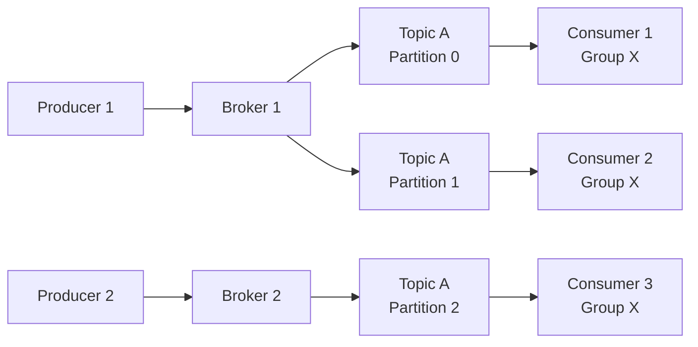

# Apache Kafka

## Panoramica

Apache Kafka è una piattaforma di event streaming distribuita, progettata per gestire flussi di dati in tempo reale con alta affidabilità, scalabilità orizzontale e bassa latenza. Originariamente sviluppato da LinkedIn e successivamente donato alla Apache Software Foundation, Kafka è diventato lo standard de facto per architetture event-driven.

**Quando usarlo:** Streaming di eventi in tempo reale, pipeline di dati, integrazione tra microservizi, change data capture (CDC), aggregazione di log, activity tracking.

**Quando NON usarlo:** Messaggistica semplice point-to-point con pochi messaggi al secondo (meglio RabbitMQ), storage a lungo termine come database primario, task queue con logica di retry complessa.

## Concetti Chiave

!!! note "Terminologia fondamentale"
    Kafka utilizza un modello basato su **log append-only**. I messaggi (record) vengono scritti in modo sequenziale e sono immutabili una volta scritti.

### Componenti principali

**Broker** — Un singolo server Kafka. Un cluster Kafka è composto da uno o più broker. Ogni broker gestisce un sottoinsieme delle partizioni e serve le richieste dei client.

**Topic** — Il canale logico su cui vengono pubblicati i messaggi. Un topic è suddiviso in una o più partizioni. È l'equivalente concettuale di una "categoria" o "feed" di eventi.

**Partition** — L'unità fondamentale di parallelismo in Kafka. Ogni partizione è un log ordinato e immutabile di record. I messaggi all'interno di una partizione mantengono un ordine rigoroso garantito dall'offset.

**Offset** — Un identificatore numerico sequenziale assegnato a ogni record all'interno di una partizione. Il consumer traccia la propria posizione nel log tramite l'offset.

**Producer** — Client che pubblica record su uno o più topic. Il producer decide a quale partizione inviare il record, tipicamente tramite una chiave di partizionamento.

**Consumer** — Client che legge record da uno o più topic. Più consumer possono leggere dallo stesso topic indipendentemente.

**Consumer Group** — Un insieme di consumer che collaborano per consumare un topic. Ogni partizione viene assegnata a un solo consumer nel gruppo, garantendo che ogni messaggio venga processato una sola volta dal gruppo.

## Architettura / Come Funziona

Il cuore di Kafka è un **commit log distribuito**. Quando un producer invia un messaggio:

1. Il producer serializza il record e lo invia al broker leader della partizione target
2. Il broker appende il record al log della partizione e gli assegna un offset
3. Se configurata la replica, il record viene replicato sui broker follower (ISR — In-Sync Replicas)
4. Il broker conferma la scrittura al producer secondo la politica di `acks` configurata
5. I consumer effettuano polling periodico per leggere i nuovi record dalla posizione del loro offset



!!! info "KRaft — Il futuro senza ZooKeeper"
    A partire da Kafka 3.3+, il protocollo **KRaft** (Kafka Raft) sostituisce ZooKeeper per la gestione dei metadati del cluster. KRaft elimina la dipendenza esterna da ZooKeeper, semplificando l'architettura e migliorando la scalabilità. Le nuove installazioni dovrebbero utilizzare KRaft.

### Modello di replica

Kafka garantisce la durabilità attraverso la replica delle partizioni. Ogni partizione ha un **leader** che gestisce tutte le letture e scritture, e zero o più **follower** che replicano i dati. Il parametro `replication-factor` definisce quante copie esistono.

La configurazione `acks` del producer controlla il livello di garanzia:

| Valore `acks` | Comportamento | Trade-off |
|:---:|---|---|
| `0` | Fire-and-forget, nessuna conferma | Massimo throughput, possibile perdita dati |
| `1` | Conferma dal leader | Buon compromesso, rischio minimo |
| `all` | Conferma da tutte le ISR | Massima durabilità, latenza più alta |

## Configurazione & Pratica

### Installazione rapida (Docker Compose con KRaft)

```yaml
# docker-compose.yml
version: '3.8'
services:
  kafka:
    image: apache/kafka:3.7.0
    hostname: broker
    container_name: broker
    ports:
      - '9092:9092'
    environment:
      KAFKA_NODE_ID: 1
      KAFKA_PROCESS_ROLES: 'broker,controller'
      KAFKA_CONTROLLER_QUORUM_VOTERS: '1@broker:29093'
      KAFKA_LISTENERS: 'PLAINTEXT://broker:29092,CONTROLLER://broker:29093,PLAINTEXT_HOST://0.0.0.0:9092'
      KAFKA_ADVERTISED_LISTENERS: 'PLAINTEXT://broker:29092,PLAINTEXT_HOST://localhost:9092'
      KAFKA_LISTENER_SECURITY_PROTOCOL_MAP: 'CONTROLLER:PLAINTEXT,PLAINTEXT:PLAINTEXT,PLAINTEXT_HOST:PLAINTEXT'
      KAFKA_CONTROLLER_LISTENER_NAMES: 'CONTROLLER'
      KAFKA_INTER_BROKER_LISTENER_NAME: 'PLAINTEXT'
      KAFKA_OFFSETS_TOPIC_REPLICATION_FACTOR: 1
      CLUSTER_ID: 'MkU3OEVBNTcwNTJENDM2Qk'
```

### Comandi CLI essenziali

```bash
# Creare un topic
kafka-topics.sh --create \
  --bootstrap-server localhost:9092 \
  --topic my-events \
  --partitions 6 \
  --replication-factor 3

# Listare i topic
kafka-topics.sh --list --bootstrap-server localhost:9092

# Descrivere un topic (partizioni, replica, ISR)
kafka-topics.sh --describe \
  --bootstrap-server localhost:9092 \
  --topic my-events

# Produrre messaggi da console
kafka-console-producer.sh \
  --bootstrap-server localhost:9092 \
  --topic my-events \
  --property "key.separator=:" \
  --property "parse.key=true"

# Consumare messaggi da console
kafka-console-consumer.sh \
  --bootstrap-server localhost:9092 \
  --topic my-events \
  --from-beginning \
  --group my-consumer-group

# Verificare lo stato dei consumer group
kafka-consumer-groups.sh --describe \
  --bootstrap-server localhost:9092 \
  --group my-consumer-group
```

### Configurazioni producer critiche

```properties
# Garanzia exactly-once
acks=all
enable.idempotence=true
max.in.flight.requests.per.connection=5

# Performance
batch.size=16384
linger.ms=5
compression.type=snappy
buffer.memory=33554432
```

### Configurazioni consumer critiche

```properties
# Consumer group
group.id=my-consumer-group
auto.offset.reset=earliest

# Commit manuale per controllo fine
enable.auto.commit=false

# Performance
fetch.min.bytes=1024
fetch.max.wait.ms=500
max.poll.records=500
```

## Best Practices

!!! tip "Dimensionamento partizioni"
    Il numero di partizioni di un topic determina il parallelismo massimo dei consumer. Una regola pratica: **partizioni ≥ numero massimo di consumer previsti nel gruppo**. Sovradimensionare moderatamente (es. 2x) è preferibile a sotto-dimensionare, poiché aumentare le partizioni a posteriori richiede un rebalancing.

!!! tip "Chiavi di partizionamento"
    Usare chiavi significative (es. `user_id`, `order_id`) per garantire che eventi correlati finiscano nella stessa partizione e mantengano l'ordine. Senza chiave, Kafka distribuisce con round-robin.

!!! warning "Attenzione: Consumer lag"
    Monitorare sempre il **consumer lag** (differenza tra l'ultimo offset scritto e l'ultimo offset consumato). Un lag crescente indica che i consumer non tengono il passo. Soluzioni: aggiungere consumer al gruppo, ottimizzare la logica di processing, aumentare le partizioni.

!!! warning "Attenzione: Retention e storage"
    La retention di default è 7 giorni (`log.retention.hours=168`). Per topic ad alto throughput, calcolare lo storage necessario: `throughput_MB/s × 86400 × retention_days × replication_factor`.

**Anti-pattern da evitare:**

- Topic con una sola partizione in produzione — elimina il parallelismo
- `acks=0` per dati critici — rischio concreto di perdita
- Consumer che processano e committano in modo sincrono senza batching — latenza eccessiva
- Topic con migliaia di partizioni — overhead di metadati significativo per il controller

## Troubleshooting

**Consumer group in stato "rebalancing" continuo** — Tipicamente causato da consumer che superano `max.poll.interval.ms` durante il processing. Soluzione: aumentare il timeout o ridurre `max.poll.records`.

**Under-replicated partitions** — Un broker è lento o irraggiungibile. Verificare lo stato del cluster con `kafka-metadata.sh` e i log del broker. Possibili cause: disco pieno, rete instabile, GC pause.

**Producer timeout** — Il broker leader non risponde entro `request.timeout.ms`. Verificare la salute del broker, il network e il carico del cluster.

**Messaggi duplicati** — Se non si usa il producer idempotente (`enable.idempotence=true`), retry automatici possono causare duplicati. Abilitare l'idempotenza o gestire la deduplica lato consumer.

## Relazioni

??? info "TCP — Protocollo di trasporto"
    Kafka utilizza TCP come protocollo di trasporto per tutte le comunicazioni client-broker e broker-broker. La configurazione dei listener e degli advertised listener è critica in ambienti containerizzati.
    
    **Approfondimento completo →** [TCP](../networking/tcp.md)

??? info "OpenShift — Deployment su container orchestrator"
    Il deployment di Kafka su OpenShift avviene tipicamente tramite **Strimzi**, un operator Kubernetes che gestisce il lifecycle completo del cluster Kafka.
    
    **Approfondimento completo →** [OpenShift](../containers/openshift.md)

## Riferimenti

- [Documentazione ufficiale Apache Kafka](https://kafka.apache.org/documentation/)
- [Kafka: The Definitive Guide (Confluent)](https://www.confluent.io/resources/kafka-the-definitive-guide-v2/)
- [Strimzi — Kafka su Kubernetes](https://strimzi.io/documentation/)
- [KRaft Migration Guide](https://kafka.apache.org/documentation/#kraft)
- [Confluent Developer Hub](https://developer.confluent.io/)
