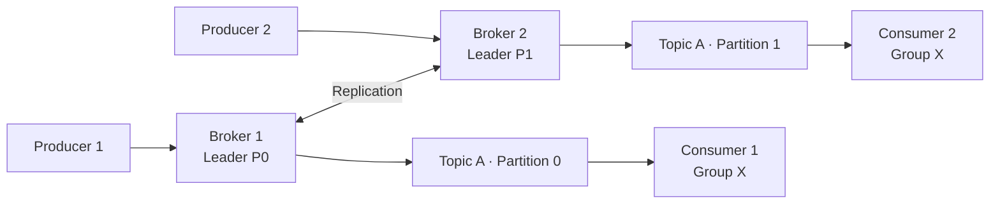

# Apache Kafka

Apache Kafka è una piattaforma di event streaming distribuita, progettata per gestire flussi di dati in tempo reale con alta affidabilità, scalabilità orizzontale e bassa latenza. Originariamente sviluppato da LinkedIn e successivamente donato alla Apache Software Foundation, Kafka è diventato lo standard de facto per architetture event-driven e microservizi.

**Quando usarlo:** Streaming di eventi in tempo reale, pipeline di dati, integrazione tra microservizi, change data capture (CDC), aggregazione di log, activity tracking.

**Quando NON usarlo:** Messaggistica semplice point-to-point con pochi messaggi al secondo (meglio RabbitMQ), storage a lungo termine come database primario, task queue con logica di retry complessa.

---

## 🗂️ Sezioni di questa Documentazione

-   :material-cube-outline:{ .lg .middle } **Fondamenti**

    ---

    Architettura, topics, partizioni, produttori, consumatori, broker e KRaft

    [:octicons-arrow-right-24: Esplora](fondamenti/)

-   :material-transit-connection-variant:{ .lg .middle } **Pattern per Microservizi**

    ---

    Event-driven, Event Sourcing, Saga, Outbox, CQRS, Dead Letter Queue

    [:octicons-arrow-right-24: Esplora](pattern-microservizi/)

-   :material-file-document-outline:{ .lg .middle } **Schema Registry**

    ---

    Avro, Protobuf, evoluzione degli schemi, compatibilità

    [:octicons-arrow-right-24: Esplora](schema-registry/)

-   :material-water-outline:{ .lg .middle } **Kafka Streams**

    ---

    Stream processing, topologie, ksqlDB, windowing e aggregazioni

    [:octicons-arrow-right-24: Esplora](kafka-streams/)

-   :material-connection:{ .lg .middle } **Kafka Connect**

    ---

    Connettori source/sink, CDC con Debezium, integrazione dati

    [:octicons-arrow-right-24: Esplora](kafka-connect/)

-   :material-shield-lock:{ .lg .middle } **Sicurezza**

    ---

    TLS/SSL, SASL, ACL, autenticazione e autorizzazione

    [:octicons-arrow-right-24: Esplora](sicurezza/)

-   :material-cog:{ .lg .middle } **Operazioni**

    ---

    Monitoring, performance tuning, replica, log compaction, disaster recovery

    [:octicons-arrow-right-24: Esplora](operazioni/)

-   :material-kubernetes:{ .lg .middle } **Kubernetes & Cloud**

    ---

    Strimzi Operator, Helm, Amazon MSK, deployment cloud-native

    [:octicons-arrow-right-24: Esplora](kubernetes-cloud/)

-   :material-code-braces:{ .lg .middle } **Sviluppo**

    ---

    Spring Kafka, Quarkus, exactly-once semantics, transazioni

    [:octicons-arrow-right-24: Esplora](sviluppo/)

---

## Architettura in Sintesi

Il cuore di Kafka è un **commit log distribuito**. I messaggi vengono scritti in modo sequenziale e immutabile su **partizioni** di un **topic**, replicati sui **broker** del cluster e consumati da **consumer group** che tracciano la propria posizione tramite **offset**.

!!! info "KRaft — Kafka senza ZooKeeper"
    A partire da Kafka 3.3+, il protocollo **KRaft** sostituisce ZooKeeper per la gestione dei metadati. Le nuove installazioni dovrebbero sempre usare KRaft.

---

## Riferimenti

- [Documentazione ufficiale Apache Kafka](https://kafka.apache.org/documentation/)
- [Kafka: The Definitive Guide (Confluent)](https://www.confluent.io/resources/kafka-the-definitive-guide-v2/)
- [Confluent Developer Hub](https://developer.confluent.io/)
- [Strimzi — Kafka su Kubernetes](https://strimzi.io/documentation/)
