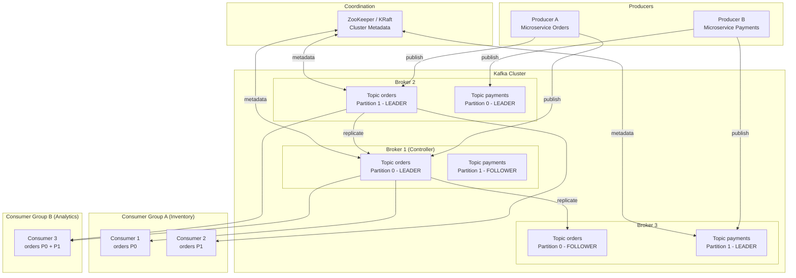

# Architettura di Apache Kafka

## Panoramica

Apache Kafka è una piattaforma distribuita di event streaming progettata per l'acquisizione, lo storage e il processing di flussi di dati ad alta velocità e bassa latenza. Nasce in LinkedIn nel 2011 e viene donata alla Apache Software Foundation, diventando uno degli strumenti di riferimento per la comunicazione asincrona tra microservizi e per la costruzione di pipeline di dati real-time. Il cuore di Kafka è il **distributed commit log**: un log append-only, immutabile, distribuito su più nodi, che permette a producer e consumer di operare in modo completamente disaccoppiato. Kafka non è un message broker tradizionale (come RabbitMQ): i messaggi persistono sul disco per un periodo configurabile e possono essere riletti da consumer multipli in modo indipendente, rendendo Kafka ideale sia per messaging sia per data integration e stream processing.

## Concetti Chiave

### Commit Log Distribuito

Il concetto fondamentale di Kafka è il **log**: una struttura dati ordinata, append-only, dove ogni record riceve un **offset** incrementale. I consumer avanzano nel log leggendo record in sequenza, senza che Kafka debba tracciare lo stato per ciascuno. Questo approccio semplifica radicalmente la gestione dello stato lato broker e permette di scalare a milioni di messaggi al secondo.

### Componenti dell'Architettura

| Componente | Ruolo |
|---|---|
| **Broker** | Server Kafka che riceve, archivia e serve i messaggi. Un cluster è composto da uno o più broker. |
| **Topic** | Canale logico in cui i producer pubblicano messaggi. Un topic è suddiviso in partizioni. |
| **Partizione** | Unità fisica di parallelismo. Ogni partizione è un log append-only replicato su più broker. |
| **Producer** | Client che pubblica messaggi su uno o più topic. |
| **Consumer** | Client che legge messaggi da uno o più topic. I consumer si organizzano in **Consumer Group**. |
| **Consumer Group** | Insieme di consumer che cooperano per leggere un topic. Ogni partizione è assegnata a un solo consumer del gruppo. |
| **ZooKeeper / KRaft** | Sistema di coordinamento per la gestione dei metadati del cluster (elezione del controller, broker registrati, ecc.). KRaft è il sostituto moderno di ZooKeeper. |
| **Controller** | Un broker eletto come responsabile della gestione amministrativa del cluster (elezioni leader, bilanciamento). |

### Record (Messaggio)

Ogni record pubblicato su Kafka è composto da:
- **Key** (opzionale): usata per il partizionamento deterministico
- **Value**: il payload del messaggio
- **Timestamp**: assegnato dal producer o dal broker
- **Headers** (opzionale): metadati chiave-valore

## Architettura / Come Funziona

### Schema Architetturale Completo



### Flusso dei Dati: Step by Step

1. **Producer invia un record** al broker leader della partizione target.
2. **Il broker leader** scrive il record nel log della partizione sul disco (append-only).
3. **I broker follower** replicano il record dal leader (replication log fetch).
4. **Quando il record è nelle ISR** (In-Sync Replicas), il leader invia l'ack al producer.
5. **Il consumer** esegue il poll loop, richiede i record dall'offset corrente al broker leader.
6. **Il consumer commette l'offset** dopo aver processato i record (manualmente o automaticamente).

### Garantia di Ordinamento

Kafka garantisce l'ordinamento dei record **all'interno di una singola partizione**. Record con la stessa key vengono sempre scritti nella stessa partizione (tramite `hash(key) % numPartitions`), garantendo l'ordinamento per quella chiave specifica. Non esiste garanzia di ordinamento globale tra partizioni diverse.

### Retention dei Dati

Kafka non elimina i record dopo che un consumer li ha letti. I dati vengono eliminati in base a policy configurabili:
- **Time-based:** `log.retention.hours` (default: 168 ore / 7 giorni)
- **Size-based:** `log.retention.bytes` per partizione
- **Compaction:** solo l'ultimo valore per ogni key viene mantenuto (log compaction)

## Configurazione & Pratica

### Avvio Rapido con Docker Compose (KRaft mode)

```yaml
# docker-compose.yml - Kafka singolo nodo in KRaft mode
version: '3.8'
services:
  kafka:
    image: confluentinc/cp-kafka:7.6.0
    hostname: kafka
    container_name: kafka
    ports:
      - "9092:9092"
      - "9101:9101"
    environment:
      KAFKA_NODE_ID: 1
      KAFKA_LISTENER_SECURITY_PROTOCOL_MAP: 'CONTROLLER:PLAINTEXT,PLAINTEXT:PLAINTEXT,PLAINTEXT_HOST:PLAINTEXT'
      KAFKA_ADVERTISED_LISTENERS: 'PLAINTEXT://kafka:29092,PLAINTEXT_HOST://localhost:9092'
      KAFKA_OFFSETS_TOPIC_REPLICATION_FACTOR: 1
      KAFKA_GROUP_INITIAL_REBALANCE_DELAY_MS: 0
      KAFKA_TRANSACTION_STATE_LOG_MIN_ISR: 1
      KAFKA_TRANSACTION_STATE_LOG_REPLICATION_FACTOR: 1
      KAFKA_JMX_PORT: 9101
      KAFKA_PROCESS_ROLES: 'broker,controller'
      KAFKA_CONTROLLER_QUORUM_VOTERS: '1@kafka:29093'
      KAFKA_LISTENERS: 'PLAINTEXT://kafka:29092,CONTROLLER://kafka:29093,PLAINTEXT_HOST://0.0.0.0:9092'
      KAFKA_INTER_BROKER_LISTENER_NAME: 'PLAINTEXT'
      KAFKA_CONTROLLER_LISTENER_NAMES: 'CONTROLLER'
      KAFKA_LOG_DIRS: '/tmp/kraft-combined-logs'
      CLUSTER_ID: 'MkU3OEVBNTcwNTJENDM2Qk'
```

### Comandi CLI Essenziali

```bash
# Verificare lo stato del cluster
kafka-broker-api-versions.sh --bootstrap-server localhost:9092

# Listare tutti i topic
kafka-topics.sh --bootstrap-server localhost:9092 --list

# Descrivere un topic (leader, ISR, repliche)
kafka-topics.sh --bootstrap-server localhost:9092 --describe --topic orders

# Produrre messaggi da console
kafka-console-producer.sh \
  --bootstrap-server localhost:9092 \
  --topic orders \
  --property "key.separator=:" \
  --property "parse.key=true"

# Consumare messaggi da console (dall'inizio)
kafka-console-consumer.sh \
  --bootstrap-server localhost:9092 \
  --topic orders \
  --from-beginning \
  --property print.key=true \
  --property key.separator=":"
```

### Parametri Broker Fondamentali (server.properties)

```properties
# Identificatore unico del broker nel cluster
broker.id=1

# Indirizzo di ascolto
listeners=PLAINTEXT://:9092

# Cartella dove sono archiviati i log (dati)
log.dirs=/var/kafka/logs

# Numero di thread per I/O di rete
num.network.threads=3

# Numero di thread per I/O su disco
num.io.threads=8

# Retention per tempo (in ore)
log.retention.hours=168

# Retention per dimensione (-1 = illimitato)
log.retention.bytes=-1

# Replication factor di default per i topic interni
offsets.topic.replication.factor=3
transaction.state.log.replication.factor=3
transaction.state.log.min.isr=2
```

## Best Practices

### Sizing delle Partizioni

!!! tip "Regola Pratica per il Numero di Partizioni"
    Una formula di partenza: `max(T/P_producer, T/P_consumer)` dove `T` è il throughput target, `P_producer` è il throughput di un singolo producer e `P_consumer` è il throughput di un singolo consumer. In assenza di benchmark, iniziare con 6-12 partizioni per topic e scalare in seguito.

- **Non sovra-partizionare:** ogni partizione ha un overhead (file handle, memoria, tempi di elezione leader). Un broker gestisce efficacemente fino a ~4000 partizioni.
- **Considerare i consumer group:** il numero di partizioni limita il parallelismo massimo del gruppo. Con 6 partizioni, massimo 6 consumer attivi per gruppo.
- **Partizioni e ordinamento:** se l'ordinamento globale è critico, usare una sola partizione (con sacrificio del parallelismo).

### Replication Factor

!!! warning "Minimum Production Setup"
    In produzione usare sempre `replication.factor=3` con `min.insync.replicas=2`. Questo garantisce tolleranza alla perdita di un broker senza perdita di dati e senza interruzione del servizio.

### Anti-Pattern da Evitare

- **Creare topic con replication factor 1:** nessuna tolleranza ai guasti, dati persi se il broker cade.
- **Usare Kafka come database:** Kafka non è ottimizzato per query puntuali. Per ricerche per key usare un database esterno (es. proiettare i dati Kafka su PostgreSQL o Redis).
- **Consumer senza gestione degli errori:** un consumer che non gestisce le eccezioni può bloccarsi senza commettere l'offset, causando il riprocessamento dei record al restart.
- **Ignorare il lag del consumer group:** monitorare sempre il consumer lag come indicatore di salute.

## Troubleshooting

### Consumer Lag Elevato

```bash
# Verificare il lag di tutti i consumer group
kafka-consumer-groups.sh \
  --bootstrap-server localhost:9092 \
  --describe \
  --all-groups

# Output: GROUP | TOPIC | PARTITION | CURRENT-OFFSET | LOG-END-OFFSET | LAG | CONSUMER-ID
```

**Cause comuni:**
- Consumer troppo lenti nel processare i record → aumentare parallelismo o ottimizzare la logica
- Producer che genera troppi record → valutare throttling lato producer
- Numero insufficiente di partizioni → scala difficile (richiede repartitioning)

### Broker Non Raggiungibile

```bash
# Verificare la connettività
nc -zv localhost 9092

# Controllare i log del broker
tail -f /var/kafka/logs/server.log | grep -i error

# Verificare le ISR degradate
kafka-topics.sh --bootstrap-server localhost:9092 --describe | grep "Isr:"
```

### Under-Replicated Partitions

```bash
# Identificare partizioni sotto-replicate
kafka-topics.sh \
  --bootstrap-server localhost:9092 \
  --describe \
  --under-replicated-partitions
```

Causa tipica: un broker follower è caduto e non ha ancora recuperato i dati. Verificare che il broker sia operativo e che le ISR tornino al numero atteso.

## Riferimenti

- [Apache Kafka Documentation](https://kafka.apache.org/documentation/)
- [Kafka: The Definitive Guide (O'Reilly)](https://www.oreilly.com/library/view/kafka-the-definitive/9781491936153/)
- [KIP-500: Replace ZooKeeper with a Self-Managed Metadata Quorum](https://cwiki.apache.org/confluence/display/KAFKA/KIP-500%3A+Replace+ZooKeeper+with+a+Self-Managed+Metadata+Quorum)
- [Confluent: Kafka Internals](https://developer.confluent.io/courses/architecture/get-started/)
- [Jay Kreps: The Log: What every software engineer should know](https://engineering.linkedin.com/distributed-systems/log-what-every-software-engineer-should-know-about-real-time-datas-unifying)
