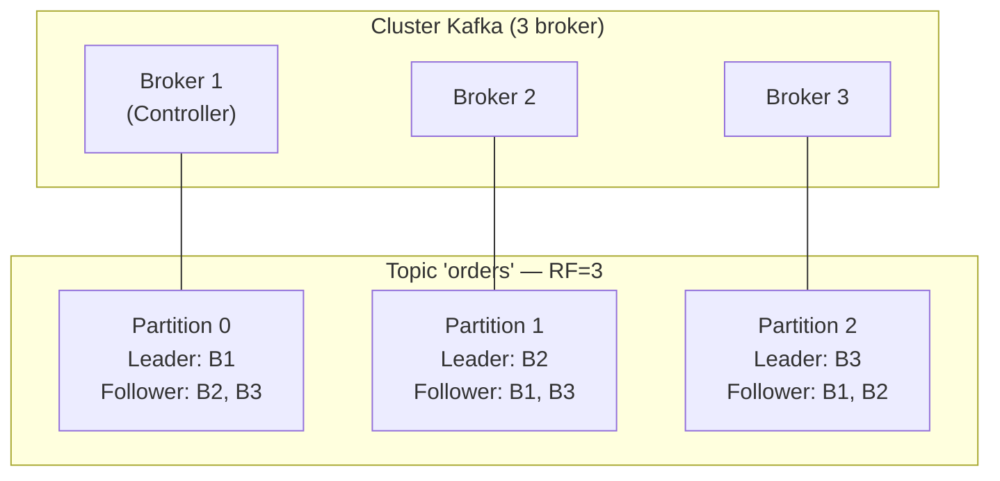

# Broker e Cluster Kafka

## Panoramica

Un **broker** è un singolo server Kafka che riceve messaggi dai producer, li archivia su disco e li serve ai consumer. Un **cluster** Kafka è composto da uno o più broker che collaborano per garantire scalabilità e alta disponibilità. Il cluster distribuisce le partizioni tra i broker, replica i dati e gestisce il failover automatico in caso di guasto.

**Quando aggiungere broker:** quando il cluster raggiunge i limiti di throughput I/O, storage o quando il replication lag è sistematicamente alto.

## Concetti Chiave

**Broker ID** — Ogni broker ha un identificativo numerico univoco nel cluster (`broker.id` in `server.properties`). In KRaft mode, è chiamato `node.id`.

**Controller** — Un broker speciale che gestisce lo stato del cluster: elezioni del leader, registrazione dei broker, aggiornamenti dei metadati. In KRaft ci sono più controller in un quorum.

**Leader** — Per ogni partizione, un broker è designato **leader**: gestisce tutte le letture e le scritture per quella partizione.

**Follower** — Gli altri broker che replicano la partizione dal leader. Non servono richieste client direttamente.

**ISR (In-Sync Replicas)** — L'insieme dei follower che sono allineati con il leader entro una certa soglia (`replica.lag.time.max.ms`). Solo le repliche ISR possono diventare leader.

**Preferred Leader** — La replica originalmente designata come leader per una partizione. Kafka tenta di ribilanciare la leadership verso il preferred leader.

## Architettura / Come Funziona



**Flusso di scrittura:**
1. Il producer invia un record al broker **leader** della partizione target
2. Il leader scrive il record nel proprio log e incrementa l'offset
3. I broker follower eseguono il **fetch** dal leader (replicazione pull-based)
4. Quando tutte le ISR hanno replicato, il broker conferma al producer (se `acks=all`)

**Flusso di lettura:**
- I consumer leggono sempre dal **leader** (default)
- Con `client.rack` configurato, i consumer possono leggere dai follower nella stessa AZ (Availability Zone), riducendo il traffico e i costi cross-zona (rack-aware fetching)

## Configurazione & Pratica

### server.properties — Configurazioni critiche

```properties
# Identificativo del broker nel cluster
broker.id=1

# Directory dati (usare dischi separati per performance)
log.dirs=/data/kafka-logs,/data2/kafka-logs

# Rete
listeners=PLAINTEXT://:9092
advertised.listeners=PLAINTEXT://broker1.example.com:9092

# Performance I/O
num.io.threads=8
num.network.threads=3

# Replica
default.replication.factor=3
min.insync.replicas=2
offsets.topic.replication.factor=3
transaction.state.log.replication.factor=3
transaction.state.log.min.isr=2

# Retention
log.retention.hours=168
log.segment.bytes=1073741824
log.retention.check.interval.ms=300000

# Replica lag
replica.lag.time.max.ms=30000
```

### Verifica stato del cluster

```bash
# Listare tutti i broker del cluster
kafka-metadata-quorum.sh --bootstrap-server localhost:9092 describe --status

# Verificare la distribuzione delle partizioni
kafka-topics.sh --describe \
  --bootstrap-server localhost:9092 \
  --topic orders

# Output esempio:
# Topic: orders  Partition: 0  Leader: 1  Replicas: 1,2,3  Isr: 1,2,3
# Topic: orders  Partition: 1  Leader: 2  Replicas: 2,3,1  Isr: 2,3,1
# Topic: orders  Partition: 2  Leader: 3  Replicas: 3,1,2  Isr: 3,1,2

# Ribilanciare i preferred leader
kafka-leader-election.sh \
  --bootstrap-server localhost:9092 \
  --election-type preferred \
  --all-topic-partitions
```

### Partizioni under-replicated

```bash
# Trovare partizioni under-replicated (follower non allineati)
kafka-topics.sh --bootstrap-server localhost:9092 \
  --describe --under-replicated-partitions

# Trovare partizioni senza leader (emergenza)
kafka-topics.sh --bootstrap-server localhost:9092 \
  --describe --unavailable-partitions
```

## Best Practices

!!! tip "Distribuire le partizioni uniformemente"
    Kafka bilancia automaticamente le partizioni, ma dopo aggiungere/rimuovere broker è necessario eseguire `kafka-reassign-partitions.sh` per ribilanciare il carico.

!!! tip "Rack awareness"
    Configurare `broker.rack` su ogni broker e `replica.assignment.strategy=org.apache.kafka.common.replica.RackAwareReplicaSelector` per distribuire le repliche tra availability zone diverse.

!!! warning "Non ridurre min.insync.replicas in produzione"
    `min.insync.replicas=1` elimina la protezione contro la perdita di dati. Il valore consigliato per produzione è `RF - 1` (con RF=3, usare `min.insync.replicas=2`).

**Regole dimensionamento:**

| Scenario | Broker | RF | min.ISR |
|----------|--------|-----|---------|
| Development | 1 | 1 | 1 |
| Staging | 3 | 2 | 1 |
| Produzione standard | 3 | 3 | 2 |
| Produzione critica | 6+ | 3 | 2 |

## Troubleshooting

### Scenario 1 — Under-replicated partitions persistenti

**Sintomo:** `kafka-topics.sh --describe --under-replicated-partitions` restituisce partizioni con ISR ridotto.

**Causa:** Disco pieno su un follower, I/O lento, GC pause prolungate, oppure rete instabile che causa il superamento di `replica.lag.time.max.ms`.

**Soluzione:** Identificare il broker in ritardo, liberare spazio disco, aumentare `replica.fetch.max.bytes` se il lag è da throughput. Monitorare il rientro nell'ISR.

```bash
# Identificare partizioni under-replicated
kafka-topics.sh --bootstrap-server localhost:9092 \
  --describe --under-replicated-partitions

# Verificare spazio disco e dimensioni log per broker
kafka-log-dirs.sh \
  --bootstrap-server localhost:9092 \
  --describe --topic-list orders
```

---

### Scenario 2 — Broker non rientra nel cluster dopo restart

**Sintomo:** Il broker si avvia ma non appare nella lista dei broker attivi; i log mostrano errori di connessione al controller.

**Causa:** `broker.id` duplicato, indirizzo `advertised.listeners` non raggiungibile dagli altri broker, oppure ZooKeeper/KRaft quorum non disponibile.

**Soluzione:** Verificare unicità del `broker.id`, controllare la resoluzione DNS di `advertised.listeners`, confermare la raggiungibilità del quorum KRaft o di ZooKeeper.

```bash
# Verificare log del broker
tail -100 /var/log/kafka/server.log | grep -E "ERROR|WARN|controller"

# Verificare i broker attivi nel cluster (KRaft)
kafka-metadata-quorum.sh \
  --bootstrap-server localhost:9092 describe --status

# Verificare broker registrati (ZooKeeper legacy)
zookeeper-shell.sh localhost:2181 ls /brokers/ids
```

---

### Scenario 3 — Leader non bilanciati tra i broker

**Sintomo:** Un broker gestisce una percentuale sproporzionata di partition leader; le metriche mostrano I/O asimmetrico.

**Causa:** Dopo un failover, Kafka può eleggere leader non-preferred. I preferred leader non vengono riassegnati automaticamente se `auto.leader.rebalance.enable=false`.

**Soluzione:** Eseguire l'elezione manuale dei preferred leader. Se il bilanciamento non migliora, ribilanciare le partizioni con `kafka-reassign-partitions.sh`.

```bash
# Elezione preferred leader su tutti i topic
kafka-leader-election.sh \
  --bootstrap-server localhost:9092 \
  --election-type preferred \
  --all-topic-partitions

# Verificare distribuzione leader dopo l'elezione
kafka-topics.sh --bootstrap-server localhost:9092 \
  --describe --topic orders
```

---

### Scenario 4 — Partizioni unavailable (nessun leader)

**Sintomo:** `kafka-topics.sh --describe --unavailable-partitions` restituisce risultati; i producer ricevono `NOT_LEADER_OR_FOLLOWER` o `LEADER_NOT_AVAILABLE`.

**Causa:** Tutti i broker con repliche ISR per quella partizione sono offline, oppure il numero di ISR è sceso sotto `min.insync.replicas` con `acks=all`.

**Soluzione:** Riportare online almeno un broker dell'ISR. In scenari di emergenza (perdita accettabile) è possibile abilitare l'elezione di repliche non-ISR con `unclean.leader.election.enable=true` (solo temporaneamente).

```bash
# Identificare partizioni senza leader
kafka-topics.sh --bootstrap-server localhost:9092 \
  --describe --unavailable-partitions

# Controllare quale broker aveva la replica (da ZooKeeper/KRaft metadata)
kafka-metadata-quorum.sh \
  --bootstrap-server localhost:9092 describe --replication

# Abilitare unclean election SOLO in emergenza (rischio perdita dati)
kafka-configs.sh --bootstrap-server localhost:9092 \
  --entity-type brokers --entity-default \
  --alter --add-config unclean.leader.election.enable=true
```

## Riferimenti

- [Broker Configurations](https://kafka.apache.org/documentation/#brokerconfigs)
- [Replication Design](https://kafka.apache.org/documentation/#replication)
- [Rack Awareness](https://kafka.apache.org/documentation/#basic_ops_racks)
