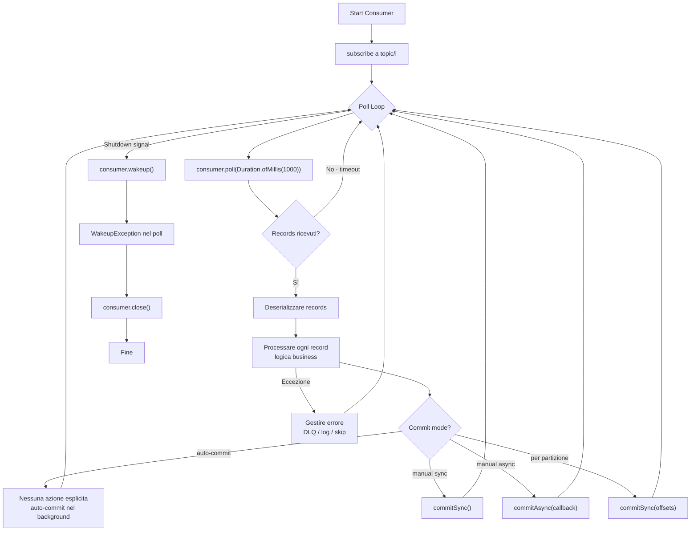
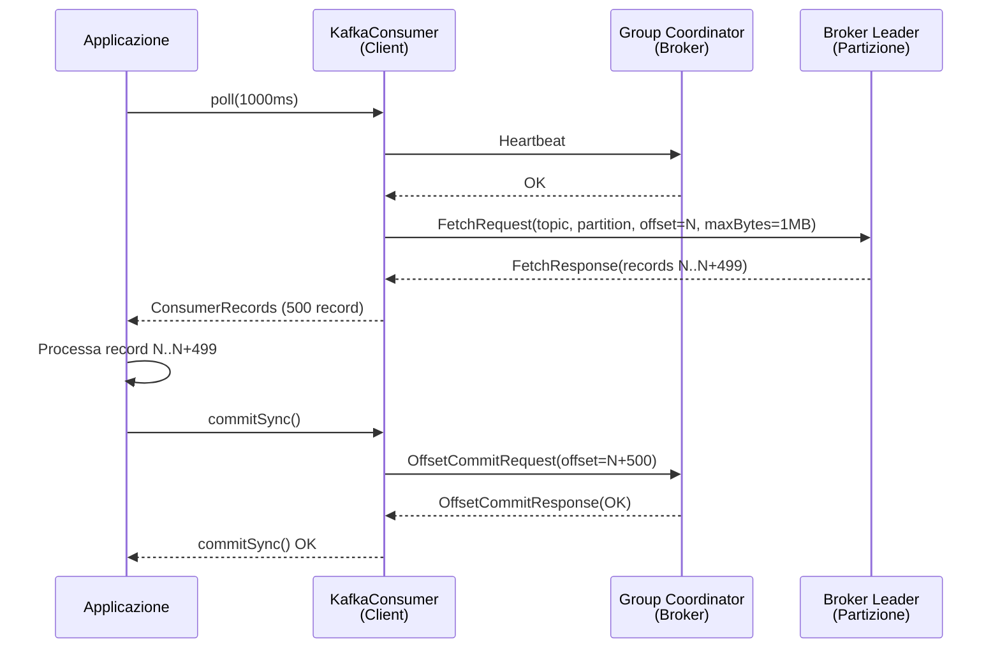

# Consumatori (Consumer)

## Panoramica

Il **consumer** è il componente client che legge record da uno o più topic Kafka. A differenza dei sistemi di messaging tradizionali dove il broker spinge i messaggi al consumer (push), in Kafka è il consumer che **chiede attivamente** i record al broker tramite il **poll loop**. Questo approccio pull consente al consumer di controllare il proprio ritmo di elaborazione senza essere sopraffatto. I consumer si organizzano in **Consumer Group** per leggere in parallelo da più partizioni dello stesso topic. Il consumer mantiene la propria posizione di lettura tramite il **commit dell'offset**: registrando l'offset dell'ultimo record processato, può riprendere da dove si era fermato in caso di riavvio. La gestione corretta del commit è fondamentale per evitare sia la perdita di messaggi sia il riprocessamento indesiderato.

## Concetti Chiave

### Poll Loop

Il cuore di un consumer Kafka è il **poll loop**: un ciclo infinito che chiama periodicamente `consumer.poll(Duration)` per ottenere un batch di record dal broker. Il metodo `poll()` serve anche a:
- Inviare **heartbeat** al Group Coordinator (indica che il consumer è vivo)
- Eseguire eventuali **rebalancing** del consumer group
- Processare il commit degli offset schedulati (auto-commit)

Se `poll()` non viene chiamato entro `max.poll.interval.ms`, il consumer viene considerato morto e viene avviato un rebalancing.

### Fetch e Deserializzazione

Per ogni chiamata `poll()`, il consumer invia richieste **Fetch** ai broker leader delle partizioni assegnate. I parametri che controllano il fetch:

| Parametro | Default | Descrizione |
|---|---|---|
| `fetch.min.bytes` | 1 byte | Minimo di dati da ricevere prima che il broker risponda |
| `fetch.max.bytes` | 52428800 (50 MB) | Massimo di dati per risposta Fetch (totale) |
| `fetch.max.wait.ms` | 500 ms | Tempo massimo che il broker aspetta per raggiungere `fetch.min.bytes` |
| `max.partition.fetch.bytes` | 1048576 (1 MB) | Massimo di dati per partizione per risposta Fetch |
| `max.poll.records` | 500 | Numero massimo di record restituiti per singola chiamata `poll()` |

I record ricevuti vengono **deserializzati** usando i deserializzatori configurati (speculari ai serializzatori del producer). È fondamentale che il deserializzatore corrisponda al serializzatore usato dal producer.

### Commit degli Offset

Dopo aver processato i record, il consumer deve **commettere l'offset** per registrare la posizione. Esistono due modalità:

#### Auto-Commit (default)

```properties
enable.auto.commit=true
auto.commit.interval.ms=5000  # commit ogni 5 secondi
```

Il consumer commette automaticamente l'offset più alto restituito da `poll()` ogni `auto.commit.interval.ms`. **Rischio:** se il consumer cade dopo la `poll()` ma prima di processare completamente i record, quegli offset vengono già commessi → perdita di messaggi.

#### Manual Commit

```properties
enable.auto.commit=false
```

Il consumer decide esplicitamente quando commettere, dopo aver completato il processing. Garantisce **at-least-once**: se il consumer cade dopo il processing ma prima del commit, riprocesserà i record al restart.

Tipi di commit manuale:
- `commitSync()`: blocca fino alla conferma del broker. Ritenta automaticamente in caso di errore.
- `commitAsync()`: non bloccante. Non ritenta (per evitare commit out-of-order).

### auto.offset.reset

Determina da dove iniziare a leggere quando non esiste un offset committato per il gruppo (primo avvio o offset scaduto):

| Valore | Comportamento |
|---|---|
| `earliest` | Legge dal primo record disponibile nella partizione (offset più basso) |
| `latest` | Legge solo i nuovi record (prodotti dopo la subscribe) |
| `none` | Lancia eccezione se non esiste offset per il gruppo |

### Heartbeat e Session Timeout

Il consumer invia **heartbeat** periodici al Group Coordinator per segnalare che è vivo:

- `heartbeat.interval.ms` (default: 3000 ms): frequenza degli heartbeat. Deve essere significativamente minore di `session.timeout.ms`.
- `session.timeout.ms` (default: 45000 ms): se il coordinator non riceve heartbeat entro questo timeout, considera il consumer morto e avvia il rebalancing.
- `max.poll.interval.ms` (default: 300000 ms / 5 min): timeout massimo tra due chiamate `poll()`. Se il processing di un batch richiede più di questo tempo, il consumer viene espulso dal gruppo.

!!! warning "Heartbeat vs max.poll.interval.ms"
    Il heartbeat viene inviato da un thread separato, quindi `session.timeout.ms` misura l'assenza di heartbeat. `max.poll.interval.ms` misura invece l'inattività del thread principale (troppo tempo tra una `poll()` e la successiva). Entrambi possono causare un rebalancing se violati.

## Architettura / Come Funziona

### Poll Loop Lifecycle



### Fetch da Broker



## Configurazione & Pratica

### Configurazioni Consumer Essenziali

```properties
# Connessione al cluster
bootstrap.servers=broker1:9092,broker2:9092,broker3:9092

# Deserializzatori
key.deserializer=org.apache.kafka.common.serialization.StringDeserializer
value.deserializer=org.apache.kafka.common.serialization.StringDeserializer

# Consumer Group ID (obbligatorio per la gestione degli offset)
group.id=inventory-service

# Punto di partenza in assenza di offset committati
auto.offset.reset=earliest

# Commit manuale (raccomandato in produzione)
enable.auto.commit=false

# Tuning fetch
fetch.min.bytes=1024        # 1 KB - attende di avere almeno 1 KB prima di rispondere
fetch.max.wait.ms=500       # attesa massima se i dati sono < fetch.min.bytes
max.poll.records=250        # processa al massimo 250 record per poll()

# Heartbeat e session
heartbeat.interval.ms=3000
session.timeout.ms=45000
max.poll.interval.ms=300000  # aumentare se il processing è lento

# Isolation level (per transazioni Kafka)
isolation.level=read_committed
```

### Esempio Java: Consumer con Commit Manuale

```java
import org.apache.kafka.clients.consumer.*;
import org.apache.kafka.common.TopicPartition;
import org.apache.kafka.common.serialization.StringDeserializer;
import java.time.Duration;
import java.util.*;

public class OrderConsumer {

    private volatile boolean running = true;
    private final KafkaConsumer<String, String> consumer;
    private static final String TOPIC = "orders";
    private static final String GROUP_ID = "inventory-service";

    public OrderConsumer() {
        Properties props = new Properties();
        props.put(ConsumerConfig.BOOTSTRAP_SERVERS_CONFIG, "localhost:9092");
        props.put(ConsumerConfig.GROUP_ID_CONFIG, GROUP_ID);
        props.put(ConsumerConfig.KEY_DESERIALIZER_CLASS_CONFIG, StringDeserializer.class.getName());
        props.put(ConsumerConfig.VALUE_DESERIALIZER_CLASS_CONFIG, StringDeserializer.class.getName());
        props.put(ConsumerConfig.AUTO_OFFSET_RESET_CONFIG, "earliest");
        props.put(ConsumerConfig.ENABLE_AUTO_COMMIT_CONFIG, false);
        props.put(ConsumerConfig.MAX_POLL_RECORDS_CONFIG, 250);
        props.put(ConsumerConfig.MAX_POLL_INTERVAL_MS_CONFIG, 300000);

        this.consumer = new KafkaConsumer<>(props);
    }

    public void run() {
        // Registrare shutdown hook per chiusura pulita
        Runtime.getRuntime().addShutdownHook(new Thread(() -> {
            running = false;
            consumer.wakeup(); // interrompe la poll() in corso
        }));

        try {
            consumer.subscribe(List.of(TOPIC));

            while (running) {
                ConsumerRecords<String, String> records = consumer.poll(Duration.ofMillis(1000));

                for (ConsumerRecord<String, String> record : records) {
                    System.out.printf("Partition=%d, Offset=%d, Key=%s, Value=%s%n",
                        record.partition(), record.offset(), record.key(), record.value());

                    processRecord(record);
                }

                // Commit sincrono dopo ogni batch (at-least-once)
                if (!records.isEmpty()) {
                    consumer.commitSync();
                }
            }

        } catch (org.apache.kafka.common.errors.WakeupException e) {
            // Atteso durante lo shutdown - ignorare
        } finally {
            consumer.close(); // flush offset e deregistrazione dal gruppo
            System.out.println("Consumer chiuso.");
        }
    }

    // Commit per-partizione (più granulare)
    public void runWithPerPartitionCommit() {
        consumer.subscribe(List.of(TOPIC));

        while (running) {
            ConsumerRecords<String, String> records = consumer.poll(Duration.ofMillis(1000));

            // Processa record per partizione
            for (TopicPartition partition : records.partitions()) {
                List<ConsumerRecord<String, String>> partitionRecords = records.records(partition);

                for (ConsumerRecord<String, String> record : partitionRecords) {
                    processRecord(record);
                }

                // Commit dell'offset della partizione corrente
                long lastOffset = partitionRecords.get(partitionRecords.size() - 1).offset();
                consumer.commitSync(Collections.singletonMap(
                    partition,
                    new OffsetAndMetadata(lastOffset + 1) // offset+1 = prossimo da leggere
                ));
            }
        }
    }

    // Commit asincrono con fallback sincrono periodico
    public void runWithAsyncCommit() {
        consumer.subscribe(List.of(TOPIC));
        int syncCommitEvery = 100;
        int batchCount = 0;

        while (running) {
            ConsumerRecords<String, String> records = consumer.poll(Duration.ofMillis(1000));

            for (ConsumerRecord<String, String> record : records) {
                processRecord(record);
            }

            if (!records.isEmpty()) {
                batchCount++;
                if (batchCount % syncCommitEvery == 0) {
                    consumer.commitSync(); // commit sincrono ogni 100 batch
                } else {
                    // commit asincrono: non blocca, ma non garantisce successo
                    consumer.commitAsync((offsets, exception) -> {
                        if (exception != null) {
                            System.err.println("Commit async fallito: " + exception.getMessage());
                        }
                    });
                }
            }
        }
    }

    private void processRecord(ConsumerRecord<String, String> record) {
        // Logica business
        System.out.println("Processing: " + record.value());
    }

    public static void main(String[] args) {
        new OrderConsumer().run();
    }
}
```

### Seek a un Offset Specifico (Override della posizione)

```java
// Seek all'inizio di tutte le partizioni assegnate
consumer.subscribe(List.of("orders"));
consumer.poll(Duration.ofMillis(100)); // necessario per ottenere l'assegnazione
consumer.seekToBeginning(consumer.assignment());

// Seek alla fine
consumer.seekToEnd(consumer.assignment());

// Seek a un offset specifico
TopicPartition partition0 = new TopicPartition("orders", 0);
consumer.seek(partition0, 42L); // rilegge dall'offset 42

// Seek per timestamp (rileggi dall'ora X)
Map<TopicPartition, Long> timestampsToSearch = new HashMap<>();
consumer.assignment().forEach(tp ->
    timestampsToSearch.put(tp, System.currentTimeMillis() - 3600_000L) // 1 ora fa
);
Map<TopicPartition, OffsetAndTimestamp> offsets = consumer.offsetsForTimes(timestampsToSearch);
offsets.forEach((tp, offsetAndTimestamp) -> {
    if (offsetAndTimestamp != null) {
        consumer.seek(tp, offsetAndTimestamp.offset());
    }
});
```

### Comandi CLI per Consumer

```bash
# Consumare dall'inizio del topic
kafka-console-consumer.sh \
  --bootstrap-server localhost:9092 \
  --topic orders \
  --from-beginning

# Consumare con visualizzazione di key, timestamp e partizione
kafka-console-consumer.sh \
  --bootstrap-server localhost:9092 \
  --topic orders \
  --from-beginning \
  --property print.key=true \
  --property print.timestamp=true \
  --property print.partition=true \
  --property print.offset=true \
  --property key.separator=" | "

# Consumare con un consumer group specifico
kafka-console-consumer.sh \
  --bootstrap-server localhost:9092 \
  --topic orders \
  --group inventory-service \
  --from-beginning

# Leggere solo N messaggi e uscire
kafka-console-consumer.sh \
  --bootstrap-server localhost:9092 \
  --topic orders \
  --max-messages 10 \
  --from-beginning
```

## Best Practices

### Processing Lento e max.poll.interval.ms

!!! warning "Problema Comune"
    Se il processing di un singolo batch di record richiede più di `max.poll.interval.ms`, il consumer viene espulso dal gruppo e parte un rebalancing. La soluzione non è sempre aumentare `max.poll.interval.ms`: è meglio ridurre `max.poll.records` o ottimizzare il processing.

```properties
# Se il processing è lento, ridurre i record per poll
max.poll.records=50
max.poll.interval.ms=600000  # aumentare solo se necessario
```

### At-Least-Once vs At-Most-Once vs Exactly-Once

| Semantica | Come ottenerla | Rischio |
|---|---|---|
| **At-most-once** | Commit prima del processing | Perdita di messaggi |
| **At-least-once** | Commit dopo il processing (manuale) | Duplicati in caso di crash |
| **Exactly-once** | Kafka Transactions + idempotent consumer | Complessità maggiore |

In produzione, **at-least-once è il compromesso standard**: progettare i consumer in modo che il riprocessamento di un record sia idempotente (es. upsert su database invece di insert).

### Dead Letter Queue (DLQ)

```java
// Pattern DLQ: i record che non si riesce a processare vengono inviati a un topic separato
private final KafkaProducer<String, String> dlqProducer; // producer verso DLQ

private void processRecord(ConsumerRecord<String, String> record) {
    try {
        // logica business
        businessLogic(record.value());
    } catch (Exception e) {
        // Invia al DLQ invece di bloccare
        dlqProducer.send(new ProducerRecord<>("orders-dlq",
            record.key(), record.value()));
        System.err.println("Record inviato a DLQ: " + e.getMessage());
    }
}
```

### Anti-Pattern

- **Committare l'offset prima del processing:** se il consumer cade, il record non viene riprocessato (at-most-once).
- **Eseguire operazioni lente dentro il poll loop senza ridurre `max.poll.records`:** causa rebalancing involontari.
- **Creare un consumer senza `group.id`:** un consumer senza group ID può leggere topic ma non partecipa alla gestione degli offset tramite il broker.
- **Non chiudere il consumer:** senza `close()`, il broker aspetta il `session.timeout.ms` prima di avviare il rebalancing, causando ritardi.

## Troubleshooting

### Consumer Bloccato (Poll Non Restituisce Record)

```bash
# Verificare il lag del consumer group
kafka-consumer-groups.sh \
  --bootstrap-server localhost:9092 \
  --describe \
  --group inventory-service

# Output:
# GROUP            TOPIC   PARTITION  CURRENT-OFFSET  LOG-END-OFFSET  LAG
# inventory-service orders 0          100             100             0    ← nessun lag
# inventory-service orders 1          50              200             150  ← lag!
```

Se il lag è 0, non ci sono nuovi record da consumare. Se il consumer è bloccato nonostante lag > 0, verificare:
- Che il consumer sia assegnato alle partizioni con lag
- Che `auto.offset.reset` sia corretto (se l'offset committato è invalido o scaduto)
- I log del consumer per eccezioni non gestite

### Rebalancing Frequente

```bash
# Verificare i log del Group Coordinator per motivi del rebalancing
# Nel log del broker cercare: "Member <ID> failed heartbeat"
# o "Member <ID> in group <ID> has not committed within the rebalance timeout"
```

**Cause comuni:**
1. Consumer troppo lento: `max.poll.interval.ms` violato → ridurre `max.poll.records`
2. Consumer che crasha: verificare eccezioni non gestite
3. `session.timeout.ms` troppo basso per la rete → aumentare a 60000 ms

### Offset Scaduto

```
org.apache.kafka.clients.consumer.NoOffsetForPartitionException:
  Undefined offset with no reset policy for partitions: [orders-0]
```

**Causa:** l'offset committato per il gruppo è fuori dalla finestra di retention del topic (il record con quell'offset è stato eliminato). `auto.offset.reset=none` genera questa eccezione invece di resettare.
**Soluzione:** impostare `auto.offset.reset=earliest` o `latest`, oppure fare seek manuale.

## Riferimenti

- [Apache Kafka Consumer Configs](https://kafka.apache.org/documentation/#consumerconfigs)
- [Confluent: Kafka Consumer Internals](https://developer.confluent.io/courses/architecture/consumer/)
- [Confluent: Consumer Group Protocol](https://docs.confluent.io/platform/current/clients/consumer.html)
- [Kafka: The Definitive Guide — Chapter 4: Kafka Consumers](https://www.oreilly.com/library/view/kafka-the-definitive/9781491936153/)
- [KIP-62: Allow consumer to send heartbeats from a background thread](https://cwiki.apache.org/confluence/display/KAFKA/KIP-62%3A+Allow+consumer+to+send+heartbeats+from+a+background+thread)
