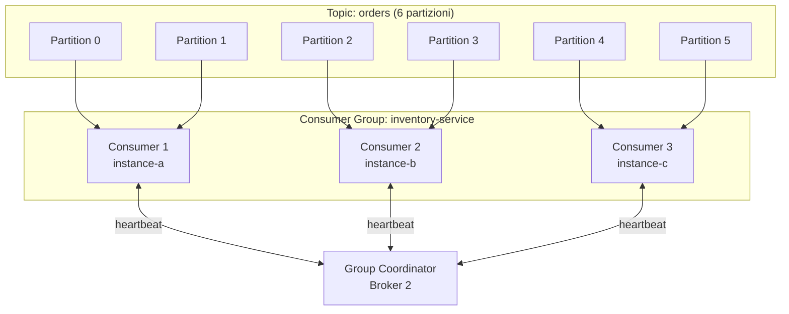
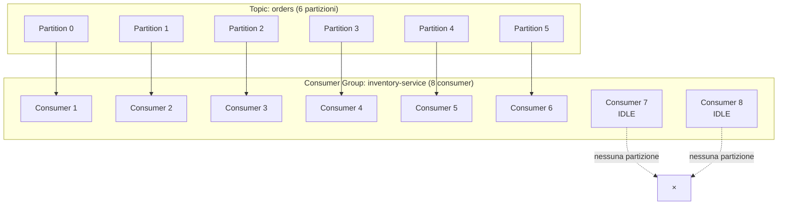

# Consumer Groups

## Panoramica

Il **consumer group** è il meccanismo fondamentale di Kafka per il consumo parallelo e scalabile dei messaggi. Un consumer group è un insieme di consumer che cooperano per leggere un topic, dove ogni partizione del topic viene assegnata a esattamente un consumer del gruppo alla volta. Questo garantisce che ogni record venga processato una sola volta nell'ambito del gruppo, permettendo al tempo stesso di distribuire il carico su più istanze. Consumer group diversi sono completamente indipendenti: ciascun gruppo mantiene i propri offset e legge il topic integralmente, abilitando il pattern **pub-sub** (un topic letto da più sistemi diversi) senza interferenze. Il numero massimo di consumer attivi in un gruppo è uguale al numero di partizioni del topic: consumer in eccesso rimarranno idle.

## Concetti Chiave

### Assegnazione delle Partizioni

Ogni partizione viene assegnata a **esattamente uno** consumer nel gruppo. Se il gruppo ha più consumer dei topic, i consumer in eccesso non ricevono partizioni e restano idle. Se il gruppo ha meno consumer delle partizioni, alcuni consumer leggono da più partizioni.

```
Topic "orders" con 6 partizioni:

Scenario 1: 3 consumer nel gruppo
  Consumer 1 → Partition 0, Partition 1
  Consumer 2 → Partition 2, Partition 3
  Consumer 3 → Partition 4, Partition 5

Scenario 2: 6 consumer nel gruppo (massimo parallelismo)
  Consumer 1 → Partition 0
  Consumer 2 → Partition 1
  Consumer 3 → Partition 2
  Consumer 4 → Partition 3
  Consumer 5 → Partition 4
  Consumer 6 → Partition 5

Scenario 3: 8 consumer nel gruppo
  Consumer 1 → Partition 0
  Consumer 2 → Partition 1
  ...
  Consumer 6 → Partition 5
  Consumer 7 → IDLE (nessuna partizione)
  Consumer 8 → IDLE (nessuna partizione)
```

### Group Coordinator

Il **Group Coordinator** è un broker speciale (determinato in base al `group.id`) responsabile di:
- Tenere traccia dei consumer membri del gruppo
- Ricevere gli heartbeat
- Avviare il rebalancing quando necessario
- Archiviare gli offset committati nel topic interno `__consumer_offsets`

La partizione del topic `__consumer_offsets` a cui appartiene il gruppo è determinata da: `abs(hash(group.id)) % numPartitions(__consumer_offsets)`.

### Rebalancing

Il **rebalancing** è il processo di riassegnazione delle partizioni ai consumer del gruppo. Avviene quando:
- Un nuovo consumer si unisce al gruppo
- Un consumer esistente lascia il gruppo (shutdown pulito)
- Un consumer viene considerato morto (heartbeat timeout o max.poll.interval.ms violato)
- Le partizioni del topic aumentano

Durante il rebalancing (nei protocolli eager), **tutti i consumer smettono temporaneamente di consumare** finché la nuova assegnazione non è completata (Stop The World).

### Protocollo di Assegnazione (Assignor)

Il **partition assignor** è il componente che calcola come distribuire le partizioni. Configurato con `partition.assignment.strategy`:

| Assignor | Comportamento | Quando usarlo |
|---|---|---|
| `RangeAssignor` | Assegna range contigui di partizioni per topic. Può causare distribuzione sbilanciata con più topic. | Default (legacy) |
| `RoundRobinAssignor` | Distribuzione round-robin di tutte le partizioni tra tutti i consumer. | Distribuzione uniforme con topic multipli |
| `StickyAssignor` | Tenta di mantenere le assegnazioni precedenti durante il rebalancing (riduce il movimento di partizioni). | Ridurre l'impatto del rebalancing |
| `CooperativeStickyAssignor` | Come StickyAssignor ma con rebalancing cooperativo (no Stop The World). | **Raccomandato in produzione** |

### Eager vs Cooperative Rebalancing

**Eager Rebalancing (legacy):**
1. Tutti i consumer revocano tutte le partizioni
2. Il coordinator calcola la nuova assegnazione
3. Tutti i consumer ricevono la nuova assegnazione
4. Processing ripreso

Problema: anche le partizioni che non cambiano proprietario vengono temporaneamente revocate → Stop The World.

**Cooperative Rebalancing (da Kafka 2.4):**
1. Il coordinator identifica solo le partizioni da spostare
2. I consumer con partizioni da cedere le revocano
3. I consumer che ricevono nuove partizioni iniziano a consumarle
4. Le partizioni che non si muovono non vengono mai interrotte

Vantaggio: i consumer che non cambiano assegnazione continuano a consumare durante il rebalancing.

## Architettura / Come Funziona

### Assegnazione con 6 Partizioni e 3 Consumer



### Consumer in Eccesso (Idle)



### Rebalancing: Sequenza Cooperativa

```mermaid
sequenceDiagram
    participant C1 as Consumer 1
    participant C2 as Consumer 2
    participant GC as Group Coordinator

    Note over C1,C2: Stato iniziale: C1 → P0,P1,P2 | C2 → P3,P4,P5

    Note over C1: Nuovo Consumer 3 si unisce
    C1->>GC: JoinGroup (con assegnazione corrente)
    C2->>GC: JoinGroup (con assegnazione corrente)
    GC-->>C1: SyncGroup → Revoca solo P2
    GC-->>C2: SyncGroup → Nessuna revoca

    C1->>GC: LeavePartition(P2) - revoca P2
    Note over C1,C2: C1 continua su P0,P1 | C2 continua su P3,P4,P5

    GC-->>C1: JoinGroup Round 2
    GC-->>C2: JoinGroup Round 2
    GC->>C3: SyncGroup → Assegna P2,P5

    Note over C1,C2,C3: Finale: C1→P0,P1 | C2→P3,P4 | C3→P2,P5
```

## Configurazione & Pratica

### Configurazioni Consumer Group Essenziali

```properties
# Identificativo del gruppo (tutti i consumer con lo stesso ID formano il gruppo)
group.id=inventory-service

# Instance ID per sticky membership (evita rebalancing al restart)
group.instance.id=inventory-service-pod-1  # Static Group Membership (Kafka 2.3+)

# Strategia di assegnazione (raccomandato: CooperativeStickyAssignor)
partition.assignment.strategy=org.apache.kafka.clients.consumer.CooperativeStickyAssignor

# Heartbeat
heartbeat.interval.ms=3000      # ogni 3 secondi
session.timeout.ms=45000        # il coordinator aspetta max 45s prima di rebalancing

# Timeout tra poll()
max.poll.interval.ms=300000     # max 5 minuti tra una poll() e la successiva

# Offset
enable.auto.commit=false
auto.offset.reset=earliest
```

### Static Group Membership (Kafka 2.3+)

Con `group.instance.id` configurato, il consumer usa la **Static Group Membership**: quando un consumer si riconnette con lo stesso `instance.id`, riceve le stesse partizioni di prima **senza** un rebalancing. Ideale per deployment con rolling restarts (es. Kubernetes).

```properties
# Consumer 1 (pod-1)
group.id=inventory-service
group.instance.id=inventory-service-pod-1

# Consumer 2 (pod-2)
group.id=inventory-service
group.instance.id=inventory-service-pod-2
```

Il broker aspetta `session.timeout.ms` prima di considerare un membro statico come morto. Aumentare il valore per tollerare restart lenti.

### Gestione del Rebalancing con ConsumerRebalanceListener

```java
import org.apache.kafka.clients.consumer.*;
import org.apache.kafka.common.TopicPartition;
import java.util.Collection;
import java.util.Map;
import java.util.HashMap;

public class RebalanceAwareConsumer {

    private final KafkaConsumer<String, String> consumer;
    private final Map<TopicPartition, OffsetAndMetadata> currentOffsets = new HashMap<>();

    public RebalanceAwareConsumer(Properties props) {
        this.consumer = new KafkaConsumer<>(props);
    }

    public void run() {
        consumer.subscribe(List.of("orders"), new ConsumerRebalanceListener() {

            // Chiamato PRIMA che le partizioni vengano revocate (usare per commit)
            @Override
            public void onPartitionsRevoked(Collection<TopicPartition> partitions) {
                System.out.println("Revoca partizioni: " + partitions);
                // Commit degli offset prima della revoca per non perdere progresso
                consumer.commitSync(currentOffsets);
                currentOffsets.clear();
            }

            // Chiamato DOPO che le nuove partizioni sono state assegnate
            @Override
            public void onPartitionsAssigned(Collection<TopicPartition> partitions) {
                System.out.println("Nuove partizioni assegnate: " + partitions);
                // Eventuale seek a posizione desiderata
            }

            // Solo con CooperativeStickyAssignor: partizioni perse durante rebalancing incrementale
            @Override
            public void onPartitionsLost(Collection<TopicPartition> partitions) {
                System.out.println("Partizioni perse (rebalancing anomalo): " + partitions);
                // Non fare commit - le partizioni ora appartengono ad altri consumer
                currentOffsets.keySet().removeAll(partitions);
            }
        });

        while (true) {
            ConsumerRecords<String, String> records = consumer.poll(Duration.ofMillis(1000));

            for (ConsumerRecord<String, String> record : records) {
                processRecord(record);
                // Tracciare l'offset corrente (offset+1 = prossimo da leggere)
                currentOffsets.put(
                    new TopicPartition(record.topic(), record.partition()),
                    new OffsetAndMetadata(record.offset() + 1)
                );
            }

            if (!currentOffsets.isEmpty()) {
                consumer.commitAsync(currentOffsets, null);
            }
        }
    }

    private void processRecord(ConsumerRecord<String, String> record) {
        System.out.printf("[%s-%d @ %d] %s%n",
            record.topic(), record.partition(), record.offset(), record.value());
    }
}
```

### kafka-consumer-groups.sh: CLI per la Gestione dei Gruppi

```bash
# Listare tutti i consumer group
kafka-consumer-groups.sh \
  --bootstrap-server localhost:9092 \
  --list

# Descrivere un gruppo (stato, lag, assegnazioni)
kafka-consumer-groups.sh \
  --bootstrap-server localhost:9092 \
  --describe \
  --group inventory-service

# Output:
# GROUP             TOPIC   PARTITION  CURRENT-OFFSET  LOG-END-OFFSET  LAG  CONSUMER-ID                     HOST
# inventory-service orders  0          1024            1024            0    consumer-1-abc123               /10.0.0.1
# inventory-service orders  1          980             1050            70   consumer-2-def456               /10.0.0.2
# inventory-service orders  2          500             500             0    consumer-1-abc123               /10.0.0.1

# Descrivere tutti i gruppi
kafka-consumer-groups.sh \
  --bootstrap-server localhost:9092 \
  --describe \
  --all-groups

# Resettare gli offset di un gruppo (diversi modi)
# IMPORTANTE: il consumer deve essere fermo

# Reset all'inizio
kafka-consumer-groups.sh \
  --bootstrap-server localhost:9092 \
  --group inventory-service \
  --topic orders \
  --reset-offsets \
  --to-earliest \
  --execute

# Reset alla fine
kafka-consumer-groups.sh \
  --bootstrap-server localhost:9092 \
  --group inventory-service \
  --topic orders \
  --reset-offsets \
  --to-latest \
  --execute

# Reset a un offset specifico
kafka-consumer-groups.sh \
  --bootstrap-server localhost:9092 \
  --group inventory-service \
  --topic orders:0 \
  --reset-offsets \
  --to-offset 500 \
  --execute

# Reset per timestamp (es. 1 ora fa)
kafka-consumer-groups.sh \
  --bootstrap-server localhost:9092 \
  --group inventory-service \
  --topic orders \
  --reset-offsets \
  --to-datetime 2026-02-23T10:00:00.000 \
  --execute

# Eliminare un consumer group (deve essere inattivo)
kafka-consumer-groups.sh \
  --bootstrap-server localhost:9092 \
  --delete \
  --group inventory-service
```

## Best Practices

### Numero di Partizioni e Scalabilità del Gruppo

!!! tip "Pianificazione della Scalabilità"
    Dimensionare le partizioni del topic in base al numero massimo di consumer che si prevede di usare nel gruppo più grande. Se si parte con 3 consumer e si vuole poter scalare a 12, creare il topic con almeno 12 partizioni fin dall'inizio (le partizioni si possono aumentare ma non ridurre senza ricreazione del topic).

### CooperativeStickyAssignor in Produzione

```properties
# Migrazione da RangeAssignor a CooperativeStickyAssignor
# Il passaggio richiede due step se si fa rolling update:
# Step 1: aggiungere CooperativeStickyAssignor alla lista esistente
partition.assignment.strategy=org.apache.kafka.clients.consumer.RangeAssignor,org.apache.kafka.clients.consumer.CooperativeStickyAssignor

# Step 2: dopo che tutti i consumer sono stati aggiornati, usare solo il cooperativo
partition.assignment.strategy=org.apache.kafka.clients.consumer.CooperativeStickyAssignor
```

### Monitoring del Consumer Lag

Il **consumer lag** (differenza tra LOG-END-OFFSET e CURRENT-OFFSET) è l'indicatore principale della salute del consumer group. Un lag crescente indica che i consumer non riescono a stare al passo con i producer.

```bash
# Script per monitorare il lag in modo continuo
watch -n 5 kafka-consumer-groups.sh \
  --bootstrap-server localhost:9092 \
  --describe \
  --group inventory-service
```

Metriche JMX (Java Management Extensions) da monitorare:
- `kafka.consumer:type=consumer-fetch-manager-metrics,client-id=*,attribute=records-lag-max`
- `kafka.consumer:type=consumer-fetch-manager-metrics,client-id=*,attribute=records-lag`

### Anti-Pattern

- **Stesso `group.id` per consumatori che svolgono ruoli diversi:** se due microservizi diversi usano lo stesso `group.id`, si spartiscono le partizioni e ciascuno vede solo una parte dei record. Usare `group.id` diversi per consumer con logica diversa.
- **Consumer che chiama `poll()` infrequentemente:** con processing lento e batch grandi, `max.poll.interval.ms` viene violato. Ridurre `max.poll.records` o spostare il processing su thread separati.
- **Non gestire il rebalancing con `ConsumerRebalanceListener`:** senza commit esplicito in `onPartitionsRevoked`, i record processati ma non committati prima del rebalancing verranno riprocessati.
- **Scalare oltre il numero di partizioni:** consumer in eccesso sono idle. Aumentare prima le partizioni.

## Troubleshooting

### Rebalancing Continuo (Rebalancing Loop)

**Sintomi:** nei log del consumer si vede costante `Revoked partition` e `Assigned partition`. Il lag cresce.

**Diagnosi:**
```bash
# Verificare se il gruppo è in stato PREPARING_REBALANCE o COMPLETING_REBALANCE
kafka-consumer-groups.sh \
  --bootstrap-server localhost:9092 \
  --describe \
  --group inventory-service \
  --state

# Output possibile: State: PreparingRebalance
```

**Cause e soluzioni:**
1. `max.poll.interval.ms` violato → ridurre `max.poll.records` o aumentare il timeout
2. Consumer instabile (crash loop) → verificare i log dell'applicazione
3. Deploy rolling con rebalancing eccessivo → usare `CooperativeStickyAssignor` + `group.instance.id`

### Offset Non Avanza (Lag Rimane Costante)

```bash
# Verificare gli offset committati vs log-end-offset
kafka-consumer-groups.sh \
  --bootstrap-server localhost:9092 \
  --describe \
  --group inventory-service
```

Se il CURRENT-OFFSET non avanza ma il consumer è attivo:
- Il consumer sta processando ma non chiama `commitSync()` / `commitAsync()`
- Eccezione non gestita nel loop che impedisce il commit
- `enable.auto.commit=false` senza commit manuale nel codice

### Consumer Group in Stato "Dead"

Un gruppo senza consumer attivi è in stato `Empty` o `Dead`. In stato `Dead`, gli offset possono essere eliminati dopo `offsets.retention.minutes` (default: 7 giorni). Se il gruppo viene riavviato dopo questa finestra, `auto.offset.reset` determina il comportamento.

```bash
# Verificare lo stato del gruppo
kafka-consumer-groups.sh \
  --bootstrap-server localhost:9092 \
  --describe \
  --group inventory-service \
  --state
# State: Dead / Empty / Stable / PreparingRebalance / CompletingRebalance
```

## Riferimenti

- [Apache Kafka Documentation: Consumer Groups](https://kafka.apache.org/documentation/#intro_consumers)
- [KIP-429: Kafka Consumer Incremental Rebalance Protocol](https://cwiki.apache.org/confluence/display/KAFKA/KIP-429%3A+Kafka+Consumer+Incremental+Rebalance+Protocol)
- [KIP-345: Introduce static membership protocol to reduce consumer rebalances](https://cwiki.apache.org/confluence/display/KAFKA/KIP-345%3A+Introduce+static+membership+protocol+to+reduce+consumer+rebalances)
- [Confluent: Consumer Group Protocol](https://developer.confluent.io/courses/architecture/consumer-group-protocol/)
- [Kafka: The Definitive Guide — Chapter 4: Kafka Consumers (Rebalancing)](https://www.oreilly.com/library/view/kafka-the-definitive/9781491936153/)
