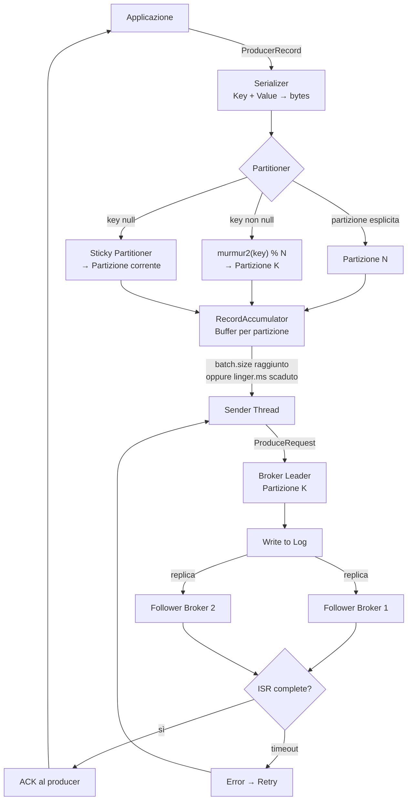

# Produttori (Producer)

## Panoramica

Il **producer** è il componente client che pubblica record su un topic Kafka. Ogni record viene serializzato, partizionato (assegnato a una partizione specifica) e inviato al broker leader di quella partizione. Il producer gestisce autonomamente la connessione al cluster tramite la lista dei bootstrap servers, scopre la topologia del cluster (metadata) e mantiene un buffer interno per ottimizzare le scritture in batch. Le garanzie di consegna sono configurabili tramite il parametro `acks`: da nessuna garanzia (fire-and-forget) alla conferma da tutte le repliche sincronizzate. Con il producer idempotente, Kafka garantisce la semantica **exactly-once** a livello di produzione, eliminando i duplicati in caso di retry.

## Concetti Chiave

### Serializzazione

Il producer deve **serializzare** la chiave e il valore del record in byte prima di inviarli al broker. Kafka fornisce serializzatori standard:

| Serializzatore | Classe | Uso |
|---|---|---|
| String | `StringSerializer` | Stringhe UTF-8 |
| Integer/Long | `IntegerSerializer`, `LongSerializer` | Numeri interi |
| Byte Array | `ByteArraySerializer` | Dati già serializzati |
| JSON (Confluent) | `KafkaJsonSerializer` | JSON generico |
| Avro (Confluent) | `KafkaAvroSerializer` | Schema Registry |
| Protobuf (Confluent) | `KafkaProtobufSerializer` | Protocol Buffers |

### Partizionamento

Il **partitioner** decide in quale partizione del topic viene scritto il record:

1. **Partizione esplicita:** se il `ProducerRecord` specifica la partizione, viene usata quella.
2. **Key-based (hash):** se la key non è null, la partizione è `murmur2(key) % numPartitions`. Stesso key → stessa partizione (ordinamento garantito per quella key).
3. **Round-robin (sticky):** se la key è null, Kafka usa lo **Sticky Partitioner** (default da Kafka 2.4): riempie un batch su una partizione prima di passare alla successiva, migliorando l'efficienza del batching.

### Batching

Il producer non invia ogni record singolarmente: li accumula in un **batch** per partizione prima di spedirli al broker. I parametri chiave:

- `batch.size` (default: 16384 byte / 16 KB): dimensione massima del batch per partizione. Batch inviato quando è pieno.
- `linger.ms` (default: 0): attesa aggiuntiva prima di inviare un batch non pieno. Aumentare per migliorare il throughput a scapito della latenza.
- `buffer.memory` (default: 33554432 / 32 MB): memoria totale del buffer del producer. Se pieno, il producer si blocca per `max.block.ms`.

### Garanzie acks

Il parametro `acks` controlla quante repliche devono confermare la scrittura:

| acks | Garanzia | Rischio | Throughput |
|---|---|---|---|
| `0` | Nessuna (fire & forget) | Perdita dati garantita se broker cade | Massimo |
| `1` | Leader ha scritto sul log locale | Perdita dati se leader cade prima della replica | Alto |
| `all` (o `-1`) | Tutte le ISR hanno scritto | Nessuna perdita dati (con min.insync.replicas >= 2) | Moderato |

!!! warning "acks=1 non è safe in produzione"
    Con `acks=1`, se il leader riceve il record, conferma al producer e poi cade prima di replicare, il record è perso. In produzione usare sempre `acks=all` con `min.insync.replicas=2`.

### Idempotenza

Con `enable.idempotence=true`, il producer assegna a ogni record un **Producer ID (PID)** e un **sequence number**. Il broker verifica che ogni sequence number sia esattamente uno in più rispetto all'ultimo ricevuto. Se un retry invia lo stesso record due volte (stesso PID + sequence), il broker deduplica e l'effetto è **exactly-once** per singola sessione del producer.

L'idempotenza implica automaticamente: `acks=all`, `retries=Integer.MAX_VALUE`, `max.in.flight.requests.per.connection <= 5`.

### Retry e Backoff

In caso di errore temporaneo (leader non disponibile, errore di rete), il producer ritenta automaticamente:
- `retries` (default con idempotenza: MAX_VALUE): numero di tentativi
- `retry.backoff.ms` (default: 100): attesa tra un retry e il successivo
- `delivery.timeout.ms` (default: 120000 ms / 2 min): timeout complessivo per un record (inclusi retry)

Errori **retriable**: `LEADER_NOT_AVAILABLE`, `NOT_LEADER_OR_FOLLOWER`, `NETWORK_EXCEPTION`
Errori **non-retriable**: `MESSAGE_TOO_LARGE`, `INVALID_TOPIC_EXCEPTION`, `OFFSET_OUT_OF_RANGE`

## Architettura / Come Funziona

### Flusso Producer → Partitioner → Broker



### Metadata Refresh

Il producer mantiene i metadata del cluster (quali broker sono leader di quali partizioni) e li aggiorna periodicamente tramite `metadata.max.age.ms` (default: 5 minuti) oppure quando riceve un errore `NOT_LEADER_OR_FOLLOWER`, forzando un refresh immediato.

## Configurazione & Pratica

### Configurazioni Producer Essenziali

```properties
# Connessione al cluster
bootstrap.servers=broker1:9092,broker2:9092,broker3:9092

# Serializzatori
key.serializer=org.apache.kafka.common.serialization.StringSerializer
value.serializer=org.apache.kafka.common.serialization.StringSerializer

# Garanzie di consegna
acks=all

# Idempotenza (raccomandato in produzione)
enable.idempotence=true

# Batching
batch.size=65536          # 64 KB - aumentare per alto throughput
linger.ms=10              # attendi 10ms per riempire il batch
buffer.memory=67108864    # 64 MB buffer totale

# Timeout e retry
delivery.timeout.ms=120000
request.timeout.ms=30000
retries=2147483647        # MAX_VALUE con idempotenza

# Compressione (riduce banda e storage)
compression.type=lz4

# Limite di richieste in volo per connessione (max 5 con idempotenza)
max.in.flight.requests.per.connection=5

# Blocco massimo quando il buffer è pieno
max.block.ms=60000
```

### Esempio Java: Producer con Callback Asincrono

```java
import org.apache.kafka.clients.producer.*;
import org.apache.kafka.common.serialization.StringSerializer;
import java.util.Properties;
import java.util.concurrent.ExecutionException;

public class OrderProducer {

    private final KafkaProducer<String, String> producer;
    private static final String TOPIC = "orders";

    public OrderProducer() {
        Properties props = new Properties();
        props.put(ProducerConfig.BOOTSTRAP_SERVERS_CONFIG, "localhost:9092");
        props.put(ProducerConfig.KEY_SERIALIZER_CLASS_CONFIG, StringSerializer.class.getName());
        props.put(ProducerConfig.VALUE_SERIALIZER_CLASS_CONFIG, StringSerializer.class.getName());
        props.put(ProducerConfig.ACKS_CONFIG, "all");
        props.put(ProducerConfig.ENABLE_IDEMPOTENCE_CONFIG, true);
        props.put(ProducerConfig.COMPRESSION_TYPE_CONFIG, "lz4");
        props.put(ProducerConfig.LINGER_MS_CONFIG, 10);
        props.put(ProducerConfig.BATCH_SIZE_CONFIG, 65536);
        this.producer = new KafkaProducer<>(props);
    }

    // Invio asincrono con callback (pattern raccomandato per alto throughput)
    public void sendAsync(String orderId, String payload) {
        ProducerRecord<String, String> record = new ProducerRecord<>(TOPIC, orderId, payload);

        producer.send(record, (metadata, exception) -> {
            if (exception != null) {
                // Gestire l'errore: log, dead-letter queue, alert
                System.err.println("Errore invio record: " + exception.getMessage());
            } else {
                System.out.printf("Record inviato → topic=%s, partition=%d, offset=%d%n",
                    metadata.topic(), metadata.partition(), metadata.offset());
            }
        });
    }

    // Invio sincrono (blocca fino all'ack — utile per debug, non per throughput)
    public RecordMetadata sendSync(String orderId, String payload)
            throws ExecutionException, InterruptedException {
        ProducerRecord<String, String> record = new ProducerRecord<>(TOPIC, orderId, payload);
        return producer.send(record).get(); // blocca qui
    }

    // Invio con partizione esplicita
    public void sendToPartition(int partition, String key, String value) {
        ProducerRecord<String, String> record = new ProducerRecord<>(TOPIC, partition, key, value);
        producer.send(record, (meta, ex) -> {
            if (ex != null) System.err.println("Errore: " + ex);
        });
    }

    // Flush esplicito: garantisce che tutti i record in buffer vengano inviati
    public void flush() {
        producer.flush();
    }

    // Chiudere il producer (importante: flush() + release risorse)
    public void close() {
        producer.close();
    }

    public static void main(String[] args) {
        OrderProducer p = new OrderProducer();

        for (int i = 0; i < 1000; i++) {
            p.sendAsync("order-" + i, "{\"id\":" + i + ",\"status\":\"created\"}");
        }

        p.flush();   // aspetta che tutti i record vengano inviati
        p.close();
    }
}
```

### Esempio con Avro e Schema Registry

```java
import io.confluent.kafka.serializers.KafkaAvroSerializer;

Properties props = new Properties();
props.put(ProducerConfig.BOOTSTRAP_SERVERS_CONFIG, "localhost:9092");
props.put(ProducerConfig.KEY_SERIALIZER_CLASS_CONFIG, StringSerializer.class.getName());
props.put(ProducerConfig.VALUE_SERIALIZER_CLASS_CONFIG, KafkaAvroSerializer.class.getName());
props.put("schema.registry.url", "http://localhost:8081");
props.put(ProducerConfig.ACKS_CONFIG, "all");
props.put(ProducerConfig.ENABLE_IDEMPOTENCE_CONFIG, true);

KafkaProducer<String, Order> avroProducer = new KafkaProducer<>(props);
```

### Test dalla CLI

```bash
# Producer console base
kafka-console-producer.sh \
  --bootstrap-server localhost:9092 \
  --topic orders

# Producer con key (separatore ":")
kafka-console-producer.sh \
  --bootstrap-server localhost:9092 \
  --topic orders \
  --property "key.separator=:" \
  --property "parse.key=true"
# Digitare: customer-1:{"id":1,"amount":99.90}

# Producer con Avro (richiede Schema Registry)
kafka-avro-console-producer \
  --broker-list localhost:9092 \
  --topic orders \
  --property schema.registry.url=http://localhost:8081 \
  --property value.schema='{"type":"record","name":"Order","fields":[{"name":"id","type":"string"}]}'
```

## Best Practices

### Configurazione per Alto Throughput

```properties
# Ottimizzato per massimizzare il throughput
linger.ms=20
batch.size=131072       # 128 KB
compression.type=lz4    # Buon bilanciamento compressione/CPU
buffer.memory=134217728 # 128 MB
max.in.flight.requests.per.connection=5
acks=1                  # accettabile se i dati sono ricostruibili
```

### Configurazione per Bassa Latenza

```properties
# Ottimizzato per minimizzare la latenza
linger.ms=0
batch.size=1
compression.type=none
acks=1
```

### Configurazione per Zero Data Loss

```properties
# Massima durabilità
acks=all
enable.idempotence=true
retries=2147483647
max.in.flight.requests.per.connection=5
delivery.timeout.ms=300000  # 5 minuti
# Sul broker: min.insync.replicas=2
```

!!! tip "Regola d'Oro"
    In produzione, abilitare sempre `enable.idempotence=true`. Abilita automaticamente `acks=all` e retry infiniti, e previene i duplicati senza overhead significativo. Il costo è trascurabile, i benefici sono sostanziali.

### Anti-Pattern

- **Creare un producer per ogni messaggio:** il `KafkaProducer` è thread-safe e costoso da inizializzare. Creare un'istanza singleton e condividerla.
- **Ignorare il callback:** senza un callback o senza chiamare `.get()` sul future, gli errori di produzione passano silenti.
- **Non chiamare `close()` al termine:** il producer non effettua il flush del buffer automaticamente alla chiusura JVM. Usare uno shutdown hook o try-with-resources.
- **Usare `linger.ms=0` con `batch.size` grande:** non ha senso. Se si vuole bassa latenza, usare batch.size piccolo.

## Troubleshooting

### Record Non Inviati (Buffer Pieno)

```
org.apache.kafka.common.errors.TimeoutException:
  Failed to allocate memory within the configured max blocking time 60000 ms.
```

**Causa:** il buffer del producer è pieno perché il sender non riesce a svuotarlo abbastanza velocemente (broker lento o irraggiungibile).
**Soluzione:** aumentare `buffer.memory`, verificare la connettività al broker, verificare che il broker non sia sovraccarico.

### Broker Non Disponibile al Primo Avvio

```
org.apache.kafka.common.errors.TimeoutException:
  Topic orders not present in metadata after 60000 ms.
```

**Causa:** il topic non esiste oppure il broker non è raggiungibile.
**Soluzione:**
```bash
# Verificare connettività
nc -zv broker1 9092

# Verificare che il topic esista
kafka-topics.sh --bootstrap-server localhost:9092 --list
```

### Duplicati Nonostante l'Idempotenza

L'idempotenza del producer protegge solo durante la sessione di vita del producer. Se il producer viene riavviato, riceve un nuovo PID e un retry di un record precedente può creare un duplicato. Per exactly-once end-to-end (producer + consumer) usare le **Kafka Transactions**.

```java
// Exactly-once con transazioni
producer.initTransactions();
try {
    producer.beginTransaction();
    producer.send(record1);
    producer.send(record2);
    producer.commitTransaction();
} catch (ProducerFencedException | OutOfOrderSequenceException e) {
    producer.close(); // non recuperabile
} catch (KafkaException e) {
    producer.abortTransaction();
}
```

## Riferimenti

- [Apache Kafka Producer Configs](https://kafka.apache.org/documentation/#producerconfigs)
- [Confluent: Kafka Producer Internals](https://developer.confluent.io/courses/architecture/producer/)
- [Confluent: Idempotent Producer](https://docs.confluent.io/platform/current/clients/producer.html#idempotent-producer)
- [KIP-98: Exactly Once Delivery and Transactional Messaging](https://cwiki.apache.org/confluence/display/KAFKA/KIP-98+-+Exactly+Once+Delivery+and+Transactional+Messaging)
- [Kafka: The Definitive Guide — Chapter 3: Kafka Producers](https://www.oreilly.com/library/view/kafka-the-definitive/9781491936153/)
