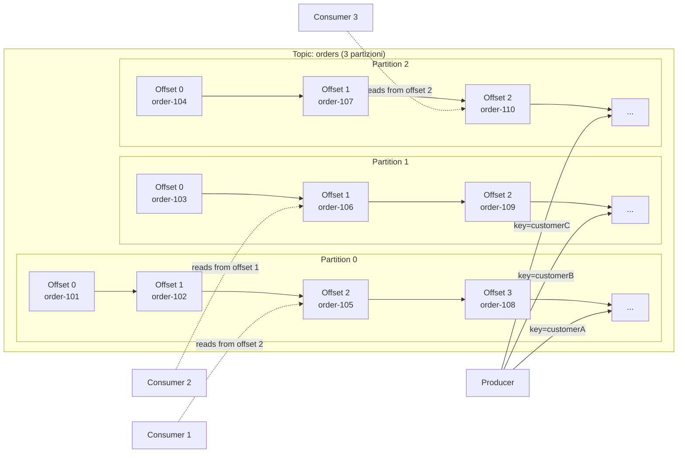
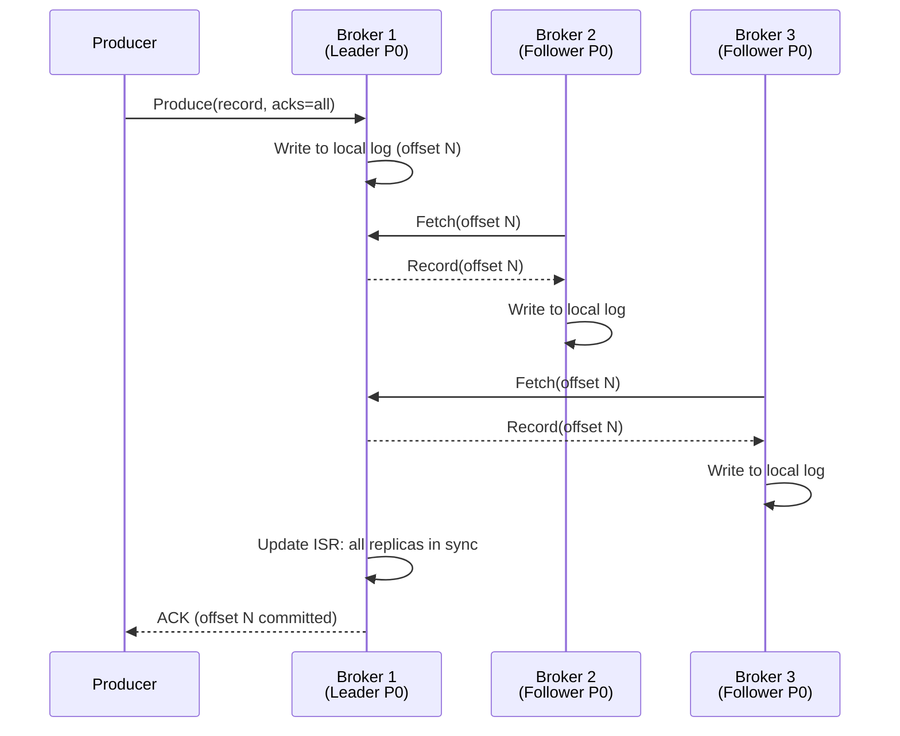

# Topics e Partizioni

## Panoramica

Il **topic** è il canale logico fondamentale di Apache Kafka: i producer pubblicano messaggi su un topic e i consumer li leggono da quel topic, senza conoscersi direttamente. Ogni topic è internamente suddiviso in una o più **partizioni**, che rappresentano l'unità fisica di storage e parallelismo. Ogni partizione è un **log append-only immutabile**: i record vengono aggiunti sempre in coda e mai modificati o cancellati individualmente. Ogni record riceve un **offset** progressivo che lo identifica univocamente all'interno della partizione. La combinazione topic + partizione + offset costituisce l'indirizzo preciso di qualsiasi record in Kafka. La replica delle partizioni su più broker garantisce durabilità e disponibilità dei dati anche in caso di guasto di un nodo.

## Concetti Chiave

### Topic

Un topic è identificato da un nome univoco nel cluster (es. `orders`, `payment-events`). Non ha uno schema dati imposto da Kafka (lo schema è responsabilità del producer e del consumer, eventualmente gestito con Schema Registry). Un topic può avere:
- **N partizioni** (configurabile alla creazione, aumentabile ma non riducibile)
- **Replication factor** (numero di copie di ogni partizione nel cluster)
- **Retention policy** (per tempo o per dimensione)

### Partizione

La partizione è l'unità fisica di Kafka:

- **Log append-only:** i record vengono sempre aggiunti alla fine del log. Non è possibile modificare un record già scritto.
- **Immutabilità:** garantisce semplicità di implementazione, cache-friendliness e replay dei dati.
- **Ordinamento garantito:** all'interno di una partizione, i record sono strettamente ordinati per offset.
- **Parallelismo:** più partizioni = più consumer in parallelo nello stesso consumer group.
- **Storage su disco:** ogni partizione corrisponde a una cartella sul filesystem del broker, composta da **segmenti** (file `.log` + indice `.index`).

### Offset

L'**offset** è un numero intero a 64 bit, crescente e monotono, assegnato ad ogni record all'interno di una partizione. Rappresenta la posizione del record nel log.

- Offset `0` = primo record della partizione
- Offset `N` = N+1-esimo record scritto nella partizione
- **Non è un timestamp**, ma può essere usato in combinazione con `offsetsForTimes()` per cercare un offset in base al tempo
- I consumer memorizzano l'offset dell'ultimo record processato (commit dell'offset) per poter riprendere da dove si sono fermati

### Replica

Ogni partizione ha esattamente:
- **1 Leader:** il broker che riceve le scritture dei producer e serve le letture dei consumer
- **N-1 Follower:** broker che replicano passivamente i dati dal leader
- **ISR (In-Sync Replicas):** insieme dei follower che sono aggiornati entro un certo lag dal leader. Solo le repliche nell'ISR possono diventare leader in caso di elezione.

## Architettura / Come Funziona

### Struttura di un Topic con 3 Partizioni



### Storage su Disco: Segmenti

Ogni partizione è composta da **segmenti**. Un segmento è un file `.log` a cui si scrive attualmente (il segmento attivo) più file di indice:

```
/var/kafka/logs/orders-0/          ← partizione 0 del topic "orders"
├── 00000000000000000000.log       ← segmento che inizia dall'offset 0
├── 00000000000000000000.index     ← indice sparso per offset → posizione fisica
├── 00000000000000000000.timeindex ← indice per timestamp → offset
├── 00000000001073741824.log       ← secondo segmento (inizia dall'offset 1073741824)
├── 00000000001073741824.index
└── leader-epoch-checkpoint
```

Un nuovo segmento viene creato quando:
- Il segmento attivo supera `log.segment.bytes` (default: 1 GB)
- Oppure dopo `log.roll.hours` (default: 168 ore)

La retention si applica a livello di segmento: un segmento viene eliminato solo quando **tutti** i suoi record sono scaduti (basato su timestamp o dimensione totale).

### Replica e ISR



## Configurazione & Pratica

### Creazione e Gestione Topic con kafka-topics.sh

```bash
# Creare un topic con 6 partizioni e replication factor 3
kafka-topics.sh \
  --bootstrap-server localhost:9092 \
  --create \
  --topic orders \
  --partitions 6 \
  --replication-factor 3 \
  --config retention.ms=604800000 \
  --config min.insync.replicas=2

# Descrivere un topic (mostra leader, ISR, repliche per ogni partizione)
kafka-topics.sh \
  --bootstrap-server localhost:9092 \
  --describe \
  --topic orders

# Output atteso:
# Topic: orders  PartitionCount: 6  ReplicationFactor: 3  Configs: retention.ms=604800000
#   Topic: orders  Partition: 0  Leader: 2  Replicas: 2,0,1  Isr: 2,0,1
#   Topic: orders  Partition: 1  Leader: 0  Replicas: 0,1,2  Isr: 0,1,2
#   Topic: orders  Partition: 2  Leader: 1  Replicas: 1,2,0  Isr: 1,2,0
#   ...

# Aumentare il numero di partizioni (SOLO incremento, mai riduzione)
kafka-topics.sh \
  --bootstrap-server localhost:9092 \
  --alter \
  --topic orders \
  --partitions 12

# Modificare la configurazione di un topic
kafka-configs.sh \
  --bootstrap-server localhost:9092 \
  --entity-type topics \
  --entity-name orders \
  --alter \
  --add-config retention.ms=2592000000

# Listare tutti i topic
kafka-topics.sh --bootstrap-server localhost:9092 --list

# Eliminare un topic
kafka-topics.sh \
  --bootstrap-server localhost:9092 \
  --delete \
  --topic orders
```

### Configurazioni Importanti a Livello di Topic

```bash
# Visualizzare tutte le configurazioni di un topic (solo overrides)
kafka-configs.sh \
  --bootstrap-server localhost:9092 \
  --entity-type topics \
  --entity-name orders \
  --describe
```

| Configurazione | Default | Descrizione |
|---|---|---|
| `retention.ms` | 604800000 (7 giorni) | Tempo di retention dei messaggi |
| `retention.bytes` | -1 (illimitato) | Dimensione massima per partizione |
| `segment.bytes` | 1073741824 (1 GB) | Dimensione massima di un segmento |
| `min.insync.replicas` | 1 | Minimo di repliche sincronizzate per acks=all |
| `cleanup.policy` | delete | Strategia: `delete` o `compact` |
| `compression.type` | producer | Compressione: `none`, `gzip`, `snappy`, `lz4`, `zstd` |
| `max.message.bytes` | 1048588 (~1 MB) | Dimensione massima di un singolo record |

### Scegliere il Numero di Partizioni

```
Fattori da considerare:
1. Throughput target: partizioni_needed = throughput_MB_s / throughput_per_partition_MB_s
2. Consumer parallelism: max_consumer_per_group = num_partitions
3. Overhead broker: un broker regge ~4000 partizioni totali

Esempio pratico:
- Target: 200 MB/s di ingestion
- Un producer scrive ~50 MB/s per partizione
- Partizioni minime lato producer: 200/50 = 4
- Consumer: vogliamo 6 consumer paralleli
- Scelta: 6 partizioni (soddisfa entrambi i vincoli)
```

## Best Practices

### Naming Convention per i Topic

!!! tip "Convenzione raccomandata"
    Usare il formato: `<dominio>.<entità>.<versione>` oppure `<team>-<servizio>-<evento>`

    Esempi:
    - `ecommerce.orders.v1`
    - `payments-service-transaction-completed`
    - `inventory.stock-updates.v2`

Evitare punti e underscore misti nello stesso topic name: Kafka internamente converte i punti in underscore per i nomi di metriche JMX, causando ambiguità.

### Partizioni

- **Non ridurre le partizioni:** non è supportato nativamente. Richiede la ricreazione del topic con migrazione dei dati.
- **Aumentare con cautela:** aumentare le partizioni cambia il mapping key → partizione per i nuovi record, rompendo eventualmente l'ordinamento per chiave dei record preesistenti.
- **Avere almeno tante partizioni quanti sono i consumer nel gruppo più grande** che leggerà il topic.

### Retention

!!! warning "Retention e Disk Space"
    Monitorare sempre lo spazio disco sui broker. Con retention.ms alta e molti topic, il disco può esaurirsi rapidamente. Impostare alert su disk usage > 70%.

- Usare **log compaction** per topic che rappresentano lo stato corrente (es. tabella utenti, configurazioni) invece della retention temporale.
- Usare **retention temporale** per topic di eventi (transazioni, log, click-stream).

### Anti-Pattern

- **Topic con 1 partizione e consumers multipli:** il secondo consumer del gruppo rimarrà idle. Usare almeno N partizioni per N consumer previsti.
- **Topic con centinaia di partizioni per sicurezza:** ogni partizione consuma risorse. Pianificare in base ai requisiti reali.
- **Non impostare min.insync.replicas:** con il default di 1, `acks=all` non garantisce la persistenza su più broker.

## Troubleshooting

### Topic Non Trovato dal Consumer

```bash
# Verificare che il topic esista
kafka-topics.sh --bootstrap-server localhost:9092 --list | grep orders

# Se non esiste e auto.create.topics.enable=true sul broker, verrà creato automaticamente
# con le configurazioni di default (spesso non desiderato in produzione)
```

!!! warning "auto.create.topics.enable"
    In produzione impostare sempre `auto.create.topics.enable=false` nel `server.properties` del broker. La creazione automatica crea topic con configurazioni di default (spesso 1 partizione, RF=1) inadatte alla produzione.

### Under-Replicated Partitions

```bash
# Trovare partizioni con ISR inferiore al replication factor
kafka-topics.sh \
  --bootstrap-server localhost:9092 \
  --describe \
  --under-replicated-partitions

# Trovare partizioni senza un leader
kafka-topics.sh \
  --bootstrap-server localhost:9092 \
  --describe \
  --unavailable-partitions
```

### Eliminare Record da una Partizione

```bash
# Creare un file JSON con gli offset da cui eliminare (elimina tutto ciò che precede)
cat > delete-records.json << 'EOF'
{
  "partitions": [
    {"topic": "orders", "partition": 0, "offset": 100},
    {"topic": "orders", "partition": 1, "offset": 100}
  ],
  "version": 1
}
EOF

kafka-delete-records.sh \
  --bootstrap-server localhost:9092 \
  --offset-json-file delete-records.json
```

## Riferimenti

- [Apache Kafka Documentation: Topics](https://kafka.apache.org/documentation/#intro_topics)
- [Apache Kafka Documentation: Log](https://kafka.apache.org/documentation/#log)
- [Kafka: The Definitive Guide — Chapter 2: Installing Kafka](https://www.oreilly.com/library/view/kafka-the-definitive/9781491936153/)
- [Confluent: Kafka Topic Configuration](https://docs.confluent.io/platform/current/installation/configuration/topic-configs.html)
- [Confluent: Kafka Log Compaction](https://developer.confluent.io/courses/architecture/compaction/)
