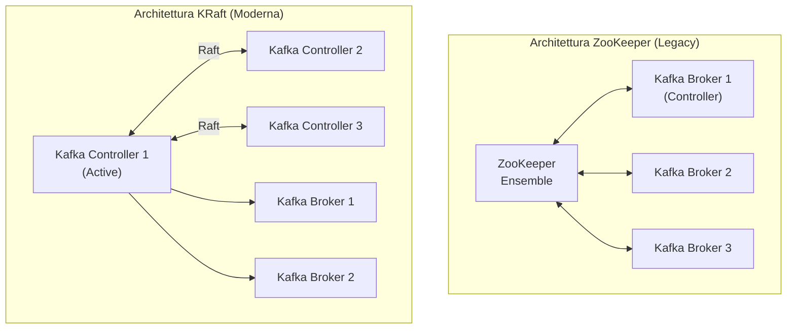

# ZooKeeper e KRaft

## Panoramica

Storicamente Apache Kafka dipendeva da **Apache ZooKeeper** per gestire i metadati del cluster: lista dei broker, configurazione dei topic, elezioni del controller. Dalla versione 3.3+, **KRaft** (Kafka Raft) è il nuovo protocollo interno che elimina questa dipendenza esterna, rendendo Kafka un sistema autonomo e semplificando drasticamente l'architettura operativa.

**ZooKeeper** rimane supportato nelle versioni attuali per compatibilità, ma è ufficialmente **deprecato** e sarà rimosso nelle versioni future. **Tutte le nuove installazioni dovrebbero usare KRaft.**

## Concetti Chiave

### ZooKeeper (architettura legacy)

**Ruolo di ZooKeeper in Kafka:**
- Eleggere il **controller broker** (uno per cluster)
- Tenere il registro di tutti i broker attivi
- Gestire i metadati di topic e partizioni
- Coordinare le elezioni del leader delle partizioni
- Memorizzare configurazioni e ACL

**Limiti dell'architettura ZooKeeper:**
- Dipendenza operativa esterna (cluster ZooKeeper separato da mantenere)
- Scalabilità limitata: lo stato è in memoria in ZooKeeper (~200K partizioni max)
- Failover del controller lento (il nuovo controller deve leggere tutto lo stato da ZooKeeper)
- Doppia complessità operativa: aggiornamenti, monitoring, sicurezza di due sistemi

### KRaft (architettura moderna)

**Cosa cambia con KRaft:**
- I metadati sono gestiti da un **quorum di controller** interni a Kafka
- I controller usano il **protocollo Raft** (simile a etcd/Consul) per consenso distribuito
- Il **metadata log** è un topic Kafka interno (`@metadata`) replicato tra i controller
- Il failover del controller è in millisecondi (il follower ha già lo stato aggiornato)
- Supporta milioni di partizioni per cluster

**Ruoli in KRaft:**

| Ruolo | Descrizione |
|-------|-------------|
| `broker` | Gestisce dati (topic, partizioni), non partecipa al quorum controller |
| `controller` | Partecipa al quorum Raft, gestisce i metadati |
| `broker,controller` | Combined mode — solo per cluster piccoli/dev |

## Architettura / Come Funziona

### Confronto architetturale



### Flusso KRaft

1. Il **quorum di controller** elegge un **active controller** tramite Raft
2. L'active controller gestisce tutte le decisioni sui metadati (elezione leader partizioni, creazione topic, ecc.)
3. I broker si registrano con l'active controller tramite heartbeat
4. Lo stato dei metadati viene replicato nei controller follower via metadata log
5. Se l'active controller muore → elezione Raft in pochi millisecondi → il nuovo active ha già lo stato completo

## Configurazione & Pratica

### Avviare un cluster KRaft (single-node, development)

```bash
# 1. Generare un cluster UUID
KAFKA_CLUSTER_ID="$(kafka-storage.sh random-uuid)"

# 2. Formattare il log directory con il cluster ID
kafka-storage.sh format \
  --config /opt/kafka/config/kraft/server.properties \
  --cluster-id "$KAFKA_CLUSTER_ID"

# 3. Avviare il broker/controller
kafka-server-start.sh /opt/kafka/config/kraft/server.properties
```

### server.properties per KRaft

```properties
# Abilitare KRaft (disabilita ZooKeeper)
process.roles=broker,controller   # combined mode per dev

# ID univoco del nodo (sostituisce broker.id)
node.id=1

# Quorum voters: ID@host:port dei controller
controller.quorum.voters=1@localhost:9093

# Listener separato per il traffico controller
listeners=PLAINTEXT://:9092,CONTROLLER://:9093
controller.listener.names=CONTROLLER
inter.broker.listener.name=PLAINTEXT

# Directory dati
log.dirs=/tmp/kraft-logs
```

### Cluster KRaft produzione (3 controller + 3 broker separati)

```properties
# Controller node (process.roles=controller)
process.roles=controller
node.id=1
controller.quorum.voters=1@ctrl1:9093,2@ctrl2:9093,3@ctrl3:9093
listeners=CONTROLLER://:9093
controller.listener.names=CONTROLLER
log.dirs=/data/controller-logs

# Broker node (process.roles=broker)
process.roles=broker
node.id=4
controller.quorum.voters=1@ctrl1:9093,2@ctrl2:9093,3@ctrl3:9093
listeners=PLAINTEXT://:9092
inter.broker.listener.name=PLAINTEXT
controller.listener.names=CONTROLLER
log.dirs=/data/kafka-logs
```

### Docker Compose KRaft (single-node)

```yaml
version: '3.8'
services:
  kafka:
    image: apache/kafka:3.9.0
    hostname: broker
    container_name: kafka-kraft
    ports:
      - '9092:9092'
    environment:
      KAFKA_NODE_ID: 1
      KAFKA_PROCESS_ROLES: 'broker,controller'
      KAFKA_CONTROLLER_QUORUM_VOTERS: '1@broker:29093'
      KAFKA_LISTENERS: 'PLAINTEXT://broker:29092,CONTROLLER://broker:29093,PLAINTEXT_HOST://0.0.0.0:9092'
      KAFKA_ADVERTISED_LISTENERS: 'PLAINTEXT://broker:29092,PLAINTEXT_HOST://localhost:9092'
      KAFKA_LISTENER_SECURITY_PROTOCOL_MAP: 'CONTROLLER:PLAINTEXT,PLAINTEXT:PLAINTEXT,PLAINTEXT_HOST:PLAINTEXT'
      KAFKA_CONTROLLER_LISTENER_NAMES: 'CONTROLLER'
      KAFKA_INTER_BROKER_LISTENER_NAME: 'PLAINTEXT'
      KAFKA_OFFSETS_TOPIC_REPLICATION_FACTOR: 1
      CLUSTER_ID: 'MkU3OEVBNTcwNTJENDM2Qk'
```

### Verificare lo stato del quorum KRaft

```bash
# Stato del quorum controller
kafka-metadata-quorum.sh \
  --bootstrap-server localhost:9092 \
  describe --status

# Output:
# ClusterId: MkU3OEVBNTcwNTJENDM2Qk
# LeaderId: 1
# LeaderEpoch: 1
# HighWatermark: 12345
# MaxFollowerLag: 0
```

## Best Practices

!!! tip "Usare sempre KRaft per nuove installazioni"
    ZooKeeper è deprecato a partire da Kafka 3.5 e sarà rimosso in una versione futura. Non iniziare nuovi progetti con ZooKeeper.

!!! tip "Separare controller e broker in produzione"
    In produzione, usare nodi dedicati come controller (3 controller per quorum) e nodi separati come broker. Il combined mode (`broker,controller`) è appropriato solo per sviluppo.

!!! warning "KRaft richiede un cluster ID fisso"
    Il `CLUSTER_ID` generato in fase di format non può essere cambiato. Documentare e fare backup del cluster ID.

**Timeline deprecazione ZooKeeper:**

| Versione Kafka | Stato ZooKeeper |
|---------------|-----------------|
| 2.8 - 3.2 | KRaft in Early Access |
| 3.3+ | KRaft production-ready, ZooKeeper deprecato |
| 3.5+ | Deprecation warnings attivi |
| 4.0 (roadmap) | Rimozione ZooKeeper |

## Troubleshooting

### Scenario 1 — `kafka-storage.sh format` fallisce con "already formatted"

**Sintomo:** Il comando di format restituisce `Log directory ... is already formatted`.

**Causa:** La directory `log.dirs` contiene già un metadata log da una precedente inizializzazione (anche fallita o di un cluster diverso).

**Soluzione:** Pulire la directory e riformattare, oppure usare `--ignore-formatted` se si vuole riutilizzare uno stato esistente.

```bash
# Opzione 1: pulire e riformattare
rm -rf /tmp/kraft-logs/*
kafka-storage.sh format \
  --config /opt/kafka/config/kraft/server.properties \
  --cluster-id "$KAFKA_CLUSTER_ID"

# Opzione 2: forzare ignorando lo stato esistente
kafka-storage.sh format \
  --config /opt/kafka/config/kraft/server.properties \
  --cluster-id "$KAFKA_CLUSTER_ID" \
  --ignore-formatted
```

---

### Scenario 2 — Controller leader non eletto, cluster non parte

**Sintomo:** I broker non partono e nei log compare `TimeoutException: Timed out waiting for a node assignment` o `No brokers found in metadata`.

**Causa:** Il quorum Raft non riesce a eleggere un active controller. Cause tipiche: `controller.quorum.voters` configurato in modo inconsistente tra i nodi, porta 9093 non raggiungibile, o cluster ID diverso tra i controller.

**Soluzione:** Verificare configurazione e connettività del quorum.

```bash
# Verificare che il quorum sia raggiungibile
kafka-metadata-quorum.sh \
  --bootstrap-server localhost:9092 \
  describe --status

# Controllare i log del controller per errori Raft
grep -i "raft\|quorum\|leader\|election" /var/log/kafka/server.log | tail -50

# Verificare che tutti i controller voters siano raggiungibili
nc -zv ctrl1 9093
nc -zv ctrl2 9093
nc -zv ctrl3 9093
```

---

### Scenario 3 — Broker non si connette ai controller

**Sintomo:** Il broker parte ma non si registra: log contiene `BrokerRegistrationRequestData` timeout o `UNKNOWN_SERVER_ERROR` durante la registrazione.

**Causa:** Il broker non riesce a raggiungere i controller. Possibili cause: `controller.quorum.voters` mancante o errato sul broker, `CONTROLLER` listener non mappato nel `listener.security.protocol.map`, firewall sulla porta 9093.

**Soluzione:**

```bash
# Verificare la configurazione del broker
grep -E "controller.quorum.voters|listener.security.protocol.map|controller.listener.names" \
  /opt/kafka/config/kraft/broker.properties

# La configurazione corretta deve includere:
# controller.quorum.voters=1@ctrl1:9093,2@ctrl2:9093,3@ctrl3:9093
# listener.security.protocol.map=PLAINTEXT:PLAINTEXT,CONTROLLER:PLAINTEXT
# controller.listener.names=CONTROLLER

# Verificare la connettività dalla macchina broker
telnet ctrl1 9093
```

---

### Scenario 4 — Migrazione da ZooKeeper a KRaft fallisce o si blocca

**Sintomo:** Il processo di migrazione si blocca in fase `MIGRATION` o il cluster diventa irraggiungibile dopo il roll del first controller.

**Causa:** La migrazione ZK→KRaft è un processo in più fasi; un cluster ID mismatch, un broker non aggiornato alla versione compatibile, o un metadata snapshot incompleto possono bloccarla.

**Soluzione:** Verificare lo stato della migrazione e i prerequisiti.

```bash
# Controllare la versione Kafka (richiede >= 3.4 per migrazione stabile)
kafka-broker-api-versions.sh --bootstrap-server localhost:9092 | head -5

# Verificare lo stato della migrazione tramite ZooKeeper
zookeeper-shell.sh localhost:2181 get /controller_epoch

# Monitorare il metadata log durante la migrazione
kafka-metadata-quorum.sh \
  --bootstrap-server localhost:9092 \
  describe --replication

# In caso di blocco: non riavviare i broker manualmente —
# consultare la KRaft Migration Guide ufficiale prima di intervenire
```

## Riferimenti

- [KRaft Documentation](https://kafka.apache.org/documentation/#kraft)
- [KIP-500: Replace ZooKeeper with a Self-Managed Metadata Quorum](https://cwiki.apache.org/confluence/display/KAFKA/KIP-500)
- [KRaft Migration Guide](https://kafka.apache.org/documentation/#kraft_zk_migration)
