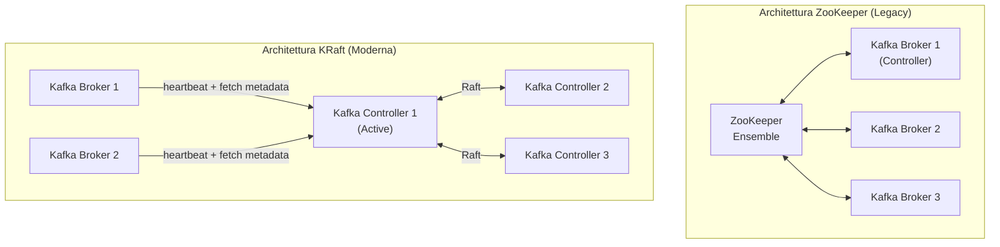

# ZooKeeper e KRaft

## Panoramica

Storicamente Apache Kafka dipendeva da **Apache ZooKeeper** per gestire i metadati del cluster: lista dei broker, configurazione dei topic, elezioni del controller. Dalla versione 3.3 **KRaft** (Kafka Raft, definito da KIP-500: *Kafka Improvement Proposal*, il documento di design con cui la community Kafka propone modifiche) è il protocollo interno che elimina questa dipendenza esterna, rendendo Kafka un sistema autonomo e semplificando drasticamente l'architettura operativa.

**ZooKeeper è stato rimosso in Kafka 4.0** (marzo 2025): le versioni 4.x girano **solo** in modalità KRaft. Un cluster ancora su ZooKeeper deve prima migrare (passando da 3.9, vedi timeline) e solo dopo aggiornare a 4.x. **Tutte le nuove installazioni usano KRaft.**

## Concetti Chiave

### ZooKeeper (architettura legacy)

**Ruolo di ZooKeeper in Kafka:**
- Eleggere il **controller broker** (uno per cluster)
- Tenere il registro di tutti i broker attivi
- Gestire i metadati di topic e partizioni
- Coordinare le elezioni del leader delle partizioni
- Memorizzare configurazioni e ACL

**Limiti dell'architettura ZooKeeper:**
- Dipendenza operativa esterna (cluster ZooKeeper separato da mantenere)
- Scalabilità limitata: lo stato è in ZooKeeper e il controller deve caricarlo per intero (nella pratica ~200K partizioni per cluster come ordine di grandezza)
- Failover del controller lento (il nuovo controller deve rileggere tutto lo stato da ZooKeeper, tempo proporzionale al numero di partizioni)
- Doppia complessità operativa: aggiornamenti, monitoring, sicurezza di due sistemi

### KRaft (architettura moderna)

**Cosa cambia con KRaft:**
- I metadati sono gestiti da un **quorum di controller** interni a Kafka
- I controller usano il **protocollo Raft** (simile a etcd/Consul) per consenso distribuito: un leader scrive su un log replicato e una modifica è valida quando la maggioranza (quorum) dei controller l'ha persistita
- Il **metadata log** è un log interno a partizione singola (topic `__cluster_metadata`) replicato tra i controller; ogni modifica ai metadati (topic, partizioni, ACL, config) è un record in questo log
- Il failover del controller è rapido (tipicamente sotto il secondo): i follower hanno già lo stato in memoria, non serve ricaricarlo
- Scala a un numero di partizioni molto maggiore (ordine dei milioni per cluster)
- Con quorum di N controller si tollerano `(N-1)/2` guasti: 3 controller → 1 guasto, 5 → 2. Usare sempre un numero **dispari** (un quorum pari non aumenta la tolleranza)

**Ruoli in KRaft:**

| Ruolo | Descrizione |
|-------|-------------|
| `broker` | Gestisce dati (topic, partizioni), non partecipa al quorum controller |
| `controller` | Partecipa al quorum Raft, gestisce i metadati |
| `broker,controller` | Combined mode — solo per cluster piccoli/dev |

## Architettura / Come Funziona

### Confronto architetturale


```mermaid
flowchart TB
    subgraph ZK["Architettura ZooKeeper (Legacy)"]
        direction LR
        ZK1["ZooKeeper<br/>Ensemble"]
        KB1["Kafka Broker 1<br/>(Controller)"]
        KB2[Kafka Broker 2]
        KB3[Kafka Broker 3]
        ZK1 <--> KB1
        ZK1 <--> KB2
        ZK1 <--> KB3
    end

    subgraph KR["Architettura KRaft (Moderna)"]
        direction LR
        KC1["Kafka Controller 1<br/>(Active)"]
        KC2[Kafka Controller 2]
        KC3[Kafka Controller 3]
        KB4[Kafka Broker 1]
        KB5[Kafka Broker 2]
        KC1 <-->|Raft| KC2
        KC1 <-->|Raft| KC3
        KB4 -->|heartbeat + fetch metadata| KC1
        KB5 -->|heartbeat + fetch metadata| KC1
    end
```

### Flusso KRaft

1. Il **quorum di controller** elegge un **active controller** tramite Raft
2. L'active controller gestisce tutte le decisioni sui metadati (elezione leader partizioni, creazione topic, ecc.)
3. I broker si registrano con l'active controller e gli inviano heartbeat periodici (se mancano, il broker è considerato morto e le sue leadership vengono riassegnate)
4. Lo stato dei metadati viene replicato nei controller follower via metadata log; i broker **leggono** (fetch) il metadata log dai controller e tengono una copia locale, invece di ricevere push come con ZooKeeper
5. Se l'active controller muore → nuova elezione Raft → il nuovo active ha già lo stato completo, senza ricaricarlo

## Configurazione & Pratica

### Avviare un cluster KRaft (single-node, development)

```bash
# 1. Generare un cluster UUID
KAFKA_CLUSTER_ID="$(kafka-storage.sh random-uuid)"

# 2. Formattare il log directory con il cluster ID
kafka-storage.sh format \
  --config /opt/kafka/config/kraft/server.properties \
  --cluster-id "$KAFKA_CLUSTER_ID"

# 3. Avviare il broker/controller
kafka-server-start.sh /opt/kafka/config/kraft/server.properties
```

### server.properties per KRaft

```properties
# Abilitare KRaft (disabilita ZooKeeper)
process.roles=broker,controller   # combined mode per dev

# ID univoco del nodo (sostituisce broker.id)
node.id=1

# Quorum voters: ID@host:port dei controller
controller.quorum.voters=1@localhost:9093

# Listener separato per il traffico controller
listeners=PLAINTEXT://:9092,CONTROLLER://:9093
controller.listener.names=CONTROLLER
inter.broker.listener.name=PLAINTEXT

# Directory dati
log.dirs=/tmp/kraft-logs
```

### Cluster KRaft produzione (3 controller + 3 broker separati)

```properties
# Controller node (process.roles=controller)
process.roles=controller
node.id=1
controller.quorum.voters=1@ctrl1:9093,2@ctrl2:9093,3@ctrl3:9093
listeners=CONTROLLER://:9093
controller.listener.names=CONTROLLER
log.dirs=/data/controller-logs

# Broker node (process.roles=broker)
process.roles=broker
node.id=4
controller.quorum.voters=1@ctrl1:9093,2@ctrl2:9093,3@ctrl3:9093
listeners=PLAINTEXT://:9092
inter.broker.listener.name=PLAINTEXT
controller.listener.names=CONTROLLER
log.dirs=/data/kafka-logs
```

### Docker Compose KRaft (single-node)

```yaml
services:
  kafka:
    image: apache/kafka:4.0.0
    hostname: broker
    container_name: kafka-kraft
    ports:
      - '9092:9092'
    environment:
      KAFKA_NODE_ID: 1
      KAFKA_PROCESS_ROLES: 'broker,controller'
      KAFKA_CONTROLLER_QUORUM_VOTERS: '1@broker:29093'
      KAFKA_LISTENERS: 'PLAINTEXT://broker:29092,CONTROLLER://broker:29093,PLAINTEXT_HOST://0.0.0.0:9092'
      KAFKA_ADVERTISED_LISTENERS: 'PLAINTEXT://broker:29092,PLAINTEXT_HOST://localhost:9092'
      KAFKA_LISTENER_SECURITY_PROTOCOL_MAP: 'CONTROLLER:PLAINTEXT,PLAINTEXT:PLAINTEXT,PLAINTEXT_HOST:PLAINTEXT'
      KAFKA_CONTROLLER_LISTENER_NAMES: 'CONTROLLER'
      KAFKA_INTER_BROKER_LISTENER_NAME: 'PLAINTEXT'
      KAFKA_OFFSETS_TOPIC_REPLICATION_FACTOR: 1
      CLUSTER_ID: 'MkU3OEVBNTcwNTJENDM2Qk'
```

!!! note "Quorum statico vs dinamico"
    `controller.quorum.voters` definisce un quorum **statico**: aggiungere o sostituire un controller richiede di riconfigurare e riavviare tutti i nodi. Dalla 3.9 (KIP-853) esiste il quorum **dinamico**: si usa `controller.quorum.bootstrap.servers` al posto di `voters` e si gestiscono i membri con `kafka-metadata-quorum.sh add-controller` / `remove-controller`. Un cluster nato con quorum statico non si converte automaticamente: verificare la documentazione della versione in uso.

### Verificare lo stato del quorum KRaft

```bash
# Stato del quorum controller
kafka-metadata-quorum.sh \
  --bootstrap-server localhost:9092 \
  describe --status

# Output:
# ClusterId: MkU3OEVBNTcwNTJENDM2Qk
# LeaderId: 1
# LeaderEpoch: 1
# HighWatermark: 12345
# MaxFollowerLag: 0
```

## Best Practices

!!! tip "Usare sempre KRaft per nuove installazioni"
    ZooKeeper è deprecato dalla 3.5 e rimosso dalla 4.0. Non esiste più alcuna alternativa a KRaft nelle versioni correnti.

!!! tip "Separare controller e broker in produzione"
    In produzione, usare nodi dedicati come controller (3 controller per quorum) e nodi separati come broker. Il combined mode (`broker,controller`) è appropriato solo per sviluppo.

!!! warning "KRaft richiede un cluster ID fisso"
    Il `CLUSTER_ID` generato in fase di format non può essere cambiato. Documentare e fare backup del cluster ID.

**Timeline deprecazione ZooKeeper:**

| Versione Kafka | Stato ZooKeeper |
|---------------|-----------------|
| 2.8 - 3.2 | KRaft in Early Access / preview |
| 3.3 | KRaft production-ready per nuovi cluster |
| 3.4 | Migrazione ZooKeeper → KRaft disponibile (early access, poi stabile) |
| 3.5 | ZooKeeper ufficialmente deprecato |
| 3.9 | Ultima versione con ZooKeeper: **ponte obbligato** per migrare |
| 4.0+ | ZooKeeper rimosso, solo KRaft |

## Troubleshooting

### Scenario 1 — `kafka-storage.sh format` fallisce con "already formatted"

**Sintomo:** Il comando di format restituisce `Log directory ... is already formatted`.

**Causa:** La directory `log.dirs` contiene già un metadata log da una precedente inizializzazione (anche fallita o di un cluster diverso).

**Soluzione:** Se la directory è di test, pulirla e riformattare. Se invece contiene dati da conservare **non cancellarla**: `--ignore-formatted` fa saltare il format per le directory già formattate (utile negli script idempotenti) senza toccarne il contenuto. Se il `cluster.id` della directory differisce da quello passato, il nodo non partirà: usare l'ID originale.

```bash
# Opzione 1: pulire e riformattare
rm -rf /tmp/kraft-logs/*
kafka-storage.sh format \
  --config /opt/kafka/config/kraft/server.properties \
  --cluster-id "$KAFKA_CLUSTER_ID"

# Opzione 2: non formattare se già formattato (non cancella nulla)
kafka-storage.sh format \
  --config /opt/kafka/config/kraft/server.properties \
  --cluster-id "$KAFKA_CLUSTER_ID" \
  --ignore-formatted
```

---

### Scenario 2 — Controller leader non eletto, cluster non parte

**Sintomo:** I broker non partono e nei log compare `TimeoutException: Timed out waiting for a node assignment` o `No brokers found in metadata`.

**Causa:** Il quorum Raft non riesce a eleggere un active controller. Cause tipiche: `controller.quorum.voters` configurato in modo inconsistente tra i nodi, porta 9093 non raggiungibile, o cluster ID diverso tra i controller.

**Soluzione:** Verificare configurazione e connettività del quorum. Se nessun broker è attivo, `--bootstrap-server` non funziona: interrogare direttamente un controller con `--bootstrap-controller` (dalla 3.7, KIP-919).

```bash
# Verificare lo stato del quorum interrogando un controller
kafka-metadata-quorum.sh \
  --bootstrap-controller ctrl1:9093 \
  describe --status

# Controllare i log del controller per errori Raft
grep -i "raft\|quorum\|leader\|election" /var/log/kafka/server.log | tail -50

# Verificare che tutti i controller voters siano raggiungibili
nc -zv ctrl1 9093
nc -zv ctrl2 9093
nc -zv ctrl3 9093
```

---

### Scenario 3 — Broker non si connette ai controller

**Sintomo:** Il broker parte ma non si registra: log contiene `BrokerRegistrationRequestData` timeout o `UNKNOWN_SERVER_ERROR` durante la registrazione.

**Causa:** Il broker non riesce a raggiungere i controller. Possibili cause: `controller.quorum.voters` mancante o errato sul broker, `CONTROLLER` listener non mappato nel `listener.security.protocol.map`, firewall sulla porta 9093.

**Soluzione:**

```bash
# Verificare la configurazione del broker
grep -E "controller.quorum.voters|listener.security.protocol.map|controller.listener.names" \
  /opt/kafka/config/kraft/broker.properties

# La configurazione corretta deve includere:
# controller.quorum.voters=1@ctrl1:9093,2@ctrl2:9093,3@ctrl3:9093
# listener.security.protocol.map=PLAINTEXT:PLAINTEXT,CONTROLLER:PLAINTEXT
# controller.listener.names=CONTROLLER

# Verificare la connettività dalla macchina broker
telnet ctrl1 9093
```

---

### Scenario 4 — Migrazione da ZooKeeper a KRaft fallisce o si blocca

**Sintomo:** Il processo di migrazione resta fermo prima di completare la copia dei metadati (stato `MIGRATION` non raggiunto) o i broker non si registrano ai nuovi controller.

**Causa:** La migrazione ZK→KRaft è un processo in più fasi (si avviano i controller KRaft con la migrazione abilitata, si riavviano i broker in modalità migrazione, si copiano i metadati, poi si passano i broker a KRaft puro). Cause tipiche: cluster ID dei controller diverso da quello del cluster ZooKeeper, broker non alla stessa versione/`inter.broker.protocol.version` richiesta, configurazione ZooKeeper mancante sui controller.

**Soluzione:** Migrare **sempre su 3.9** (o almeno ≥ 3.4) *prima* di aggiornare a 4.x, e verificare lo stato.

```bash
# Versione delle API supportate dai broker
kafka-broker-api-versions.sh --bootstrap-server localhost:9092 | head -5

# Stato della migrazione: metrica JMX sul controller attivo
#   kafka.controller:type=KafkaController,name=ZkMigrationState
#   valori: 2=PRE_MIGRATION, 1=MIGRATION, 3=POST_MIGRATION

# Stato del quorum e lag dei controller
kafka-metadata-quorum.sh \
  --bootstrap-server localhost:9092 \
  describe --replication

# In caso di blocco: non riavviare i broker a caso —
# seguire la KRaft Migration Guide ufficiale (ogni fase è reversibile fino alla finalizzazione)
```

!!! danger "Punto di non ritorno"
    Finché i controller sono in migration mode (`zookeeper.metadata.migration.enable=true`) si può tornare a ZooKeeper. Il rollback diventa impossibile con la **finalizzazione**: rimozione di `zookeeper.metadata.migration.enable` dai controller KRaft (riavvio uno alla volta) dopo che tutti i broker sono in KRaft. Prima di finalizzare conviene attendere qualche giorno per validare il cluster.

!!! warning "Nessun upgrade diretto 3.x ZooKeeper → 4.x"
    Kafka 4.0 non contiene più il codice ZooKeeper e non sa migrare. Un cluster ZooKeeper va portato a 3.9, migrato a KRaft, e solo dopo aggiornato a 4.x.

## Riferimenti

- [KRaft Documentation](https://kafka.apache.org/documentation/#kraft)
- [KIP-500: Replace ZooKeeper with a Self-Managed Metadata Quorum](https://cwiki.apache.org/confluence/display/KAFKA/KIP-500)
- [KRaft Migration Guide](https://kafka.apache.org/documentation/#kraft_zk_migration)
