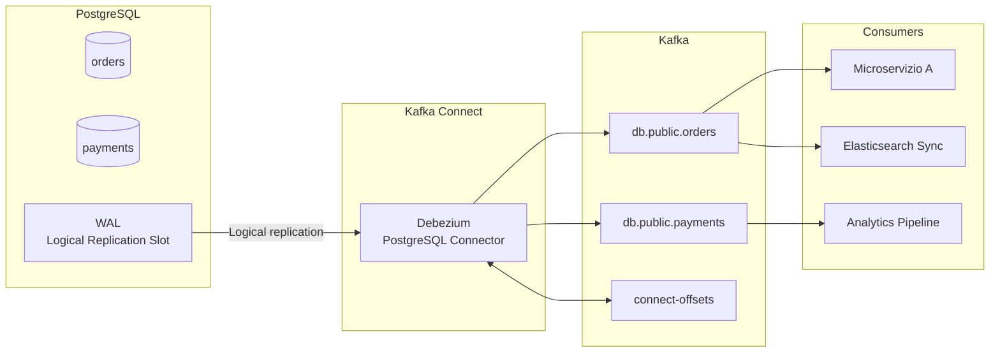

# Debezium e Change Data Capture

## Panoramica

**Debezium** è una piattaforma open source per il **Change Data Capture (CDC)**: legge il log delle transazioni del database (WAL per PostgreSQL, binlog per MySQL) e pubblica ogni insert, update e delete come evento su Kafka in tempo reale. A differenza del polling JDBC, CDC è event-driven: le modifiche vengono catturate immediatamente e il carico sul database è minimo.

**Quando usarlo:** Data replication cross-sistema, implementazione del pattern Outbox, event sourcing da sistemi legacy, sincronizzazione near-real-time tra database.

**Quando NON usarlo:** Database che non espongono il log delle transazioni (es. alcune versioni di cloud database con log access limitato), sistemi dove il volume di modifiche è estremo e il parsing del WAL diventa collo di bottiglia.

## Concetti Chiave

**WAL (Write-Ahead Log)** — PostgreSQL scrive ogni modifica nel WAL prima di applicarla al database. Debezium legge il WAL tramite il protocollo di **logical replication** di PostgreSQL.

**Binlog** — MySQL/MariaDB usa il binary log per la replicazione. Debezium si connette come uno slave di replicazione.

**Snapshot iniziale** — Alla prima connessione, Debezium effettua uno snapshot dell'intero database (o delle tabelle configurate) per inizializzare lo stato. Poi passa al CDC in streaming.

**Evento CDC** — Ogni record Kafka prodotto da Debezium contiene:
- `before`: stato della riga prima della modifica (null per INSERT)
- `after`: stato della riga dopo la modifica (null per DELETE)
- `op`: tipo operazione (`c`=create/insert, `u`=update, `d`=delete, `r`=read/snapshot)
- `source`: metadati (database, tabella, timestamp, LSN/binlog position)

**Offset Debezium** — La posizione nel WAL/binlog viene salvata in Kafka Connect (`connect-offsets`). Garantisce la ripresa dal punto giusto dopo un restart.

## Architettura / Come Funziona



**Flusso di un UPDATE:**
1. L'applicazione esegue `UPDATE orders SET status='shipped' WHERE id=123`
2. PostgreSQL scrive la modifica nel WAL
3. Debezium legge il record dal WAL tramite la logical replication slot
4. Pubblica su `db.public.orders` un record con `op=u`, `before={...old state...}`, `after={...new state...}`
5. I consumer ricevono l'evento e reagiscono (es. sincronizzano Elasticsearch)

## Configurazione & Pratica

### Configurare PostgreSQL per logical replication

```sql
-- postgresql.conf
-- wal_level = logical  (richiede restart)
-- max_replication_slots = 10
-- max_wal_senders = 10

-- Creare un utente dedicato per Debezium
CREATE USER debezium WITH REPLICATION LOGIN PASSWORD 'debezium_secret';

-- Concedere accesso alle tabelle
GRANT SELECT ON ALL TABLES IN SCHEMA public TO debezium;
ALTER DEFAULT PRIVILEGES IN SCHEMA public GRANT SELECT ON TABLES TO debezium;

-- Creare una publication (Debezium può crearla automaticamente o usarne una esistente)
CREATE PUBLICATION debezium_pub FOR ALL TABLES;
```

### Docker Compose: PostgreSQL + Kafka + Debezium

```yaml
version: '3.8'
services:
  postgres:
    image: postgres:16
    environment:
      POSTGRES_USER: postgres
      POSTGRES_PASSWORD: postgres
      POSTGRES_DB: mydb
    command:
      - "postgres"
      - "-c"
      - "wal_level=logical"
      - "-c"
      - "max_replication_slots=10"
    ports:
      - "5432:5432"

  kafka:
    image: apache/kafka:3.9.0
    environment:
      KAFKA_NODE_ID: 1
      KAFKA_PROCESS_ROLES: 'broker,controller'
      KAFKA_CONTROLLER_QUORUM_VOTERS: '1@kafka:9093'
      KAFKA_LISTENERS: 'PLAINTEXT://kafka:29092,CONTROLLER://kafka:9093,PLAINTEXT_HOST://0.0.0.0:9092'
      KAFKA_ADVERTISED_LISTENERS: 'PLAINTEXT://kafka:29092,PLAINTEXT_HOST://localhost:9092'
      KAFKA_LISTENER_SECURITY_PROTOCOL_MAP: 'CONTROLLER:PLAINTEXT,PLAINTEXT:PLAINTEXT,PLAINTEXT_HOST:PLAINTEXT'
      KAFKA_CONTROLLER_LISTENER_NAMES: 'CONTROLLER'
      CLUSTER_ID: 'debezium-demo-cluster-id'
    ports:
      - "9092:9092"

  kafka-connect:
    image: debezium/connect:2.7
    depends_on:
      - kafka
      - postgres
    environment:
      BOOTSTRAP_SERVERS: kafka:29092
      GROUP_ID: debezium-cluster
      CONFIG_STORAGE_TOPIC: debezium-configs
      OFFSET_STORAGE_TOPIC: debezium-offsets
      STATUS_STORAGE_TOPIC: debezium-status
    ports:
      - "8083:8083"
```

### Registrare il connector PostgreSQL

```bash
curl -X POST http://localhost:8083/connectors \
  -H "Content-Type: application/json" \
  -d '{
    "name": "postgres-cdc-connector",
    "config": {
      "connector.class": "io.debezium.connector.postgresql.PostgresConnector",
      "database.hostname": "postgres",
      "database.port": "5432",
      "database.user": "debezium",
      "database.password": "debezium_secret",
      "database.dbname": "mydb",
      "database.server.name": "db",

      "topic.prefix": "db",
      "table.include.list": "public.orders,public.payments",

      "plugin.name": "pgoutput",
      "publication.name": "debezium_pub",
      "slot.name": "debezium_slot",

      "snapshot.mode": "initial",
      "snapshot.isolation.mode": "repeatable_read",

      "heartbeat.interval.ms": "10000",

      "transforms": "unwrap",
      "transforms.unwrap.type": "io.debezium.transforms.ExtractNewRecordState",
      "transforms.unwrap.drop.tombstones": "false",
      "transforms.unwrap.delete.handling.mode": "rewrite"
    }
  }'
```

**Topic generati:** `db.public.orders`, `db.public.payments`

### Struttura di un evento CDC (senza unwrap)

```json
{
  "schema": { "..." },
  "payload": {
    "before": null,
    "after": {
      "id": 123,
      "customer_id": 456,
      "status": "created",
      "amount": 99.99,
      "created_at": "2026-02-23T14:30:00Z"
    },
    "source": {
      "version": "2.7.0.Final",
      "connector": "postgresql",
      "name": "db",
      "ts_ms": 1740321000000,
      "db": "mydb",
      "schema": "public",
      "table": "orders",
      "lsn": 33058752
    },
    "op": "c",
    "ts_ms": 1740321001234
  }
}
```

### SMT ExtractNewRecordState (unwrap)

La trasformazione `ExtractNewRecordState` semplifica la struttura dell'evento estraendo solo il campo `after` (lo stato corrente della riga):

```json
{
  "id": 123,
  "customer_id": 456,
  "status": "created",
  "amount": 99.99,
  "__op": "c",
  "__deleted": "false",
  "__source_ts_ms": 1740321000000
}
```

## Best Practices

!!! tip "Usare pgoutput su PostgreSQL"
    `plugin.name=pgoutput` è il plugin di replication nativo di PostgreSQL 10+ e non richiede estensioni aggiuntive. Preferirlo a `wal2json` o `decoderbufs`.

!!! warning "Gestire la replication slot con cura"
    Una replication slot in PostgreSQL trattiene il WAL finché Debezium non lo ha letto. Se Debezium è fermo a lungo, il WAL cresce indefinitamente fino a riempire il disco. Monitorare `pg_replication_slots` e configurare `slot.max.retries`.

!!! tip "Heartbeat per evitare WAL retention su tabelle non attive"
    Con `heartbeat.interval.ms`, Debezium invia heartbeat anche se non ci sono modifiche, permettendo a PostgreSQL di avanzare l'LSN confermato e liberare il WAL.

!!! warning "Snapshot iniziale su tabelle grandi"
    Lo snapshot legge l'intera tabella in una singola transazione. Su tabelle da milioni di righe, può richiedere ore. Pianificare la prima connessione con attenzione. Usare `snapshot.mode=schema_only` se non serve lo stato iniziale.

## Troubleshooting

### Scenario 1 — Replication slot già esistente

**Sintomo:** Il connector non si avvia e nei log compare `ERROR: replication slot "debezium_slot" already exists`.

**Causa:** Un'istanza precedente di Debezium ha creato lo slot ma non lo ha rilasciato (crash, stop forzato).

**Soluzione:** Verificare lo stato dello slot e rimuoverlo se inattivo.

```sql
-- Controllare slot esistenti e il loro stato
SELECT slot_name, active, restart_lsn, wal_status
FROM pg_replication_slots;

-- Se active = false, eliminare il slot
SELECT pg_drop_replication_slot('debezium_slot');
```

---

### Scenario 2 — Alto lag del connector (Debezium indietro rispetto al DB)

**Sintomo:** Gli eventi Kafka arrivano con ritardo crescente; `kafka.consumer.lag` del connector worker sale costantemente.

**Causa:** Throughput troppo basso del worker Kafka Connect: batch size insufficiente, o I/O lento durante lo snapshot iniziale su tabelle grandi.

**Soluzione:** Aumentare i parametri di buffering e verificare il carico I/O del database sorgente.

```bash
# Verificare il lag del consumer group del connector
kafka-consumer-groups.sh --bootstrap-server localhost:9092 \
  --describe --group debezium-cluster

# Aggiornare la configurazione del worker (connect-distributed.properties)
# max.batch.size=8192
# max.queue.size=16384

# Oppure via REST API per il connector specifico
curl -X PUT http://localhost:8083/connectors/postgres-cdc-connector/config \
  -H "Content-Type: application/json" \
  -d '{"max.batch.size": "8192", "max.queue.size": "16384", ...}'
```

---

### Scenario 3 — Record con `op=r` invece di `op=c`

**Sintomo:** I consumer ricevono eventi con `"op": "r"` che non corrispondono a inserimenti reali.

**Causa:** `op=r` (read) indica record provenienti dallo snapshot iniziale, non da modifiche live. È il comportamento atteso alla prima connessione con `snapshot.mode=initial`.

**Soluzione:** Filtrare gli eventi `op=r` a livello consumer se lo snapshot non è necessario, oppure usare `snapshot.mode=schema_only` per saltarlo.

```bash
# Configurare snapshot.mode nel connector
curl -X PUT http://localhost:8083/connectors/postgres-cdc-connector/config \
  -H "Content-Type: application/json" \
  -d '{
    "snapshot.mode": "schema_only",
    ...
  }'

# Verificare lo stato corrente del connector
curl http://localhost:8083/connectors/postgres-cdc-connector/status | jq .
```

---

### Scenario 4 — Disco pieno su PostgreSQL per WAL retention

**Sintomo:** Il disco del server PostgreSQL si riempie; `pg_replication_slots` mostra `wal_status=lost` o `retained_wal` molto elevato.

**Causa:** La replication slot trattiene tutto il WAL generato finché Debezium non lo legge. Se Debezium è fermo (crash, manutenzione), il WAL si accumula.

**Soluzione:** Monitorare proattivamente il WAL trattenuto e configurare un limite.

```sql
-- Monitorare WAL trattenuto da ogni slot
SELECT slot_name, active,
       pg_size_pretty(pg_wal_lsn_diff(pg_current_wal_lsn(), restart_lsn)) AS retained_wal,
       wal_status
FROM pg_replication_slots;

-- In emergenza (Debezium fermo, disco in esaurimento): eliminare il slot
-- ATTENZIONE: il prossimo avvio ripartirà dallo snapshot iniziale
SELECT pg_drop_replication_slot('debezium_slot');
```

```ini
# postgresql.conf — impostare un limite di WAL per slot (PostgreSQL 13+)
max_slot_wal_keep_size = 10GB
```

## Riferimenti

- [Debezium Documentation](https://debezium.io/documentation/)
- [Debezium PostgreSQL Connector](https://debezium.io/documentation/reference/stable/connectors/postgresql.html)
- [Debezium MySQL Connector](https://debezium.io/documentation/reference/stable/connectors/mysql.html)
- [ExtractNewRecordState SMT](https://debezium.io/documentation/reference/stable/transformations/event-flattening.html)
