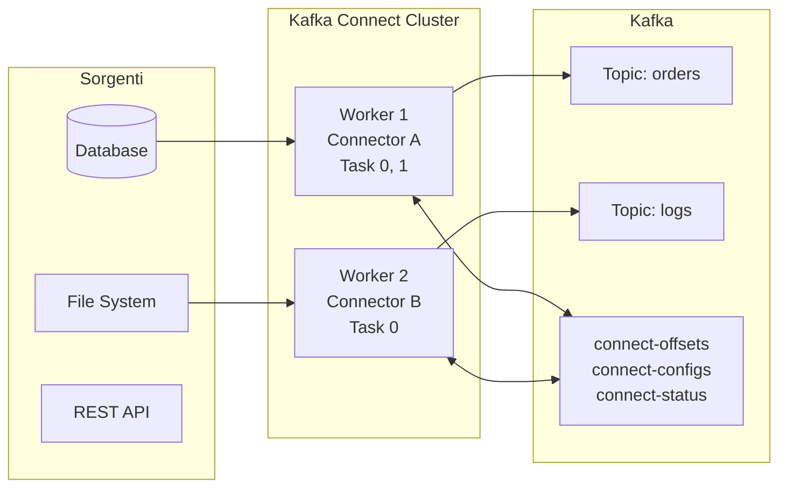

# Source Connectors

## Panoramica

I **source connector** importano dati da sorgenti esterne (database, file system, API REST, sistemi legacy) verso topic Kafka. Eliminano la necessità di scrivere codice producer custom per ogni integrazione, fornendo un framework standardizzato con gestione degli offset, parallelismo, monitoring e restart automatico.

**Quando usarli:** Ingestion di dati da database relazionali, file di log, sistemi di terze parti, migration di dati verso Kafka.

**Quando NON usarli:** Quando la logica di trasformazione è molto complessa (meglio un consumer/stream processing custom), o quando la latenza richiesta è sub-millisecondo.

## Concetti Chiave

**Connector** — L'unità di configurazione che specifica sorgente, mapping e configurazioni. Un connector può avere più **task** paralleli.

**Task** — L'unità di parallelismo effettiva. Ogni task legge da un sottoinsieme della sorgente (es. tabelle diverse o partizioni di file).

**Worker** — Il processo JVM che esegue i connector e i task. Può essere in modalità **standalone** (un solo worker) o **distributed** (cluster di worker).

**Offset** — Kafka Connect mantiene gli offset dei connector in un topic interno (`connect-offsets`), garantendo la continuità dopo un restart.

**SMT (Single Message Transformation)** — Trasformazioni leggere applicabili a ogni record prima dell'invio su Kafka (es. campo rename, filtro, routing).

## Architettura / Come Funziona



**Flusso di ingestion:**
1. Il connector interroga la sorgente (polling) o riceve notifiche push
2. I dati vengono trasformati in `SourceRecord` (Kafka record con schema)
3. Le SMT (se configurate) trasformano il record
4. Il record viene pubblicato sul topic Kafka di destinazione
5. L'offset viene committato nel topic `connect-offsets`

## Configurazione & Pratica

### Avviare Kafka Connect in modalità distributed

```properties
# connect-distributed.properties
bootstrap.servers=kafka:9092

# Topic interni (creati automaticamente se non esistono)
group.id=connect-cluster
config.storage.topic=connect-configs
offset.storage.topic=connect-offsets
status.storage.topic=connect-status

config.storage.replication.factor=3
offset.storage.replication.factor=3
status.storage.replication.factor=3

# Converter di default (JSON con schema embedded)
key.converter=org.apache.kafka.connect.json.JsonConverter
value.converter=org.apache.kafka.connect.json.JsonConverter
key.converter.schemas.enable=true
value.converter.schemas.enable=true

# Plugin path — dove sono installati i connector JAR
plugin.path=/opt/kafka/plugins
```

```bash
# Avviare Connect
connect-distributed.sh /opt/kafka/config/connect-distributed.properties
```

### JDBC Source Connector (polling da database)

Il JDBC Source Connector legge da qualsiasi database con un driver JDBC (PostgreSQL, MySQL, Oracle, SQL Server).

```bash
# Creare un connector via REST API
curl -X POST http://localhost:8083/connectors \
  -H "Content-Type: application/json" \
  -d '{
    "name": "postgres-orders-source",
    "config": {
      "connector.class": "io.confluent.connect.jdbc.JdbcSourceConnector",
      "connection.url": "jdbc:postgresql://db:5432/mydb",
      "connection.user": "kafka_user",
      "connection.password": "secret",

      "mode": "timestamp+incrementing",
      "timestamp.column.name": "updated_at",
      "incrementing.column.name": "id",

      "table.whitelist": "orders,customers",
      "topic.prefix": "db.",

      "poll.interval.ms": "1000",
      "batch.max.rows": "1000",

      "transforms": "addTimestamp",
      "transforms.addTimestamp.type": "org.apache.kafka.connect.transforms.InsertField$Value",
      "transforms.addTimestamp.timestamp.field": "ingested_at"
    }
  }'
```

**Modalità di polling JDBC:**

| Modalità | Descrizione | Requisito |
|----------|-------------|-----------|
| `bulk` | Legge tutto ad ogni poll | Nessuno (non adatto a produzione) |
| `incrementing` | Legge nuove righe tramite colonna incrementale | Colonna `id` auto-increment |
| `timestamp` | Legge righe aggiornate tramite colonna timestamp | Colonna `updated_at` |
| `timestamp+incrementing` | Combina entrambi | Entrambe le colonne |

### FileStream Source Connector (built-in, test)

```bash
curl -X POST http://localhost:8083/connectors \
  -H "Content-Type: application/json" \
  -d '{
    "name": "file-log-source",
    "config": {
      "connector.class": "org.apache.kafka.connect.file.FileStreamSourceConnector",
      "file": "/var/log/app/application.log",
      "topic": "app-logs",
      "tasks.max": "1"
    }
  }'
```

### Gestione via REST API

```bash
# Lista connector attivi
curl http://localhost:8083/connectors

# Stato di un connector
curl http://localhost:8083/connectors/postgres-orders-source/status

# Pausa / resume
curl -X PUT http://localhost:8083/connectors/postgres-orders-source/pause
curl -X PUT http://localhost:8083/connectors/postgres-orders-source/resume

# Eliminare un connector
curl -X DELETE http://localhost:8083/connectors/postgres-orders-source

# Riavviare un task fallito
curl -X POST http://localhost:8083/connectors/postgres-orders-source/tasks/0/restart
```

### SMT — Trasformazioni comuni

```json
{
  "transforms": "dropField,renameField",

  "transforms.dropField.type": "org.apache.kafka.connect.transforms.ReplaceField$Value",
  "transforms.dropField.blacklist": "internal_id,password_hash",

  "transforms.renameField.type": "org.apache.kafka.connect.transforms.ReplaceField$Value",
  "transforms.renameField.renames": "cust_id:customer_id,ord_ts:order_timestamp"
}
```

## Best Practices

!!! tip "Usare mode=timestamp+incrementing per database"
    La modalità `bulk` rilegge tutta la tabella ad ogni poll. Con `timestamp+incrementing` si leggono solo le righe nuove o aggiornate.

!!! tip "Separare la configurazione per ambiente"
    Usare variabili d'ambiente o un config provider (es. HashiCorp Vault) per le credenziali, mai hardcodate nella configurazione del connector.

!!! warning "JDBC Source non cattura DELETE"
    Il JDBC Source Connector non può rilevare le eliminazioni di righe. Per catturare insert/update/delete usare [Debezium CDC](debezium-cdc.md).

!!! warning "Schema evolution con JDBC"
    Se lo schema del database cambia (nuova colonna), Kafka Connect aggiorna automaticamente lo schema del topic. Verificare che i consumer siano in grado di gestire l'evoluzione degli schemi.

## Troubleshooting

### Scenario 1 — Task in stato `FAILED`

**Sintomo:** Il connector è visibile ma uno o più task risultano in stato `FAILED` nella REST API.

**Causa:** Errore di connessione alla sorgente, credenziali scadute, schema incompatibile, o eccezione non gestita nel polling.

**Soluzione:** Leggere il trace dell'errore dal task status, correggere la configurazione e riavviare il task.

```bash
# Ispezionare l'errore del task
curl -s http://localhost:8083/connectors/my-connector/status | jq '.tasks[] | {id, state, trace}'

# Riavviare il task fallito (task id 0)
curl -X POST http://localhost:8083/connectors/my-connector/tasks/0/restart

# Se tutti i task sono failed, riavviare il connector intero
curl -X POST http://localhost:8083/connectors/my-connector/restart
```

### Scenario 2 — Connector lento o lag elevato

**Sintomo:** I record arrivano su Kafka con ritardo rispetto alla sorgente; il consumer group del topic di destinazione accumula lag.

**Causa:** `poll.interval.ms` troppo alto, `batch.max.rows` troppo basso, `tasks.max=1` con molte tabelle, o query lenta sul database sorgente.

**Soluzione:** Aumentare il parallelismo e ottimizzare i parametri di polling.

```bash
# Aggiornare la configurazione del connector via REST API
curl -X PUT http://localhost:8083/connectors/postgres-orders-source/config \
  -H "Content-Type: application/json" \
  -d '{
    "connector.class": "io.confluent.connect.jdbc.JdbcSourceConnector",
    "tasks.max": "4",
    "poll.interval.ms": "500",
    "batch.max.rows": "5000",
    "connection.url": "jdbc:postgresql://db:5432/mydb",
    "connection.user": "kafka_user",
    "connection.password": "secret",
    "mode": "timestamp+incrementing",
    "timestamp.column.name": "updated_at",
    "incrementing.column.name": "id",
    "table.whitelist": "orders,customers",
    "topic.prefix": "db."
  }'

# Monitorare il lag consumer sul topic
kafka-consumer-groups.sh --bootstrap-server kafka:9092 \
  --describe --group my-consumer-group
```

### Scenario 3 — Record duplicati dopo restart

**Sintomo:** Dopo un riavvio del worker o del connector, compaiono record duplicati nel topic Kafka.

**Causa:** At-least-once delivery garantita da Kafka Connect: se un commit degli offset non va a buon fine prima del crash, i record vengono rielaborati.

**Soluzione:** Il consumer deve essere idempotente. Con `mode=incrementing` il rischio è minimizzato perché gli offset sono deterministici. Verificare che il topic `connect-offsets` sia replicato correttamente.

```bash
# Verificare il contenuto degli offset salvati
kafka-console-consumer.sh --bootstrap-server kafka:9092 \
  --topic connect-offsets --from-beginning \
  --formatter "kafka.coordinator.group.GroupMetadataManager\$OffsetMessageFormatter"

# Controllare la replication factor del topic degli offset
kafka-topics.sh --bootstrap-server kafka:9092 \
  --describe --topic connect-offsets
```

### Scenario 4 — Connector non si avvia: `ClassNotFoundException` o plugin non trovato

**Sintomo:** Al momento della creazione del connector la REST API restituisce `500` con errore `ClassNotFoundException` o "Connector class not found".

**Causa:** Il JAR del connector non è presente nel `plugin.path` configurato nel worker, oppure il path è errato o il processo non è stato riavviato dopo l'installazione del plugin.

**Soluzione:** Verificare che il JAR sia nella directory corretta e riavviare il worker Connect.

```bash
# Listare i plugin riconosciuti dal worker
curl -s http://localhost:8083/connector-plugins | jq '.[].class'

# Verificare il contenuto del plugin.path
ls -la /opt/kafka/plugins/

# Installare un plugin da Confluent Hub (se confluent-hub è disponibile)
confluent-hub install confluentinc/kafka-connect-jdbc:latest \
  --component-dir /opt/kafka/plugins --no-prompt

# Dopo l'installazione riavviare il worker Connect
systemctl restart kafka-connect
# oppure, in ambiente containerizzato
docker restart kafka-connect
```

## Riferimenti

- [Kafka Connect Documentation](https://kafka.apache.org/documentation/#connect)
- [Confluent Hub (catalogo connectors)](https://www.confluent.io/hub/)
- [JDBC Connector Docs](https://docs.confluent.io/kafka-connectors/jdbc/current/source-connector/overview.html)
