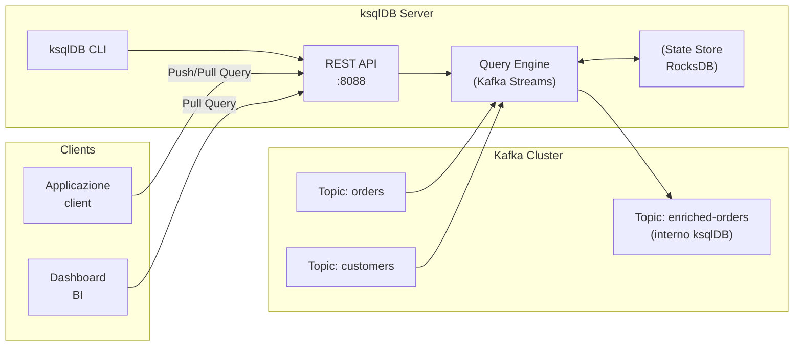

# ksqlDB

## Panoramica

ksqlDB è un database event streaming costruito su Kafka Streams che espone un'interfaccia SQL per processare stream di dati su Kafka. Invece di scrivere codice Java/Scala con la Kafka Streams API, è possibile esprimere la logica di processing in SQL familiare. ksqlDB trasla le query SQL in topologie Kafka Streams che girano sul server ksqlDB.

ksqlDB è progettato per due use case principali: **streaming analytics** (aggregazioni continue su eventi in tempo reale) e **stream processing as infrastructure** (creare viste materializzate, arricchire stream, filtrare topic) senza dover scrivere e deployare applicazioni Java. È particolarmente adatto a team che conoscono SQL ma non hanno esperienza con Kafka Streams API.

!!! note "ksqlDB vs KSQL"
    ksqlDB è il successore di KSQL (Confluent KSQL). Da Confluent Platform 5.5, KSQL è stato rinominato ksqlDB con aggiunta del supporto per le pull queries e un modello di storage più completo.

## Concetti Chiave

### Stream vs Table in ksqlDB

Come in Kafka Streams, ksqlDB distingue tra:

| Concetto | Backed by | Semantica | Mutabilità |
|----------|-----------|-----------|------------|
| **STREAM** | Topic Kafka | Flusso di eventi immutabili | Append-only |
| **TABLE** | Topic Kafka (compacted) | Stato corrente per chiave | Upsert/Delete |
| **MATERIALIZED VIEW** | State store interno | Vista derivata da STREAM o TABLE | Aggiornata automaticamente |

### Push Query vs Pull Query

**Push Query** — sottoscrizione continua: il client riceve risultati man mano che i dati arrivano. Non termina mai finché il client non si disconnette.

```sql
-- Push query: sottoscrivi aggiornamenti continui
SELECT orderId, status, totalAmount
FROM orders_stream
WHERE status = 'CREATED'
EMIT CHANGES;
```

**Pull Query** — richiesta puntuale: il client fa una query e riceve il risultato attuale, poi la connessione si chiude. Equivalente a una SELECT su un database tradizionale, ma su una materialized view.

```sql
-- Pull query: recupera stato attuale di un ordine specifico
SELECT * FROM orders_by_customer
WHERE customerId = 'cust-789';
```

!!! warning "Pull query richiedono Materialized View"
    Le pull query funzionano solo su TABLE o MATERIALIZED VIEW, non su STREAM. Tentare una pull query su uno stream restituisce un errore.

## Come Funziona / Architettura



ksqlDB Server è un'applicazione Java che:
1. Accetta comandi SQL via REST API o CLI
2. Trasforma le query in topologie Kafka Streams
3. Esegue le topologie internamente, leggendo dai topic Kafka
4. Mantiene state store (RocksDB) per le operazioni stateful
5. Espone un endpoint REST per push e pull queries

## Configurazione & Pratica

### Docker Compose per avviare ksqlDB

```yaml
version: '3.8'
services:
  zookeeper:
    image: confluentinc/cp-zookeeper:7.6.0
    environment:
      ZOOKEEPER_CLIENT_PORT: 2181

  kafka:
    image: confluentinc/cp-kafka:7.6.0
    depends_on: [zookeeper]
    environment:
      KAFKA_ZOOKEEPER_CONNECT: zookeeper:2181
      KAFKA_ADVERTISED_LISTENERS: PLAINTEXT://kafka:9092
      KAFKA_OFFSETS_TOPIC_REPLICATION_FACTOR: 1
    ports:
      - "9092:9092"

  schema-registry:
    image: confluentinc/cp-schema-registry:7.6.0
    depends_on: [kafka]
    environment:
      SCHEMA_REGISTRY_KAFKASTORE_BOOTSTRAP_SERVERS: kafka:9092
      SCHEMA_REGISTRY_HOST_NAME: schema-registry
    ports:
      - "8081:8081"

  ksqldb-server:
    image: confluentinc/cp-ksqldb-server:7.6.0
    depends_on: [kafka, schema-registry]
    ports:
      - "8088:8088"
    environment:
      KSQL_BOOTSTRAP_SERVERS: kafka:9092
      KSQL_KSQL_SCHEMA_REGISTRY_URL: http://schema-registry:8081
      KSQL_KSQL_LOGGING_PROCESSING_STREAM_AUTO_CREATE: "true"
      KSQL_KSQL_LOGGING_PROCESSING_TOPIC_AUTO_CREATE: "true"

  ksqldb-cli:
    image: confluentinc/cp-ksqldb-cli:7.6.0
    depends_on: [ksqldb-server]
    entrypoint: /bin/sh
    tty: true
```

```bash
# Avviare l'ambiente
docker-compose up -d

# Accedere alla CLI
docker exec -it <ksqldb-cli-container> ksql http://ksqldb-server:8088
```

### Operazioni Fondamentali con ksqlDB CLI

```sql
-- Listare i topic Kafka disponibili
SHOW TOPICS;

-- Listare stream e table esistenti
SHOW STREAMS;
SHOW TABLES;

-- Listare le query in esecuzione
SHOW QUERIES;

-- Impostare lettura dall'inizio per questa sessione
SET 'auto.offset.reset' = 'earliest';
```

### CREATE STREAM — Definire un topic come stream

```sql
-- Creare uno stream sul topic 'orders' con schema Avro
CREATE STREAM orders_stream (
  orderId VARCHAR KEY,
  customerId VARCHAR,
  status VARCHAR,
  totalAmount DOUBLE,
  createdAt BIGINT
) WITH (
  KAFKA_TOPIC = 'orders',
  VALUE_FORMAT = 'AVRO'
);

-- Con JSON (senza schema registry)
CREATE STREAM orders_json_stream (
  orderId VARCHAR KEY,
  customerId VARCHAR,
  status VARCHAR,
  totalAmount DOUBLE
) WITH (
  KAFKA_TOPIC = 'orders-json',
  VALUE_FORMAT = 'JSON',
  PARTITIONS = 6
);
```

### CREATE TABLE — Definire un topic compacted come tabella

```sql
-- Creare una KTable dal topic 'customers' (deve essere compacted)
CREATE TABLE customers_table (
  customerId VARCHAR PRIMARY KEY,
  name VARCHAR,
  email VARCHAR,
  tier VARCHAR,
  creditLimit DOUBLE
) WITH (
  KAFKA_TOPIC = 'customers',
  VALUE_FORMAT = 'AVRO'
);
```

### Filtrare eventi e creare un nuovo stream

```sql
-- Stream derivato: solo ordini ad alto valore
CREATE STREAM high_value_orders AS
  SELECT
    orderId,
    customerId,
    status,
    totalAmount,
    TIMESTAMPTOSTRING(createdAt, 'yyyy-MM-dd HH:mm:ss') AS createdAtFormatted
  FROM orders_stream
  WHERE totalAmount > 500.0
  EMIT CHANGES;
```

### Aggregare — COUNT e SUM per chiave

```sql
-- Aggregazione continua: ordini per cliente
CREATE TABLE orders_per_customer AS
  SELECT
    customerId,
    COUNT(*) AS orderCount,
    SUM(totalAmount) AS totalSpent,
    LATEST_BY_OFFSET(status) AS lastStatus
  FROM orders_stream
  GROUP BY customerId
  EMIT CHANGES;
```

### JOIN tra Stream e Table

```sql
-- Arricchire gli ordini con i dati del cliente
CREATE STREAM enriched_orders AS
  SELECT
    o.orderId,
    o.customerId,
    o.status,
    o.totalAmount,
    c.name AS customerName,
    c.tier AS customerTier,
    c.email AS customerEmail
  FROM orders_stream o
  INNER JOIN customers_table c ON o.customerId = c.customerId
  EMIT CHANGES;
```

### CREATE MATERIALIZED VIEW (con Windowing)

```sql
-- Totale ordini per cliente nell'ultima ora (finestra tumbling)
CREATE TABLE hourly_order_totals AS
  SELECT
    customerId,
    COUNT(*) AS orderCount,
    SUM(totalAmount) AS hourlyTotal,
    WINDOWSTART AS windowStart,
    WINDOWEND AS windowEnd
  FROM orders_stream
  WINDOW TUMBLING (SIZE 1 HOUR)
  GROUP BY customerId
  EMIT FINAL;  -- emetti solo a fine finestra
```

### Pull Query su Materialized View

```sql
-- Recupera stato attuale per un cliente specifico
SELECT customerId, orderCount, totalSpent
FROM orders_per_customer
WHERE customerId = 'cust-789';

-- Recupera il totale orario per un cliente
SELECT customerId, hourlyTotal, FROM_UNIXTIME(windowStart / 1000) AS window
FROM hourly_order_totals
WHERE customerId = 'cust-789';
```

### ksqlDB REST API

```bash
# Creare uno stream via REST API
curl -X POST http://localhost:8088/ksql \
  -H "Content-Type: application/vnd.ksql.v1+json" \
  -d '{
    "ksql": "CREATE STREAM orders_stream (orderId VARCHAR KEY, customerId VARCHAR, totalAmount DOUBLE) WITH (KAFKA_TOPIC = '\''orders'\'', VALUE_FORMAT = '\''JSON'\'');",
    "streamsProperties": {
      "ksql.streams.auto.offset.reset": "earliest"
    }
  }'

# Push query via REST (streaming response)
curl -X POST http://localhost:8088/query-stream \
  -H "Content-Type: application/vnd.ksql.v1+json" \
  -d '{
    "sql": "SELECT * FROM orders_stream EMIT CHANGES;",
    "properties": {
      "ksql.streams.auto.offset.reset": "earliest"
    }
  }'

# Pull query via REST
curl -X POST http://localhost:8088/query \
  -H "Content-Type: application/vnd.ksql.v1+json" \
  -d '{"ksql": "SELECT * FROM orders_per_customer WHERE customerId = '\''cust-789'\'';"}'
```

## Quando Usare ksqlDB vs Kafka Streams API

| Criterio | ksqlDB | Kafka Streams API |
|----------|--------|-------------------|
| Complessità della logica | Semplice-media | Qualsiasi |
| Linguaggio richiesto | SQL | Java/Kotlin/Scala |
| Deployment | Server separato | Embedded nell'app |
| Debugging | Limitato | Completo (IDE, debugger) |
| Testabilità | Via CLI/REST | Unit test con TopologyTestDriver |
| Custom logic | Limitata (UDF) | Illimitata |
| Gestione errori granulare | No | Sì |
| Multi-join complessi | Difficile | Possibile |
| Adatto a | Analisi, prototipazione, ETL | Microservizi, logica custom |

!!! tip "Usa ksqlDB come strumento operativo"
    ksqlDB è eccellente per creare viste materializzate da consumare via pull query, per filtrare e routare messaggi tra topic, e per debugging/monitoring in produzione. Per logiche di business complesse in produzione, preferisci Kafka Streams API.

## Best Practices

- **Usa `EMIT FINAL`** invece di `EMIT CHANGES` per le aggregazioni con windowing: riduce il numero di messaggi di output emettendo solo il risultato finale della finestra.
- **Definisci sempre la `PRIMARY KEY`** nelle TABLE: senza di essa, ksqlDB non può fare pull query su quella tabella.
- **Scala ksqlDB orizzontalmente** avviando più istanze dello stesso server: le query vengono distribuite automaticamente tramite Kafka consumer group.
- **Usa User Defined Functions (UDF)** per logiche custom non esprimibili in SQL:

```java
// UDF custom per ksqlDB
@UdfDescription(name = "mask_email", description = "Maschera email per GDPR")
public class MaskEmailUdf {
    @Udf(description = "Maschera la parte locale dell'email")
    public String maskEmail(@UdfParameter String email) {
        if (email == null) return null;
        int atIndex = email.indexOf('@');
        return "***" + email.substring(atIndex);
    }
}
```

- **Monitora le query** via `EXPLAIN <queryId>` e la REST API `/status/<queryId>`.
- **Evita join KStream-KStream in produzione** senza un'attenta configurazione delle retention window.

## Troubleshooting

### Query non produce output

**Causa:** L'offset reset è impostato su `latest` (default) e non ci sono nuovi messaggi.
**Soluzione:** `SET 'auto.offset.reset' = 'earliest';` prima di eseguire la query.

### Errore: Table must have a primary key

```
Statement is invalid because it requires a TABLE that has a primary key
```

**Causa:** Si sta tentando una pull query su uno STREAM o una TABLE senza PRIMARY KEY.
**Soluzione:** Ridefinire la TABLE con `PRIMARY KEY` sul campo chiave.

### Consumer lag crescente

**Sintomo:** Il processing non riesce a stare al passo con il rate di produzione.
**Soluzione:** Aumentare le istanze ksqlDB o aumentare `ksql.streams.num.stream.threads` nel server properties.

### Errore di Join: Input topics non allineati

```
For stream-table joins, the input records for the table must be co-partitioned with the stream
```

**Causa:** Stream e Table hanno un numero diverso di partizioni.
**Soluzione:** Assicurarsi che i topic abbiano lo stesso numero di partizioni, oppure usare GlobalKTable (`CREATE GLOBAL TABLE`).

## Riferimenti

- [ksqlDB — Documentazione Ufficiale](https://ksqldb.io/)
- [ksqlDB SQL Reference](https://docs.ksqldb.io/en/latest/developer-guide/ksqldb-reference/)
- [ksqlDB REST API Reference](https://docs.ksqldb.io/en/latest/developer-guide/api/)
- [ksqlDB User Defined Functions](https://docs.ksqldb.io/en/latest/how-to-guides/use-and-define-udfs/)
- [Confluent — ksqlDB Tutorials](https://docs.confluent.io/platform/current/ksqldb/tutorials/index.html)
