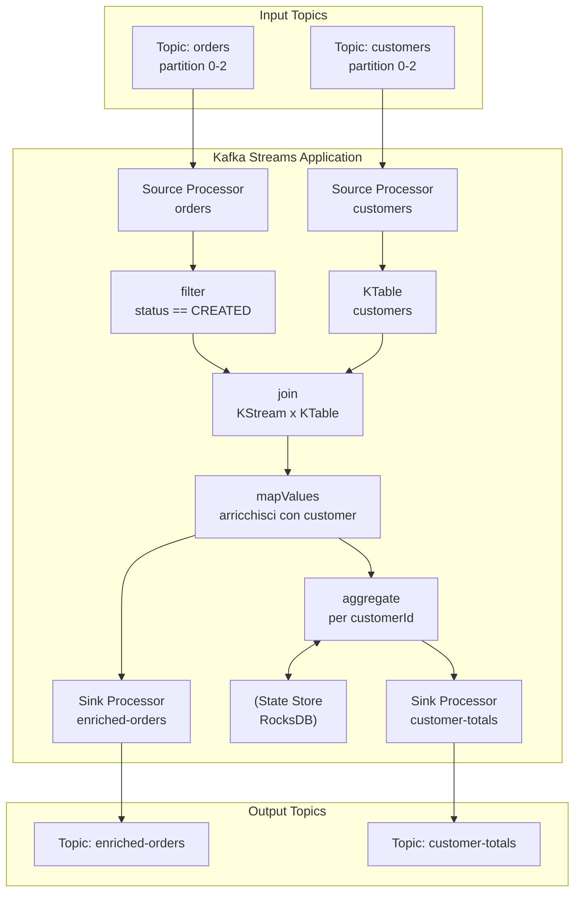

# Topologie in Kafka Streams

## Panoramica

Kafka Streams è una libreria client Java per il processing di stream in modo stateful o stateless, senza richiedere un cluster di processing separato (come Flink o Spark). Ogni applicazione Kafka Streams è un normale processo JVM che legge da uno o più topic Kafka, applica trasformazioni e scrive i risultati su altri topic. La logica di processing è espressa come una **topologia**: un grafo orientato aciclico (DAG) di processori connessi da stream.

A differenza di altri framework di stream processing, Kafka Streams è embeddato nell'applicazione come libreria, garantisce esattamente-una-volta la semantica (exactly-once semantics), e scala orizzontalmente semplicemente avviando più istanze della stessa applicazione.

## Concetti Chiave

### Processor Topology

Una topologia è composta da tre tipi di nodi:

| Tipo | Descrizione | Esempio |
|------|-------------|---------|
| **Source Processor** | Legge record da un topic Kafka | Consume da `orders` |
| **Stream Processor** | Trasforma, filtra, aggrega record | `filter`, `map`, `aggregate` |
| **Sink Processor** | Scrive record su un topic Kafka | Pubblica su `processed-orders` |

### KStream, KTable, GlobalKTable

Queste sono le tre astrazioni fondamentali di Kafka Streams:

**KStream** — rappresenta un flusso infinito di record indipendenti. Ogni record è un evento separato. Semantica: append-only log.

```
KStream: [key=ord1, v=CREATED] → [key=ord1, v=SHIPPED] → [key=ord1, v=DELIVERED]
Sono 3 eventi separati, tutti significativi
```

**KTable** — rappresenta una tabella mutabile dove ogni record con la stessa chiave aggiorna lo stato. Semantica: changelog log (ultimo valore per chiave).

```
KTable: key=ord1 → stato corrente DELIVERED (i valori precedenti sono obsoleti)
```

**GlobalKTable** — come KTable ma completamente replicata su ogni istanza dell'applicazione. Usata per lookup di dati di riferimento (configurazione, mappings) da fare join senza partitioning.

### Operazioni Stateless vs Stateful

| Operazione | Tipo | Note |
|------------|------|------|
| `filter` / `filterNot` | Stateless | Scarta record basandosi su una predicate |
| `map` / `mapValues` | Stateless | Trasforma key o value |
| `flatMap` / `flatMapValues` | Stateless | Produce 0 o più record da 1 record |
| `selectKey` | Stateless | Cambia la chiave (causa repartitioning) |
| `aggregate` | Stateful | Accumula stato per chiave |
| `count` | Stateful | Conta record per chiave |
| `reduce` | Stateful | Combina valori per chiave |
| `join` (KStream-KTable) | Stateful | Lookup nel state store |
| `join` (KStream-KStream) | Stateful | Join temporale con finestra |

### State Store e RocksDB

Le operazioni stateful usano uno **state store** per mantenere lo stato locale. Per default, Kafka Streams usa **RocksDB** come implementazione persistente dello state store. RocksDB è un key-value store embedded, ottimizzato per SSD, sviluppato da Facebook.

!!! note "State store e changelog topic"
    Ogni state store ha un **changelog topic** interno su Kafka che replica ogni aggiornamento. In caso di failure o restart dell'applicazione, il state store viene ricostituito dal changelog topic. Questo garantisce fault tolerance senza coordinator esterni.

### Thread Model e Tasks

```
Applicazione Kafka Streams
├── Stream Thread 1
│   ├── Task 0 (partizione 0 del topic input)
│   └── Task 1 (partizione 1 del topic input)
└── Stream Thread 2
    ├── Task 2 (partizione 2 del topic input)
    └── Task 3 (partizione 3 del topic input)
```

- Ogni **task** è assegnato a un insieme di partizioni e processa i record in modo sequenziale
- Ogni **thread** può gestire più task (configurabile via `num.stream.threads`)
- Il numero di task è determinato dal numero massimo di partizioni tra tutti i topic sorgente

## Come Funziona / Architettura



## Configurazione & Pratica

### Configurazione Base dell'Applicazione

```java
import org.apache.kafka.streams.*;
import org.apache.kafka.streams.kstream.*;

Properties config = new Properties();
config.put(StreamsConfig.APPLICATION_ID_CONFIG, "order-processor");
config.put(StreamsConfig.BOOTSTRAP_SERVERS_CONFIG, "localhost:9092");
config.put(StreamsConfig.DEFAULT_KEY_SERDE_CLASS_CONFIG, Serdes.String().getClass());
config.put(StreamsConfig.DEFAULT_VALUE_SERDE_CLASS_CONFIG, Serdes.String().getClass());
// Exactly-once semantics (richiede Kafka 2.5+)
config.put(StreamsConfig.PROCESSING_GUARANTEE_CONFIG, StreamsConfig.EXACTLY_ONCE_V2);
// Numero di thread per istanza
config.put(StreamsConfig.NUM_STREAM_THREADS_CONFIG, 4);
// Directory per state store RocksDB
config.put(StreamsConfig.STATE_DIR_CONFIG, "/tmp/kafka-streams");
```

### Esempio: Topologia Completa con Filter, Map, Join, Aggregate

```java
StreamsBuilder builder = new StreamsBuilder();

// Source: KStream dal topic "orders"
KStream<String, OrderEvent> ordersStream = builder.stream(
    "orders",
    Consumed.with(Serdes.String(), orderEventSerde)
);

// Source: KTable dal topic "customers"
KTable<String, Customer> customersTable = builder.table(
    "customers",
    Consumed.with(Serdes.String(), customerSerde)
);

// Stateless: filtra solo gli ordini CREATED
KStream<String, OrderEvent> createdOrders = ordersStream
    .filter((orderId, order) -> order.getStatus() == OrderStatus.CREATED)
    .peek((key, value) -> log.debug("Processing order: {}", key));

// Stateless: cambia la chiave da orderId a customerId per il join
KStream<String, OrderEvent> byCustomer = createdOrders
    .selectKey((orderId, order) -> order.getCustomerId());
    // Nota: selectKey causa un repartitioning implicito

// Stateful: join KStream con KTable (lookup del customer)
KStream<String, EnrichedOrder> enrichedOrders = byCustomer
    .join(
        customersTable,
        (order, customer) -> EnrichedOrder.builder()
            .order(order)
            .customerName(customer.getName())
            .customerTier(customer.getTier())
            .build(),
        Joined.with(Serdes.String(), orderEventSerde, customerSerde)
    );

// Sink: scrivi gli ordini arricchiti su un topic di output
enrichedOrders.to(
    "enriched-orders",
    Produced.with(Serdes.String(), enrichedOrderSerde)
);

// Stateful: aggrega per customerId — totale speso
KTable<String, Double> customerTotals = enrichedOrders
    .groupByKey()
    .aggregate(
        () -> 0.0,  // initializer
        (customerId, order, total) -> total + order.getOrder().getTotalAmount(),
        Materialized.<String, Double, KeyValueStore<Bytes, byte[]>>as("customer-totals-store")
            .withKeySerde(Serdes.String())
            .withValueSerde(Serdes.Double())
    );

// Scrivi i totali aggregati su un topic
customerTotals
    .toStream()
    .to("customer-totals", Produced.with(Serdes.String(), Serdes.Double()));

// Build e avvio topologia
Topology topology = builder.build();

// Stampa la descrizione della topologia (utile per debug)
System.out.println(topology.describe());

KafkaStreams streams = new KafkaStreams(topology, config);

// Gestione graceful shutdown
Runtime.getRuntime().addShutdownHook(new Thread(streams::close));

streams.cleanUp(); // Pulisce stato locale (solo in dev/test)
streams.start();
```

### Output di `topology.describe()`

```
Topologies:
   Sub-topology: 0
    Source: KSTREAM-SOURCE-0000000000 (topics: [orders])
      --> KSTREAM-FILTER-0000000001
    Processor: KSTREAM-FILTER-0000000001 (stores: [])
      --> KSTREAM-PEEK-0000000002
      <-- KSTREAM-SOURCE-0000000000
    Processor: KSTREAM-PEEK-0000000002 (stores: [])
      --> KSTREAM-KEY-SELECT-0000000003
      <-- KSTREAM-FILTER-0000000001
    Processor: KSTREAM-KEY-SELECT-0000000003 (stores: [])
      --> KSTREAM-SINK-0000000004
      <-- KSTREAM-PEEK-0000000002
    Sink: KSTREAM-SINK-0000000004 (topic: orders-KSTREAM-JOIN-0000000007-repartition)
      <-- KSTREAM-KEY-SELECT-0000000003

   Sub-topology: 1
    Source: KSTREAM-SOURCE-0000000005 (topics: [customers])
    ...
```

### Processor API (Low-Level)

Per casi non gestibili dalla DSL, è possibile usare la Processor API:

```java
// Definizione di un processore custom
class OrderEnricherProcessor implements Processor<String, OrderEvent, String, EnrichedOrder> {
    private ProcessorContext<String, EnrichedOrder> context;
    private KeyValueStore<String, Customer> customerStore;

    @Override
    public void init(ProcessorContext<String, EnrichedOrder> context) {
        this.context = context;
        this.customerStore = context.getStateStore("customer-store");
    }

    @Override
    public void process(Record<String, OrderEvent> record) {
        Customer customer = customerStore.get(record.value().getCustomerId());
        if (customer != null) {
            EnrichedOrder enriched = new EnrichedOrder(record.value(), customer);
            context.forward(record.withValue(enriched));
        } else {
            log.warn("Customer not found for order: {}", record.key());
        }
    }

    @Override
    public void close() { }
}

// Uso nella topologia low-level
Topology topology = new Topology();
topology.addSource("orders-source", "orders")
        .addProcessor("enricher", OrderEnricherProcessor::new, "orders-source")
        .addStateStore(
            Stores.keyValueStoreBuilder(
                Stores.persistentKeyValueStore("customer-store"),
                Serdes.String(), customerSerde
            ),
            "enricher"
        )
        .addSink("enriched-sink", "enriched-orders", "enricher");
```

## Best Practices

- **Preferisci la Streams DSL** alla Processor API: è più leggibile, mantenibile e viene ottimizzata automaticamente. Usa la Processor API solo quando la DSL non è sufficiente.
- **Attenzione a `selectKey`**: cambiare la chiave causa un repartitioning implicito (scrittura su un topic interno e rilettura). Pianifica le chiavi fin dall'inizio del design della topologia.
- **Imposta `exactly-once` solo in produzione**: ha un overhead di performance del 10-20% rispetto ad `at-least-once`.
- **Dimensiona i thread correttamente**: `num.stream.threads` non deve superare il numero di partizioni del topic con più partizioni. Thread aggiuntivi rimarranno idle.
- **Usa `suppress` per ridurre l'output delle KTable**: senza `suppress`, ogni aggiornamento intermedio viene emesso. `suppress(Suppressed.untilTimeLimit(...))` emette solo l'aggiornamento finale per finestra.
- **Monitora il lag del consumer group** con `kafka-consumer-groups.sh --describe`. Se il lag cresce, l'applicazione non riesce a stare al passo con il rate di produzione.
- **Usa `Materialized.as(...)` esplicitamente** quando vuoi interrogare lo state store via Interactive Queries.

## Troubleshooting

### Applicazione bloccata in REBALANCING

**Causa:** L'applicazione sta ribilanciando le partizioni tra le istanze. Può durare da secondi a minuti.
**Soluzione:** Verificare che tutte le istanze siano raggiungibili. Controllare `session.timeout.ms` e `heartbeat.interval.ms`. Se il rebalancing è frequente, aumentare `session.timeout.ms`.

### State store corrotto dopo crash

```
org.apache.kafka.streams.errors.InvalidStateStoreException:
The state store may have migrated to another instance
```

**Causa:** L'istanza non era il proprietario di quella partizione al momento della query.
**Soluzione:** Usare le Interactive Queries con discovery (`streams.queryMetadataForKey(...)`) per trovare l'istanza corretta.

### Performance degradata con RocksDB

**Sintomo:** Latenza alta nelle operazioni stateful, alto consumo di CPU.
**Soluzione:** Configurare RocksDB tramite `RocksDBConfigSetter`:

```java
public class CustomRocksDBConfig implements RocksDBConfigSetter {
    @Override
    public void setConfig(String storeName, Options options, Map<String, Object> configs) {
        options.setMaxWriteBufferNumber(4);
        options.setWriteBufferSize(64 * 1024 * 1024L); // 64 MB
        options.setLevel0FileNumCompactionTrigger(4);
    }
}

// In StreamsConfig
config.put(StreamsConfig.ROCKSDB_CONFIG_SETTER_CLASS_CONFIG, CustomRocksDBConfig.class);
```

## Riferimenti

- [Kafka Streams Developer Guide](https://kafka.apache.org/documentation/streams/developer-guide/)
- [Kafka Streams API Javadoc](https://kafka.apache.org/36/javadoc/org/apache/kafka/streams/package-summary.html)
- [Confluent — Kafka Streams Architecture](https://docs.confluent.io/platform/current/streams/architecture.html)
- [RocksDB Tuning Guide](https://github.com/facebook/rocksdb/wiki/RocksDB-Tuning-Guide)
- [Confluent — Interactive Queries](https://docs.confluent.io/platform/current/streams/developer-guide/interactive-queries.html)
