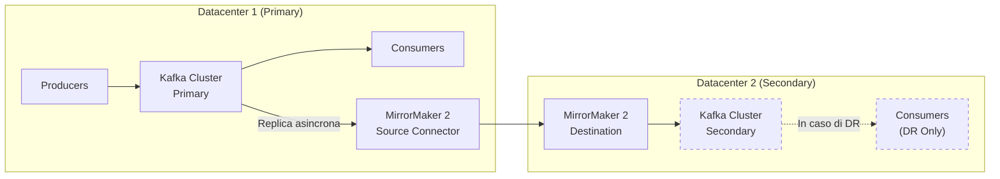

# Disaster Recovery

## Panoramica

Il disaster recovery per Kafka riguarda la capacità di sopravvivere alla perdita di un intero cluster o datacenter, con perdita di dati e downtime controllati. Kafka non è un database con backup tradizionale: la strategia principale è la **geo-replicazione** tramite **MirrorMaker 2** che mantiene un cluster secondario sincronizzato. La preparazione è fondamentale — il DR non improvvisato non funziona.

**RPO (Recovery Point Objective):** Quanti dati possiamo perdere? Con MirrorMaker 2 ben configurato, il RPO è tipicamente < 1 minuto.

**RTO (Recovery Time Objective):** Quanto tempo ci vuole per ripristinare? Con una procedura documentata e testata, l'RTO può essere di pochi minuti.

## Concetti Chiave

**MirrorMaker 2 (MM2)** — Il tool ufficiale Kafka per la replicazione cross-cluster. È un'applicazione Kafka Connect che usa il framework Connect per replicare topic, consumer group offsets e metadati tra cluster.

**Active-Passive** — Un cluster primario (attivo) e uno secondario (standby). Il secondario riceve i dati ma non serve client. In caso di disaster, il secondario viene promosso a primario.

**Active-Active** — Entrambi i cluster servono client. MM2 replica bidirezionalmente. Richiede gestione dei conflitti e topic naming convention per evitare loop di replicazione.

**Offset Translation** — Gli offset nel cluster sorgente non corrispondono agli offset nel cluster destinazione. MM2 mantiene una mappatura degli offset tradotti nel topic `mm2-offsets`.

**Alias dei cluster** — MM2 usa alias per identificare i cluster (es. `primary`, `secondary`). I topic replicati vengono prefissati con l'alias sorgente: `primary.orders` nel cluster secondario.

## Architettura / Come Funziona



## Configurazione & Pratica

### MirrorMaker 2 — Configurazione standalone

```properties
# mm2.properties
clusters = primary, secondary

primary.bootstrap.servers = primary-kafka:9092
secondary.bootstrap.servers = secondary-kafka:9092

# Replicazione da primary a secondary
primary->secondary.enabled = true
primary->secondary.topics = .*               # tutti i topic (regex)
primary->secondary.topics.blacklist = .*internal.*, .*_schema_version_.*

# Sincronizzazione offset consumer group
primary->secondary.sync.group.offsets.enabled = true
primary->secondary.sync.group.offsets.interval.seconds = 60
primary->secondary.emit.offset.syncs.enabled = true

# Replicazione bidirezionale (se active-active)
secondary->primary.enabled = false

# Heartbeat per monitorare la latenza di replicazione
primary->secondary.emit.heartbeats.enabled = true
primary->secondary.heartbeats.topic.replication.factor = 3

# Dimensionamento
tasks.max = 4
replication.factor = 3
```

```bash
# Avviare MirrorMaker 2
connect-mirror-maker.sh mm2.properties
```

### MirrorMaker 2 come Kafka Connect Connector

Per integrare MM2 in un cluster Kafka Connect esistente:

```bash
# MirrorSourceConnector: replica topic e dati
curl -X POST http://connect:8083/connectors \
  -H "Content-Type: application/json" \
  -d '{
    "name": "mirror-source-connector",
    "config": {
      "connector.class": "org.apache.kafka.connect.mirror.MirrorSourceConnector",
      "source.cluster.alias": "primary",
      "target.cluster.alias": "secondary",
      "source.cluster.bootstrap.servers": "primary-kafka:9092",
      "target.cluster.bootstrap.servers": "secondary-kafka:9092",
      "topics": "orders,payments,users",
      "tasks.max": "4",
      "replication.factor": "3",
      "source->target.enabled": "true"
    }
  }'

# MirrorCheckpointConnector: sincronizza consumer group offsets
curl -X POST http://connect:8083/connectors \
  -H "Content-Type: application/json" \
  -d '{
    "name": "mirror-checkpoint-connector",
    "config": {
      "connector.class": "org.apache.kafka.connect.mirror.MirrorCheckpointConnector",
      "source.cluster.alias": "primary",
      "target.cluster.alias": "secondary",
      "source.cluster.bootstrap.servers": "primary-kafka:9092",
      "target.cluster.bootstrap.servers": "secondary-kafka:9092",
      "groups": ".*",
      "sync.group.offsets.enabled": "true",
      "sync.group.offsets.interval.seconds": "60"
    }
  }'
```

### Procedura di failover

```bash
# ─── FASE 1: Rilevare il disastro ───────────────────────────────────────────
# Verificare che il cluster primario sia irraggiungibile
kafka-topics.sh --bootstrap-server primary-kafka:9092 --list
# Se fallisce → procedere con failover

# ─── FASE 2: Tradurre gli offset ────────────────────────────────────────────
# MM2 mantiene la mappatura degli offset. Usare lo script di traduzione:
./kafka-console-consumer.sh \
  --bootstrap-server secondary-kafka:9092 \
  --topic mm2-offsets.primary.internal \
  --from-beginning

# Oppure usare l'API MirrorClient per tradurre gli offset automaticamente
# (disponibile nel connector MirrorCheckpoint)

# ─── FASE 3: Aggiornare i consumer ──────────────────────────────────────────
# Puntare i consumer al cluster secondario
# I consumer group offset sono già sincronizzati da MM2

# Se i topic nel secondario hanno il prefisso "primary.":
# Aggiornare i consumer per leggere da "primary.orders" invece di "orders"
# OPPURE configurare MM2 con replication.policy.class per evitare il prefisso

# ─── FASE 4: Aggiornare i producer ──────────────────────────────────────────
# Puntare i producer al cluster secondario
# bootstrap.servers=secondary-kafka:9092

# ─── FASE 5: Verificare ─────────────────────────────────────────────────────
kafka-consumer-groups.sh \
  --bootstrap-server secondary-kafka:9092 \
  --describe --all-groups
```

### Evitare il prefisso nei topic replicati

Per default MM2 aggiunge il prefisso del cluster sorgente. Per evitarlo:

```properties
# Usare IdentityReplicationPolicy invece della default
replication.policy.class = org.apache.kafka.connect.mirror.IdentityReplicationPolicy
```

!!! warning "IdentityReplicationPolicy richiede attenzione"
    Con la policy di identità, in modalità active-active i topic vengono replicati in loop. Usarla solo con topologie active-passive.

### Backup dei metadati

```bash
# Backup della configurazione dei topic
kafka-topics.sh --bootstrap-server kafka:9092 \
  --describe > topic-config-backup-$(date +%Y%m%d).txt

# Backup dei consumer group offsets
kafka-consumer-groups.sh --bootstrap-server kafka:9092 \
  --describe --all-groups > consumer-groups-backup-$(date +%Y%m%d).txt

# Export config broker
kafka-configs.sh --bootstrap-server kafka:9092 \
  --entity-type brokers --describe --all > broker-config-backup.txt
```

## Best Practices

!!! tip "Testare il DR regolarmente"
    Un piano DR non testato è un piano inutile. Eseguire failover drill ogni trimestre su un ambiente non produttivo. Documentare i tempi effettivi di RTO.

!!! tip "Monitorare il lag di replicazione MM2"
    MM2 espone metriche JMX e Prometheus. Monitorare `replication-latency-ms-avg` e `record-count` per rilevare anomalie nel replication lag prima che diventino un problema.

!!! warning "MM2 non è sincrono"
    MirrorMaker 2 replica in modo asincrono. In caso di perdita improvvisa del cluster primario, i record scritti nell'ultima finestra temporale (tipicamente <1 minuto) potrebbero non essere stati replicati.

!!! tip "Nominare i cluster coerentemente"
    Usare nomi descrittivi come `eu-west-primary`, `eu-central-dr`. Questi nomi appaiono nei topic replicati e nei log — devono essere autoesplicativi.

## Troubleshooting

**MM2 non replica nuovi topic**
- Verificare la regex `topics` nel connector
- Topic blacklist potrebbe escludere il nuovo topic
- Riavviare il connector dopo aver modificato la configurazione

**Consumer group offset non sincronizzato**
- Verificare che `MirrorCheckpointConnector` sia in esecuzione
- Controllare il topic `mm2-checkpoints.primary.internal` nel cluster secondario
- Aumentare la frequenza di sync: `sync.group.offsets.interval.seconds=30`

**Topic replicati con lag elevato**
- Aumentare `tasks.max` nel MirrorSourceConnector
- Verificare la bandwidth di rete tra datacenter
- Monitorare metriche JMX: `kafka.connect:type=mirror-source-metrics`

## Riferimenti

- [MirrorMaker 2 Documentation](https://kafka.apache.org/documentation/#georeplication)
- [KIP-382: MirrorMaker 2.0](https://cwiki.apache.org/confluence/display/KAFKA/KIP-382)
- [Confluent Replicator (enterprise alternative)](https://docs.confluent.io/platform/current/multi-dc-deployments/replicator/replicator-quickstart.html)
