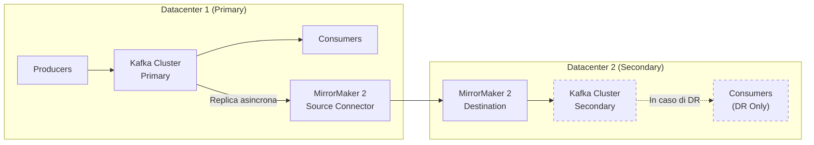

# Disaster Recovery

## Panoramica

Il disaster recovery per Kafka riguarda la capacità di sopravvivere alla perdita di un intero cluster o datacenter, con perdita di dati e downtime controllati. Kafka non è un database con backup tradizionale: la strategia principale è la **geo-replicazione** tramite **MirrorMaker 2** che mantiene un cluster secondario sincronizzato. La preparazione è fondamentale — il DR non improvvisato non funziona.

**RPO (Recovery Point Objective):** Quanti dati possiamo perdere? MM2 replica in modo asincrono: il RPO coincide con il lag di replicazione, tipicamente secondi ma non garantito. Va misurato (metrica `replication-latency-ms`, heartbeat), non assunto.

**RTO (Recovery Time Objective):** Quanto tempo ci vuole per ripristinare? Con una procedura documentata, automatizzata e testata l'RTO può essere di pochi minuti; senza drill è imprevedibile (client da ripuntare, offset da verificare).

## Concetti Chiave

**MirrorMaker 2 (MM2)** — Il tool ufficiale Kafka per la replicazione cross-cluster. È un'applicazione Kafka Connect che usa il framework Connect per replicare topic, consumer group offsets e metadati tra cluster.

**Active-Passive** — Un cluster primario (attivo) e uno secondario (standby). Il secondario riceve i dati ma non serve client. In caso di disaster, il secondario viene promosso a primario.

**Active-Active** — Entrambi i cluster servono client. MM2 replica bidirezionalmente. Richiede gestione dei conflitti e topic naming convention per evitare loop di replicazione.

**Offset Translation** — Gli offset nel cluster sorgente non corrispondono agli offset nel cluster destinazione. MM2 scrive la mappatura nel topic interno `mm2-offset-syncs.<alias>.internal` (cluster sorgente) e i checkpoint dei consumer group, già tradotti, in `<alias>.checkpoints.internal` nel cluster destinazione (es. `primary.checkpoints.internal`). Li produce il `MirrorCheckpointConnector`; si leggono con `RemoteClusterUtils.translateOffsets()` (`MirrorClient`).

**Alias dei cluster** — MM2 usa alias per identificare i cluster (es. `primary`, `secondary`). I topic replicati vengono prefissati con l'alias sorgente: `primary.orders` nel cluster secondario.

## Architettura / Come Funziona


```mermaid
flowchart LR
    subgraph DC1["Datacenter 1 (Primary)"]
        P[Producers]
        K1["Kafka Cluster<br/>Primary"]
        C1[Consumers]
        MM_S["MirrorMaker 2\nSource Connector"]
    end

    subgraph DC2["Datacenter 2 (Secondary)"]
        K2["Kafka Cluster<br/>Secondary"]
        C2["Consumers<br/>(DR Only)"]
        MM_T["MirrorMaker 2\nDestination"]
    end

    P --> K1
    K1 --> C1
    K1 -->|Replica asincrona| MM_S
    MM_S --> MM_T
    MM_T --> K2
    K2 -.->|In caso di DR| C2

    style K2 stroke-dasharray: 5 5
    style C2 stroke-dasharray: 5 5
```

## Configurazione & Pratica

### MirrorMaker 2 — Configurazione standalone

```properties
# mm2.properties
clusters = primary, secondary

primary.bootstrap.servers = primary-kafka:9092
secondary.bootstrap.servers = secondary-kafka:9092

# Replicazione da primary a secondary
primary->secondary.enabled = true
# NB: nei file .properties i commenti vanno su riga propria: a fine riga
# verrebbero letti come parte del valore.
# Tutti i topic (regex); i topic interni (*.internal, __*) sono esclusi di default
primary->secondary.topics = .*
# topics.blacklist è deprecato: usare topics.exclude
primary->secondary.topics.exclude = .*[\-\.]internal, .*\.replica, __.*

# Sincronizzazione offset consumer group
primary->secondary.sync.group.offsets.enabled = true
primary->secondary.sync.group.offsets.interval.seconds = 60
primary->secondary.emit.checkpoints.enabled = true

# Replicazione inversa: false in active-passive, true in active-active
secondary->primary.enabled = false

# Heartbeat per monitorare la latenza di replicazione
primary->secondary.emit.heartbeats.enabled = true
primary->secondary.heartbeats.topic.replication.factor = 3

# Dimensionamento
tasks.max = 4
replication.factor = 3
```

!!! note "Sync offset: condizioni"
    `sync.group.offsets.enabled` è **false** di default. Anche se attivo, MM2 scrive gli offset tradotti nel cluster destinazione solo per i consumer group **senza membri attivi** lì. Prima del failover i consumer DR devono quindi essere fermi.

```bash
# Avviare MirrorMaker 2
connect-mirror-maker.sh mm2.properties
```

### MirrorMaker 2 come Kafka Connect Connector

Per integrare MM2 in un cluster Kafka Connect esistente (meglio vicino al cluster **destinazione**: la lettura attraversa la WAN, la scrittura è locale). I record sono copiati senza deserializzazione, quindi servono i `ByteArrayConverter`:

```bash
# MirrorSourceConnector: replica topic e dati
curl -X POST http://connect:8083/connectors \
  -H "Content-Type: application/json" \
  -d '{
    "name": "mirror-source-connector",
    "config": {
      "connector.class": "org.apache.kafka.connect.mirror.MirrorSourceConnector",
      "source.cluster.alias": "primary",
      "target.cluster.alias": "secondary",
      "source.cluster.bootstrap.servers": "primary-kafka:9092",
      "target.cluster.bootstrap.servers": "secondary-kafka:9092",
      "topics": "orders,payments,users",
      "key.converter": "org.apache.kafka.connect.converters.ByteArrayConverter",
      "value.converter": "org.apache.kafka.connect.converters.ByteArrayConverter",
      "tasks.max": "4",
      "replication.factor": "3"
    }
  }'

# MirrorCheckpointConnector: sincronizza consumer group offsets
curl -X POST http://connect:8083/connectors \
  -H "Content-Type: application/json" \
  -d '{
    "name": "mirror-checkpoint-connector",
    "config": {
      "connector.class": "org.apache.kafka.connect.mirror.MirrorCheckpointConnector",
      "source.cluster.alias": "primary",
      "target.cluster.alias": "secondary",
      "source.cluster.bootstrap.servers": "primary-kafka:9092",
      "target.cluster.bootstrap.servers": "secondary-kafka:9092",
      "groups": ".*",
      "sync.group.offsets.enabled": "true",
      "sync.group.offsets.interval.seconds": "60"
    }
  }'
```

### Procedura di failover

```bash
# ─── FASE 1: Rilevare il disastro ───────────────────────────────────────────
# Verificare che il cluster primario sia irraggiungibile
kafka-topics.sh --bootstrap-server primary-kafka:9092 --list
# Se fallisce → procedere con failover

# ─── FASE 2: Verificare gli offset tradotti ─────────────────────────────────
# I checkpoint stanno in primary.checkpoints.internal sul secondario (formato
# binario: si leggono via MirrorClient/RemoteClusterUtils.translateOffsets,
# non con il console consumer). Con sync.group.offsets.enabled=true sono già
# applicati ai consumer group inattivi: controllare che esistano.
kafka-consumer-groups.sh --bootstrap-server secondary-kafka:9092 \
  --describe --group my-consumer-group

# ─── FASE 3: Aggiornare i consumer ──────────────────────────────────────────
# Puntare i consumer al cluster secondario
# Gli offset sono già sincronizzati da MM2 (sync attivo e gruppo inattivo).
# Il lag residuo dell'ultimo intervallo causa riletture: i consumer devono
# essere idempotenti (MM2 è at-least-once).

# Se i topic nel secondario hanno il prefisso "primary.":
# Aggiornare i consumer per leggere da "primary.orders" invece di "orders"
# OPPURE configurare MM2 con replication.policy.class per evitare il prefisso

# ─── FASE 4: Aggiornare i producer ──────────────────────────────────────────
# Puntare i producer al cluster secondario
# bootstrap.servers=secondary-kafka:9092
# Il failback è un'operazione separata: richiede di replicare in senso inverso
# (secondary->primary) e ritradurre gli offset.

# ─── FASE 5: Verificare ─────────────────────────────────────────────────────
kafka-consumer-groups.sh \
  --bootstrap-server secondary-kafka:9092 \
  --describe --all-groups
```

### Evitare il prefisso nei topic replicati

Per default MM2 aggiunge il prefisso del cluster sorgente. Per evitarlo:

```properties
# Usare IdentityReplicationPolicy invece della default
replication.policy.class = org.apache.kafka.connect.mirror.IdentityReplicationPolicy
```

!!! warning "IdentityReplicationPolicy richiede attenzione"
    Senza prefisso MM2 non riconosce i topic già replicati: in active-active i record rimbalzano all'infinito tra i cluster. Usarla solo con topologie active-passive (disponibile da Kafka 3.0).

### Backup dei metadati

```bash
# Backup della configurazione dei topic
kafka-topics.sh --bootstrap-server kafka:9092 \
  --describe > topic-config-backup-$(date +%Y%m%d).txt

# Backup dei consumer group offsets
kafka-consumer-groups.sh --bootstrap-server kafka:9092 \
  --describe --all-groups > consumer-groups-backup-$(date +%Y%m%d).txt

# Export config broker
kafka-configs.sh --bootstrap-server kafka:9092 \
  --entity-type brokers --entity-default --describe --all > broker-config-backup.txt
```

## Best Practices

!!! tip "Testare il DR regolarmente"
    Un piano DR non testato è un piano inutile. Eseguire failover drill ogni trimestre su un ambiente non produttivo. Documentare i tempi effettivi di RTO.

!!! tip "Monitorare il lag di replicazione MM2"
    MM2 espone metriche JMX e Prometheus. Monitorare `replication-latency-ms-avg` e `record-count` per rilevare anomalie nel replication lag prima che diventino un problema.

!!! warning "MM2 non è sincrono"
    MirrorMaker 2 replica in modo asincrono. In caso di perdita improvvisa del cluster primario, i record scritti nell'ultima finestra temporale (tipicamente <1 minuto) potrebbero non essere stati replicati.

!!! tip "Nominare i cluster coerentemente"
    Usare nomi descrittivi come `eu-west-primary`, `eu-central-dr`. Questi nomi appaiono nei topic replicati e nei log — devono essere autoesplicativi.

## Troubleshooting

### Scenario 1 — MM2 non replica i nuovi topic

**Sintomo:** Un nuovo topic creato nel cluster primario non appare nel cluster secondario dopo diversi minuti.

**Causa:** La regex `topics` del connector non copre il nuovo topic, oppure il topic è incluso nella blacklist. MM2 rileva nuovi topic con un polling periodico (`refresh.topics.interval.seconds`, default 600 s).

**Soluzione:** Verificare la configurazione del connector e forzare il refresh.

```bash
# Verificare la configurazione attuale del connector
curl http://connect:8083/connectors/mirror-source-connector/config | jq .

# Controllare i topic attualmente replicati
kafka-topics.sh --bootstrap-server secondary-kafka:9092 --list | grep "^primary\."

# Forzare un refresh: restart di connector e task
curl -X POST "http://connect:8083/connectors/mirror-source-connector/restart?includeTasks=true"

# Per cambiare config: PUT /config SOSTITUISCE l'intera config, quindi inviare
# sempre il JSON completo (partire dall'output del GET .../config)
curl -X PUT http://connect:8083/connectors/mirror-source-connector/config \
  -H "Content-Type: application/json" \
  -d @mirror-source-config-completa.json
```

---

### Scenario 2 — Consumer group offset non sincronizzato dopo failover

**Sintomo:** Dopo il failover, i consumer ripartono dall'inizio (o dalla fine, secondo `auto.offset.reset`) invece che dall'ultimo offset processato.

**Causa:** Il `MirrorCheckpointConnector` non gira, `sync.group.offsets.enabled` è false (default), il gruppo era già attivo sul secondario, oppure il sync era in ritardo al momento del disastro. Gli offset tradotti risiedono in `primary.checkpoints.internal`.

**Soluzione:** Verificare il checkpoint connector e, se necessario, ripristinare gli offset manualmente.

```bash
# Verificare lo stato del MirrorCheckpointConnector
curl http://connect:8083/connectors/mirror-checkpoint-connector/status | jq .

# Fallback manuale (gruppo fermo): ripartire da un timestamp poco precedente
# al disastro; si accettano duplicati ma non si perdono dati.
# --to-latest perderebbe tutto ciò che non era ancora stato consumato.
kafka-consumer-groups.sh \
  --bootstrap-server secondary-kafka:9092 \
  --group my-consumer-group \
  --topic primary.orders \
  --reset-offsets --to-datetime 2026-10-04T10:00:00.000 --execute

# Ridurre l'intervallo di sync per il futuro (nel connector config)
# sync.group.offsets.interval.seconds=30
```

---

### Scenario 3 — Lag di replicazione elevato (backlog MM2)

**Sintomo:** I topic nel cluster secondario sono in ritardo di migliaia/milioni di messaggi rispetto al primario. La metrica `replication-latency-ms-avg` è alta.

**Causa:** Il numero di task MM2 è insufficiente per il throughput, oppure la bandwidth WAN è il collo di bottiglia. Possibile anche per topic con partizioni elevate con `tasks.max` troppo basso.

**Soluzione:** Aumentare il parallelismo e monitorare le metriche di rete.

```bash
# Il source connector assegna le partizioni a mano e non usa un consumer group:
# il lag si legge dalle metriche JMX kafka.connect.mirror:type=MirrorSourceConnector
# (replication-latency-ms-avg/max, record-count) e dal topic heartbeats.
# Confrontare gli end offset sorgente/destinazione di un topic:
kafka-get-offsets.sh --bootstrap-server primary-kafka:9092 --topic orders
kafka-get-offsets.sh --bootstrap-server secondary-kafka:9092 --topic primary.orders

# Aumentare tasks.max: inviare la config COMPLETA (PUT sostituisce tutto),
# con tasks.max più alto (max utile = numero totale di partizioni replicate)
curl -X PUT http://connect:8083/connectors/mirror-source-connector/config \
  -H "Content-Type: application/json" \
  -d @mirror-source-config-completa.json

# Monitorare throughput di rete tra datacenter
# Su Linux: iftop -i eth0 -f "host secondary-kafka"
```

---

### Scenario 4 — Loop di replicazione in topologia active-active

**Sintomo:** I messaggi vengono duplicati indefinitamente tra i due cluster. I topic crescono in modo anomalo. Gli stessi record compaiono in entrambi i cluster con offset crescenti.

**Causa:** Con `IdentityReplicationPolicy` in modalità active-active i topic hanno lo stesso nome nei due cluster. MM2 rileva i cicli solo tramite il prefisso alias (es. `primary.primary.orders` viene scartato), quindi senza prefisso ricopia i record in entrambe le direzioni.

**Soluzione:** Ripristinare la `DefaultReplicationPolicy` (che usa i prefissi) o disabilitare una direzione di replicazione.

```bash
# Verificare la policy attuale
curl http://connect:8083/connectors/mirror-source-connector/config | \
  jq '."replication.policy.class"'

# Fermare subito il loop: mettere in pausa il connector della direzione inversa
# (il nome dipende da come è stato creato; elencarli con GET /connectors)
curl http://connect:8083/connectors
curl -X PUT http://connect:8083/connectors/<connector-secondary-to-primary>/pause

# Ripristinare DefaultReplicationPolicy (prefissi) in TUTTI i connector MM2
# (config completa, PUT sostituisce tutto) oppure nel mm2.properties:
#   replication.policy.class = org.apache.kafka.connect.mirror.DefaultReplicationPolicy

# Poi ripulire i topic duplicati creati dal loop
kafka-topics.sh --bootstrap-server secondary-kafka:9092 --list
```

## Riferimenti

- [MirrorMaker 2 Documentation](https://kafka.apache.org/documentation/#georeplication)
- [KIP-382: MirrorMaker 2.0](https://cwiki.apache.org/confluence/display/KAFKA/KIP-382)
- [Confluent Cluster Linking (alternativa Confluent: offset preservati, nessun prefisso)](https://docs.confluent.io/platform/current/multi-dc-deployments/cluster-linking/index.html)
- [Confluent Replicator (enterprise alternative)](https://docs.confluent.io/platform/current/multi-dc-deployments/replicator/replicator-quickstart.html)
