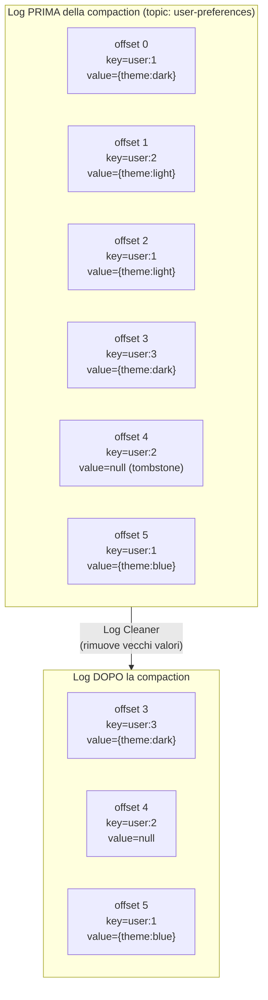

# Log Compaction

## Panoramica

La **log compaction** è una policy di retention alternativa alla retention basata sul tempo. Invece di eliminare i record più vecchi di N giorni, Kafka mantiene almeno **l'ultimo valore per ogni chiave**. Questo è ideale per topic che rappresentano uno stato corrente (come una tabella di database): si può sempre ricostruire lo stato più recente leggendo il topic dall'inizio, indipendentemente da quanto sia vecchio.

**Quando usarla:** Topic changelog (Kafka Streams state stores), topic di configurazione, sincronizzazione dello stato tra microservizi, event sourcing dove interessa solo l'ultimo stato.

**Quando NON usarla:** Stream di eventi dove ogni record ha un valore proprio (es. log di accesso, metriche temporali) — per questi usare la retention temporale.

## Concetti Chiave

**Clean segment** — Segmento del log già processato dal log cleaner. Contiene al massimo un record per chiave.

**Dirty segment** — Segmento del log non ancora processato: può contenere più record con la stessa chiave.

**Dirty ratio** — Rapporto tra dimensione dei dirty segment e dimensione totale del log. Il cleaner inizia quando supera `min.cleanable.dirty.ratio`.

**Tombstone** — Record con chiave non-null e **valore null**. Indica che la chiave deve essere eliminata. I tombstone vengono mantenuti per `delete.retention.ms` prima di essere rimossi definitivamente.

**Log Head** — La parte più recente del log (dirty), dove vengono scritti i nuovi record.
**Log Tail** — La parte già compattata del log (clean), con al massimo un record per chiave.

## Architettura / Come Funziona



**Processo di compaction:**
1. Il **Log Cleaner thread** monitora il dirty ratio di tutti i topic compacted
2. Quando supera `min.cleanable.dirty.ratio`, il cleaner crea un indice delle chiavi con i loro ultimi offset nel dirty segment
3. Il cleaner riscrive i segmenti rimuovendo i record con offset inferiore all'ultimo per quella chiave
4. I tombstone vengono mantenuti per `delete.retention.ms` poi eliminati

**Garanzie importanti:**
- L'ordine relativo dei record per una stessa chiave è preservato
- I consumer che leggono dall'inizio vedono almeno l'ultimo valore per ogni chiave
- L'HW (High Watermark) non viene influenzato dalla compaction

## Configurazione & Pratica

### Configurare un topic compacted

```bash
# Creare un topic con solo compaction
kafka-topics.sh --create \
  --bootstrap-server localhost:9092 \
  --topic user-preferences \
  --partitions 6 \
  --replication-factor 3 \
  --config cleanup.policy=compact \
  --config min.cleanable.dirty.ratio=0.1 \
  --config delete.retention.ms=86400000 \
  --config segment.bytes=104857600

# Creare un topic con compaction + retention temporale (entrambe)
kafka-topics.sh --create \
  --bootstrap-server localhost:9092 \
  --topic user-state \
  --partitions 6 \
  --replication-factor 3 \
  --config cleanup.policy=compact,delete \
  --config retention.ms=604800000 \
  --config min.cleanable.dirty.ratio=0.1
```

### Modificare un topic esistente

```bash
# Aggiungere compaction a un topic esistente
kafka-configs.sh \
  --bootstrap-server localhost:9092 \
  --entity-type topics \
  --entity-name user-preferences \
  --alter \
  --add-config cleanup.policy=compact

# Verificare la configurazione
kafka-configs.sh \
  --bootstrap-server localhost:9092 \
  --entity-type topics \
  --entity-name user-preferences \
  --describe
```

### Configurazioni chiave del cleaner

```properties
# Frequenza di esecuzione del cleaner thread
log.cleaner.enable=true
log.cleaner.threads=1                    # aumentare se compaction lenta
log.cleaner.io.max.bytes.per.second=1048576  # rate limiting I/O

# Per topic
min.cleanable.dirty.ratio=0.5           # inizia compaction quando 50% dirty
# Valore basso (0.1) = compaction aggressiva, più CPU/I/O
# Valore alto (0.9) = compaction lazy, più storage usato

delete.retention.ms=86400000            # tombstone mantenuto 24h
min.compaction.lag.ms=0                 # messaggi non compattabili se più recenti di X ms
max.compaction.lag.ms=9223372036854775807  # forza compaction entro X ms
```

### Produrre un tombstone (eliminazione di una chiave)

```java
// Java Producer — inviare un tombstone
ProducerRecord<String, String> tombstone = new ProducerRecord<>(
    "user-preferences",
    "user:123",   // key
    null           // value null = tombstone
);
producer.send(tombstone);
```

```bash
# Da CLI (valore vuoto = tombstone)
echo "user:123:" | kafka-console-producer.sh \
  --bootstrap-server localhost:9092 \
  --topic user-preferences \
  --property "parse.key=true" \
  --property "key.separator=:" \
  --property "null.marker=~"
# Note: null marker approach varies by Kafka version
```

### Topic changelog di Kafka Streams

Kafka Streams crea automaticamente topic changelog per i state store con compaction abilitata:

```java
// I topic changelog hanno naming: application-id-store-name-changelog
// Es: my-app-orders-store-changelog
// Creati con cleanup.policy=compact di default
```

## Best Practices

!!! tip "Usare sempre le chiavi con i topic compacted"
    La compaction è basata sulle chiavi. Record senza chiave (key=null) non vengono mai compattati e si accumulano.

!!! warning "Tombstone non elimina immediatamente"
    Dopo aver inviato un tombstone, il record con valore null rimane nel log per `delete.retention.ms`. Consumer che leggono durante questo periodo vedranno il tombstone. Progettare i consumer per gestire i valori null.

!!! tip "Compaction + delete per sicurezza"
    `cleanup.policy=compact,delete` mantiene il vantaggio della compaction (ultimo valore per chiave) ma garantisce anche che dati molto vecchi vengano eliminati. Utile per compliance.

!!! warning "Non aspettarsi offset continui"
    Dopo la compaction, i consumer vedranno dei "buchi" negli offset (es. da offset 10 si salta direttamente a offset 15). Questo è normale e non indica perdita di dati utili.

## Troubleshooting

**Compaction non avviene mai**
```bash
# Verificare che il cleaner sia abilitato
kafka-configs.sh --bootstrap-server localhost:9092 \
  --entity-type brokers --entity-name 1 --describe | grep cleaner

# Verificare che il topic abbia cleanup.policy=compact
kafka-configs.sh --bootstrap-server localhost:9092 \
  --entity-type topics --entity-name my-topic --describe

# Log del cleaner (abilitare log level DEBUG per il cleaner)
# log4j: log4j.logger.kafka.log.LogCleaner=DEBUG
```

**Topic cresce indefinitamente nonostante compaction**
- Verificare che tutti i record abbiano una chiave (key!=null)
- Verificare che `min.cleanable.dirty.ratio` non sia troppo alto
- Il cleaner non compatta i segmenti più recenti dell'`active segment` (il segmento in fase di scrittura)

**Consumer vede troppi tombstone**
- Normale subito dopo eliminazioni massicce
- I tombstone vengono rimossi dopo `delete.retention.ms`
- Il consumer deve ignorare o gestire i record con valore null

## Riferimenti

- [Log Compaction Documentation](https://kafka.apache.org/documentation/#compaction)
- [Kafka Internals: Log Compaction](https://kafka.apache.org/documentation/#design_compactiondetails)
