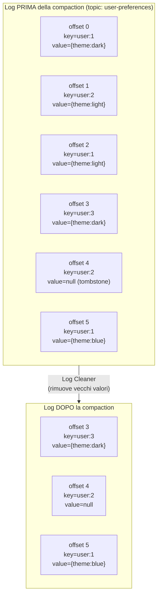

# Log Compaction

## Panoramica

La **log compaction** è una policy di retention alternativa alla retention basata sul tempo. Invece di eliminare i record più vecchi di N giorni, Kafka mantiene almeno **l'ultimo valore per ogni chiave**. Questo è ideale per topic che rappresentano uno stato corrente (come una tabella di database): si può sempre ricostruire lo stato più recente leggendo il topic dall'inizio, indipendentemente da quanto sia vecchio.

**Quando usarla:** Topic changelog (Kafka Streams state stores), topic di configurazione, sincronizzazione dello stato tra microservizi, event sourcing dove interessa solo l'ultimo stato.

**Quando NON usarla:** Stream di eventi dove ogni record ha un valore proprio (es. log di accesso, metriche temporali) — per questi usare la retention temporale.

## Concetti Chiave

**Clean segment** — Segmento del log già processato dal log cleaner. Contiene al massimo un record per chiave.

**Dirty segment** — Segmento del log non ancora processato: può contenere più record con la stessa chiave.

**Dirty ratio** — Rapporto tra dimensione dei dirty segment e dimensione totale del log. Il cleaner inizia quando supera `min.cleanable.dirty.ratio`.

**Tombstone** — Record con chiave non-null e **valore null**. Indica che la chiave deve essere eliminata. I tombstone vengono mantenuti per `delete.retention.ms` prima di essere rimossi definitivamente.

**Log Head** — La parte più recente del log (dirty), dove vengono scritti i nuovi record.
**Log Tail** — La parte già compattata del log (clean), con al massimo un record per chiave.

**Active segment** — Il segmento su cui il broker sta scrivendo. **Non viene mai compattato**: il cleaner lavora solo su segmenti chiusi. Un segmento si chiude (roll) al raggiungimento di `segment.bytes` o `segment.ms`; finché non avviene, i duplicati restano visibili anche se il dirty ratio è alto.

!!! note "Uso interno"
    `__consumer_offsets` (offset committati dai consumer group) e i changelog di Kafka Streams sono topic compacted: la compaction è un meccanismo centrale di Kafka, non solo una feature opzionale.

## Architettura / Come Funziona


```mermaid
flowchart TB
    subgraph Before["Log PRIMA della compaction (topic: user-preferences)"]
        direction LR
        R1["offset 0\nkey=user:1\nvalue={theme:dark}"]
        R2["offset 1\nkey=user:2\nvalue={theme:light}"]
        R3["offset 2\nkey=user:1\nvalue={theme:light}"]
        R4["offset 3\nkey=user:3\nvalue={theme:dark}"]
        R5["offset 4\nkey=user:2\nvalue=null (tombstone)"]
        R6["offset 5\nkey=user:1\nvalue={theme:blue}"]
    end

    subgraph After["Log DOPO la compaction"]
        direction LR
        A3["offset 3\nkey=user:3\nvalue={theme:dark}"]
        A5["offset 4\nkey=user:2\nvalue=null"]
        A6["offset 5\nkey=user:1\nvalue={theme:blue}"]
    end

    Before -->|"Log Cleaner\n(rimuove vecchi valori)"| After
```

**Processo di compaction:**
1. Il **Log Cleaner thread** monitora il dirty ratio di tutti i topic compacted
2. Quando supera `min.cleanable.dirty.ratio`, il cleaner crea un indice delle chiavi con i loro ultimi offset nel dirty segment
3. Il cleaner riscrive i segmenti rimuovendo i record con offset inferiore all'ultimo per quella chiave
4. I tombstone vengono mantenuti per `delete.retention.ms` poi eliminati (il conteggio parte da quando il segmento che li contiene è stato compattato, non dall'invio)

**Garanzie importanti:**
- L'ordine relativo dei record per una stessa chiave è preservato
- I consumer che leggono dall'inizio vedono almeno l'ultimo valore per ogni chiave
- L'HW (High Watermark) non viene influenzato dalla compaction

## Configurazione & Pratica

### Configurare un topic compacted

```bash
# Creare un topic con solo compaction
kafka-topics.sh --create \
  --bootstrap-server localhost:9092 \
  --topic user-preferences \
  --partitions 6 \
  --replication-factor 3 \
  --config cleanup.policy=compact \
  --config min.cleanable.dirty.ratio=0.1 \
  --config delete.retention.ms=86400000 \
  --config segment.bytes=104857600

# Creare un topic con compaction + retention temporale (entrambe)
kafka-topics.sh --create \
  --bootstrap-server localhost:9092 \
  --topic user-state \
  --partitions 6 \
  --replication-factor 3 \
  --config cleanup.policy=compact,delete \
  --config retention.ms=604800000 \
  --config min.cleanable.dirty.ratio=0.1
```

### Modificare un topic esistente

```bash
# Aggiungere compaction a un topic esistente
kafka-configs.sh \
  --bootstrap-server localhost:9092 \
  --entity-type topics \
  --entity-name user-preferences \
  --alter \
  --add-config cleanup.policy=compact

# Verificare la configurazione
kafka-configs.sh \
  --bootstrap-server localhost:9092 \
  --entity-type topics \
  --entity-name user-preferences \
  --describe
```

### Configurazioni chiave del cleaner

```properties
# Frequenza di esecuzione del cleaner thread
log.cleaner.enable=true
log.cleaner.threads=1                    # aumentare se compaction lenta
log.cleaner.io.max.bytes.per.second=1048576  # rate limiting I/O (default: illimitato)

# Per topic
min.cleanable.dirty.ratio=0.5           # inizia compaction quando 50% dirty
# Valore basso (0.1) = compaction aggressiva, più CPU/I/O
# Valore alto (0.9) = compaction lazy, più storage usato

delete.retention.ms=86400000            # tombstone mantenuto 24h
min.compaction.lag.ms=0                 # messaggi non compattabili se più recenti di X ms
max.compaction.lag.ms=9223372036854775807  # forza compaction entro X ms
```

### Produrre un tombstone (eliminazione di una chiave)

```java
// Java Producer — inviare un tombstone
ProducerRecord<String, String> tombstone = new ProducerRecord<>(
    "user-preferences",
    "user:123",   // key
    null           // value null = tombstone
);
producer.send(tombstone);
```

```bash
# Da CLI: un valore vuoto NON è un tombstone (è una stringa vuota).
# Serve null.marker (Kafka >= 3.2, KIP-810): il valore "~" viene inviato come null
echo "user:123:~" | kafka-console-producer.sh \
  --bootstrap-server localhost:9092 \
  --topic user-preferences \
  --property "parse.key=true" \
  --property "key.separator=:" \
  --property "null.marker=~"
```

### Topic changelog di Kafka Streams

Kafka Streams crea automaticamente topic changelog per i state store con compaction abilitata:

```java
// I topic changelog hanno naming: application-id-store-name-changelog
// Es: my-app-orders-store-changelog
// Creati con cleanup.policy=compact di default
// (i changelog di window store usano compact,delete con retention.ms
//  legata alla durata della finestra)
```

## Best Practices

!!! tip "Usare sempre le chiavi con i topic compacted"
    La compaction è basata sulle chiavi. Un topic con `cleanup.policy=compact` **rifiuta** i record con key=null (il broker risponde con `InvalidRecordException: Compacted topic cannot accept message without key`). Con `compact,delete` il rifiuto vale ugualmente.

!!! warning "Tombstone non elimina immediatamente"
    Dopo aver inviato un tombstone, il record con valore null rimane nel log per `delete.retention.ms`. Consumer che leggono durante questo periodo vedranno il tombstone. Progettare i consumer per gestire i valori null.

!!! tip "Compaction + delete per sicurezza"
    `cleanup.policy=compact,delete` mantiene il vantaggio della compaction (ultimo valore per chiave) ma garantisce anche che dati molto vecchi vengano eliminati. Utile per compliance.

!!! warning "Non aspettarsi offset continui"
    Dopo la compaction, i consumer vedranno dei "buchi" negli offset (es. da offset 10 si salta direttamente a offset 15). Questo è normale e non indica perdita di dati utili.

## Troubleshooting

### Scenario 1 — Compaction non avviene mai

**Sintomo:** Il topic compacted continua ad avere record duplicati per la stessa chiave; la dimensione del log non scende mai.

**Causa:** Il log cleaner è disabilitato, il `cleanup.policy` non è impostato correttamente, oppure il dirty ratio non raggiunge mai la soglia configurata.

**Soluzione:** Verificare che il cleaner sia attivo sul broker e che il topic abbia la policy corretta.

```bash
# Verificare configurazione del broker (cleaner abilitato)
kafka-configs.sh --bootstrap-server localhost:9092 \
  --entity-type brokers --entity-name 1 --describe --all | grep cleaner
# senza --all vengono mostrate solo le override dinamiche, non server.properties

# Verificare che il topic abbia cleanup.policy=compact
kafka-configs.sh --bootstrap-server localhost:9092 \
  --entity-type topics --entity-name my-topic --describe

# Abbassare la soglia dirty ratio per forzare compaction più frequente
kafka-configs.sh --bootstrap-server localhost:9092 \
  --entity-type topics --entity-name my-topic \
  --alter --add-config min.cleanable.dirty.ratio=0.1

# Il cleaner thread può morire per un'eccezione (es. segmento corrotto):
# cercare "Error due to" / "Stopped" nel log e la metrica
# kafka.log:type=LogCleanerManager,name=time-since-last-run-ms
grep -E "kafka.log.LogCleaner|log-cleaner" /var/log/kafka/server.log | tail

# Abilitare log DEBUG per monitorare il cleaner
# log4j.properties (Kafka 3.x):  log4j.logger.kafka.log.LogCleaner=DEBUG
# log4j2 (Kafka 4.x): logger name="kafka.log.LogCleaner" level="DEBUG"
```

---

### Scenario 2 — Topic cresce indefinitamente nonostante compaction

**Sintomo:** Il log compacted aumenta di dimensione senza che i vecchi record vengano rimossi.

**Causa:** Cause tipiche: (1) il segmento attivo non è compattabile e `segment.bytes` (default 1 GiB) / `segment.ms` (default 7 giorni) sono troppo grandi, quindi i segmenti non si chiudono mai; (2) `min.compaction.lag.ms` impedisce di compattare record recenti; (3) il dirty ratio è troppo alto; (4) il cleaner thread è morto; (5) la policy è `compact,delete` e la dimensione è dominata da record con chiavi tutte distinte (nessun duplicato da rimuovere). Record senza chiave non sono la causa: il broker li rifiuta sui topic compacted (possono esistere solo se la policy è stata aggiunta a un topic già popolato).

**Soluzione:** Ridurre `segment.ms`/`segment.bytes` e `min.cleanable.dirty.ratio`; verificare `min.compaction.lag.ms`; controllare che il cleaner sia vivo (Scenario 1). Usare `max.compaction.lag.ms` per forzare la compaction entro un tempo massimo.

```bash
# Chiudere più spesso i segmenti (es. 1 ora) così diventano compattabili
kafka-configs.sh --bootstrap-server localhost:9092 \
  --entity-type topics --entity-name my-topic \
  --alter --add-config segment.ms=3600000

# Verificare dimensione segmenti dirty vs clean (tramite JMX)
# Metric: kafka.log:type=LogCleanerManager,name=max-dirty-percent

# Forzare compaction abbassando la soglia
kafka-configs.sh --bootstrap-server localhost:9092 \
  --entity-type topics --entity-name my-topic \
  --alter --add-config min.cleanable.dirty.ratio=0.05
```

---

### Scenario 3 — Consumer vede troppi tombstone / valori null

**Sintomo:** Il consumer riceve molti record con `value=null` che causano NullPointerException o comportamenti inattesi.

**Causa:** Tombstone inviati per eliminare chiavi restano nel log per `delete.retention.ms` (default 24h). Consumer che non gestiscono i valori null si rompono.

**Soluzione:** I consumer devono filtrare i tombstone. Ridurre `delete.retention.ms` se i tombstone non sono necessari a lungo.

```bash
# Ridurre il tempo di retention dei tombstone (es. 1h)
kafka-configs.sh --bootstrap-server localhost:9092 \
  --entity-type topics --entity-name my-topic \
  --alter --add-config delete.retention.ms=3600000

# Verificare quanti tombstone sono presenti
kafka-console-consumer.sh \
  --bootstrap-server localhost:9092 \
  --topic my-topic \
  --from-beginning \
  --property print.key=true \
  --property print.value=true | grep -c "null$"
```

---

### Scenario 4 — Lag del cleaner troppo elevato / compaction lenta

**Sintomo:** Il dirty ratio rimane alto per ore, il cleaner non riesce a stare al passo con la velocità di scrittura. Possibile aumento del lag in JMX.

**Causa:** Un solo cleaner thread non basta per il volume di dati, oppure l'I/O rate del cleaner è limitato troppo aggressivamente.

**Soluzione:** Aumentare `log.cleaner.threads` e/o alzare `log.cleaner.io.max.bytes.per.second` nella configurazione del broker.

```bash
# Verificare le metriche del cleaner via JMX (con kafka-jmx tool)
# Metric: kafka.log:type=LogCleaner,name=cleaner-recopy-percent
# Metric: kafka.log:type=LogCleanerManager,name=max-dirty-percent

# Entrambi i parametri sono dynamic broker config (nessun riavvio):
kafka-configs.sh --bootstrap-server localhost:9092 \
  --entity-type brokers --entity-default --alter \
  --add-config log.cleaner.threads=2,log.cleaner.io.max.bytes.per.second=52428800  # 50 MB/s
# In alternativa in server.properties (richiede riavvio)

# Verificare throughput del cleaner nel log del broker
grep "LogCleaner" /var/log/kafka/server.log | tail -50
```

## Riferimenti

- [Log Compaction Documentation](https://kafka.apache.org/documentation/#compaction)
- [Kafka Internals: Log Compaction](https://kafka.apache.org/documentation/#design_compactiondetails)
