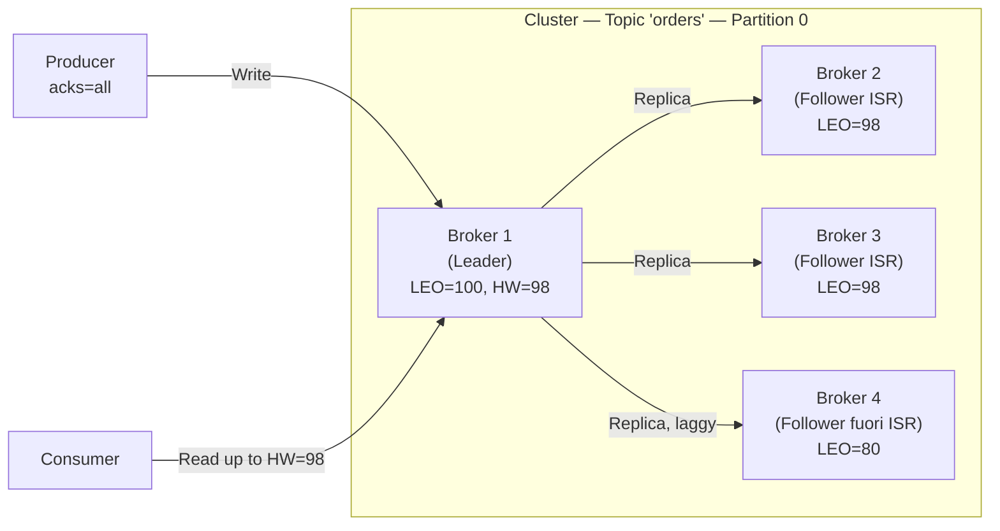

# Replica e Fault Tolerance

## Panoramica

Kafka garantisce la durabilità dei dati attraverso la **replica delle partizioni** su più broker. Ogni partizione ha un broker **leader** che gestisce tutte le operazioni di lettura/scrittura, e uno o più broker **follower** che mantengono copie sincronizzate. Il sistema è progettato per sopravvivere alla perdita di broker senza perdita di dati, purché la configurazione sia corretta.

## Concetti Chiave

**Replication Factor (RF)** — Numero totale di copie di ogni partizione nel cluster. RF=3 significa 1 leader + 2 follower.

**ISR (In-Sync Replicas)** — Sottoinsieme dei follower che sono allineati con il leader entro `replica.lag.time.max.ms` (default 30 secondi). Solo le repliche ISR sono eleggibili come nuovo leader.

**min.insync.replicas** — Numero minimo di repliche ISR necessarie perché il broker leader accetti una scrittura con `acks=all`. Se le ISR scendono sotto questa soglia, il producer riceve `NotEnoughReplicasException`.

**HW (High Watermark)** — Il massimo offset che tutti i follower ISR hanno confermato di avere replicato. I consumer leggono solo fino all'HW, garantendo che leggano solo dati completamente replicati.

**LEO (Log End Offset)** — L'offset dell'ultimo record nel log del leader (inclusi record non ancora replicati da tutte le ISR).

## Architettura / Come Funziona



**Flusso di una scrittura con acks=all:**
1. Producer invia record al leader (LEO diventa 100)
2. I follower ISR (Broker 2, 3) fanno fetch e replicano fino a LEO=100
3. Il leader aggiorna l'HW a 100 quando tutti gli ISR hanno confermato
4. Il leader risponde al producer con ACK
5. I consumer ora possono leggere fino all'offset 100

**Elezione del leader:**
1. Il broker leader muore
2. Il controller rileva la disconnessione tramite heartbeat
3. Il controller sceglie il nuovo leader dall'ISR (preferibilmente il preferred leader)
4. I consumer e producer vengono notificati del nuovo leader tramite metadata update

## Configurazione & Pratica

### Configurazioni critiche per durabilità

```properties
# server.properties (broker)
default.replication.factor=3
min.insync.replicas=2

# Permette elezione di leader fuori ISR (RISCHIO PERDITA DATI)
# Lasciare a false in produzione
unclean.leader.election.enable=false

# Quante repliche devono confermare per i topic interni
offsets.topic.replication.factor=3
transaction.state.log.replication.factor=3
transaction.state.log.min.isr=2

# Timeout prima che un follower sia rimosso dall'ISR
replica.lag.time.max.ms=30000

# Preferred leader election automatica
auto.leader.rebalance.enable=true
leader.imbalance.check.interval.seconds=300
leader.imbalance.per.broker.percentage=10
```

### Creare un topic con RF specifico

```bash
kafka-topics.sh --create \
  --bootstrap-server localhost:9092 \
  --topic critical-events \
  --partitions 12 \
  --replication-factor 3 \
  --config min.insync.replicas=2 \
  --config unclean.leader.election.enable=false
```

### Monitorare la salute della replica

```bash
# Topic con partizioni under-replicated (follower non allineati)
kafka-topics.sh --bootstrap-server localhost:9092 \
  --describe --under-replicated-partitions

# Topic con partizioni senza leader (cluster parzialmente down)
kafka-topics.sh --bootstrap-server localhost:9092 \
  --describe --unavailable-partitions

# Dettaglio di un topic: leader, ISR, repliche
kafka-topics.sh --bootstrap-server localhost:9092 \
  --describe --topic critical-events
# Topic: critical-events  Partition: 0  Leader: 1  Replicas: 1,2,3  Isr: 1,2,3
# Topic: critical-events  Partition: 1  Leader: 2  Replicas: 2,3,1  Isr: 2,3,1
```

### Preferred leader election

```bash
# Eleggere il preferred leader su tutte le partizioni
kafka-leader-election.sh \
  --bootstrap-server localhost:9092 \
  --election-type preferred \
  --all-topic-partitions

# Per topic specifico
kafka-leader-election.sh \
  --bootstrap-server localhost:9092 \
  --election-type preferred \
  --topic critical-events \
  --partition 0
```

### Matrice durabilità vs disponibilità

| RF | min.ISR | Broker tollerati offline | Perdita dati possibile |
|----|---------|--------------------------|------------------------|
| 1 | 1 | 0 | Sì (se il broker perde disco) |
| 2 | 1 | 1 | Sì (se entrambi offline) |
| 2 | 2 | 0 | No (ma disponibilità ridotta) |
| 3 | 1 | 2 | Sì (unclean election) |
| 3 | 2 | 1 | No (configurazione raccomandata) |
| 3 | 3 | 0 | No (disponibilità molto bassa) |

## Best Practices

!!! tip "RF=3, min.ISR=2 è il gold standard"
    Questa configurazione sopporta la perdita di 1 broker senza perdita di dati e senza interrompere le scritture.

!!! warning "Non abilitare unclean.leader.election in produzione"
    Se abilitato e un follower ritardatario viene eletto leader, i record non replicati vengono silenziosamente persi. In produzione, prefer availability degradata a perdita di dati.

!!! tip "Distribuire leader su AZ diverse"
    Con `broker.rack` configurato e `replica.assignment.strategy=RackAwareReplicaSelector`, Kafka distribuisce le repliche su AZ diverse. Questo garantisce che la perdita di una AZ non causi la perdita di tutti i leader di un topic.

!!! warning "Topic interni devono avere RF=3"
    `__consumer_offsets` e `__transaction_state` devono avere RF=3. Se creati con RF=1 (default dev), la perdita di un broker elimina la traccia degli offset di tutti i consumer.

## Troubleshooting

### Scenario 1 — Under-replicated partitions persistenti

**Sintomo:** `kafka-topics.sh --under-replicated-partitions` restituisce partizioni in modo continuo; metrica `UnderReplicatedPartitions` > 0.

**Causa:** Un follower non riesce a stare al passo con il leader a causa di disco pieno, I/O lento, GC pause eccessive o rete congestionata.

**Soluzione:** Identificare il broker in ritardo e rimuovere la causa radice.

```bash
# Identificare partizioni under-replicated e il broker lento
kafka-topics.sh --bootstrap-server localhost:9092 \
  --describe --under-replicated-partitions

# Controllare spazio disco sul broker incriminato
df -h /data/kafka-logs

# Controllare I/O
iostat -x 1 5

# Controllare log JVM per GC pause (cercare "GC pause" nei log del broker)
grep -i "gc pause" /var/log/kafka/server.log | tail -20

# Verificare il lag di replica per broker specifico
kafka-log-dirs.sh --bootstrap-server localhost:9092 \
  --broker-list 2 --describe
```

### Scenario 2 — Producer riceve NotEnoughReplicasException

**Sintomo:** I producer falliscono con `org.apache.kafka.common.errors.NotEnoughReplicasException`; le scritture sul topic sono bloccate.

**Causa:** Il numero di ISR è sceso sotto `min.insync.replicas`, ad esempio per la caduta di uno o più broker follower.

**Soluzione:** Verificare lo stato del cluster e ripristinare i broker. In emergenza, abbassare temporaneamente `min.insync.replicas`.

```bash
# Verificare quante ISR sono attive per il topic
kafka-topics.sh --bootstrap-server localhost:9092 \
  --describe --topic my-topic
# Colonna ISR mostra le repliche sincronizzate attive

# Verificare broker online
kafka-broker-api-versions.sh --bootstrap-server localhost:9092

# Emergenza: ridurre min.insync.replicas (RISCHIO: riduce garanzie durabilità)
kafka-configs.sh --bootstrap-server localhost:9092 \
  --alter --entity-type topics --entity-name my-topic \
  --add-config min.insync.replicas=1

# Ripristinare appena i broker tornano online
kafka-configs.sh --bootstrap-server localhost:9092 \
  --alter --entity-type topics --entity-name my-topic \
  --add-config min.insync.replicas=2
```

### Scenario 3 — Leader sbilanciato (tutti i leader su uno stesso broker)

**Sintomo:** Un broker ha la quasi totalità dei leader; metrica `ActiveControllerCount` e `LeaderCount` sbilanciata. Latenza aumentata per quel broker.

**Causa:** Dopo un riavvio del cluster o failover, i leader non tornano ai broker "preferred" se `auto.leader.rebalance.enable=false` oppure il timer non è ancora scattato.

**Soluzione:** Eseguire una preferred leader election manuale.

```bash
# Verificare distribuzione dei leader per broker
kafka-topics.sh --bootstrap-server localhost:9092 \
  --describe --topic my-topic

# Preferred leader election su tutti i topic
kafka-leader-election.sh \
  --bootstrap-server localhost:9092 \
  --election-type preferred \
  --all-topic-partitions

# Oppure su topic specifico
kafka-leader-election.sh \
  --bootstrap-server localhost:9092 \
  --election-type preferred \
  --topic my-topic --partition 0
```

### Scenario 4 — Perdita di dati dopo riavvio con unclean.leader.election=true

**Sintomo:** Dopo il riavvio del cluster, i consumer rilevano un gap negli offset o ricevono record duplicati/mancanti rispetto a ciò che era stato scritto.

**Causa:** Un follower non ISR è stato eletto leader (unclean election). I record presenti sul leader originale ma non ancora replicati sono stati persi o sovrascritti.

**Soluzione:** Disabilitare unclean leader election in produzione. Dopo un incidente, verificare il data loss tramite i log.

```bash
# Verificare configurazione corrente del topic
kafka-configs.sh --bootstrap-server localhost:9092 \
  --describe --entity-type topics --entity-name my-topic
# Cercare: unclean.leader.election.enable=true (è un problema)

# Disabilitare unclean election a livello di topic
kafka-configs.sh --bootstrap-server localhost:9092 \
  --alter --entity-type topics --entity-name my-topic \
  --add-config unclean.leader.election.enable=false

# Disabilitare a livello di broker (server.properties)
# unclean.leader.election.enable=false

# Verificare offset del leader attuale vs aspettativa
kafka-get-offsets.sh --bootstrap-server localhost:9092 \
  --topic my-topic --time -1
```

## Riferimenti

- [Kafka Replication](https://kafka.apache.org/documentation/#replication)
- [Kafka Durability](https://kafka.apache.org/documentation/#design_ha)
- [ISR and High Watermark](https://developer.confluent.io/courses/architecture/replication/)
