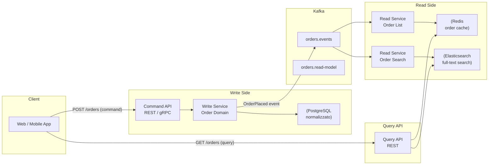
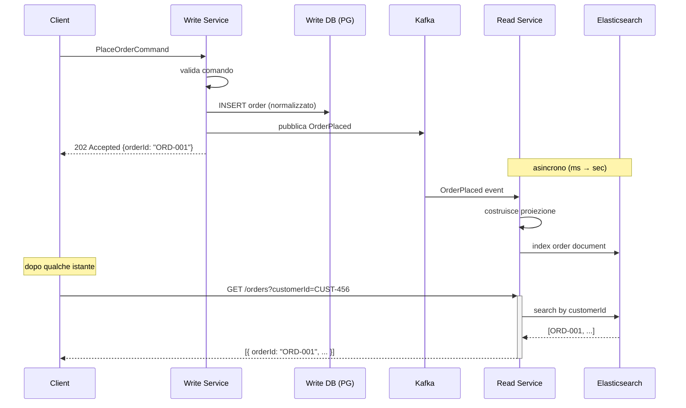

# CQRS con Kafka

## Panoramica

CQRS (Command Query Responsibility Segregation) è un pattern architetturale che separa il modello di scrittura (commands) dal modello di lettura (queries). In un'architettura tradizionale, lo stesso modello serve sia le operazioni di scrittura sia quelle di lettura, creando un compromesso: il modello di dati ottimizzato per le transazioni è raramente ottimizzato per le query complesse, e viceversa. Con CQRS, il write side gestisce i comandi e mantiene uno stato normalizzato; il read side costruisce e mantiene view denormalizzate ottimizzate per specifici pattern di query. Kafka è il backbone di sincronizzazione: gli eventi generati dal write side vengono consumati dal read side per aggiornare le proiezioni. Il pattern vale la complessità aggiuntiva quando le operazioni di lettura e scrittura hanno requisiti di scalabilità, modello di dati o performance significativamente diversi; è over-engineering se applicato a domini semplici con query standard.

## Concetti Chiave

### Command vs Query

| Concetto | Command | Query |
|----------|---------|-------|
| **Scopo** | Mutare lo stato | Leggere lo stato |
| **Ritorno** | Void (o ID) | Dati (DTO, proiezioni) |
| **Side effects** | Sì (modifica DB, pubblica eventi) | No (read-only) |
| **Consistenza** | Forte (write side) | Eventual (read side) |
| **Esempio** | `PlaceOrderCommand` | `GetOrdersByCustomerQuery` |

### Write Side

Il write side gestisce i comandi e applica la business logic. Persiste lo stato in forma normalizzata (o come event store se combinato con Event Sourcing). Ogni mutazione di stato genera un evento pubblicato su Kafka.

### Read Side (Proiezioni)

Il read side consuma gli eventi Kafka e costruisce **proiezioni** (o materialized view) ottimizzate per le query. Ogni proiezione può usare il database più adatto al suo caso d'uso:
- **Elasticsearch**: ricerca full-text, aggregazioni
- **Redis**: cache, sessioni, contatori real-time
- **PostgreSQL**: query relazionali complesse
- **MongoDB**: documenti flessibili, query annidate

### Eventual Consistency e Read-Your-Writes

Il problema principale di CQRS: dopo che un utente esegue un comando (es. aggiorna il profilo), la query successiva potrebbe restituire dati non ancora aggiornati perché la proiezione non ha ancora ricevuto l'evento. Questo è il **read-your-writes challenge**.

### Materialized View

Una materialized view è una proiezione pre-calcolata e persistita. A differenza di una view SQL che ricalcola al momento della query, la materialized view viene aggiornata incrementalmente quando arrivano nuovi eventi.

## Come Funziona

### Architettura CQRS con Kafka



### Flusso Temporale di un Comando



## Implementazione con Kafka

### Write Side — Command Handler

```java
@RestController
@RequestMapping("/api/v1/orders")
@Slf4j
public class OrderCommandController {

    private final OrderCommandService commandService;

    @PostMapping
    @ResponseStatus(HttpStatus.ACCEPTED)
    public OrderCreatedResponse placeOrder(@RequestBody @Valid PlaceOrderRequest request) {
        PlaceOrderCommand command = PlaceOrderCommand.builder()
            .orderId(UUID.randomUUID().toString())
            .customerId(request.getCustomerId())
            .items(request.getItems())
            .correlationId(request.getCorrelationId())
            .build();

        String orderId = commandService.handle(command);

        return OrderCreatedResponse.builder()
            .orderId(orderId)
            .status("PENDING")
            .message("Ordine in elaborazione. Usare GET /orders/" + orderId + " per lo stato.")
            .build();
    }
}

@Service
@Slf4j
public class OrderCommandService {

    private final OrderRepository orderRepository;
    private final OutboxRepository outboxRepository;

    @Transactional
    public String handle(PlaceOrderCommand command) {
        // 1. Valida command
        validateCommand(command);

        // 2. Persiste nel write model (normalizzato)
        Order order = Order.builder()
            .orderId(command.getOrderId())
            .customerId(command.getCustomerId())
            .items(command.getItems())
            .totalAmount(calculateTotal(command.getItems()))
            .status(OrderStatus.PENDING)
            .createdAt(Instant.now())
            .build();

        orderRepository.save(order);

        // 3. Pubblica evento via Outbox (atomico con il write)
        outboxRepository.save(OutboxEntry.builder()
            .aggregateType("Order")
            .aggregateId(order.getOrderId())
            .eventType("OrderPlaced")
            .payload(serializeEvent(OrderPlacedEvent.from(order)))
            .build());

        log.info("Comando PlaceOrder gestito, orderId={}", order.getOrderId());
        return order.getOrderId();
    }
}
```

### Read Side — Proiezione con Elasticsearch

```java
@Service
@Slf4j
public class OrderReadProjection {

    private final OrderSearchRepository elasticsearchRepo;
    private final OrderCacheRepository redisRepo;

    // ─── Consumer che aggiorna le proiezioni ─────────────────────────────────

    @KafkaListener(
        topics = "orders.events",
        groupId = "order-read-projection",
        containerFactory = "batchListenerContainerFactory"
    )
    public void projectEvents(List<ConsumerRecord<String, OrderEvent>> records,
                              Acknowledgment ack) {
        log.debug("Proiezione batch di {} eventi", records.size());

        List<OrderDocument> toIndex = new ArrayList<>();
        List<String> toEvict = new ArrayList<>();

        for (ConsumerRecord<String, OrderEvent> record : records) {
            OrderEvent event = record.value();

            switch (event.getEventType()) {
                case "OrderPlaced" -> {
                    OrderDocument doc = buildOrderDocument((OrderPlacedEvent) event);
                    toIndex.add(doc);
                    toEvict.add(event.getAggregateId()); // invalida cache
                }
                case "PaymentConfirmed" -> {
                    updateOrderStatus(event.getAggregateId(), "PAYMENT_CONFIRMED");
                    toEvict.add(event.getAggregateId());
                }
                case "OrderShipped" -> {
                    updateOrderStatus(event.getAggregateId(), "SHIPPED");
                    toEvict.add(event.getAggregateId());
                }
                case "OrderCancelled" -> {
                    updateOrderStatus(event.getAggregateId(), "CANCELLED");
                    toEvict.add(event.getAggregateId());
                }
                default -> log.warn("Evento non gestito dalla proiezione: {}",
                    event.getEventType());
            }
        }

        // Bulk index su Elasticsearch
        if (!toIndex.isEmpty()) {
            elasticsearchRepo.saveAll(toIndex);
        }

        // Invalida cache Redis
        toEvict.forEach(orderId -> redisRepo.evict("order:" + orderId));

        ack.acknowledge();
        log.debug("Proiezione completata per {} eventi", records.size());
    }

    private OrderDocument buildOrderDocument(OrderPlacedEvent event) {
        return OrderDocument.builder()
            .orderId(event.getPayload().getOrderId())
            .customerId(event.getPayload().getCustomerId())
            .customerName(event.getPayload().getCustomerName())
            .status("PENDING")
            .totalAmount(event.getPayload().getTotalAmount())
            .currency(event.getPayload().getCurrency())
            .itemCount(event.getPayload().getItems().size())
            .itemNames(event.getPayload().getItems().stream()
                .map(OrderItem::getName)
                .toList())
            .createdAt(event.getTimestamp())
            .lastUpdatedAt(event.getTimestamp())
            .build();
    }
}
```

### Query Side — API di lettura

```java
@RestController
@RequestMapping("/api/v1/orders")
@Slf4j
public class OrderQueryController {

    private final OrderQueryService queryService;

    @GetMapping("/{orderId}")
    public OrderDetailView getOrder(@PathVariable String orderId,
                                    @RequestParam(defaultValue = "false") boolean noCache) {
        return queryService.getOrderById(orderId, noCache);
    }

    @GetMapping
    public Page<OrderSummaryView> searchOrders(
            @RequestParam(required = false) String customerId,
            @RequestParam(required = false) String status,
            @RequestParam(required = false) String query,
            @RequestParam(defaultValue = "0") int page,
            @RequestParam(defaultValue = "20") int size) {

        OrderSearchQuery searchQuery = OrderSearchQuery.builder()
            .customerId(customerId)
            .status(status)
            .fullTextQuery(query)
            .page(page)
            .size(size)
            .build();

        return queryService.searchOrders(searchQuery);
    }
}

@Service
@Slf4j
public class OrderQueryService {

    private final OrderSearchRepository elasticsearchRepo;
    private final OrderCacheRepository redisCache;

    public OrderDetailView getOrderById(String orderId, boolean noCache) {
        // 1. Prova la cache Redis (read-through cache)
        if (!noCache) {
            OrderDetailView cached = redisCache.get("order:" + orderId);
            if (cached != null) {
                log.debug("Cache hit per orderId={}", orderId);
                return cached;
            }
        }

        // 2. Fallback su Elasticsearch
        OrderDocument doc = elasticsearchRepo.findById(orderId)
            .orElseThrow(() -> new OrderNotFoundException(orderId));

        OrderDetailView view = OrderDetailView.from(doc);

        // 3. Popola la cache
        redisCache.set("order:" + orderId, view, Duration.ofMinutes(5));

        return view;
    }

    public Page<OrderSummaryView> searchOrders(OrderSearchQuery searchQuery) {
        // Elasticsearch gestisce full-text search, filtri e paginazione
        return elasticsearchRepo.search(searchQuery)
            .map(OrderSummaryView::from);
    }
}
```

### Gestione Read-Your-Writes

```java
@Service
@Slf4j
public class OrderCommandServiceWithReadYourWrites {

    private final OrderCommandService commandService;
    private final OrderQueryService queryService;
    private final KafkaOffsetTracker offsetTracker;

    /**
     * Variante con read-your-writes: aspetta che la proiezione
     * sia aggiornata prima di restituire la risposta.
     * ATTENZIONE: aumenta latenza. Usare solo se strettamente necessario.
     */
    public OrderDetailView placeOrderAndRead(PlaceOrderCommand command)
            throws InterruptedException, TimeoutException {

        // 1. Esegui il comando
        String orderId = commandService.handle(command);

        // 2. Attendi che la proiezione sia aggiornata (max 5 secondi)
        Instant deadline = Instant.now().plus(Duration.ofSeconds(5));

        while (Instant.now().isBefore(deadline)) {
            OrderDetailView view = queryService.getOrderById(orderId, true); // skip cache
            if (view != null && view.getStatus().equals("PENDING")) {
                return view; // proiezione aggiornata
            }
            Thread.sleep(100);
        }

        throw new TimeoutException(
            "Read-your-writes timeout per orderId=" + orderId + " dopo 5s");
    }
}
```

## Best Practices

### Pattern Consigliati

!!! tip "Separare fisicamente le API di command e query"
    Esporre endpoint diversi (o microservizi diversi) per command e query. Questo permette di scalare indipendentemente: il read side riceve tipicamente 10-100x più traffico del write side.

!!! tip "Proiezioni multiple per la stessa fonte di eventi"
    Dallo stesso stream Kafka, costruire proiezioni diverse per casi d'uso diversi: una per la lista ordini (Redis), una per la ricerca (Elasticsearch), una per i report (data warehouse). Kafka Streams o ksqlDB possono materializzare le proiezioni senza scrivere codice consumer.

!!! tip "Versionare le proiezioni"
    Quando si modifica lo schema di una proiezione, creare una nuova proiezione con nome diverso e fare lo switch graduale. Le proiezioni si ricostruiscono sempre rileggendo gli eventi da Kafka (con `auto.offset.reset=earliest` e un nuovo consumer group).

!!! tip "Non fare join tra write side e read side"
    Il read side deve essere autosufficiente. Se un join è necessario (es. ordine + cliente), includerlo nel documento della proiezione al momento della costruzione.

### Quando CQRS Vale la Complessità

- Write e read hanno profili di carico molto diversi (es. 1:100)
- Le query richiedono aggregazioni o ricerche non efficienti sul modello di scrittura
- Si vuole scalare il read side indipendentemente
- Si usa Event Sourcing (CQRS è quasi obbligatorio in quel caso)

### Quando CQRS è Over-Engineering

!!! warning "Dominio CRUD semplice"
    Se il modello di lettura e scrittura sono identici e il carico è basso, CQRS aggiunge complessità senza benefici. Un ORM su PostgreSQL con indici appropriati è spesso sufficiente.

!!! warning "Team piccolo o prototipo"
    CQRS richiede infrastruttura aggiuntiva (Elasticsearch, Redis, consumer di proiezione). Per team piccoli o MVP, è prematuro.

!!! warning "Consistenza forte richiesta ovunque"
    Se ogni query deve riflettere immediatamente l'ultima scrittura, la complessità di gestire read-your-writes vanifica i benefici di CQRS.

## Troubleshooting

### Proiezione in Ritardo (Projection Lag)

**Sintomo:** Le query restituiscono dati vecchi di minuti.

**Diagnosi:**
```bash
# Controlla lag del consumer group della proiezione
kafka-consumer-groups.sh \
  --bootstrap-server kafka:9092 \
  --describe \
  --group order-read-projection

# Controlla throughput del consumer
kafka-consumer-groups.sh \
  --bootstrap-server kafka:9092 \
  --describe \
  --group order-read-projection \
  --verbose
```

**Soluzioni:**
1. Aumentare il parallelismo del consumer (più istanze, fino al numero di partizioni)
2. Ottimizzare la scrittura su Elasticsearch (bulk indexing, aumentare `refresh_interval`)
3. Ridurre la complessità della logica di proiezione

### Proiezione Inconsistente dopo Deploy

**Sintomo:** Dopo un cambio al codice della proiezione, i dati mostrano inconsistenze.

**Causa:** La proiezione precedente aveva già processato gli eventi con la logica vecchia.

**Soluzione:** Ricostruire la proiezione da zero.
```bash
# 1. Elimina la proiezione Elasticsearch corrente
curl -X DELETE http://elasticsearch:9200/orders-v1

# 2. Crea nuovo indice con schema aggiornato
curl -X PUT http://elasticsearch:9200/orders-v2 -d @mappings.json

# 3. Reset offset del consumer group per rileggere tutti gli eventi
kafka-consumer-groups.sh \
  --bootstrap-server kafka:9092 \
  --group order-read-projection-v2 \
  --reset-offsets \
  --to-earliest \
  --topic orders.events \
  --execute

# 4. Avvia il consumer con il nuovo group ID
```

### Read-Your-Writes: Query Restituisce Dati Vecchi Subito dopo un Comando

**Sintomo:** L'utente esegue un'operazione (es. aggiorna profilo), poi receve immediatamente i dati precedenti in risposta alla query successiva.

**Causa:** Il read side non ha ancora consumato l'evento dal topic Kafka. Il lag può essere di decine di millisecondi anche in condizioni normali.

**Soluzione:** Scegliere la strategia adatta al contesto.

```bash
# Verifica il lag corrente del consumer group
kafka-consumer-groups.sh \
  --bootstrap-server kafka:9092 \
  --describe \
  --group order-read-projection

# Output atteso in condizioni normali (LAG vicino a 0):
# TOPIC          PARTITION  CURRENT-OFFSET  LOG-END-OFFSET  LAG
# orders.events  0          10452           10452           0
# orders.events  1          9871            9872            1  ← lag fisiologico

# Se LAG è elevato (>100 con traffico basso), indagare lentezza del consumer
```

**Strategie:**
1. **Versioning ottimistico**: il client include `expectedVersion` nella query; se la proiezione non ha ancora quella versione, ritorna `202 Retry-After: 1`
2. **Polling lato client**: dopo un comando, il frontend fa polling per max N secondi finché il dato non cambia
3. **Token di consistenza**: il write side restituisce l'offset Kafka scritto; il read side accetta query solo se ha consumato fino a quell'offset

## Riferimenti

- [Martin Fowler — CQRS](https://martinfowler.com/bliki/CQRS.html)
- [Greg Young — CQRS Documents](https://cqrs.files.wordpress.com/2010/11/cqrs_documents.pdf)
- [Pattern: CQRS — microservices.io](https://microservices.io/patterns/data/cqrs.html)
- [Confluent — Kafka Streams for Materialized Views](https://www.confluent.io/blog/kafka-streams-tables-part-1-event-streaming/)
- [Microsoft — CQRS Pattern](https://docs.microsoft.com/azure/architecture/patterns/cqrs)
