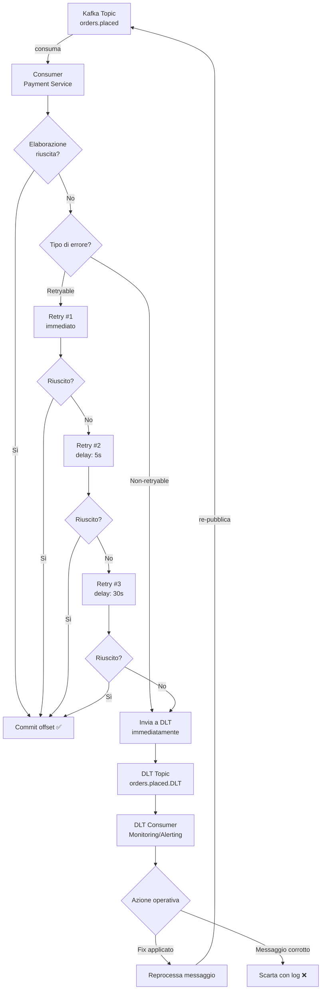

# Dead Letter Queue (DLQ)

## Panoramica

La Dead Letter Queue (DLQ), chiamata anche Dead Letter Topic (DLT) nell'ecosistema Kafka, è un topic separato dove vengono instradati i messaggi che il consumer non riesce a processare dopo un numero configurabile di tentativi. Senza una DLQ, un messaggio che causa un'eccezione non gestita blocca la partizione del consumer per sempre (poison pill), impedendo il processamento di tutti i messaggi successivi. La DLQ risolve questo problema spostando il messaggio problematico fuori dal flusso principale, permettendo al consumer di continuare e fornendo al team operativo un'area dedicata per ispezionare, correggere e reprocessare i messaggi falliti. Il pattern è quasi obbligatorio in qualsiasi sistema Kafka in produzione; l'unica alternativa accettabile è lo skip del messaggio (con log dell'errore), accettando la perdita di dati — accettabile solo per casi d'uso non critici.

## Concetti Chiave

### Cause Comuni di Failure

| Categoria | Esempio | Tipo |
|-----------|---------|------|
| **Deserializzazione** | Schema incompatibile, JSON malformato | Non-retryable |
| **Validazione** | Campo obbligatorio mancante, valore fuori range | Non-retryable |
| **Business logic** | Ordine già annullato, stato inconsistente | Non-retryable (spesso) |
| **Dipendenza downstream** | DB temporaneamente irraggiungibile, timeout HTTP | Retryable |
| **Rate limiting** | API esterna restituisce 429 | Retryable con backoff |
| **Errore di concorrenza** | Optimistic lock failure | Retryable |

### Naming Convention DLT

La convenzione Spring Kafka è aggiungere `.DLT` al nome del topic sorgente:

```
Topic sorgente:  orders.placed
DLT:             orders.placed.DLT

Topic sorgente:  payments.processed
DLT:             payments.processed.DLT
```

Per sistemi con retry intermedi, è comune avere topic di retry:
```
orders.placed                 ← topic principale
orders.placed.RETRY-0         ← primo retry (delay: 5s)
orders.placed.RETRY-1         ← secondo retry (delay: 30s)
orders.placed.RETRY-2         ← terzo retry (delay: 5m)
orders.placed.DLT             ← dead letter (dopo tutti i retry)
```

### Headers DLT Standard

Quando un messaggio viene inviato alla DLQ, Spring Kafka aggiunge automaticamente headers con i metadati dell'errore:

| Header | Contenuto | Esempio |
|--------|-----------|---------|
| `kafka_dlt-original-topic` | Topic sorgente | `orders.placed` |
| `kafka_dlt-original-partition` | Partizione sorgente | `3` |
| `kafka_dlt-original-offset` | Offset sorgente | `12345` |
| `kafka_dlt-original-timestamp` | Timestamp originale | `1740304800000` |
| `kafka_dlt-exception-fqcn` | Classe eccezione | `java.lang.NullPointerException` |
| `kafka_dlt-exception-message` | Messaggio eccezione | `customerId cannot be null` |
| `kafka_dlt-exception-stacktrace` | Stack trace completo | `...` |

### Retry Policy

```
Messaggio ricevuto
        ↓
Elaborazione fallisce
        ↓
Retry immediato (1-3 volte, ms)
        ↓
Errore persiste?
        ↓
    Sì → Delayed retry (backoff esponenziale)
        ↓
    Ancora errore?
        ↓
    Sì → Dead Letter Topic (DLT)
```

## Come Funziona

### Flusso Completo con Retry e DLT



### Architettura con Retry Topic

```mermaid
flowchart LR
    T0[orders.placed] -->|consume| C0["Consumer Group\npayment-service"]
    C0 -->|retry| T1["orders.placed.RETRY-0\ndelay: 5s"]
    T1 -->|consume| C1["Retry Consumer\npayment-service-retry-0"]
    C1 -->|retry| T2["orders.placed.RETRY-1\ndelay: 30s"]
    T2 -->|consume| C2["Retry Consumer\npayment-service-retry-1"]
    C2 -->|fail definitivo| T3[orders.placed.DLT]
    T3 -->|consume| C3["DLT Consumer\nmonitoring-service"]
```



## Implementazione con Kafka

### Configurazione Spring Kafka con DeadLetterPublishingRecoverer

```java
@Configuration
@Slf4j
public class KafkaErrorHandlingConfig {

    @Bean
    public DefaultErrorHandler errorHandler(
            KafkaTemplate<Object, Object> kafkaTemplate) {

        // ─── Dead Letter Publishing Recoverer ─────────────────────────────────
        // Pubblica il messaggio fallito sul topic <original-topic>.DLT
        DeadLetterPublishingRecoverer recoverer = new DeadLetterPublishingRecoverer(
            kafkaTemplate,
            // Funzione di routing: (record, exception) → TopicPartition del DLT
            (record, ex) -> {
                String dltTopic = record.topic() + ".DLT";
                // Stessa partizione del topic sorgente per preservare l'ordine
                return new TopicPartition(dltTopic, record.partition());
            }
        );

        // Aggiunge header personalizzati al messaggio DLT
        recoverer.setHeadersFunction((record, ex) -> {
            Map<String, Object> headers = new HashMap<>();
            headers.put("dlt-service-name", "payment-service");
            headers.put("dlt-environment", "production");
            headers.put("dlt-timestamp-utc", Instant.now().toString());
            return new MapHeaders(headers);
        });

        // ─── Retry Policy — backoff esponenziale ──────────────────────────────
        ExponentialBackOffWithMaxRetries backOff = new ExponentialBackOffWithMaxRetries(3);
        backOff.setInitialInterval(1_000L);    // 1 secondo
        backOff.setMultiplier(2.0);            // 1s → 2s → 4s
        backOff.setMaxInterval(10_000L);       // max 10 secondi

        DefaultErrorHandler errorHandler = new DefaultErrorHandler(recoverer, backOff);

        // ─── Eccezioni non-retryable → DLT immediata ─────────────────────────
        errorHandler.addNotRetryableExceptions(
            DeserializationException.class,         // JSON malformato
            MessageConversionException.class,       // schema incompatibile
            MethodArgumentNotValidException.class,  // validazione fallita
            BusinessRuleViolationException.class,   // logica di business
            DataIntegrityViolationException.class   // constraint DB (non è transient)
        );

        // ─── Eccezioni retryable ──────────────────────────────────────────────
        // (tutte le altre vengono ritentate per default)

        // Log dettagliato di ogni tentativo fallito
        errorHandler.setRetryListeners(new RetryListener() {
            @Override
            public void failedDelivery(ConsumerRecord<?, ?> record,
                                       Exception ex,
                                       int deliveryAttempt) {
                log.warn("Tentativo {} fallito per topic={}, partition={}, offset={}: {}",
                    deliveryAttempt,
                    record.topic(),
                    record.partition(),
                    record.offset(),
                    ex.getMessage());
            }

            @Override
            public void recovered(ConsumerRecord<?, ?> record, Exception ex) {
                log.error("Messaggio inviato a DLT dopo {} tentativi — topic={}, partition={}, offset={}",
                    3, record.topic(), record.partition(), record.offset(), ex);
            }

            @Override
            public void recoveryFailed(ConsumerRecord<?, ?> record,
                                       Exception original,
                                       Exception failure) {
                log.error("CRITICO: Impossibile inviare messaggio a DLT! topic={}, partition={}, offset={}",
                    record.topic(), record.partition(), record.offset(), failure);
                // Alert critico: il messaggio è perso
                alertService.sendCriticalAlert("DLT write failed", record, failure);
            }
        });

        return errorHandler;
    }

    @Bean
    public ConcurrentKafkaListenerContainerFactory<?, ?> kafkaListenerContainerFactory(
            ConsumerFactory<Object, Object> consumerFactory,
            DefaultErrorHandler errorHandler) {

        ConcurrentKafkaListenerContainerFactory<Object, Object> factory =
            new ConcurrentKafkaListenerContainerFactory<>();

        factory.setConsumerFactory(consumerFactory);
        factory.setCommonErrorHandler(errorHandler);
        factory.getContainerProperties().setAckMode(ContainerProperties.AckMode.RECORD);

        return factory;
    }
}
```

### Consumer Principale

```java
@Service
@Slf4j
public class PaymentEventConsumer {

    private final PaymentService paymentService;

    @KafkaListener(
        topics = "orders.placed",
        groupId = "payment-service",
        containerFactory = "kafkaListenerContainerFactory"
    )
    public void handleOrderPlaced(
            @Payload OrderPlacedEvent event,
            @Header(KafkaHeaders.RECEIVED_TOPIC) String topic,
            @Header(KafkaHeaders.RECEIVED_PARTITION) int partition,
            @Header(KafkaHeaders.OFFSET) long offset) {

        log.info("Elaborazione evento OrderPlaced: orderId={}, topic={}, partition={}, offset={}",
            event.getData().getOrderId(), topic, partition, offset);

        // Validazione — se fallisce → DeserializationException → DLT immediata
        validateEvent(event);

        try {
            // Logica di business
            paymentService.initiatePayment(
                event.getData().getOrderId(),
                event.getData().getCustomerId(),
                event.getData().getTotalAmount()
            );

            log.info("Pagamento avviato per orderId={}", event.getData().getOrderId());

        } catch (InsufficientFundsException e) {
            // Errore di business non recuperabile → throw per DLT immediata
            throw new BusinessRuleViolationException(
                "Fondi insufficienti per orderId=" + event.getData().getOrderId(), e);

        } catch (PaymentGatewayTimeoutException e) {
            // Errore transitorio → throw per retry con backoff
            log.warn("Timeout gateway pagamento per orderId={}, tentativo di retry",
                event.getData().getOrderId());
            throw e; // Spring Kafka gestirà il retry

        } catch (Exception e) {
            log.error("Errore inatteso per orderId={}", event.getData().getOrderId(), e);
            throw e;
        }
    }

    private void validateEvent(OrderPlacedEvent event) {
        if (event.getData() == null) {
            throw new MessageConversionException("Payload nullo nell'evento");
        }
        if (event.getData().getOrderId() == null || event.getData().getOrderId().isBlank()) {
            throw new MessageConversionException("orderId mancante nell'evento");
        }
        if (event.getData().getTotalAmount() == null ||
            event.getData().getTotalAmount().compareTo(BigDecimal.ZERO) <= 0) {
            throw new MessageConversionException("totalAmount non valido nell'evento");
        }
    }
}
```

### DLT Consumer — Monitoring e Alerting

```java
@Service
@Slf4j
public class DltMonitoringConsumer {

    private final AlertService alertService;
    private final DltMessageRepository dltRepository;
    private final MeterRegistry meterRegistry;

    @KafkaListener(
        topicPattern = ".*\\.DLT",   // sottoscrive tutti i DLT topic
        groupId = "dlt-monitoring",
        containerFactory = "dltListenerContainerFactory"
    )
    public void handleDltMessage(
            ConsumerRecord<String, String> record,
            @Header(value = "kafka_dlt-original-topic", required = false) String originalTopic,
            @Header(value = "kafka_dlt-exception-fqcn", required = false) String exceptionClass,
            @Header(value = "kafka_dlt-exception-message", required = false) String exceptionMessage,
            @Header(value = "kafka_dlt-original-offset", required = false) Long originalOffset,
            @Header(value = "kafka_dlt-original-partition", required = false) Integer originalPartition) {

        log.error("MESSAGGIO IN DLT — topic={}, originalTopic={}, partition={}, offset={}, " +
                  "exception={}: {}",
            record.topic(), originalTopic, originalPartition, originalOffset,
            exceptionClass, exceptionMessage);

        // 1. Persisti il messaggio DLT nel DB per analisi e reprocessing
        DltMessage dltMessage = DltMessage.builder()
            .id(UUID.randomUUID().toString())
            .dltTopic(record.topic())
            .originalTopic(originalTopic)
            .originalPartition(originalPartition)
            .originalOffset(originalOffset)
            .messageKey(record.key())
            .messagePayload(record.value())
            .exceptionClass(exceptionClass)
            .exceptionMessage(exceptionMessage)
            .receivedAt(Instant.now())
            .status(DltStatus.PENDING_REVIEW)
            .build();

        dltRepository.save(dltMessage);

        // 2. Metriche
        meterRegistry.counter("kafka.dlt.messages",
            "topic", originalTopic != null ? originalTopic : "unknown",
            "exception", exceptionClass != null ? simplifyClassName(exceptionClass) : "unknown"
        ).increment();

        // 3. Alert (Slack, PagerDuty, email)
        alertService.sendDltAlert(dltMessage);
    }

    private String simplifyClassName(String fqcn) {
        int lastDot = fqcn.lastIndexOf('.');
        return lastDot >= 0 ? fqcn.substring(lastDot + 1) : fqcn;
    }
}
```

### Reprocessing dei Messaggi dal DLT

```java
@Service
@Slf4j
public class DltReprocessingService {

    private final DltMessageRepository dltRepository;
    private final KafkaTemplate<String, String> kafkaTemplate;

    /**
     * Reprocessa un messaggio DLT ri-pubblicandolo sul topic originale.
     * Da invocare dopo aver corretto la causa del fallimento.
     */
    @Transactional
    public void reprocessMessage(String dltMessageId) {
        DltMessage dltMessage = dltRepository.findById(dltMessageId)
            .orElseThrow(() -> new DltMessageNotFoundException(dltMessageId));

        if (dltMessage.getStatus() == DltStatus.REPROCESSED) {
            log.warn("Messaggio {} già reprocessato, skip", dltMessageId);
            return;
        }

        log.info("Reprocessando messaggio {} da DLT → {}",
            dltMessageId, dltMessage.getOriginalTopic());

        try {
            // Ri-pubblica sul topic originale con tutti gli headers originali
            kafkaTemplate.send(
                dltMessage.getOriginalTopic(),
                dltMessage.getMessageKey(),
                dltMessage.getMessagePayload()
            ).get(10, TimeUnit.SECONDS);

            dltMessage.setStatus(DltStatus.REPROCESSED);
            dltMessage.setReprocessedAt(Instant.now());
            dltRepository.save(dltMessage);

            log.info("Messaggio {} reprocessato con successo", dltMessageId);

        } catch (Exception e) {
            log.error("Errore reprocessing messaggio {}: {}", dltMessageId, e.getMessage());
            throw new DltReprocessingException("Reprocessing fallito", e);
        }
    }

    /**
     * Reprocessa in batch tutti i messaggi PENDING_REVIEW di un topic specifico.
     */
    @Transactional
    public ReprocessingResult reprocessBatch(String originalTopic, int limit) {
        List<DltMessage> messages = dltRepository
            .findByOriginalTopicAndStatus(originalTopic, DltStatus.PENDING_REVIEW,
                PageRequest.of(0, limit));

        int success = 0, failed = 0;

        for (DltMessage msg : messages) {
            try {
                reprocessMessage(msg.getId());
                success++;
            } catch (Exception e) {
                log.error("Fallito reprocessing messaggio {}: {}", msg.getId(), e.getMessage());
                failed++;
            }
        }

        log.info("Reprocessing batch completato: {}/{} messaggi riusciti, {} falliti",
            success, messages.size(), failed);

        return new ReprocessingResult(success, failed, messages.size());
    }
}
```

### Configurazione Topic DLT

```yaml
# Configurazione topic DLT in kafka-topics.yml
topics:
  orders-placed-dlt:
    name: orders.placed.DLT
    partitions: 12          # stesse partizioni del topic sorgente
    replication-factor: 3
    configs:
      retention.ms: 2592000000  # 30 giorni (molto più lungo del topic normale)
      cleanup.policy: delete
      min.insync.replicas: 2

  payments-processed-dlt:
    name: payments.processed.DLT
    partitions: 6
    replication-factor: 3
    configs:
      retention.ms: 2592000000
      cleanup.policy: delete
      min.insync.replicas: 2
```

## Best Practices

### Pattern Consigliati

!!! tip "Distinguere errori retryable da non-retryable"
    Non tutti gli errori si risolvono con il retry. Un JSON malformato non migliorerà con il tempo; un timeout di rete potrebbe risolversi. Classificare esplicitamente le eccezioni e configurare `addNotRetryableExceptions` di conseguenza.

!!! tip "Sempre persistere i messaggi DLT"
    Il DLT consumer deve salvare ogni messaggio in un database persistente prima di fare qualsiasi altra cosa. Perché: il topic DLT potrebbe essere cancellato per errore, e il messaggio nel DB è l'unica copia di recovery.

!!! tip "Aggiungere headers custom al DLT"
    Oltre agli headers standard di Spring Kafka, aggiungere: nome del servizio, ambiente (prod/staging), versione del servizio al momento del fallimento. Questi facilitano il debugging post-mortem.

!!! tip "Monitoring e alerting obbligatori"
    Ogni messaggio in DLT è un anomalia operativa. Configurare alert su:
    - Tasso di messaggi DLT > soglia (es. 0.1% del throughput)
    - Numero assoluto di messaggi DLT > soglia
    - Messaggi DLT non processati da > 24h

!!! tip "Retry topic con delay tramite Kafka Headers"
    Per implementare delay nei retry senza topic separati, usare un header `retry-after` e il consumer verifica: se `now < retry-after`, ri-pubblica e fai acknowledgment; altrimenti elabora.

### Anti-Pattern da Evitare

!!! warning "Ignorare la DLQ in produzione"
    Una DLQ che cresce senza essere monitorata è un indicatore di un problema sistemico non rilevato. In produzione, la DLQ deve avere alert attivi che notificano il team di on-call.

!!! warning "Reprocessare senza correggere la causa"
    Reprocessare un messaggio dalla DLQ senza prima correggere il bug che ha causato il fallimento farà finire nuovamente il messaggio in DLQ. Correggere prima, reprocessare poi.

!!! warning "DLQ come sostituto del debugging"
    La DLQ è una rete di sicurezza, non un meccanismo per nascondere i problemi. Ogni messaggio in DLQ deve essere investigato. Usare i metadati degli headers per capire la causa root.

!!! warning "Retention troppo breve sul DLT"
    Se il DLT ha la stessa retention del topic sorgente (es. 7 giorni), i messaggi potrebbero scadere prima che il team possa investigare e reprocessare. Usare almeno 30 giorni per i DLT.

## Troubleshooting

### Consumer Bloccato su Poison Pill

**Sintomo:** Un consumer group non avanza, il lag cresce all'infinito.

**Diagnosi:**
```bash
# Identifica la partizione bloccata
kafka-consumer-groups.sh \
  --bootstrap-server kafka:9092 \
  --describe \
  --group payment-service

# Cerca la partizione con lag crescente e current-offset fermo
# PARTITION  CURRENT-OFFSET  LOG-END-OFFSET  LAG
#     0           5000            5001         1   ← bloccata qui

# Ispeziona il messaggio all'offset bloccato
kafka-console-consumer.sh \
  --bootstrap-server kafka:9092 \
  --topic orders.placed \
  --partition 0 \
  --offset 5000 \
  --max-messages 1
```

**Soluzione:** Se il messaggio è irrecuperabile e non si usa la DLQ, è necessario skipparla manualmente avanzando l'offset:
```bash
# ATTENZIONE: questo salta il messaggio senza elaborarlo
kafka-consumer-groups.sh \
  --bootstrap-server kafka:9092 \
  --group payment-service \
  --reset-offsets \
  --to-offset 5001 \
  --topic orders.placed:0 \
  --execute
```

### DLT Non Viene Popolata

**Sintomo:** I messaggi falliti non arrivano nel DLT topic.

**Cause comuni:**
1. Il topic DLT non esiste → crearlo con la naming convention corretta
2. Il consumer non usa il `DefaultErrorHandler` configurato correttamente → verificare la factory
3. Il producer DLT non ha permessi di scrittura → verificare le ACL Kafka

**Verifica:**
```bash
# Verifica esistenza topic DLT
kafka-topics.sh --bootstrap-server kafka:9092 --list | grep DLT

# Verifica messaggi nel DLT
kafka-console-consumer.sh \
  --bootstrap-server kafka:9092 \
  --topic orders.placed.DLT \
  --from-beginning \
  --max-messages 5 \
  --property print.headers=true
```

### Messaggi DLT Non Reprocessabili

**Sintomo:** Il reprocessing fallisce con lo stesso errore.

**Causa:** La causa del fallimento originale non è stata corretta.

**Soluzione:**
1. Analizzare gli headers `kafka_dlt-exception-*` del messaggio DLT
2. Correggere il bug o la configurazione nel servizio consumer
3. Fare deploy del fix
4. Verificare con un messaggio di test
5. Poi reprocessare la DLQ in batch

## Riferimenti

- [Spring Kafka — Dead-letter Topic](https://docs.spring.io/spring-kafka/docs/current/reference/html/#dead-letters)
- [Confluent — Error Handling in Kafka](https://www.confluent.io/blog/kafka-consumer-multi-threaded-messaging/)
- [Spring Kafka — DefaultErrorHandler](https://docs.spring.io/spring-kafka/docs/current/api/org/springframework/kafka/listener/DefaultErrorHandler.html)
- [DeadLetterPublishingRecoverer JavaDoc](https://docs.spring.io/spring-kafka/docs/current/api/org/springframework/kafka/listener/DeadLetterPublishingRecoverer.html)
- [Pattern: Dead Letter Channel — Enterprise Integration Patterns](https://www.enterpriseintegrationpatterns.com/patterns/messaging/DeadLetterChannel.html)
