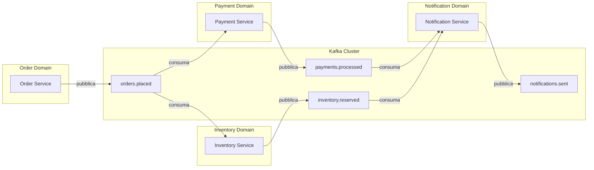

# Event-Driven Architecture

## Panoramica

L'Event-Driven Architecture (EDA) è un paradigma architetturale in cui i componenti di un sistema comunicano attraverso la produzione, il routing e il consumo di eventi. A differenza delle architetture request-reply tradizionali, il produttore di un evento non sa chi lo consumerà né quando: questa caratteristica è la fonte principale sia del vantaggio (disaccoppiamento temporale e logico) sia della complessità (debugging, tracing, eventual consistency). EDA si applica idealmente a sistemi distribuiti con molti microservizi che devono reagire a cambiamenti di stato senza creare dipendenze dirette tra loro. Non va usata quando la semplicità del request-reply sincrono è sufficiente, o quando la consistenza forte immediata è un requisito non negoziabile.

## Concetti Chiave

### Tipologie di Evento

| Tipo | Descrizione | Esempio |
|------|-------------|---------|
| **Domain Event** | Fatto accaduto nel dominio di business | `OrderPlaced`, `PaymentConfirmed` |
| **Integration Event** | Evento pubblicato per comunicare con altri bounded context | `OrderShipped` (notifica a sistemi esterni) |
| **Command Event** | Istruzione di eseguire un'azione (ibrido, usare con cautela) | `ProcessPayment` |

### Componenti Fondamentali

- **Event Producer**: servizio che genera e pubblica eventi su un topic Kafka
- **Event Broker**: Kafka, responsabile del routing, della persistenza e della delivery degli eventi
- **Event Consumer**: servizio che sottoscrive topic e reagisce agli eventi
- **Topic**: canale logico su Kafka, partizionato e replicato
- **Event Schema**: contratto strutturale dell'evento (Avro, JSON Schema, Protobuf)
- **Schema Registry**: repository centrale degli schemi, garantisce la compatibilità

### Modelli di Comunicazione a Confronto

| Modello | Accoppiamento | Latenza | Scalabilità | Consistenza |
|---------|--------------|---------|-------------|-------------|
| Request-Reply sincrono (REST/gRPC) | Alto | Bassa | Limitata | Forte |
| Pub-Sub tradizionale | Medio | Media | Alta | Eventual |
| **Event-Driven (Kafka)** | **Basso** | **Media/Alta** | **Molto alta** | **Eventual** |

## Come Funziona

### Flusso di Comunicazione tra Microservizi



### Ciclo di Vita di un Evento

1. **Generazione**: il servizio produce un evento come risultato di una mutazione di stato
2. **Pubblicazione**: l'evento viene serializzato e scritto su un topic Kafka con una chiave di partizione
3. **Persistenza**: Kafka persiste l'evento nel log (retention configurabile)
4. **Routing**: Kafka distribuisce l'evento alle partizioni in base alla chiave
5. **Consumo**: i consumer group sottoscritti leggono l'evento dalla loro partizione
6. **Elaborazione**: ogni consumer elabora l'evento in modo indipendente
7. **Commit**: il consumer esegue il commit dell'offset dopo l'elaborazione

## Implementazione con Kafka

### Struttura di un Evento JSON ben Strutturato

```json
{
  "eventId": "550e8400-e29b-41d4-a716-446655440000",
  "eventType": "order.placed",
  "eventVersion": "1.0",
  "timestamp": "2026-02-23T10:30:00.000Z",
  "source": "order-service",
  "correlationId": "req-abc123",
  "causationId": null,
  "dataContentType": "application/json",
  "data": {
    "orderId": "ORD-2026-001",
    "customerId": "CUST-456",
    "items": [
      {
        "productId": "PROD-789",
        "quantity": 2,
        "unitPrice": 29.99,
        "currency": "EUR"
      }
    ],
    "totalAmount": 59.98,
    "currency": "EUR",
    "shippingAddress": {
      "street": "Via Roma 1",
      "city": "Milano",
      "postalCode": "20100",
      "country": "IT"
    }
  },
  "metadata": {
    "userId": "user-789",
    "tenantId": "tenant-001",
    "environment": "production"
  }
}
```

### Producer con Spring Kafka

```java
@Service
@Slf4j
public class OrderEventPublisher {

    private final KafkaTemplate<String, OrderEvent> kafkaTemplate;
    private final ObjectMapper objectMapper;

    private static final String TOPIC_ORDERS_PLACED = "orders.placed";

    public OrderEventPublisher(KafkaTemplate<String, OrderEvent> kafkaTemplate,
                               ObjectMapper objectMapper) {
        this.kafkaTemplate = kafkaTemplate;
        this.objectMapper = objectMapper;
    }

    public void publishOrderPlaced(Order order) {
        OrderPlacedEvent event = OrderPlacedEvent.builder()
            .eventId(UUID.randomUUID().toString())
            .eventType("order.placed")
            .eventVersion("1.0")
            .timestamp(Instant.now())
            .source("order-service")
            .data(OrderData.from(order))
            .build();

        // La chiave di partizione garantisce l'ordine per stesso orderId
        String partitionKey = order.getCustomerId();

        kafkaTemplate.send(TOPIC_ORDERS_PLACED, partitionKey, event)
            .whenComplete((result, ex) -> {
                if (ex != null) {
                    log.error("Fallita pubblicazione evento {} per orderId={}",
                        event.getEventId(), order.getId(), ex);
                    throw new EventPublishingException("Impossibile pubblicare evento", ex);
                }
                log.info("Evento {} pubblicato su partizione {}, offset {}",
                    event.getEventId(),
                    result.getRecordMetadata().partition(),
                    result.getRecordMetadata().offset());
            });
    }
}
```

### Consumer con Spring Kafka

```java
@Service
@Slf4j
public class OrderEventConsumer {

    private final PaymentService paymentService;

    @KafkaListener(
        topics = "orders.placed",
        groupId = "payment-service",
        containerFactory = "kafkaListenerContainerFactory"
    )
    public void handleOrderPlaced(
            @Payload OrderPlacedEvent event,
            @Header(KafkaHeaders.RECEIVED_PARTITION) int partition,
            @Header(KafkaHeaders.OFFSET) long offset,
            Acknowledgment acknowledgment) {

        log.info("Ricevuto evento {} da partizione={}, offset={}",
            event.getEventId(), partition, offset);

        try {
            paymentService.initiatePayment(event.getData());
            acknowledgment.acknowledge(); // commit manuale dopo elaborazione
        } catch (NonRetryableException e) {
            log.error("Errore non recuperabile per evento {}: {}", event.getEventId(), e.getMessage());
            acknowledgment.acknowledge(); // commit per non bloccare la partizione
            // inviare a DLQ separatamente
        } catch (RetryableException e) {
            log.warn("Errore recuperabile per evento {}, non eseguito commit", event.getEventId());
            // non fare acknowledge → Kafka riprocesserà il messaggio
            throw e;
        }
    }
}
```

### Configurazione Kafka Producer

```yaml
spring:
  kafka:
    producer:
      bootstrap-servers: kafka-broker-1:9092,kafka-broker-2:9092,kafka-broker-3:9092
      key-serializer: org.apache.kafka.common.serialization.StringSerializer
      value-serializer: io.confluent.kafka.serializers.KafkaAvroSerializer
      acks: all                    # attendere conferma da tutti i replica in-sync
      retries: 3
      retry-backoff-ms: 1000
      enable-idempotence: true     # garanzia exactly-once lato producer
      max-in-flight-requests-per-connection: 5
      compression-type: snappy
      properties:
        schema.registry.url: http://schema-registry:8081

    consumer:
      bootstrap-servers: kafka-broker-1:9092,kafka-broker-2:9092,kafka-broker-3:9092
      group-id: payment-service
      auto-offset-reset: earliest
      enable-auto-commit: false    # commit manuale per controllo fine
      key-deserializer: org.apache.kafka.common.serialization.StringDeserializer
      value-deserializer: io.confluent.kafka.serializers.KafkaAvroDeserializer
      max-poll-records: 100
      properties:
        schema.registry.url: http://schema-registry:8081
        specific.avro.reader: true
```

## Best Practices

### Pattern Consigliati

!!! tip "Evento come fatto immutabile"
    Un evento descrive qualcosa che **è accaduto**, non qualcosa che **deve accadere**. Usare il passato: `OrderPlaced`, non `PlaceOrder`. I comandi appartengono a un pattern diverso (Command-Driven).

!!! tip "Chiave di partizione significativa"
    Scegliere la chiave di partizione in modo che eventi correlati vadano sulla stessa partizione, garantendo l'ordinamento. Per gli ordini: `customerId` o `orderId`. Non usare mai chiavi casuali se l'ordine conta.

!!! tip "Schema versionato e retrocompatibile"
    Usare Avro con Schema Registry. Seguire le regole di compatibilità backward/forward: aggiungere solo campi opzionali con default, mai rimuovere campi necessari.

!!! tip "Idempotenza nei consumer"
    Ogni consumer deve essere idempotente: processare lo stesso evento più volte deve produrre lo stesso risultato. Tracciare gli `eventId` già processati in un registro.

### Anti-Pattern da Evitare

!!! warning "Event sourcing confuso con EDA"
    EDA è un pattern architetturale di comunicazione. Event Sourcing è un pattern di persistenza. Sono complementari ma distinti. Non confonderli.

!!! warning "Payload troppo grandi"
    Non includere tutto il dato nel payload dell'evento. Per dati voluminosi, usare il pattern **Event Carried State Transfer** solo quando necessario, oppure includere solo l'ID e lasciare che il consumer faccia fetch.

!!! warning "Logica di routing nel broker"
    Kafka non è un ESB (Enterprise Service Bus). Evitare di mettere logica di business nel routing. La logica deve stare nei consumer.

!!! warning "Accoppiamento implicito tramite schema"
    Cambiare lo schema di un evento senza versionamento può rompere tutti i consumer silenziosamente. Sempre Schema Registry + compatibilità verificata in CI.

## Troubleshooting

### Consumer Lag Elevato

**Sintomo:** I consumer non riescono a stare al passo con i producer.

**Diagnosi:**
```bash
# Verificare il lag per consumer group
kafka-consumer-groups.sh \
  --bootstrap-server kafka:9092 \
  --describe \
  --group payment-service

# Output atteso per ogni partizione:
# PARTITION  CURRENT-OFFSET  LOG-END-OFFSET  LAG
#     0           1000            1500       500   ← lag elevato
```

**Soluzioni:**
1. Aumentare le partizioni del topic (richiede ridistribuzione)
2. Aumentare le istanze del consumer (fino al numero di partizioni)
3. Ottimizzare la logica di elaborazione (batching, cache)
4. Verificare se ci sono messaggi "veleni" (poison pill) che bloccano la partizione

### Messaggi Duplicati

**Sintomo:** Lo stesso evento viene processato più volte.

**Causa:** At-least-once delivery è il default di Kafka. Un commit perso dopo elaborazione causa la ri-lettura.

**Soluzione:**
```java
// Tracciare gli eventId già processati in Redis o DB
@Service
public class IdempotentEventProcessor {

    private final RedisTemplate<String, Boolean> redis;

    public boolean isAlreadyProcessed(String eventId) {
        return Boolean.TRUE.equals(redis.hasKey("processed:" + eventId));
    }

    public void markAsProcessed(String eventId) {
        redis.opsForValue().set(
            "processed:" + eventId,
            true,
            Duration.ofDays(7) // TTL ragionevole
        );
    }
}
```

### Ordering non Garantito

**Sintomo:** Gli eventi vengono consumati in ordine diverso da quello di produzione.

**Causa:** Partizioni diverse non garantiscono ordine globale. Solo all'interno della stessa partizione.

**Soluzione:** Verificare che tutti gli eventi correlati usino la stessa chiave di partizione. Se l'ordine globale è critico, considerare un solo topic con una sola partizione (sacrificando la scalabilità).

## Riferimenti

- [Apache Kafka Documentation](https://kafka.apache.org/documentation/)
- [Confluent Event-Driven Microservices](https://www.confluent.io/event-driven-microservices/)
- [CloudEvents Specification](https://cloudevents.io/)
- [Designing Event-Driven Systems — Ben Stopford (free ebook)](https://www.confluent.io/designing-event-driven-systems/)
- [Pattern: Event-driven architecture — microservices.io](https://microservices.io/patterns/data/event-driven-architecture.html)
