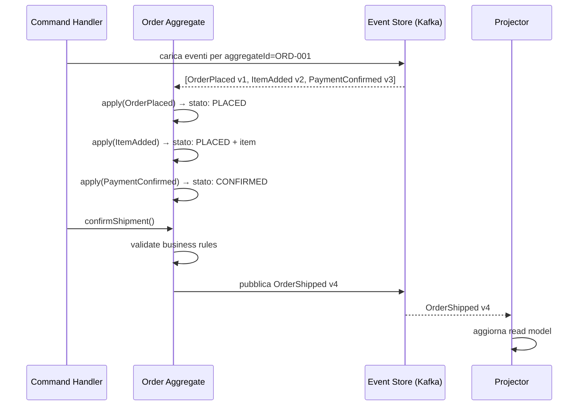
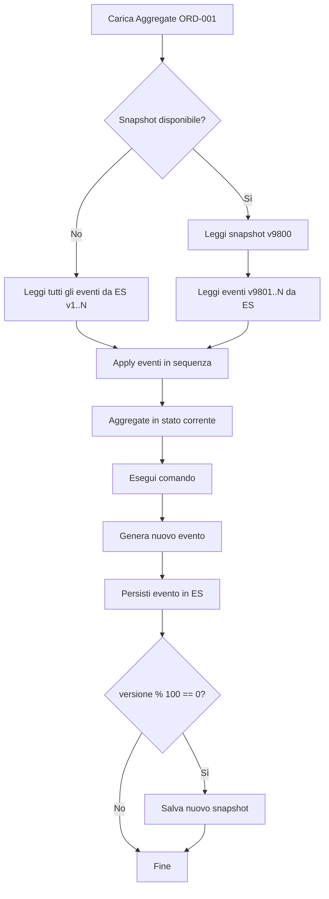

# Event Sourcing

## Panoramica

Event Sourcing è un pattern di persistenza in cui lo stato di un'entità di dominio non viene salvato come snapshot corrente (CRUD tradizionale), ma come sequenza immutabile di eventi che rappresentano ogni mutazione avvenuta nel tempo. Per conoscere lo stato corrente di un'entità, si riproducono tutti gli eventi dalla sua storia, applicandoli in ordine. Questo approccio offre un audit trail completo e nativo, la possibilità di ricostruire lo stato a qualsiasi punto nel tempo (time travel debugging), e una naturale compatibilità con l'architettura CQRS. Non va applicato quando la semplicità del CRUD è sufficiente, quando le query richiedono accesso a proiezioni complesse che non giustificano la complessità di gestione, o quando il team non ha familiarità con i paradigmi event-driven.

## Concetti Chiave

### Event Store

L'event store è il database specializzato (o Kafka stesso) in cui vengono persistiti gli eventi in forma immutabile. Ogni evento ha:

| Campo | Descrizione | Esempio |
|-------|-------------|---------|
| `aggregateId` | Identificatore dell'entità | `ORD-2026-001` |
| `aggregateType` | Tipo dell'entità | `Order` |
| `eventId` | UUID univoco dell'evento | `550e8400-...` |
| `eventType` | Nome del tipo di evento | `OrderPlaced` |
| `version` | Versione sequenziale per aggregate | `1`, `2`, `3` |
| `timestamp` | Timestamp di creazione | `2026-02-23T10:00:00Z` |
| `payload` | Dati dell'evento serializzati | `{ "orderId": ... }` |
| `metadata` | Informazioni di contesto | `{ "userId": "u-1" }` |

### Aggregate

L'aggregate è il confine di consistenza che gestisce una sequenza di eventi. Espone:
- **Comandi**: azioni che, se valide, generano nuovi eventi
- **Handler di eventi**: metodi che applicano le mutazioni di stato in base agli eventi
- **Versione corrente**: numero d'ordine dell'ultimo evento applicato

### Snapshot

Dopo molti eventi, il replay diventa costoso. Uno snapshot è una fotografia dello stato dell'aggregate a una versione specifica. Al caricamento, si parte dall'ultimo snapshot e si riproducono solo gli eventi successivi.

```
Senza snapshot: replay di 10.000 eventi → lento
Con snapshot:   snapshot a v9800 + replay di 200 eventi → veloce
```

### CQRS come Pattern Companion

Event Sourcing e CQRS si abbinano naturalmente:
- **Write side**: persiste gli eventi nell'event store (via aggregate)
- **Read side**: consuma gli eventi e costruisce proiezioni ottimizzate per le query

## Come Funziona

### Ricostruzione dello Stato da Eventi



### Flusso con Snapshot



## Implementazione con Kafka

### OrderAggregate — Java

```java
@Aggregate
public class OrderAggregate {

    private String orderId;
    private String customerId;
    private OrderStatus status;
    private List<OrderItem> items;
    private BigDecimal totalAmount;
    private int version;

    // Costruttore vuoto per ricostruzione da eventi
    public OrderAggregate() {
        this.items = new ArrayList<>();
    }

    // ─── COMANDI → generano eventi ───────────────────────────────────────────

    public List<DomainEvent> placeOrder(PlaceOrderCommand cmd) {
        if (this.status != null) {
            throw new IllegalStateException("Ordine già creato");
        }
        validateItems(cmd.getItems());

        return List.of(OrderPlacedEvent.builder()
            .aggregateId(cmd.getOrderId())
            .aggregateType("Order")
            .eventId(UUID.randomUUID().toString())
            .version(this.version + 1)
            .timestamp(Instant.now())
            .payload(OrderPlacedPayload.builder()
                .orderId(cmd.getOrderId())
                .customerId(cmd.getCustomerId())
                .items(cmd.getItems())
                .totalAmount(calculateTotal(cmd.getItems()))
                .build())
            .build());
    }

    public List<DomainEvent> confirmPayment(ConfirmPaymentCommand cmd) {
        if (this.status != OrderStatus.PLACED) {
            throw new IllegalStateException(
                "Pagamento non applicabile in stato: " + this.status);
        }

        return List.of(PaymentConfirmedEvent.builder()
            .aggregateId(this.orderId)
            .aggregateType("Order")
            .eventId(UUID.randomUUID().toString())
            .version(this.version + 1)
            .timestamp(Instant.now())
            .payload(PaymentConfirmedPayload.builder()
                .orderId(this.orderId)
                .transactionId(cmd.getTransactionId())
                .amount(this.totalAmount)
                .build())
            .build());
    }

    // ─── EVENT HANDLERS → mutano lo stato (deterministici, no side effects) ──

    @EventHandler
    public void on(OrderPlacedEvent event) {
        this.orderId = event.getPayload().getOrderId();
        this.customerId = event.getPayload().getCustomerId();
        this.items = new ArrayList<>(event.getPayload().getItems());
        this.totalAmount = event.getPayload().getTotalAmount();
        this.status = OrderStatus.PLACED;
        this.version = event.getVersion();
    }

    @EventHandler
    public void on(PaymentConfirmedEvent event) {
        this.status = OrderStatus.PAYMENT_CONFIRMED;
        this.version = event.getVersion();
    }

    @EventHandler
    public void on(OrderShippedEvent event) {
        this.status = OrderStatus.SHIPPED;
        this.version = event.getVersion();
    }

    // ─── SNAPSHOT SUPPORT ────────────────────────────────────────────────────

    public OrderSnapshot toSnapshot() {
        return OrderSnapshot.builder()
            .aggregateId(this.orderId)
            .version(this.version)
            .timestamp(Instant.now())
            .state(OrderState.builder()
                .orderId(this.orderId)
                .customerId(this.customerId)
                .status(this.status)
                .items(this.items)
                .totalAmount(this.totalAmount)
                .build())
            .build();
    }

    public static OrderAggregate fromSnapshot(OrderSnapshot snapshot) {
        OrderAggregate aggregate = new OrderAggregate();
        aggregate.orderId = snapshot.getState().getOrderId();
        aggregate.customerId = snapshot.getState().getCustomerId();
        aggregate.status = snapshot.getState().getStatus();
        aggregate.items = new ArrayList<>(snapshot.getState().getItems());
        aggregate.totalAmount = snapshot.getState().getTotalAmount();
        aggregate.version = snapshot.getVersion();
        return aggregate;
    }
}
```

### EventStore con Kafka come Backend

```java
@Repository
@Slf4j
public class KafkaEventStore implements EventStore {

    private final KafkaTemplate<String, DomainEvent> kafkaTemplate;
    private final KafkaConsumer<String, DomainEvent> replayConsumer;
    private final SnapshotRepository snapshotRepository;

    private static final String EVENT_STORE_TOPIC = "event-store.orders";

    @Override
    public void append(String aggregateId, List<DomainEvent> events, int expectedVersion) {
        // Verifica ottimistica della versione
        int currentVersion = getLatestVersion(aggregateId);
        if (currentVersion != expectedVersion) {
            throw new OptimisticLockingException(
                String.format("Versione attesa %d, trovata %d per aggregate %s",
                    expectedVersion, currentVersion, aggregateId));
        }

        for (DomainEvent event : events) {
            kafkaTemplate.send(
                EVENT_STORE_TOPIC,
                aggregateId,           // chiave di partizione = aggregateId
                event
            );
        }

        log.info("Appesi {} eventi per aggregate {}", events.size(), aggregateId);
    }

    @Override
    public List<DomainEvent> loadEvents(String aggregateId) {
        return loadEvents(aggregateId, 0);
    }

    @Override
    public List<DomainEvent> loadEvents(String aggregateId, int fromVersion) {
        // In produzione, usare un read model indicizzato per aggregateId
        // Kafka non supporta query per chiave nativamente in modo efficiente
        // Usare una tabella PostgreSQL come event store secondario
        return eventRepository.findByAggregateIdAndVersionGreaterThan(
            aggregateId, fromVersion
        );
    }

    @Override
    public OrderAggregate load(String aggregateId) {
        // 1. Cerca snapshot più recente
        Optional<OrderSnapshot> snapshot = snapshotRepository.findLatest(aggregateId);

        int fromVersion = 0;
        OrderAggregate aggregate;

        if (snapshot.isPresent()) {
            aggregate = OrderAggregate.fromSnapshot(snapshot.get());
            fromVersion = snapshot.get().getVersion();
        } else {
            aggregate = new OrderAggregate();
        }

        // 2. Carica eventi successivi allo snapshot
        List<DomainEvent> events = loadEvents(aggregateId, fromVersion);

        // 3. Applica eventi
        for (DomainEvent event : events) {
            aggregate.apply(event);
        }

        return aggregate;
    }
}
```

### Configurazione Topic Event Store

```yaml
# kafka-topics.yml — configurazione topic event store
topics:
  event-store-orders:
    name: event-store.orders
    partitions: 12           # partizionamento per aggregateId (hash)
    replication-factor: 3
    configs:
      retention.ms: -1       # INFINITO — gli eventi non vanno mai cancellati
      cleanup.policy: delete # NON usare compact: preservare la storia completa
      min.insync.replicas: 2
      compression.type: lz4

  event-store-snapshots:
    name: event-store.snapshots
    partitions: 12
    replication-factor: 3
    configs:
      cleanup.policy: compact  # compact: tenere solo l'ultimo snapshot per chiave
      min.insync.replicas: 2
```

## Best Practices

### Pattern Consigliati

!!! tip "Event handler deterministici"
    Gli event handler (metodi `on(Event)`) devono essere **puri e deterministici**: stessi eventi in input → stesso stato in output. Non fare I/O, non chiamare servizi esterni, non generare numeri casuali all'interno degli handler.

!!! tip "Separare comando da evento"
    Il comando (`PlaceOrderCommand`) contiene l'intenzione. L'evento (`OrderPlacedEvent`) contiene il fatto. La validazione avviene nel comando; l'evento è già validato e non può fallire.

!!! tip "Versionamento degli eventi con upcasting"
    Con il tempo, gli eventi evolvono. Implementare un **upcaster** che trasforma eventi vecchi nella versione corrente durante il replay:
    ```java
    // OrderPlacedEvent v1 → v2 (aggiunto campo currency)
    public OrderPlacedEventV2 upcast(OrderPlacedEventV1 old) {
        return OrderPlacedEventV2.builder()
            .from(old)
            .currency("EUR") // default per eventi storici
            .build();
    }
    ```

!!! tip "Snapshot threshold adattivo"
    Non usare un threshold fisso per i snapshot. Considerare un threshold basato sul tempo di replay misurato: se ricostruire l'aggregate richiede più di X ms, creare uno snapshot.

### Anti-Pattern da Evitare

!!! warning "Evento troppo granulare o troppo grosso"
    Evitare eventi triviali come `OrderFieldUpdated { field: "status", value: "PLACED" }`. Preferire eventi significativi dal punto di vista del dominio: `OrderPlaced`. Non includere l'intero oggetto se cambiano solo pochi campi.

!!! warning "Side effects negli event handler"
    Un errore classico: fare chiamate HTTP o DB all'interno degli event handler. Il replay deve essere deterministico e veloce. I side effects vanno nei command handler, mai negli event handler.

!!! warning "Modificare eventi pubblicati"
    Gli eventi nell'event store sono **immutabili**. Non correggere un evento errato: creare un evento di compensazione (`OrderCancelled` dopo `OrderPlaced` errato).

## Troubleshooting

### Replay Lento

**Sintomo:** Il caricamento dell'aggregate richiede secondi.

**Diagnosi:** Contare il numero di eventi per aggregateId.
```sql
SELECT aggregate_id, COUNT(*) as event_count
FROM event_store
GROUP BY aggregate_id
ORDER BY event_count DESC
LIMIT 10;
```

**Soluzione:**
1. Implementare snapshot se `event_count > 500`
2. Verificare che gli event handler non facciano I/O
3. Considerare un read model dedicato per letture frequenti (CQRS)

### Conflitti di Versione (Optimistic Locking)

**Sintomo:** `OptimisticLockingException` durante l'append di eventi.

**Causa:** Due comandi concorrenti hanno caricato lo stesso aggregate con la stessa versione.

**Soluzione:** Implementare retry con backoff esponenziale per comandi idempotenti.
```java
@Retryable(
    value = OptimisticLockingException.class,
    maxAttempts = 3,
    backoff = @Backoff(delay = 100, multiplier = 2)
)
public void handleCommand(PlaceOrderCommand cmd) {
    // ...
}
```

### Perdita di Ordine degli Eventi

**Sintomo:** L'aggregate si trova in uno stato inconsistente.

**Causa:** La versione sequenziale degli eventi non viene rispettata durante il replay.

**Soluzione:** Verificare che il `loadEvents` ordini sempre per `version ASC` e che non ci siano gap nella sequenza delle versioni.

## Riferimenti

- [Martin Fowler — Event Sourcing](https://martinfowler.com/eaaDev/EventSourcing.html)
- [Axon Framework Documentation](https://docs.axoniq.io/reference-guide/)
- [EventStoreDB Documentation](https://developers.eventstore.com/)
- [Greg Young — CQRS and Event Sourcing (video)](https://www.youtube.com/watch?v=JHGkaShoyNs)
- [Pattern: Event sourcing — microservices.io](https://microservices.io/patterns/data/event-sourcing.html)
