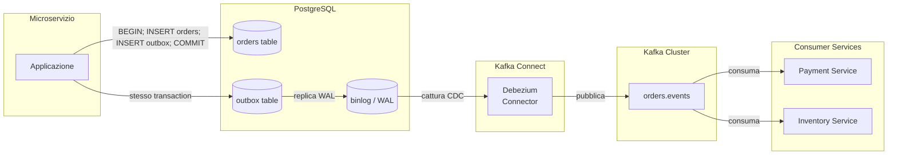

# Outbox Pattern

## Panoramica

Il problema del **dual write** è uno dei più insidiosi nei sistemi distribuiti: un servizio deve aggiornare il proprio database e pubblicare un evento su Kafka in modo atomico, ma non esiste una transazione distribuita che coinvolga entrambi senza ricorrere al 2PC. Se il servizio scrive sul DB e crasha prima di pubblicare su Kafka, lo stato è aggiornato ma l'evento è perso; se pubblica su Kafka e poi crasha prima di scrivere sul DB, l'evento è stato pubblicato ma lo stato non è aggiornato. L'Outbox Pattern risolve questo problema usando una tabella `outbox` nello stesso database applicativo: la scrittura del dato di business e dell'evento nella tabella outbox avviene in una singola transazione ACID locale. Un processo separato (relay) legge la tabella outbox e pubblica gli eventi su Kafka. Il relay più potente è **Debezium**, che usa il Change Data Capture (CDC) per leggere il binlog del database senza polling. L'Outbox Pattern non va usato quando la latenza del CDC (tipicamente < 1 secondo) è inaccettabile, o quando il database non supporta CDC (preferire polling publisher in quel caso).

## Concetti Chiave

### Il Problema: Dual Write

```
❌ APPROCCIO SBAGLIATO — DUAL WRITE

1. Servizio scrive sul DB          [DB: committed ✅]
2. Crash del servizio              [evento perso ❌]
3. Kafka non riceve l'evento       [inconsistenza ❌]

oppure:

1. Servizio pubblica su Kafka      [Kafka: published ✅]
2. Crash del servizio
3. DB non viene aggiornato         [inconsistenza ❌]
```

### La Soluzione: Outbox Table

```
✅ APPROCCIO CORRETTO — OUTBOX PATTERN

Transazione atomica locale:
  BEGIN;
  INSERT INTO orders (...) VALUES (...);        -- write business data
  INSERT INTO outbox (event_type, payload, ...) -- write event to outbox
  COMMIT;                                        -- atomico: entrambi o nessuno

Relay (Debezium/Polling):
  Legge outbox → pubblica su Kafka → marca come "pubblicato"
```

### Debezium vs Polling Publisher

| Aspetto | Debezium (CDC) | Polling Publisher |
|---------|----------------|-------------------|
| **Latenza** | Sub-secondo (binlog) | Dipende da polling interval |
| **Overhead DB** | Basso (legge binlog) | Alto se polling frequente |
| **Complessità** | Elevata (setup Kafka Connect) | Bassa |
| **Scalabilità** | Alta | Limitata (lock su outbox) |
| **DB supportati** | PostgreSQL, MySQL, SQL Server, MongoDB | Qualsiasi |
| **Quando usare** | Produzione ad alto volume | Proof of concept, DB senza CDC |

### Garanzie di Delivery

L'Outbox Pattern garantisce **at-least-once delivery**: un evento potrebbe essere pubblicato su Kafka più volte (es. il relay crasha dopo aver pubblicato ma prima di aver aggiornato l'offset). I consumer devono essere **idempotenti** o deduplicare tramite `eventId`.

## Come Funziona

### Architettura con Debezium CDC



### Schema SQL Tabella Outbox

```sql
-- Tabella outbox per PostgreSQL
CREATE TABLE outbox (
    id              UUID PRIMARY KEY DEFAULT gen_random_uuid(),
    aggregate_type  VARCHAR(255) NOT NULL,   -- es: 'Order'
    aggregate_id    VARCHAR(255) NOT NULL,   -- es: 'ORD-2026-001'
    event_type      VARCHAR(255) NOT NULL,   -- es: 'OrderPlaced'
    event_version   VARCHAR(10)  NOT NULL DEFAULT '1.0',
    payload         JSONB        NOT NULL,   -- corpo dell'evento
    headers         JSONB,                  -- metadata aggiuntivi
    status          VARCHAR(20)  NOT NULL DEFAULT 'PENDING',
    created_at      TIMESTAMPTZ  NOT NULL DEFAULT NOW(),
    published_at    TIMESTAMPTZ,
    error_message   TEXT,
    retry_count     INT          NOT NULL DEFAULT 0
);

-- Indici per il polling publisher (se non si usa Debezium)
CREATE INDEX idx_outbox_status_created
    ON outbox (status, created_at)
    WHERE status = 'PENDING';

CREATE INDEX idx_outbox_aggregate
    ON outbox (aggregate_type, aggregate_id);

-- Indice per Debezium: non necessario, usa il WAL direttamente
COMMENT ON TABLE outbox IS
    'Tabella outbox per Transactional Outbox Pattern. '
    'Non cancellare mai le righe: marcarle come PUBLISHED o usare retention policy.';
```

### Scrittura Atomica con Spring + JPA

```java
@Service
@Slf4j
public class OrderService {

    private final OrderRepository orderRepository;
    private final OutboxRepository outboxRepository;
    private final ObjectMapper objectMapper;

    @Transactional  // CRITICO: tutto in una singola transazione DB
    public Order createOrder(CreateOrderCommand cmd) {
        // 1. Scrittura dato di business
        Order order = Order.builder()
            .orderId(UUID.randomUUID().toString())
            .customerId(cmd.getCustomerId())
            .items(cmd.getItems())
            .totalAmount(calculateTotal(cmd.getItems()))
            .status(OrderStatus.PENDING)
            .createdAt(Instant.now())
            .build();

        orderRepository.save(order);

        // 2. Scrittura evento in outbox — STESSA transazione
        OutboxEntry outboxEntry = OutboxEntry.builder()
            .id(UUID.randomUUID())
            .aggregateType("Order")
            .aggregateId(order.getOrderId())
            .eventType("OrderPlaced")
            .eventVersion("1.0")
            .payload(buildPayload(order))
            .headers(buildHeaders(cmd))
            .status(OutboxStatus.PENDING)
            .createdAt(Instant.now())
            .build();

        outboxRepository.save(outboxEntry);

        log.info("Ordine {} e evento outbox salvati atomicamente", order.getOrderId());
        // Il COMMIT avviene qui → entrambe le scritture o nessuna
        return order;
    }

    private String buildPayload(Order order) {
        try {
            return objectMapper.writeValueAsString(OrderPlacedPayload.builder()
                .orderId(order.getOrderId())
                .customerId(order.getCustomerId())
                .items(order.getItems())
                .totalAmount(order.getTotalAmount())
                .timestamp(order.getCreatedAt())
                .build());
        } catch (JsonProcessingException e) {
            throw new EventSerializationException("Errore serializzazione payload", e);
        }
    }

    private Map<String, String> buildHeaders(CreateOrderCommand cmd) {
        return Map.of(
            "correlationId", cmd.getCorrelationId(),
            "userId", cmd.getUserId(),
            "source", "order-service"
        );
    }
}
```

### Debezium Connector — Configurazione

```json
{
  "name": "orders-outbox-connector",
  "config": {
    "connector.class": "io.debezium.connector.postgresql.PostgresConnector",
    "database.hostname": "postgres-primary",
    "database.port": "5432",
    "database.user": "debezium",
    "database.password": "${file:/opt/kafka/external.properties:db.password}",
    "database.dbname": "orders_db",
    "database.server.name": "orders-db",

    "table.include.list": "public.outbox",
    "plugin.name": "pgoutput",
    "slot.name": "debezium_outbox_slot",

    "transforms": "outbox",
    "transforms.outbox.type": "io.debezium.transforms.outbox.EventRouter",
    "transforms.outbox.table.field.event.id": "id",
    "transforms.outbox.table.field.event.key": "aggregate_id",
    "transforms.outbox.table.field.event.type": "event_type",
    "transforms.outbox.table.field.event.payload": "payload",
    "transforms.outbox.table.field.event.payload.id": "id",
    "transforms.outbox.table.fields.additional.placement": "headers:header:headers",
    "transforms.outbox.route.topic.replacement": "${routedByValue}.events",

    "key.converter": "org.apache.kafka.connect.storage.StringConverter",
    "value.converter": "org.apache.kafka.connect.json.JsonConverter",
    "value.converter.schemas.enable": "false",

    "heartbeat.interval.ms": "5000",
    "publication.autocreate.mode": "filtered",
    "skipped.operations": "u,d"
  }
}
```

### Polling Publisher — Alternativa a Debezium

```java
@Component
@Slf4j
public class OutboxPollingPublisher {

    private final OutboxRepository outboxRepository;
    private final KafkaTemplate<String, String> kafkaTemplate;

    // ─── Polling ogni secondo, batch di 100 messaggi ──────────────────────────

    @Scheduled(fixedDelay = 1000)
    @Transactional
    public void publishPendingEvents() {
        List<OutboxEntry> pendingEntries = outboxRepository
            .findTopByStatusOrderByCreatedAt(OutboxStatus.PENDING, PageRequest.of(0, 100));

        if (pendingEntries.isEmpty()) return;

        log.debug("Trovati {} eventi pendenti da pubblicare", pendingEntries.size());

        for (OutboxEntry entry : pendingEntries) {
            try {
                String topicName = resolveTopicName(entry);

                kafkaTemplate.send(topicName, entry.getAggregateId(), entry.getPayload())
                    .get(5, TimeUnit.SECONDS); // sync per il polling publisher

                entry.setStatus(OutboxStatus.PUBLISHED);
                entry.setPublishedAt(Instant.now());
            } catch (Exception e) {
                log.error("Errore pubblicazione evento {}: {}", entry.getId(), e.getMessage());
                entry.setRetryCount(entry.getRetryCount() + 1);
                entry.setErrorMessage(e.getMessage());

                if (entry.getRetryCount() >= 5) {
                    entry.setStatus(OutboxStatus.FAILED);
                    log.error("Evento {} marcato come FAILED dopo {} tentativi",
                        entry.getId(), entry.getRetryCount());
                }
            }
            outboxRepository.save(entry);
        }
    }

    private String resolveTopicName(OutboxEntry entry) {
        // Routing: aggregate_type → nome topic
        return entry.getAggregateType().toLowerCase() + "s.events";
    }
}
```

### Gestione Deduplicazione lato Consumer

```java
@Service
@Slf4j
public class IdempotentOutboxConsumer {

    private final ProcessedEventRepository processedEventRepository;

    @KafkaListener(topics = "orders.events", groupId = "payment-service")
    @Transactional
    public void consume(
            @Payload String payload,
            @Header("id") String eventId,
            Acknowledgment ack) {

        // Controlla se evento già processato
        if (processedEventRepository.existsByEventId(eventId)) {
            log.warn("Evento {} già processato, skip (deduplicazione outbox)", eventId);
            ack.acknowledge();
            return;
        }

        try {
            processEvent(payload, eventId);

            // Registra evento come processato nella stessa transazione
            processedEventRepository.save(ProcessedEvent.builder()
                .eventId(eventId)
                .processedAt(Instant.now())
                .consumerGroup("payment-service")
                .build());

            ack.acknowledge();
        } catch (Exception e) {
            log.error("Errore processamento evento {}: {}", eventId, e.getMessage());
            throw e; // no ack → retry
        }
    }
}
```

## Best Practices

### Pattern Consigliati

!!! tip "Non cancellare mai la outbox table"
    Marcare gli eventi come `PUBLISHED` e implementare una retention policy (es. DELETE WHERE status='PUBLISHED' AND published_at < NOW() - INTERVAL '7 days'). Cancellare immediatamente potrebbe causare problemi con Debezium che rilegge gli stessi record.

!!! tip "Usare il WAL level corretto"
    Per Debezium con PostgreSQL, impostare `wal_level = logical` nel `postgresql.conf`. Senza questo, il CDC non funziona.
    ```sql
    -- Verifica WAL level
    SHOW wal_level; -- deve essere 'logical'
    ```

!!! tip "Evitare scritture dirette al topic Kafka dall'applicazione"
    Con l'Outbox Pattern, l'applicazione scrive SOLO nel DB. Kafka non viene mai toccato direttamente dall'applicazione. Questo semplifica i test e il debugging.

!!! tip "Monitor replication slot lag (Debezium)"
    Lo slot di replicazione PostgreSQL accumula WAL se Debezium è lento o fermo. Monitorare `pg_replication_slots` per evitare esaurimento del disco.
    ```sql
    SELECT slot_name, active, pg_size_pretty(pg_wal_lsn_diff(
        pg_current_wal_lsn(), confirmed_flush_lsn)) AS lag
    FROM pg_replication_slots;
    ```

### Anti-Pattern da Evitare

!!! warning "Outbox in database separato dal business data"
    La tabella outbox DEVE essere nello stesso database del dato di business. In database separati, l'atomicità si perde e il problema del dual write si ripresenta identico.

!!! warning "Polling con SELECT ... FOR UPDATE senza limite"
    Un polling publisher che non limita il batch può tenere lock sulla tabella outbox per troppo tempo, causando contention con le scritture dell'applicazione. Sempre `LIMIT N`.

!!! warning "Ignorare il lag dello slot di replicazione"
    Uno slot Debezium inattivo causa accumulo di WAL senza limite. Implementare un alert se il lag supera 1 GB.

## Troubleshooting

### Debezium Non Legge Nuovi Record

**Sintomo:** Nuovi record nella tabella outbox non vengono pubblicati su Kafka.

**Diagnosi:**
```bash
# Verifica stato connector
curl -s http://kafka-connect:8083/connectors/orders-outbox-connector/status | jq

# Verifica replication slot
psql -c "SELECT * FROM pg_replication_slots WHERE slot_name='debezium_outbox_slot';"

# Log Kafka Connect
kubectl logs -l app=kafka-connect --tail=100 | grep ERROR
```

**Cause comuni:**
1. Slot di replicazione inattivo (Debezium crash) → riavviare il connector
2. WAL level non impostato a `logical` → richiede restart PostgreSQL
3. Permessi insufficienti per l'utente Debezium

### Evento Pubblicato Più Volte

**Sintomo:** I consumer ricevono lo stesso evento multiple volte.

**Causa:** At-least-once delivery intrinseco al pattern. Il relay ha pubblicato ma non ha potuto marcare l'evento come `PUBLISHED` (crash).

**Soluzione:** Verificare che tutti i consumer implementino deduplicazione tramite `eventId`. Non è un bug del pattern, è il comportamento atteso.

### Tabella Outbox Cresce Senza Limite

**Sintomo:** La tabella outbox occupa decine di GB.

**Soluzione:** Aggiungere job di cleanup periodico.
```sql
-- Eseguire ogni giorno
DELETE FROM outbox
WHERE status IN ('PUBLISHED', 'FAILED')
  AND created_at < NOW() - INTERVAL '30 days';

-- Con VACUUM per recuperare spazio fisico
VACUUM (ANALYZE) outbox;
```

## Riferimenti

- [Pattern: Transactional Outbox — microservices.io](https://microservices.io/patterns/data/transactional-outbox.html)
- [Debezium Documentation](https://debezium.io/documentation/)
- [Debezium Outbox Event Router](https://debezium.io/documentation/reference/transformations/outbox-event-router.html)
- [Confluent — Change Data Capture with Debezium and Kafka](https://www.confluent.io/blog/data-streaming-with-debezium-and-kafka/)
- [PostgreSQL Logical Replication](https://www.postgresql.org/docs/current/logical-replication.html)
