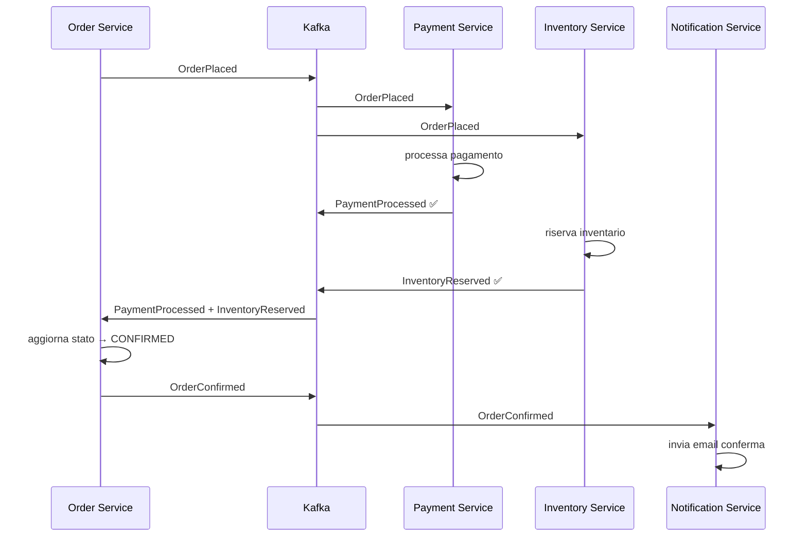
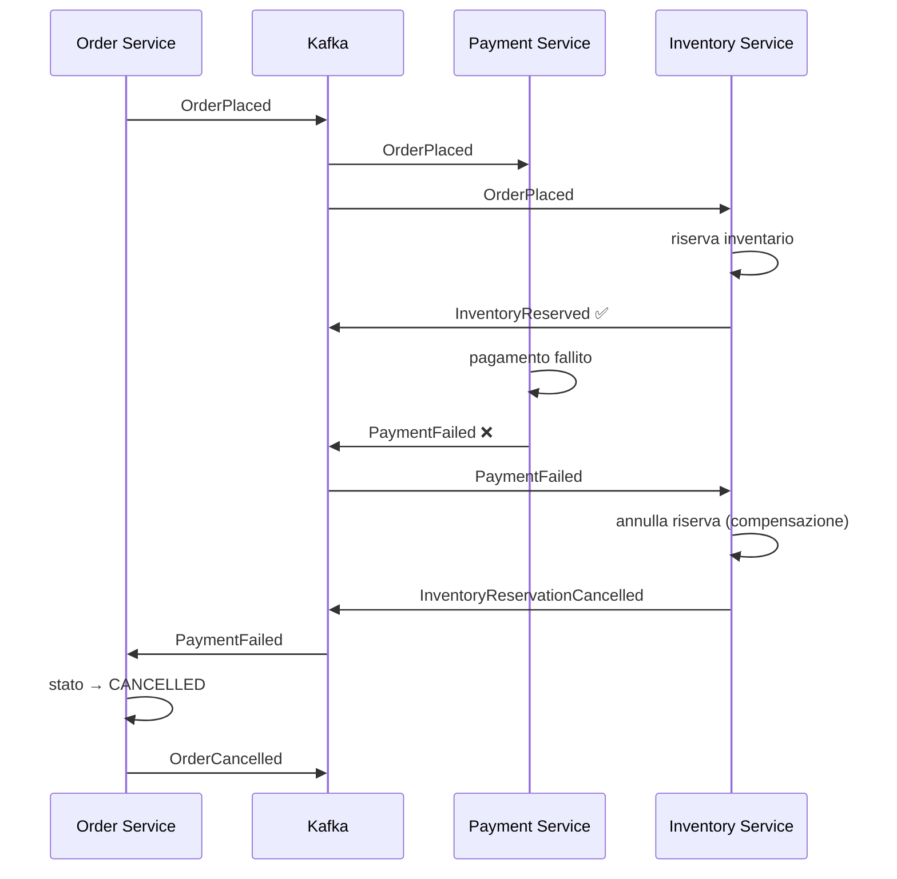
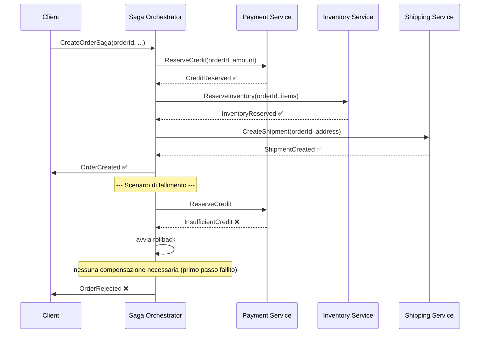

# Saga Pattern

## Panoramica

Il Saga Pattern risolve il problema delle transazioni distribuite in un'architettura a microservizi senza ricorrere al Two-Phase Commit (2PC), che richiederebbe lock globali e renderebbe i servizi strettamente accoppiati. Una saga è una sequenza di transazioni locali, ciascuna eseguita da un microservizio diverso: se una transazione fallisce, vengono eseguite **compensating transactions** per annullare quelle già completate con successo. Esistono due implementazioni principali: **Choreography** (coordinazione peer-to-peer tramite eventi) e **Orchestration** (coordinazione centralizzata tramite un orchestratore). Il pattern è appropriato per flussi di business che attraversano più servizi e che richiedono consistenza eventual; non è adatto a operazioni che richiedono consistenza forte immediata o che durano pochi millisecondi.

## Concetti Chiave

### Transazione Locale

Ogni passo della saga esegue una transazione atomica nel proprio database. Il microservizio aggiorna il suo stato e pubblica un evento (o invia un comando) per il passo successivo.

### Compensating Transaction

La transazione di compensazione annulla gli effetti di una transazione già completata. Deve essere:
- **Idempotente**: eseguirla più volte produce lo stesso risultato
- **Commutativa rispetto all'ordine**: idealmente non dipende dall'ordine di esecuzione
- **Sempre fattibile**: non può fallire definitivamente (altrimenti: dead end)

### Choreography vs Orchestration

| Aspetto | Choreography | Orchestration |
|---------|-------------|--------------|
| **Coordinazione** | Peer-to-peer tramite eventi | Centralizzata (Saga Orchestrator) |
| **Accoppiamento** | Basso (solo via topic Kafka) | Medio (i servizi conoscono l'orchestratore) |
| **Visibilità** | Difficile (distribuita) | Alta (flow visibile nell'orchestratore) |
| **Complessità** | Cresce con il numero di passi | Gestita nell'orchestratore |
| **Punto di fallimento** | Distribuito | Orchestratore (va reso resiliente) |
| **Quando usare** | Saghe semplici (2-4 passi) | Saghe complesse con branching e rollback |

### Semantica dei Messaggi nelle Saghe

- **Request**: comando inviato a un servizio (es. `ReserveInventory`)
- **Reply**: risposta al comando (es. `InventoryReserved` o `InsufficientStock`)
- **Rollback Request**: comando di compensazione (es. `CancelInventoryReservation`)

## Come Funziona

### Saga Choreography — Flusso Ordine/Pagamento/Inventario



### Saga Choreography — Flusso con Compensazione (Pagamento Fallito)



### Saga Orchestration — Flusso con Orchestratore



## Implementazione con Kafka

### Choreography Saga — Order Service

```java
@Service
@Slf4j
public class OrderSagaChoreography {

    private final OrderRepository orderRepository;
    private final KafkaTemplate<String, Object> kafkaTemplate;

    // ─── PASSO 1: avvia la saga ───────────────────────────────────────────────

    @Transactional
    public Order createOrder(CreateOrderRequest request) {
        Order order = Order.builder()
            .orderId(UUID.randomUUID().toString())
            .customerId(request.getCustomerId())
            .items(request.getItems())
            .totalAmount(calculateTotal(request.getItems()))
            .status(OrderStatus.PENDING)
            .build();

        orderRepository.save(order);

        // Pubblica evento che avvia la saga
        kafkaTemplate.send("orders.placed", order.getOrderId(),
            OrderPlacedEvent.from(order));

        log.info("Saga avviata per orderId={}", order.getOrderId());
        return order;
    }

    // ─── PASSO 4a: entrambe le conferme ricevute → conferma ordine ────────────

    @KafkaListener(topics = "payments.processed", groupId = "order-service")
    @Transactional
    public void onPaymentProcessed(PaymentProcessedEvent event) {
        Order order = orderRepository.findByOrderId(event.getOrderId())
            .orElseThrow(() -> new OrderNotFoundException(event.getOrderId()));

        order.markPaymentConfirmed();
        orderRepository.save(order);

        if (order.isFullyConfirmed()) {
            order.setStatus(OrderStatus.CONFIRMED);
            orderRepository.save(order);
            kafkaTemplate.send("orders.confirmed", order.getOrderId(),
                OrderConfirmedEvent.from(order));
            log.info("Ordine {} confermato", order.getOrderId());
        }
    }

    // ─── PASSO 4b: pagamento fallito → compensazione ─────────────────────────

    @KafkaListener(topics = "payments.failed", groupId = "order-service")
    @Transactional
    public void onPaymentFailed(PaymentFailedEvent event) {
        Order order = orderRepository.findByOrderId(event.getOrderId())
            .orElseThrow(() -> new OrderNotFoundException(event.getOrderId()));

        order.setStatus(OrderStatus.CANCELLED);
        order.setCancellationReason("Pagamento fallito: " + event.getReason());
        orderRepository.save(order);

        // Pubblica evento di compensazione per altri servizi (es. inventario)
        kafkaTemplate.send("orders.cancelled", order.getOrderId(),
            OrderCancelledEvent.from(order));

        log.warn("Ordine {} cancellato per pagamento fallito: {}",
            order.getOrderId(), event.getReason());
    }
}
```

### Orchestration Saga — Orchestrator con State Machine

```java
@Service
@Slf4j
public class CreateOrderSagaOrchestrator {

    private final SagaStateMachineFactory stateMachineFactory;
    private final SagaInstanceRepository sagaRepository;
    private final PaymentServiceClient paymentClient;
    private final InventoryServiceClient inventoryClient;
    private final ShippingServiceClient shippingClient;

    public enum SagaState {
        STARTED,
        AWAITING_PAYMENT,
        AWAITING_INVENTORY,
        AWAITING_SHIPMENT,
        COMPLETED,
        COMPENSATING_INVENTORY,
        COMPENSATING_PAYMENT,
        FAILED
    }

    @Transactional
    public String startSaga(CreateOrderSagaData data) {
        String sagaId = UUID.randomUUID().toString();

        SagaInstance saga = SagaInstance.builder()
            .sagaId(sagaId)
            .sagaType("CreateOrderSaga")
            .state(SagaState.STARTED)
            .data(data)
            .startedAt(Instant.now())
            .build();

        sagaRepository.save(saga);

        // Primo passo: riserva credito
        paymentClient.send(ReserveCreditCommand.builder()
            .sagaId(sagaId)
            .orderId(data.getOrderId())
            .customerId(data.getCustomerId())
            .amount(data.getTotalAmount())
            .build());

        saga.setState(SagaState.AWAITING_PAYMENT);
        sagaRepository.save(saga);

        log.info("Saga {} avviata per orderId={}", sagaId, data.getOrderId());
        return sagaId;
    }

    @KafkaListener(topics = "saga.payment.reply", groupId = "saga-orchestrator")
    @Transactional
    public void onPaymentReply(SagaReplyEvent reply) {
        SagaInstance saga = sagaRepository.findBySagaId(reply.getSagaId())
            .orElseThrow();

        if (reply.isSuccess()) {
            log.info("Saga {} — pagamento confermato, procedo con inventario", saga.getSagaId());
            saga.setState(SagaState.AWAITING_INVENTORY);
            sagaRepository.save(saga);

            inventoryClient.send(ReserveInventoryCommand.builder()
                .sagaId(saga.getSagaId())
                .orderId(saga.getData().getOrderId())
                .items(saga.getData().getItems())
                .build());
        } else {
            log.warn("Saga {} — pagamento fallito: {}", saga.getSagaId(), reply.getFailureReason());
            saga.setState(SagaState.FAILED);
            sagaRepository.save(saga);
            // Nessuna compensazione necessaria (primo passo)
        }
    }

    @KafkaListener(topics = "saga.inventory.reply", groupId = "saga-orchestrator")
    @Transactional
    public void onInventoryReply(SagaReplyEvent reply) {
        SagaInstance saga = sagaRepository.findBySagaId(reply.getSagaId())
            .orElseThrow();

        if (reply.isSuccess()) {
            saga.setState(SagaState.AWAITING_SHIPMENT);
            sagaRepository.save(saga);

            shippingClient.send(CreateShipmentCommand.builder()
                .sagaId(saga.getSagaId())
                .orderId(saga.getData().getOrderId())
                .address(saga.getData().getShippingAddress())
                .build());
        } else {
            log.warn("Saga {} — inventario insufficiente, avvio compensazione", saga.getSagaId());
            saga.setState(SagaState.COMPENSATING_PAYMENT);
            sagaRepository.save(saga);

            // Compensazione: cancella prenotazione credito
            paymentClient.send(CancelCreditReservationCommand.builder()
                .sagaId(saga.getSagaId())
                .orderId(saga.getData().getOrderId())
                .build());
        }
    }
}
```

### Idempotenza delle Compensating Transactions

```java
@Service
@Slf4j
public class InventoryCompensationService {

    private final InventoryRepository inventoryRepository;
    private final CompensationLogRepository compensationLogRepository;

    @Transactional
    public void cancelReservation(CancelInventoryReservationCommand cmd) {
        // Verifica idempotenza: compensazione già eseguita?
        if (compensationLogRepository.existsByOrderIdAndAction(
                cmd.getOrderId(), "CANCEL_RESERVATION")) {
            log.warn("Compensazione già eseguita per orderId={}, skip",
                cmd.getOrderId());
            return;
        }

        InventoryReservation reservation = inventoryRepository
            .findByOrderId(cmd.getOrderId())
            .orElse(null);

        if (reservation == null) {
            log.warn("Nessuna riserva trovata per orderId={}, skip",
                cmd.getOrderId());
        } else {
            inventoryRepository.releaseReservation(reservation);
            log.info("Riserva annullata per orderId={}", cmd.getOrderId());
        }

        // Registra compensazione eseguita (anche se reservation era null)
        compensationLogRepository.save(CompensationLog.builder()
            .orderId(cmd.getOrderId())
            .action("CANCEL_RESERVATION")
            .executedAt(Instant.now())
            .build());
    }
}
```

## Best Practices

### Pattern Consigliati

!!! tip "Scegliere il tipo di saga in base alla complessità"
    Usare Choreography per saghe lineari con 2-4 passi. Passare a Orchestration quando il flusso ha branch condizionali, molti passi, o quando la visibilità del flusso è importante per il debugging.

!!! tip "Idempotenza come requisito non negoziabile"
    Ogni passo della saga e ogni compensating transaction devono essere idempotenti. La rete e Kafka garantiscono at-least-once: lo stesso messaggio può arrivare più volte.

!!! tip "Persistere lo stato della saga"
    Specialmente nell'orchestration, persistere sempre lo stato corrente della saga nel database prima di inviare comandi ai servizi. In caso di crash dell'orchestratore, permette il recovery.

!!! tip "Timeout e dead saga detection"
    Implementare un job che rileva saghe bloccate in uno stato intermedio da troppo tempo e le porta in stato FAILED con compensazione automatica.

### Anti-Pattern da Evitare

!!! warning "Saga troppo lunga"
    Una saga con più di 6-8 passi è un segnale di bounded context mal definiti. Riconsiderare il design del dominio.

!!! warning "Compensazione che fallisce"
    Se una compensating transaction può fallire, occorre gestire il caso. Implementare retry infinito con backoff esponenziale. Una compensazione che non può essere completata è un incidente critico che richiede intervento umano.

!!! warning "Leggere il proprio write durante la saga"
    Un servizio non dovrebbe leggere dati modificati da un altro passo della saga se non ha ancora ricevuto la conferma. Questo porta a race condition. Usare i dati inclusi negli eventi, non fare query ai servizi degli altri passi.

## Troubleshooting

### Saga Bloccata in Stato Intermedio

**Sintomo:** La saga rimane in `AWAITING_PAYMENT` per ore.

**Causa:** Il servizio di pagamento non ha pubblicato la reply (crash, errore di rete).

**Soluzione:**
```java
// Job schedulato ogni 5 minuti
@Scheduled(fixedRate = 300_000)
public void detectStaleSagas() {
    Instant threshold = Instant.now().minus(Duration.ofMinutes(30));

    List<SagaInstance> staleSagas = sagaRepository
        .findByStateInAndLastUpdatedBefore(
            List.of(SagaState.AWAITING_PAYMENT, SagaState.AWAITING_INVENTORY),
            threshold
        );

    staleSagas.forEach(saga -> {
        log.error("Saga {} bloccata in stato {} da oltre 30 minuti",
            saga.getSagaId(), saga.getState());
        // Inviare alert + avviare compensazione manuale o retry
        alertService.sendSagaStuckAlert(saga);
    });
}
```

### Compensazioni Non nell'Ordine Corretto

**Sintomo:** La compensazione di un passo viene eseguita prima che il passo sia completato.

**Causa:** Race condition tra eventi publishati da servizi diversi.

**Soluzione:** Nell'orchestration, eseguire le compensazioni nell'ordine inverso rispetto ai passi completati, aspettando la reply di ogni compensazione prima di avviare la successiva.

## Riferimenti

- [Pattern: Saga — microservices.io](https://microservices.io/patterns/data/saga.html)
- [Saga Pattern — Chris Richardson (video)](https://www.youtube.com/watch?v=txlSrGVCK18)
- [Eventuate Tram Sagas Framework](https://eventuate.io/docs/manual/eventuate-tram/latest/sagas.html)
- [Azure Architecture Center — Saga distributed transactions pattern](https://docs.microsoft.com/azure/architecture/reference-architectures/saga/saga)
