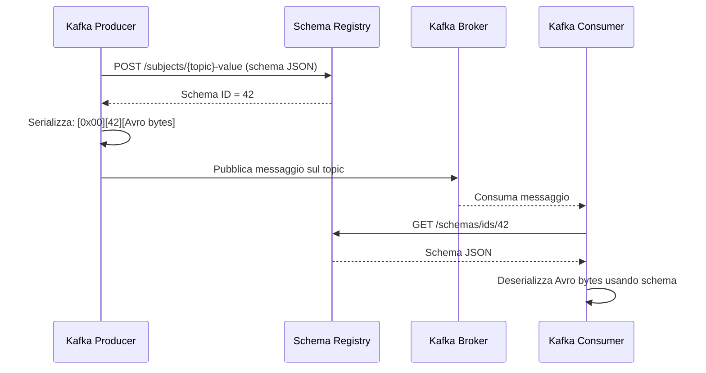

# Apache Avro

## Panoramica

Apache Avro è un framework di serializzazione dati binario sviluppato nell'ecosistema Hadoop e diventato il formato di serializzazione più diffuso in Kafka con Confluent Schema Registry. A differenza di JSON (verboso e senza schema obbligatorio) o XML, Avro produce payload compatti e richiede che ogni messaggio rispetti uno schema definito esplicitamente. Lo schema descrive la struttura dei dati in formato JSON ed è separato dal payload binario: questo consente di inviare sul wire solo i dati, senza ripetere i nomi dei campi ad ogni messaggio.

Avro è particolarmente adatto a Kafka perché risolve il problema dell'evoluzione degli schemi in modo strutturato: producer e consumer possono evolvere in modo indipendente purché le modifiche rispettino le regole di compatibilità. Il risultato è un sistema di messaggistica fortemente tipizzato, compatto e compatibile con strumenti come Apache Spark, Apache Flink e Confluent Platform.

## Concetti Chiave

!!! note "Schema come contratto"
    In Avro lo schema non è opzionale: ogni record deve rispettare uno schema. Questo rende Avro un meccanismo di "schema-first design" che obbliga i team a definire il contratto dei dati prima di scrivere codice.

### Tipi Primitivi

| Tipo | Descrizione | Esempio JSON |
|------|-------------|--------------|
| `null` | Valore nullo | `null` |
| `boolean` | Valore booleano | `true` |
| `int` | Intero 32-bit | `42` |
| `long` | Intero 64-bit | `1700000000000` |
| `float` | Floating point 32-bit | `3.14` |
| `double` | Floating point 64-bit | `3.14159265` |
| `bytes` | Sequenza di byte | — |
| `string` | Stringa UTF-8 | `"hello"` |

### Tipi Complessi

- **record**: struttura con campi nominati (equivalente a un oggetto/classe)
- **array**: lista di elementi dello stesso tipo
- **map**: dizionario chiave-stringa / valore di tipo specificato
- **union**: un campo che può assumere uno tra più tipi (tipicamente usato per i campi nullable: `["null", "string"]`)
- **enum**: insieme di valori stringa ammissibili
- **fixed**: sequenza di byte a lunghezza fissa

### Schema ID nel Messaggio Kafka

Quando si usa il Confluent Schema Registry, ogni messaggio Avro serializzato su Kafka ha il seguente formato binario:

```
[ Magic Byte (0x00) | Schema ID (4 byte Big-Endian) | Avro Payload ]
```

Il magic byte `0x00` segnala che il messaggio usa il formato Confluent. Lo schema ID è un intero che punta allo schema registrato nel Schema Registry. Il consumer recupera lo schema una volta sola e lo mantiene in cache: questo rende la serializzazione molto efficiente a regime.

## Come Funziona / Architettura



Il flusso è:
1. Il producer registra (o recupera) lo schema nel Schema Registry al momento dell'avvio
2. Per ogni messaggio, il producer serializza il payload Avro e antepone magic byte + schema ID
3. Il consumer, alla ricezione del primo messaggio con un dato schema ID, scarica lo schema dal Registry
4. Lo schema viene messo in cache locale: le chiamate successive non richiedono round-trip al Registry
5. La deserializzazione usa lo schema del writer (embedded nell'ID) e lo schema del reader (locale al consumer) per gestire l'evoluzione

## Configurazione & Pratica

### Schema Avro per un OrderEvent

```json
{
  "type": "record",
  "name": "OrderEvent",
  "namespace": "com.example.orders",
  "doc": "Evento generato alla creazione o aggiornamento di un ordine",
  "fields": [
    {
      "name": "orderId",
      "type": "string",
      "doc": "UUID univoco dell'ordine"
    },
    {
      "name": "customerId",
      "type": "string",
      "doc": "ID del cliente"
    },
    {
      "name": "status",
      "type": {
        "type": "enum",
        "name": "OrderStatus",
        "symbols": ["CREATED", "CONFIRMED", "SHIPPED", "DELIVERED", "CANCELLED"]
      }
    },
    {
      "name": "totalAmount",
      "type": "double",
      "doc": "Importo totale in EUR"
    },
    {
      "name": "items",
      "type": {
        "type": "array",
        "items": {
          "type": "record",
          "name": "OrderItem",
          "fields": [
            { "name": "productId", "type": "string" },
            { "name": "quantity", "type": "int" },
            { "name": "unitPrice", "type": "double" }
          ]
        }
      }
    },
    {
      "name": "metadata",
      "type": {
        "type": "map",
        "values": "string"
      },
      "default": {}
    },
    {
      "name": "cancelReason",
      "type": ["null", "string"],
      "default": null,
      "doc": "Motivo della cancellazione, null se non cancellato"
    },
    {
      "name": "createdAt",
      "type": "long",
      "logicalType": "timestamp-millis",
      "doc": "Timestamp di creazione in millisecondi epoch"
    }
  ]
}
```

### Configurazione Maven con avro-maven-plugin

```xml
<dependencies>
  <dependency>
    <groupId>org.apache.avro</groupId>
    <artifactId>avro</artifactId>
    <version>1.11.3</version>
  </dependency>
  <dependency>
    <groupId>io.confluent</groupId>
    <artifactId>kafka-avro-serializer</artifactId>
    <version>7.6.0</version>
  </dependency>
</dependencies>

<build>
  <plugins>
    <plugin>
      <groupId>org.apache.avro</groupId>
      <artifactId>avro-maven-plugin</artifactId>
      <version>1.11.3</version>
      <executions>
        <execution>
          <phase>generate-sources</phase>
          <goals>
            <goal>schema</goal>
          </goals>
          <configuration>
            <sourceDirectory>${project.basedir}/src/main/avro</sourceDirectory>
            <outputDirectory>${project.build.directory}/generated-sources/avro</outputDirectory>
          </configuration>
        </execution>
      </executions>
    </plugin>
  </plugins>
</build>
```

### Configurazione Gradle

```groovy
plugins {
    id 'com.github.davidmc24.gradle.plugin.avro' version '1.9.1'
}

dependencies {
    implementation 'org.apache.avro:avro:1.11.3'
    implementation 'io.confluent:kafka-avro-serializer:7.6.0'
}

avro {
    stringType = 'String'
    fieldVisibility = 'PRIVATE'
}
```

### Kafka Producer con AvroSerializer

```java
import io.confluent.kafka.serializers.KafkaAvroSerializer;
import io.confluent.kafka.serializers.KafkaAvroSerializerConfig;
import com.example.orders.OrderEvent;

Properties props = new Properties();
props.put(ProducerConfig.BOOTSTRAP_SERVERS_CONFIG, "localhost:9092");
props.put(ProducerConfig.KEY_SERIALIZER_CLASS_CONFIG, StringSerializer.class);
props.put(ProducerConfig.VALUE_SERIALIZER_CLASS_CONFIG, KafkaAvroSerializer.class);
props.put(KafkaAvroSerializerConfig.SCHEMA_REGISTRY_URL_CONFIG, "http://localhost:8081");
// Registra automaticamente lo schema se non esiste
props.put(KafkaAvroSerializerConfig.AUTO_REGISTER_SCHEMAS, true);

KafkaProducer<String, OrderEvent> producer = new KafkaProducer<>(props);

OrderEvent event = OrderEvent.newBuilder()
    .setOrderId("ord-12345")
    .setCustomerId("cust-789")
    .setStatus(OrderStatus.CREATED)
    .setTotalAmount(129.99)
    .setItems(List.of(
        OrderItem.newBuilder()
            .setProductId("prod-001")
            .setQuantity(2)
            .setUnitPrice(64.99)
            .build()
    ))
    .setMetadata(Map.of("channel", "web", "region", "EU"))
    .setCancelReason(null)
    .setCreatedAt(System.currentTimeMillis())
    .build();

ProducerRecord<String, OrderEvent> record =
    new ProducerRecord<>("orders", event.getOrderId().toString(), event);

producer.send(record, (metadata, exception) -> {
    if (exception != null) {
        log.error("Errore invio messaggio", exception);
    } else {
        log.info("Messaggio inviato a partizione {} offset {}",
            metadata.partition(), metadata.offset());
    }
});
producer.flush();
producer.close();
```

### Kafka Consumer con AvroDeserializer

```java
import io.confluent.kafka.serializers.KafkaAvroDeserializer;
import io.confluent.kafka.serializers.KafkaAvroDeserializerConfig;

Properties props = new Properties();
props.put(ConsumerConfig.BOOTSTRAP_SERVERS_CONFIG, "localhost:9092");
props.put(ConsumerConfig.GROUP_ID_CONFIG, "order-processor-group");
props.put(ConsumerConfig.KEY_DESERIALIZER_CLASS_CONFIG, StringDeserializer.class);
props.put(ConsumerConfig.VALUE_DESERIALIZER_CLASS_CONFIG, KafkaAvroDeserializer.class);
props.put(KafkaAvroDeserializerConfig.SCHEMA_REGISTRY_URL_CONFIG, "http://localhost:8081");
// Usa le classi generate invece di GenericRecord
props.put(KafkaAvroDeserializerConfig.SPECIFIC_AVRO_READER_CONFIG, true);

KafkaConsumer<String, OrderEvent> consumer = new KafkaConsumer<>(props);
consumer.subscribe(List.of("orders"));

while (true) {
    ConsumerRecords<String, OrderEvent> records = consumer.poll(Duration.ofMillis(100));
    for (ConsumerRecord<String, OrderEvent> record : records) {
        OrderEvent event = record.value();
        log.info("Ricevuto ordine: {} status={} amount={}",
            event.getOrderId(), event.getStatus(), event.getTotalAmount());
        processOrder(event);
    }
}
```

### Uso con GenericRecord (senza codegen)

```java
// Utile per consumer generici o tool di monitoraggio
props.put(KafkaAvroDeserializerConfig.SPECIFIC_AVRO_READER_CONFIG, false);

KafkaConsumer<String, GenericRecord> consumer = new KafkaConsumer<>(props);
consumer.subscribe(List.of("orders"));

ConsumerRecords<String, GenericRecord> records = consumer.poll(Duration.ofMillis(100));
for (ConsumerRecord<String, GenericRecord> record : records) {
    GenericRecord genericRecord = record.value();
    String orderId = genericRecord.get("orderId").toString();
    Double amount = (Double) genericRecord.get("totalAmount");
    log.info("orderId={} amount={}", orderId, amount);
}
```

## Best Practices

!!! tip "Schema naming convention"
    Usa sempre il namespace Java completo nello schema Avro: `com.example.domain.EventName`. Questo evita conflitti di nome nel Schema Registry e rende il codice generato più leggibile.

- **Usa sempre valori di default** per i campi: questo rende più semplice aggiungere nuovi campi in futuro mantenendo la backward compatibility.
- **I campi nullable devono avere `null` come primo tipo** nella union: `["null", "string"]` non `["string", "null"]`. In Avro il default deve corrispondere al primo tipo della union.
- **Non usare `AUTO_REGISTER_SCHEMAS=true` in produzione**: registra gli schemi esplicitamente come parte del processo CI/CD per evitare schemi inattesi registrati da producer buggy.
- **Imposta la compatibilità nel Schema Registry** prima di registrare il primo schema: una volta che i dati sono in produzione, cambiare la politica di compatibilità è rischioso.
- **Sfrutta i logical types** per tipi semantici: `timestamp-millis`, `date`, `time-millis`, `decimal`. I tipi logici migliorano l'interoperabilità con tool di analisi.
- **Versiona gli schemi nel repository Git**: ogni schema `.avsc` deve essere in source control, trattato come API pubblica.
- **Testa la compatibilità in CI** con il Maven/Gradle plugin di Schema Registry prima del deploy.

```bash
# Verificare compatibilità di un nuovo schema prima del deploy
curl -X POST \
  -H "Content-Type: application/vnd.schemaregistry.v1+json" \
  --data '{"schema": "<escaped-json-schema>"}' \
  http://localhost:8081/compatibility/subjects/orders-value/versions/latest
```

## Troubleshooting

### Errore: Schema not found

```
org.apache.kafka.common.errors.SerializationException:
Error retrieving Avro schema for id 42
```

**Causa:** Il consumer non riesce a raggiungere il Schema Registry, oppure lo schema ID non esiste.
**Soluzione:** Verificare la connettività al Schema Registry e che la variabile `schema.registry.url` sia corretta. Verificare che lo schema esista: `GET /schemas/ids/42`.

### Errore: Incompatible schema

```
io.confluent.kafka.schemaregistry.client.rest.exceptions.RestClientException:
Schema being registered is incompatible with an earlier schema; error code: 409
```

**Causa:** Il nuovo schema viola la politica di compatibilità configurata nel Registry.
**Soluzione:** Verificare le regole di compatibilità per il subject. Usare `GET /config/{subject}` per vedere la politica attiva. Vedere la guida all'evoluzione degli schemi.

### Errore: ClassCastException su GenericRecord

```
java.lang.ClassCastException: org.apache.avro.generic.GenericData$Record
cannot be cast to com.example.OrderEvent
```

**Causa:** `SPECIFIC_AVRO_READER_CONFIG` non è impostato a `true`, quindi il deserializzatore restituisce `GenericRecord` invece della classe specifica.
**Soluzione:** Aggiungere `props.put(KafkaAvroDeserializerConfig.SPECIFIC_AVRO_READER_CONFIG, true)`.

### Avro e null: errore di default

```
org.apache.avro.AvroTypeException: No default value for: cancelReason
```

**Causa:** Il campo nullable è definito come `["string", "null"]` con default `null`, ma in Avro il default deve corrispondere al primo tipo. Se il primo tipo è `string`, il default non può essere `null`.
**Soluzione:** Definire sempre i campi nullable come `["null", "string"]` con `"default": null`.

## Riferimenti

- [Apache Avro — Documentazione Ufficiale](https://avro.apache.org/docs/)
- [Confluent Schema Registry — Avro Integration](https://docs.confluent.io/platform/current/schema-registry/fundamentals/serdes-develop/serdes-avro.html)
- [Avro Specification — Tipi e Schema](https://avro.apache.org/docs/current/specification/)
- [kafka-avro-serializer su Maven Central](https://mvnrepository.com/artifact/io.confluent/kafka-avro-serializer)
- [Schema Registry API Reference](https://docs.confluent.io/platform/current/schema-registry/develop/api.html)
