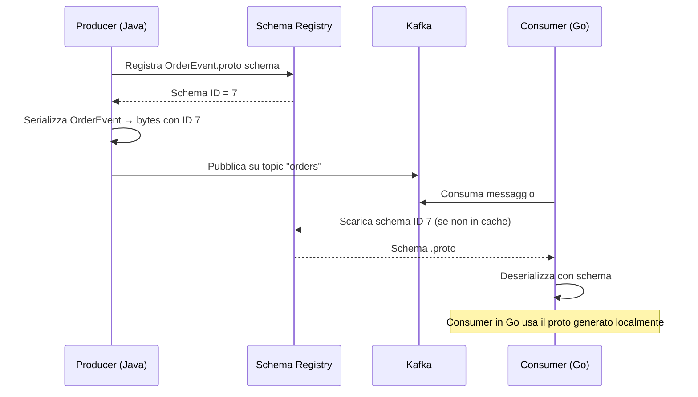

# Protocol Buffers (Protobuf)

## Panoramica

Protocol Buffers (Protobuf) è il formato di serializzazione binario sviluppato da Google e utilizzato internamente per la comunicazione tra microservizi. Come Avro, produce payload compatti e richiede uno schema esplicito; a differenza di Avro, lo schema è definito in file `.proto` con una sintassi dedicata anziché in JSON. Protobuf è supportato nativamente da Confluent Schema Registry a partire dalla versione 5.5.

Il vantaggio principale di Protobuf rispetto ad Avro è la generazione di codice fortemente tipizzato per un'ampia gamma di linguaggi (Java, Python, Go, C++, C#, Kotlin, Swift, Dart...) partendo dallo stesso file `.proto`. Questo lo rende ideale in contesti multi-linguaggio dove producer e consumer sono scritti in tecnologie diverse. Protobuf è inoltre il protocollo di serializzazione nativo di gRPC.

## Concetti Chiave

### File .proto e Sintassi proto3

Un file `.proto` definisce i tipi di messaggio con una sintassi simile a C:

```protobuf
syntax = "proto3";

package com.example.orders;

option java_package = "com.example.orders.proto";
option java_outer_classname = "OrderProtos";
option java_multiple_files = true;
```

### Tipi Scalari

| Tipo Protobuf | Java | Python | Go | Note |
|---------------|------|--------|----|------|
| `double` | `double` | `float` | `float64` | IEEE 754 64-bit |
| `float` | `float` | `float` | `float32` | IEEE 754 32-bit |
| `int32` | `int` | `int` | `int32` | Varint encoding |
| `int64` | `long` | `int` | `int64` | Varint encoding |
| `uint32` | `int` | `int` | `uint32` | Unsigned |
| `bool` | `boolean` | `bool` | `bool` | |
| `string` | `String` | `str` | `string` | UTF-8 |
| `bytes` | `ByteString` | `bytes` | `[]byte` | Raw bytes |

### Field Numbers

In Protobuf ogni campo ha un numero univoco nel messaggio. I field number sono ciò che viene serializzato sul wire, non i nomi. Questo ha implicazioni fondamentali per l'evoluzione degli schemi:

!!! warning "Field numbers sono permanenti"
    Una volta assegnato un field number a un campo, non deve mai essere riusato — neanche se il campo viene rimosso. Usare `reserved` per documentare i field number riservati.

```protobuf
message OrderEvent {
  string order_id = 1;
  string customer_id = 2;
  // Il campo 3 è stato rimosso: non riusarlo
  reserved 3;
  reserved "old_field_name";
  OrderStatus status = 4;
  double total_amount = 5;
}
```

## Come Funziona / Architettura

### Confronto: Avro vs Protobuf vs JSON Schema

| Caratteristica | Avro | Protobuf | JSON Schema |
|----------------|------|----------|-------------|
| Formato payload | Binario | Binario | JSON (testuale) |
| Schema definito in | JSON | `.proto` | JSON |
| Codegen | Sì (Java, Python, C++) | Sì (15+ linguaggi) | Sì (limitato) |
| Dimensione payload | Molto compatta | Molto compatta | Grande |
| Schema nell'header Kafka | Schema ID | Schema ID | Schema ID |
| Evoluzione schemi | Schema Registry | Schema Registry + field numbers | Schema Registry |
| Compatibilità backward/forward | Eccellente con regole | Eccellente con field numbers | Buona |
| Interoperabilità gRPC | No | Nativa | No |
| Supporto union/oneof | Union type | `oneof` | `oneOf` |
| Tool ecosystem | Hadoop, Spark | Google, CNCF | Web APIs |

### Serializzazione Protobuf su Kafka con Schema Registry



A differenza di Avro dove lo schema writer è sempre disponibile via Registry, con Protobuf il Registry contiene il `.proto` completo. La deserializzazione è spesso possibile anche senza il file `.proto` originale grazie ai field number nel payload binario.

## Configurazione & Pratica

### Esempio .proto — OrderEvent completo

```protobuf
syntax = "proto3";

package com.example.orders;

import "google/protobuf/timestamp.proto";

option java_package = "com.example.orders.proto";
option java_multiple_files = true;

// Enum dei possibili stati di un ordine
enum OrderStatus {
  ORDER_STATUS_UNSPECIFIED = 0;  // Proto3: il valore 0 è sempre il default
  ORDER_STATUS_CREATED = 1;
  ORDER_STATUS_CONFIRMED = 2;
  ORDER_STATUS_SHIPPED = 3;
  ORDER_STATUS_DELIVERED = 4;
  ORDER_STATUS_CANCELLED = 5;
}

// Singolo articolo dell'ordine
message OrderItem {
  string product_id = 1;
  int32 quantity = 2;
  double unit_price = 3;
}

// Evento principale dell'ordine
message OrderEvent {
  string order_id = 1;
  string customer_id = 2;
  OrderStatus status = 3;
  double total_amount = 4;
  repeated OrderItem items = 5;
  map<string, string> metadata = 6;

  // oneof: il campo è presente solo in uno dei casi
  oneof cancellation_info {
    string cancel_reason = 7;
    string cancel_code = 8;
  }

  google.protobuf.Timestamp created_at = 9;
  google.protobuf.Timestamp updated_at = 10;
}
```

### Compilazione con protoc

```bash
# Installazione protoc su Linux/Mac
brew install protobuf           # macOS
apt-get install -y protobuf-compiler  # Ubuntu

# Generazione classi Java
protoc \
  --java_out=src/main/java \
  --proto_path=src/main/proto \
  src/main/proto/order_event.proto

# Generazione classi Go
protoc \
  --go_out=. \
  --go_opt=paths=source_relative \
  src/main/proto/order_event.proto

# Generazione classi Python
protoc \
  --python_out=. \
  src/main/proto/order_event.proto
```

### Dipendenze Maven

```xml
<dependencies>
  <!-- Runtime Protobuf -->
  <dependency>
    <groupId>com.google.protobuf</groupId>
    <artifactId>protobuf-java</artifactId>
    <version>3.25.3</version>
  </dependency>
  <!-- Confluent Kafka Protobuf Serializer -->
  <dependency>
    <groupId>io.confluent</groupId>
    <artifactId>kafka-protobuf-serializer</artifactId>
    <version>7.6.0</version>
  </dependency>
</dependencies>

<build>
  <plugins>
    <plugin>
      <groupId>kr.motd.maven</groupId>
      <artifactId>os-maven-plugin</artifactId>
      <version>1.7.1</version>
    </plugin>
    <plugin>
      <groupId>org.xolstice.maven.plugins</groupId>
      <artifactId>protobuf-maven-plugin</artifactId>
      <version>0.6.1</version>
      <configuration>
        <protocArtifact>
          com.google.protobuf:protoc:3.25.3:exe:${os.detected.classifier}
        </protocArtifact>
      </configuration>
      <executions>
        <execution>
          <goals>
            <goal>compile</goal>
            <goal>compile-java</goal>
          </goals>
        </execution>
      </executions>
    </plugin>
  </plugins>
</build>
```

### Kafka Producer con KafkaProtobufSerializer

```java
import io.confluent.kafka.serializers.protobuf.KafkaProtobufSerializer;
import io.confluent.kafka.serializers.protobuf.KafkaProtobufSerializerConfig;
import com.example.orders.proto.OrderEvent;
import com.example.orders.proto.OrderStatus;
import com.google.protobuf.Timestamp;

Properties props = new Properties();
props.put(ProducerConfig.BOOTSTRAP_SERVERS_CONFIG, "localhost:9092");
props.put(ProducerConfig.KEY_SERIALIZER_CLASS_CONFIG, StringSerializer.class);
props.put(ProducerConfig.VALUE_SERIALIZER_CLASS_CONFIG, KafkaProtobufSerializer.class);
props.put(KafkaProtobufSerializerConfig.SCHEMA_REGISTRY_URL_CONFIG, "http://localhost:8081");
props.put(KafkaProtobufSerializerConfig.AUTO_REGISTER_SCHEMAS, false); // raccomandato in prod

KafkaProducer<String, OrderEvent> producer = new KafkaProducer<>(props);

Instant now = Instant.now();
OrderEvent event = OrderEvent.newBuilder()
    .setOrderId("ord-12345")
    .setCustomerId("cust-789")
    .setStatus(OrderStatus.ORDER_STATUS_CREATED)
    .setTotalAmount(129.99)
    .addItems(
        OrderItem.newBuilder()
            .setProductId("prod-001")
            .setQuantity(2)
            .setUnitPrice(64.99)
            .build()
    )
    .putMetadata("channel", "web")
    .putMetadata("region", "EU")
    .setCreatedAt(Timestamp.newBuilder()
        .setSeconds(now.getEpochSecond())
        .setNanos(now.getNano())
        .build())
    .build();

producer.send(new ProducerRecord<>("orders", event.getOrderId(), event));
producer.flush();
producer.close();
```

### Kafka Consumer con KafkaProtobufDeserializer

```java
import io.confluent.kafka.serializers.protobuf.KafkaProtobufDeserializer;
import io.confluent.kafka.serializers.protobuf.KafkaProtobufDeserializerConfig;

Properties props = new Properties();
props.put(ConsumerConfig.BOOTSTRAP_SERVERS_CONFIG, "localhost:9092");
props.put(ConsumerConfig.GROUP_ID_CONFIG, "order-consumer-group");
props.put(ConsumerConfig.KEY_DESERIALIZER_CLASS_CONFIG, StringDeserializer.class);
props.put(ConsumerConfig.VALUE_DESERIALIZER_CLASS_CONFIG, KafkaProtobufDeserializer.class);
props.put(KafkaProtobufDeserializerConfig.SCHEMA_REGISTRY_URL_CONFIG, "http://localhost:8081");
// Indica la classe specifica da deserializzare
props.put(KafkaProtobufDeserializerConfig.SPECIFIC_PROTOBUF_VALUE_TYPE, OrderEvent.class.getName());

KafkaConsumer<String, OrderEvent> consumer = new KafkaConsumer<>(props);
consumer.subscribe(List.of("orders"));

while (true) {
    ConsumerRecords<String, OrderEvent> records = consumer.poll(Duration.ofMillis(100));
    for (ConsumerRecord<String, OrderEvent> record : records) {
        OrderEvent event = record.value();
        log.info("Ordine ricevuto: id={} status={} total={}",
            event.getOrderId(), event.getStatus(), event.getTotalAmount());

        // Gestione oneof
        if (event.hasCancelReason()) {
            log.info("Cancellato per: {}", event.getCancelReason());
        }
    }
}
```

### Registrazione schema via REST API

```bash
# Leggere il file .proto e registrare nel Registry
SCHEMA=$(cat src/main/proto/order_event.proto | python3 -c "
import sys, json
content = sys.stdin.read()
print(json.dumps({'schema': content, 'schemaType': 'PROTOBUF'}))
")

curl -X POST \
  -H "Content-Type: application/vnd.schemaregistry.v1+json" \
  -d "$SCHEMA" \
  http://localhost:8081/subjects/orders-value/versions

# Verificare gli schemi registrati
curl http://localhost:8081/subjects/orders-value/versions
curl http://localhost:8081/subjects/orders-value/versions/latest
```

## Best Practices

!!! tip "Enum con valore 0 come UNSPECIFIED"
    In proto3, il valore di default di un enum è sempre 0. Usa sempre un valore `UNSPECIFIED` o `UNKNOWN` a 0 per distinguere "non impostato" da un valore valido. Non usare 0 per un valore semanticamente significativo.

- **Numera i campi in modo sparso** lasciando spazio per futuri inserimenti: usa 1-15 per i campi più frequenti (1 byte di tag), 16-2047 per i meno frequenti (2 byte di tag).
- **Non riusare mai un field number** rimosso. Documenta i field number obsoleti con `reserved`.
- **Preferisci `optional` in proto3** per i campi che devono distinguere "non impostato" da valore zero: `optional int32 quantity = 2;` genera metodo `hasQuantity()`.
- **Usa `google.protobuf.Timestamp`** per i timestamp invece di `int64`: miglior leggibilità e interoperabilità.
- **Mantieni i file `.proto` in un repository condiviso** (o package separato) come source of truth per tutti i team.
- **Configura la Schema Registry compatibility** su `FULL_TRANSITIVE` per i topic in produzione.
- **Non inserire logica di business nei message**: i proto devono essere pure data structures.

## Troubleshooting

### Errore: Unknown field durante la deserializzazione

In Protobuf, i campi sconosciuti vengono ignorati silenziosamente per impostazione predefinita. Questo è un comportamento desiderato per la forward compatibility. Se serve sapere se ci sono campi sconosciuti:

```java
OrderEvent event = OrderEvent.parseFrom(bytes);
if (!event.getUnknownFields().asMap().isEmpty()) {
    log.warn("Campi sconosciuti ricevuti — il producer usa una versione più nuova dello schema");
}
```

### Errore: Schema Registry restituisce 422

```
{"error_code": 42201, "message": "Invalid schema"}
```

**Causa:** Il file `.proto` contiene errori di sintassi o import non trovati.
**Soluzione:** Compilare il file con `protoc` localmente prima di registrarlo. Il compilatore fornisce errori precisi.

### Errore: ClassCastException con DynamicMessage

```
java.lang.ClassCastException: com.google.protobuf.DynamicMessage
cannot be cast to com.example.orders.proto.OrderEvent
```

**Causa:** `SPECIFIC_PROTOBUF_VALUE_TYPE` non è configurato nel consumer.
**Soluzione:** Aggiungere la proprietà con il fully qualified class name della classe generata.

### Schema Registry: compatibilità violata

```
Schema being registered is incompatible; error code: 409
```

**Causa:** È stata modificata la semantica di un field number esistente o rimosso un campo obbligatorio.
**Soluzione:** Aggiungere nuovi campi con nuovi field number; usare `reserved` per i campi rimossi; mai cambiare il tipo di un field number esistente.

## Riferimenti

- [Protocol Buffers — Documentazione Ufficiale](https://protobuf.dev/)
- [Confluent — Protobuf con Schema Registry](https://docs.confluent.io/platform/current/schema-registry/fundamentals/serdes-develop/serdes-protobuf.html)
- [proto3 Language Guide](https://protobuf.dev/programming-guides/proto3/)
- [Confluent kafka-protobuf-serializer](https://docs.confluent.io/platform/current/schema-registry/fundamentals/serdes-develop/serdes-protobuf.html)
- [Buf — Tool moderno per la gestione dei file .proto](https://buf.build/docs/)
