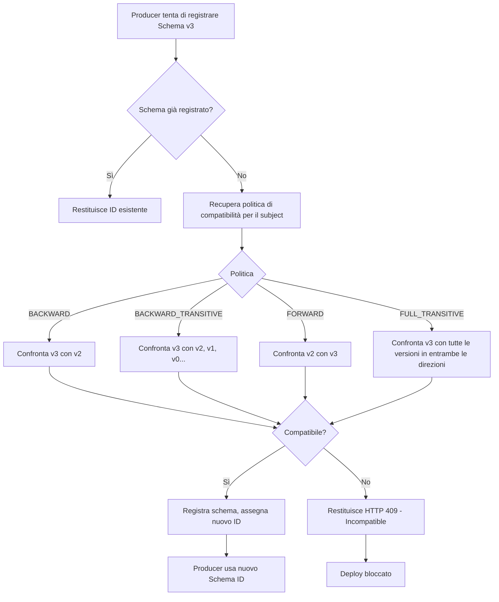
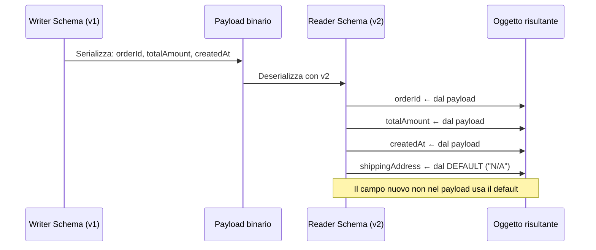

# Evoluzione degli Schemi

## Panoramica

In un sistema distribuito basato su Kafka, producer e consumer sono componenti indipendenti che vengono aggiornati in momenti diversi. Questo crea il problema dell'evoluzione degli schemi: come può un consumer aggiornato leggere messaggi scritti con lo schema vecchio, e viceversa? Come si garantisce che un aggiornamento del producer non rompa i consumer esistenti?

Il Confluent Schema Registry risolve questo problema con un sistema di controllo di compatibilità: ogni nuovo schema registrato viene confrontato con le versioni precedenti e accettato o rifiutato in base alla politica di compatibilità configurata. Questo trasforma la gestione degli schemi da un problema di coordinazione manuale a un gate automatico nel processo di deploy.

!!! warning "Schema evolution è un problema da progettare, non da risolvere a posteriori"
    I campi obbligatori senza default, gli enum senza valore UNKNOWN, i tipi rinominati: queste scelte di design iniziali rendono l'evoluzione futura molto più difficile. La sezione Best Practices descrive come progettare schemi evolution-safe fin dall'inizio.

## Concetti Chiave

### Il Problema: Versioni Multiple in Volo

Considera questo scenario tipico in produzione:

```
T=0: Producer v1 scrive con Schema v1
T=1: Deploy Producer v2 (Schema v2 con campo nuovo)
T=2: Deploy Consumer v2 (legge Schema v2)
T=3: Consumer v1 (vecchia istanza) ancora in esecuzione

Producer v2 scrive messaggi con Schema v2.
Consumer v1 deve ancora leggere quei messaggi.
Consumer v2 deve leggere sia messaggi v1 che v2 dal topic.
```

Senza un sistema di compatibilità, questo scenario porta a errori di deserializzazione o perdita silenziosa di dati.

### Tipi di Compatibilità

Il Schema Registry supporta le seguenti modalità di compatibilità:

| Modalità | Chi si aggiorna | Chi può ancora leggere | Descrizione breve |
|----------|----------------|------------------------|-------------------|
| `BACKWARD` | Consumer (più nuovo) | Consumer nuovo legge dati vecchi | **Default.** Il nuovo schema può leggere dati scritti con il vecchio schema |
| `BACKWARD_TRANSITIVE` | Consumer | Consumer nuovo legge dati di tutte le versioni precedenti | Come BACKWARD ma verifica su tutte le versioni, non solo l'ultima |
| `FORWARD` | Producer (più nuovo) | Consumer vecchio legge dati nuovi | Il vecchio consumer può leggere dati scritti con il nuovo schema |
| `FORWARD_TRANSITIVE` | Producer | Tutti i consumer esistenti leggono dati nuovi | Come FORWARD ma verifica su tutte le versioni |
| `FULL` | Entrambi | Sia consumer nuovi che vecchi leggono tutto | Combinazione di BACKWARD e FORWARD |
| `FULL_TRANSITIVE` | Entrambi | Compatibilità totale con tutte le versioni | **Raccomandato per produzione** |
| `NONE` | — | Nessun controllo | Nessuna verifica di compatibilità |

## Come Funziona / Architettura

### Meccanismo di Verifica nel Schema Registry



### Compatibilità BACKWARD in Dettaglio

Con BACKWARD, il consumer aggiornato (che usa il nuovo schema come "reader schema") deve poter leggere messaggi serializzati con il vecchio schema ("writer schema"). Avro gestisce questo con la **schema resolution**: il runtime Avro mappa i campi del writer sui campi del reader.

```
Schema v1 (writer):
  - orderId: string
  - totalAmount: double
  - createdAt: long

Schema v2 (reader, compatibilità BACKWARD):
  - orderId: string
  - totalAmount: double
  - createdAt: long
  - [NUOVO] shippingAddress: string = "N/A"  ← default obbligatorio
```

Quando il consumer v2 legge un messaggio scritto con v1, il campo `shippingAddress` non è presente nel payload. Avro usa il valore di default `"N/A"`. Questo è BACKWARD compatible.

### Schema Resolution in Avro



## Configurazione & Pratica

### Configurazione Compatibilità via REST API

```bash
# Impostare compatibilità globale (default per tutti i subject)
curl -X PUT \
  -H "Content-Type: application/vnd.schemaregistry.v1+json" \
  -d '{"compatibility": "FULL_TRANSITIVE"}' \
  http://localhost:8081/config

# Impostare compatibilità per un subject specifico (override globale)
curl -X PUT \
  -H "Content-Type: application/vnd.schemaregistry.v1+json" \
  -d '{"compatibility": "BACKWARD"}' \
  http://localhost:8081/config/orders-value

# Leggere la compatibilità di un subject
curl http://localhost:8081/config/orders-value

# Verificare compatibilità PRIMA di registrare
curl -X POST \
  -H "Content-Type: application/vnd.schemaregistry.v1+json" \
  -d '{"schema": "{\"type\":\"record\",\"name\":\"OrderEvent\",...}"}' \
  http://localhost:8081/compatibility/subjects/orders-value/versions/latest

# Risposta se compatibile
{"is_compatible": true}

# Risposta se incompatibile
{
  "is_compatible": false,
  "messages": ["reader field type 'string' not compatible with writer field type 'int'"]
}
```

### Regole di Compatibilità — Cosa Si Può e Non Si Può Fare

#### BACKWARD: cosa è permesso

```json
// ✅ PERMESSO: aggiungere un campo con valore di default
{
  "name": "shippingAddress",
  "type": ["null", "string"],
  "default": null  // ← OBBLIGATORIO per BACKWARD
}

// ✅ PERMESSO: rimuovere un campo che aveva un default
// (il consumer vecchio ignorerà il campo mancante)

// ❌ VIETATO: aggiungere un campo senza default
{
  "name": "requiredField",
  "type": "string"
  // nessun default → consumer vecchi non sapranno cosa mettere qui
}

// ❌ VIETATO: cambiare il tipo di un campo esistente (incompatibile)
// da "type": "int" a "type": "string"

// ❌ VIETATO: rimuovere un campo senza default
// (il consumer nuovo non trova il valore per campi che non hanno default)
```

#### FORWARD: cosa è permesso

```json
// ✅ PERMESSO: aggiungere un campo (il consumer vecchio lo ignora)
{
  "name": "newField",
  "type": "string"
  // il consumer vecchio ignora campi sconosciuti
}

// ✅ PERMESSO: rimuovere un campo che aveva un default
// (il consumer vecchio usa il default)

// ❌ VIETATO: rimuovere un campo obbligatorio (senza default)
// (il consumer vecchio si aspetta quel campo e non ha default)
```

### Esempi Concreti di Evoluzione

#### Scenario 1: Aggiungere un campo nullable (BACKWARD safe)

```json
// Schema v1
{
  "type": "record",
  "name": "OrderEvent",
  "fields": [
    {"name": "orderId", "type": "string"},
    {"name": "totalAmount", "type": "double"},
    {"name": "status", "type": "string"}
  ]
}

// Schema v2 — aggiunta campo nullable con default null (BACKWARD safe)
{
  "type": "record",
  "name": "OrderEvent",
  "fields": [
    {"name": "orderId", "type": "string"},
    {"name": "totalAmount", "type": "double"},
    {"name": "status", "type": "string"},
    {
      "name": "shippingAddress",
      "type": ["null", "string"],
      "default": null,
      "doc": "Aggiunto in v2 — null per ordini precedenti"
    }
  ]
}
```

#### Scenario 2: Rimozione sicura di un campo (FULL safe con preparation)

```json
// FASE 1 — Schema v2: deprecare il campo (mantenerlo ma documentarlo)
{
  "name": "legacyField",
  "type": ["null", "string"],
  "default": null,
  "doc": "DEPRECATED: da rimuovere in v3. Usare newField."
}

// FASE 2 — Schema v3: rimuovere il campo
// ✅ Solo dopo che TUTTI i consumer sono stati aggiornati per non dipendere da legacyField
// ✅ Solo se la modalità era BACKWARD (non FORWARD_TRANSITIVE)
```

#### Scenario 3: Rinominare un campo (richiede alias)

```json
// Schema v2 — rinominare totalAmount in orderTotal usando alias
{
  "name": "orderTotal",   // nuovo nome
  "type": "double",
  "aliases": ["totalAmount"]  // alias per reader schema resolution
}
```

In Avro, il reader usa gli alias per trovare il campo nel writer schema quando il nome è cambiato. Protobuf gestisce questo diversamente: il field number rimane lo stesso e il nome può cambiare liberamente perché non è serializzato nel payload.

#### Scenario 4: Aggiungere valore a un enum (attenzione!)

```json
// Schema v1 enum
{"type": "enum", "name": "OrderStatus",
 "symbols": ["CREATED", "CONFIRMED", "SHIPPED"]}

// Schema v2 enum — aggiungere DELIVERED
{"type": "enum", "name": "OrderStatus",
 "symbols": ["CREATED", "CONFIRMED", "SHIPPED", "DELIVERED"]}
```

!!! warning "Aggiungere valori a enum è BACKWARD ma non FORWARD"
    Un consumer vecchio che riceve un messaggio con `status = "DELIVERED"` non sa come gestire questo valore. In Avro il comportamento è un errore di deserializzazione a meno che l'enum abbia un campo `"default"`. Soluzione: aggiungere sempre `"default": "CREATED"` all'enum.

### Script CI/CD — Verifica compatibilità automatica

```bash
#!/bin/bash
# check-schema-compatibility.sh
# Da eseguire in CI prima del deploy

REGISTRY_URL="http://schema-registry:8081"
SCHEMA_FILE="src/main/avro/order_event.avsc"
SUBJECT="orders-value"

echo "Verificando compatibilità schema per subject: $SUBJECT"

# Escape JSON per il payload
SCHEMA_JSON=$(cat "$SCHEMA_FILE" | python3 -c "
import sys, json
content = sys.stdin.read()
print(json.dumps({'schema': content}))
")

RESPONSE=$(curl -s -o /dev/null -w "%{http_code}" \
  -X POST \
  -H "Content-Type: application/vnd.schemaregistry.v1+json" \
  -d "$SCHEMA_JSON" \
  "$REGISTRY_URL/compatibility/subjects/$SUBJECT/versions/latest")

if [ "$RESPONSE" -eq 200 ]; then
  RESULT=$(curl -s -X POST \
    -H "Content-Type: application/vnd.schemaregistry.v1+json" \
    -d "$SCHEMA_JSON" \
    "$REGISTRY_URL/compatibility/subjects/$SUBJECT/versions/latest")

  IS_COMPATIBLE=$(echo "$RESULT" | python3 -c "import sys,json; print(json.load(sys.stdin)['is_compatible'])")

  if [ "$IS_COMPATIBLE" = "True" ]; then
    echo "✓ Schema compatibile — deploy autorizzato"
    exit 0
  else
    echo "✗ Schema INCOMPATIBILE — deploy bloccato"
    echo "$RESULT" | python3 -m json.tool
    exit 1
  fi
else
  echo "Errore connessione al Schema Registry (HTTP $RESPONSE)"
  exit 1
fi
```

## Best Practices

!!! tip "Design evolution-safe fin dall'inizio"
    Le scelte di design iniziali dello schema determinano quanto sarà facile evolverlo in futuro. Progettare schemi evolution-safe costa poco all'inizio e risparmia molto dolore in seguito.

### Regole d'Oro per Schemi Evolution-Safe

1. **Usa sempre `FULL_TRANSITIVE`** come politica di compatibilità in produzione. Sembra restrittivo ma è l'unico modo per garantire che aggiornamenti rolling non causino errori.

2. **Ogni campo deve avere un default**:
   - Avro: `"default": null` per campi nullable (`["null", "type"]`), valore sensato per altri
   - Protobuf: i campi `optional` sono implicitamente nullable; gli scalari hanno default di zero-value

3. **Non usare `required` in Avro** (esiste solo in Avro 1.x): ogni campo obbligatorio blocca l'evoluzione.

4. **Non rinominare campi esistenti** senza usare alias. Il renaming è quasi sempre un breaking change.

5. **Versiona i soggetti Schema Registry** con strategie chiare:
   - `{topic}-value`: un solo schema per topic (approccio più comune)
   - `{topic}-{version}-value`: schema multipli, utile per migrazioni radicali

6. **Documenta i campi deprecati** nel campo `doc` dell'Avro schema prima di rimuoverli. Pianifica la rimozione per la versione successiva con almeno 1 sprint di preavviso.

7. **Testa l'evoluzione in staging** con messaggi reali della versione precedente prima di deployare in produzione.

## Troubleshooting

### Errore 409 su Schema Registry

```json
{
  "error_code": 409,
  "message": "Schema being registered is incompatible with an earlier schema for subject \"orders-value\"; incompatibilities: [...]"
}
```

**Diagnosi:** Elencare le incompatibilità riportate nel messaggio. Le più comuni sono:
- `reader field type 'X' not compatible with writer field type 'Y'`: tipo cambiato
- `reader field 'fieldName' not found in writer schema, and no default is defined`: campo rimosso senza default
- `New field has no default`: campo aggiunto senza default in modalità BACKWARD

**Soluzione:** Non ignorare l'errore abbassando la compatibilità a `NONE`. Correggere lo schema o pianificare una migrazione graduale.

### Consumer con dati corrotti dopo un deploy

**Sintomo:** Il consumer riceve eccezioni di deserializzazione dopo un deploy del producer.
**Cause possibili:**
1. Il nuovo schema non era compatibile ma la verifica è stata saltata
2. La politica di compatibilità era `NONE`
3. Il consumer non stava usando il Schema Registry (schema hardcoded)

**Recovery:** Il topic Kafka contiene i messaggi con lo schema ID originale. Se lo schema è ancora nel Registry, il consumer può essere rollbackato alla versione precedente per consumare il backlog. Se lo schema è stato eliminato dal Registry, la situazione è più critica: i dati potrebbero essere irrecuperabili senza backup dello schema.

!!! warning "Non eliminare schemi dal Registry in produzione"
    L'eliminazione di uno schema (DELETE /subjects/...) rompe irreversibilmente la possibilità di deserializzare i messaggi corrispondenti già presenti nei topic. Usa la soft-delete (`?permanent=false`) se necessario.

### Rollback dello schema

```bash
# Vedere tutte le versioni di uno schema
curl http://localhost:8081/subjects/orders-value/versions

# Cancellare l'ultima versione (soft delete)
curl -X DELETE \
  http://localhost:8081/subjects/orders-value/versions/latest

# Verificare che la versione precedente sia tornata ad essere "latest"
curl http://localhost:8081/subjects/orders-value/versions/latest
```

## Riferimenti

- [Confluent — Schema Evolution and Compatibility](https://docs.confluent.io/platform/current/schema-registry/avro.html)
- [Confluent — Schema Registry API Reference](https://docs.confluent.io/platform/current/schema-registry/develop/api.html)
- [Avro Schema Resolution Rules](https://avro.apache.org/docs/current/specification/#schema-resolution)
- [Martin Fowler — Tolerant Reader Pattern](https://martinfowler.com/bliki/TolerantReader.html)
- [Confluent — Schema Registry Concepts](https://docs.confluent.io/platform/current/schema-registry/fundamentals/index.html)
