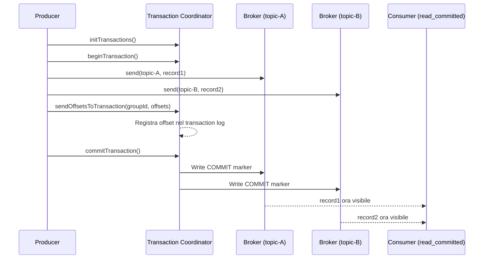

# Exactly-Once Semantics (EOS)

## Panoramica

Kafka supporta tre garanzie di delivery: **at-most-once** (possibile perdita dati), **at-least-once** (possibili duplicati) e **exactly-once** (nessuna perdita, nessun duplicato). EOS è la garanzia più forte e la più complessa da implementare. In Kafka, si articola in due livelli distinti: **producer idempotente** (EOS sul singolo topic/partizione) e **transazioni Kafka** (EOS end-to-end su più topic).

**Quando usarlo:** Sistemi finanziari (pagamenti, billing), audit log, qualsiasi scenario dove duplicati o perdita di record hanno impatto concreto.

**Quando NON usarlo:** Sistemi ad alto throughput dove la latenza aggiuntiva è inaccettabile, metriche e log dove qualche perdita o duplicato è tollerabile.

## Concetti Chiave

### Le tre garanzie di delivery

| Garanzia | Perdita dati | Duplicati | Come si ottiene |
|----------|-------------|-----------|-----------------|
| **At-most-once** | Possibile | No | acks=0, no retry |
| **At-least-once** | No | Possibili | acks=all + retry |
| **Exactly-once** | No | No | Idempotenza + transazioni |

### Producer Idempotente

Il producer idempotente garantisce che ogni record venga scritto **esattamente una volta** su una partizione, anche in presenza di retry. Meccanismo:
- Il producer riceve un **Producer ID (PID)** univoco dal broker alla prima connessione
- Ogni record riceve un **sequence number** incrementale per partizione
- Se il broker riceve un record con un sequence number già visto → scarta il duplicato
- Se il sequence number è troppo alto (record perso) → errore

```
Producer (PID=42)  →  Record [PID=42, seq=1]  →  Broker (scrive offset 100)
                   →  Record [PID=42, seq=1]  →  Broker (DUPLICATO → scarta, ritorna OK)
                   →  Record [PID=42, seq=2]  →  Broker (scrive offset 101)
```

### Transazioni Kafka (EOS end-to-end)

Le transazioni permettono di scrivere su **più topic/partizioni in modo atomico**: o tutti i record vengono scritti, o nessuno. Essenziale per il pattern **consume-transform-produce** (leggo da A, processo, scrivo su B — deve essere atomico).

- **Transaction Coordinator** — Broker speciale che gestisce il ciclo di vita delle transazioni
- **Transaction Log** — Topic interno `__transaction_state` dove vengono registrate le transazioni
- **Transaction Marker** — Record speciale (COMMIT o ABORT) scritto al termine di ogni transazione
- **Isolation Level** — I consumer devono usare `isolation.level=read_committed` per non vedere record di transazioni in corso o abortite

## Come Funziona



## Configurazione & Pratica

### Producer Idempotente

```java
Properties props = new Properties();
props.put(ProducerConfig.BOOTSTRAP_SERVERS_CONFIG, "kafka:9092");
props.put(ProducerConfig.KEY_SERIALIZER_CLASS_CONFIG, StringSerializer.class);
props.put(ProducerConfig.VALUE_SERIALIZER_CLASS_CONFIG, StringSerializer.class);

// ── EOS: Producer Idempotente ─────────────────────────────────────────────
props.put(ProducerConfig.ENABLE_IDEMPOTENCE_CONFIG, true);   // abilita idempotenza
// Implica automaticamente:
// acks=all
// max.in.flight.requests.per.connection <= 5
// retries = Integer.MAX_VALUE

// Opzionale ma raccomandato
props.put(ProducerConfig.COMPRESSION_TYPE_CONFIG, "snappy");

KafkaProducer<String, String> producer = new KafkaProducer<>(props);
```

### Producer Transazionale (EOS end-to-end)

```java
Properties props = new Properties();
props.put(ProducerConfig.BOOTSTRAP_SERVERS_CONFIG, "kafka:9092");
props.put(ProducerConfig.KEY_SERIALIZER_CLASS_CONFIG, StringSerializer.class);
props.put(ProducerConfig.VALUE_SERIALIZER_CLASS_CONFIG, StringSerializer.class);

// ── EOS: Transazioni ─────────────────────────────────────────────────────
props.put(ProducerConfig.ENABLE_IDEMPOTENCE_CONFIG, true);
props.put(ProducerConfig.TRANSACTIONAL_ID_CONFIG, "order-processor-1");
// transactional.id DEVE essere univoco per istanza del producer e stabile tra restart
// Esempio: "order-processor-{pod-name}" in Kubernetes

props.put(ProducerConfig.TRANSACTION_TIMEOUT_CONFIG, 60000);  // 60 secondi

KafkaProducer<String, String> producer = new KafkaProducer<>(props);

// Inizializzare le transazioni una volta sola all'avvio
producer.initTransactions();
```

### Pattern Consume-Transform-Produce con EOS

```java
KafkaConsumer<String, String> consumer = createConsumer();
KafkaProducer<String, String> producer = createTransactionalProducer();
producer.initTransactions();

consumer.subscribe(List.of("input-orders"));

while (true) {
    ConsumerRecords<String, String> records = consumer.poll(Duration.ofMillis(500));
    if (records.isEmpty()) continue;

    producer.beginTransaction();
    try {
        // ── 1. Processare e produrre output ───────────────────────────────
        for (ConsumerRecord<String, String> record : records) {
            String processed = transform(record.value());
            producer.send(new ProducerRecord<>("processed-orders", record.key(), processed));
        }

        // ── 2. Committare gli offset come parte della transazione ─────────
        // Questo garantisce che gli offset siano committati atomicamente con i record prodotti
        Map<TopicPartition, OffsetAndMetadata> offsets = new HashMap<>();
        for (TopicPartition partition : records.partitions()) {
            List<ConsumerRecord<String, String>> partitionRecords = records.records(partition);
            long lastOffset = partitionRecords.get(partitionRecords.size() - 1).offset();
            offsets.put(partition, new OffsetAndMetadata(lastOffset + 1));
        }
        producer.sendOffsetsToTransaction(offsets, consumer.groupMetadata());

        // ── 3. Commit atomico ─────────────────────────────────────────────
        producer.commitTransaction();

    } catch (Exception e) {
        producer.abortTransaction();
        // Il consumer verrà ribilanciato o rilascerà gli offset
        throw e;
    }
}
```

### Consumer con read_committed

```java
Properties consumerProps = new Properties();
consumerProps.put(ConsumerConfig.BOOTSTRAP_SERVERS_CONFIG, "kafka:9092");
consumerProps.put(ConsumerConfig.GROUP_ID_CONFIG, "my-consumer-group");
consumerProps.put(ConsumerConfig.KEY_DESERIALIZER_CLASS_CONFIG, StringDeserializer.class);
consumerProps.put(ConsumerConfig.VALUE_DESERIALIZER_CLASS_CONFIG, StringDeserializer.class);

// ── Essenziale per EOS ────────────────────────────────────────────────────
consumerProps.put(ConsumerConfig.ISOLATION_LEVEL_CONFIG, "read_committed");
// read_committed: vede solo record di transazioni committate
// read_uncommitted (default): vede tutti i record, inclusi quelli di transazioni in corso/abortite
```

### Kafka Streams EOS

```java
Properties streamsProps = new Properties();
streamsProps.put(StreamsConfig.APPLICATION_ID_CONFIG, "my-streams-app");
streamsProps.put(StreamsConfig.BOOTSTRAP_SERVERS_CONFIG, "kafka:9092");

// ── EOS in Kafka Streams ──────────────────────────────────────────────────
streamsProps.put(StreamsConfig.PROCESSING_GUARANTEE_CONFIG,
    StreamsConfig.EXACTLY_ONCE_V2);  // raccomandato (Kafka 2.6+)
    // Alternativa legacy: StreamsConfig.EXACTLY_ONCE_BETA
```

## Best Practices

!!! tip "Usare transactional.id stabile e unico per istanza"
    Il `transactional.id` deve essere lo stesso tra i restart del producer (così Kafka può fare zombie fencing) ma **diverso** per ogni istanza parallela del producer (per evitare conflitti di fencing).

!!! warning "EOS ha un overhead di latenza"
    Le transazioni aggiungono latenza (commit del transaction coordinator + marker nei topic). In sistemi ad alto throughput, valutare se EOS è necessario o se at-least-once + idempotenza lato consumer è sufficiente.

!!! warning "Non mischiare consumer read_committed e read_uncommitted"
    In un sistema EOS, tutti i consumer del topic devono usare `read_committed`, altrimenti alcuni consumer vedranno record di transazioni abortite.

!!! tip "Zombie fencing"
    Se un producer con lo stesso `transactional.id` di un producer "zombie" (es. pod riavviato lentamente) tenta di usare lo stesso ID, Kafka scarta il producer vecchio tramite l'**epoch** delle transazioni. Questo è automatico ma richiede `transactional.id` stabile.

## Troubleshooting

**ProducerFencedException**
- Un producer con lo stesso `transactional.id` è già attivo
- Assicurarsi che `transactional.id` sia univoco per istanza
- Se il pod si è riavviato, aspettare che il vecchio producer scada (`transaction.timeout.ms`)

**InvalidTxnStateException**
- Il producer sta cercando di fare operazioni fuori ordine (es. `send` prima di `beginTransaction`)
- Verificare il flusso del codice

**Consumer vede record duplicati con read_committed**
- Verificare che il producer usi `transactional.id` e `initTransactions()`
- Verificare che `sendOffsetsToTransaction` sia chiamato prima di `commitTransaction`

## Riferimenti

- [Kafka Exactly-Once Semantics](https://kafka.apache.org/documentation/#semantics)
- [KIP-98: Exactly Once Delivery](https://cwiki.apache.org/confluence/display/KAFKA/KIP-98+-+Exactly+Once+Delivery+and+Transactional+Messaging)
- [Kafka Streams EOS](https://kafka.apache.org/documentation/streams/developer-guide/config-streams.html#processing-guarantee)
- [Confluent: Exactly-Once Semantics](https://developer.confluent.io/courses/architecture/exactly-once-semantics/)
