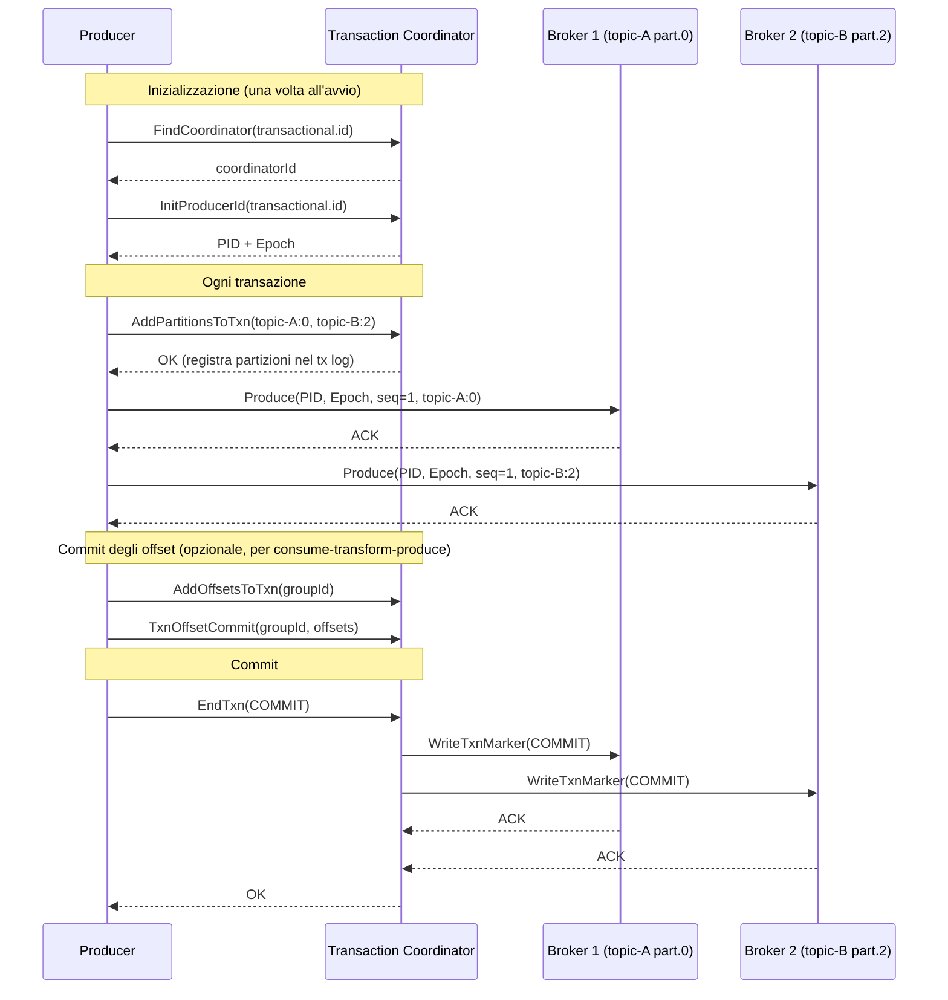

# Transazioni Kafka

## Panoramica

Le transazioni Kafka permettono di scrivere su **più topic e partizioni in modo atomico**: o tutti i record vengono committati, o nessuno. Questo è il fondamento del pattern **consume-transform-produce** con garanzia exactly-once. Le transazioni includono anche la capacità di committare gli **offset dei consumer** come parte della stessa transazione, garantendo che il processing di un record e la scrittura dell'output siano un'unica operazione atomica.

**Quando usarle:** Sistemi finanziari, aggregazione di eventi con output multipli, qualsiasi scenario dove è necessario garantire che il processing di un input e la scrittura dell'output siano atomici.

## Concetti Chiave

**transactional.id** — Identificatore stabile del producer. Permette al broker di identificare il producer tra i restart e di eseguire lo **zombie fencing**. Deve essere:
- Univoco per istanza di producer (diverso per ogni istanza parallela)
- Stabile tra i restart dello stesso producer (stesso nome dopo un restart)

**Transaction Coordinator** — Broker speciale che gestisce il ciclo di vita delle transazioni per un dato `transactional.id`. Determinato tramite hash: `hash(transactional.id) % num.partitions` del topic `__transaction_state`.

**Transaction Log** — Topic interno `__transaction_state` dove vengono scritti gli stati delle transazioni (ONGOING, PREPARE_COMMIT, COMPLETE_COMMIT, PREPARE_ABORT, COMPLETE_ABORT).

**Transaction Marker** — Record speciale scritto al termine di ogni transazione (COMMIT o ABORT) in ogni partizione toccata dalla transazione. I consumer `read_committed` attendono il marker prima di consegnare i record.

**Epoch** — Numero incrementale associato al `transactional.id`. Ogni nuovo produttore che si inizializza con lo stesso `transactional.id` riceve un epoch più alto. Il broker rifiuta le richieste con epoch inferiore (zombie fencing).

**Producer ID (PID)** — Identificativo interno del producer assegnato dal broker, usato insieme all'epoch per il tracking della sequenza e l'idempotenza.

## Ciclo di Vita di una Transazione



## Configurazione & Pratica

### Configurazione producer transazionale

```java
Properties props = new Properties();
props.put(ProducerConfig.BOOTSTRAP_SERVERS_CONFIG, "kafka:9092");
props.put(ProducerConfig.KEY_SERIALIZER_CLASS_CONFIG, StringSerializer.class);
props.put(ProducerConfig.VALUE_SERIALIZER_CLASS_CONFIG, StringSerializer.class);

// ── Configurazioni transazionali obbligatorie ─────────────────────────────
props.put(ProducerConfig.ENABLE_IDEMPOTENCE_CONFIG, true);
props.put(ProducerConfig.TRANSACTIONAL_ID_CONFIG, "payment-processor-instance-1");

// ── Timeout della transazione ────────────────────────────────────────────
// Se la transazione non viene committata/abortita entro questo timeout,
// il coordinator la aborta automaticamente
props.put(ProducerConfig.TRANSACTION_TIMEOUT_CONFIG, 30000);  // 30 secondi

// ── Impliciti con idempotenza ─────────────────────────────────────────────
// acks=all (automatico)
// max.in.flight.requests.per.connection=5 (automatico)
// retries=Integer.MAX_VALUE (automatico)

KafkaProducer<String, String> producer = new KafkaProducer<>(props);

// ── Inizializzazione (UNA SOLA VOLTA all'avvio) ───────────────────────────
// Recupera PID e incrementa l'epoch (zombie fencing)
producer.initTransactions();
```

### Transazione con scrittura su un singolo topic

```java
try {
    producer.beginTransaction();

    // Scritture atomiche su più partizioni dello stesso topic
    producer.send(new ProducerRecord<>("payments", "payment:101", paymentJson1));
    producer.send(new ProducerRecord<>("payments", "payment:102", paymentJson2));
    producer.send(new ProducerRecord<>("payments", "payment:103", paymentJson3));

    producer.commitTransaction();
    log.info("Transazione committata: 3 pagamenti");

} catch (ProducerFencedException | OutOfOrderSequenceException | AuthorizationException e) {
    // Errori fatali — il producer non è più utilizzabile
    producer.close();
    throw new RuntimeException("Producer fence — restart required", e);
} catch (KafkaException e) {
    // Errori recuperabili — aborta e riprova
    producer.abortTransaction();
    log.warn("Transazione abortita, retry possibile", e);
}
```

### Transazione con scrittura su topic multipli

```java
producer.beginTransaction();
try {
    // Scrittura su topic diversi — atomica
    producer.send(new ProducerRecord<>("orders-created", orderId, orderJson));
    producer.send(new ProducerRecord<>("inventory-reserved", orderId, inventoryJson));
    producer.send(new ProducerRecord<>("payment-requested", orderId, paymentJson));

    producer.commitTransaction();

} catch (Exception e) {
    producer.abortTransaction();
    // Nessuno dei tre record è visibile ai consumer
    throw e;
}
```

### Consume-Transform-Produce con commit degli offset atomico

```java
KafkaConsumer<String, String> consumer = createConsumerWithReadCommitted();
KafkaProducer<String, String> producer = createTransactionalProducer();
producer.initTransactions();

consumer.subscribe(List.of("raw-events"));

while (running) {
    ConsumerRecords<String, String> records = consumer.poll(Duration.ofMillis(200));
    if (records.isEmpty()) continue;

    producer.beginTransaction();
    try {
        // 1. Processare i record
        List<ProducerRecord<String, String>> outputs = records.records("raw-events")
            .stream()
            .map(r -> new ProducerRecord<>("processed-events", r.key(), transform(r.value())))
            .collect(toList());

        // 2. Inviare l'output
        outputs.forEach(producer::send);

        // 3. Committare gli offset DEL CONSUMER come parte della transazione
        // Questo è il meccanismo chiave: se la transazione viene abortita,
        // anche gli offset vengono rollback-ati
        Map<TopicPartition, OffsetAndMetadata> offsetsToCommit = new HashMap<>();
        for (TopicPartition partition : records.partitions()) {
            List<ConsumerRecord<String, String>> partitionRecords = records.records(partition);
            long lastOffset = partitionRecords.get(partitionRecords.size() - 1).offset();
            offsetsToCommit.put(partition, new OffsetAndMetadata(lastOffset + 1));
        }
        producer.sendOffsetsToTransaction(offsetsToCommit, consumer.groupMetadata());

        // 4. Commit atomico: output + offset
        producer.commitTransaction();

    } catch (Exception e) {
        producer.abortTransaction();
        // Il consumer non ha committato → rileggerà gli stessi record al prossimo poll
        log.error("Transazione abortita, record saranno riletti", e);
    }
}
```

### Configurazione broker per le transazioni

```properties
# server.properties
# Replication factor del transaction state log (produzione: 3)
transaction.state.log.replication.factor=3
transaction.state.log.min.isr=2

# Timeout massimo per una transazione aperta
transaction.max.timeout.ms=900000    # 15 minuti (default)

# Retention del transaction state log
transactional.id.expiration.ms=604800000  # 7 giorni
```

## Best Practices

!!! tip "transactional.id deve essere unico per istanza"
    In un deployment con 3 istanze dell'applicazione, usare ID come `order-processor-0`, `order-processor-1`, `order-processor-2`. In Kubernetes, usare il nome del pod come suffisso.

!!! warning "Non condividere un producer transazionale tra thread"
    Il `KafkaProducer` è thread-safe per le operazioni di `send`, ma le transazioni devono essere gestite sequenzialmente da un singolo thread (un thread non può aprire una nuova transazione mentre un altro thread ne sta gestendo un'altra).

!!! tip "Gestire ProducerFencedException come errore fatale"
    Quando si riceve `ProducerFencedException`, il producer è stato sostituito da un'istanza più recente con lo stesso `transactional.id`. Non tentare di recuperare — creare un nuovo producer.

!!! warning "transaction.timeout troppo lungo aumenta il rischio di dangling transactions"
    Una transazione lunga blocca la garbage collection del log per tutte le partizioni toccate. Mantenere `transaction.timeout.ms` proporzionale alla durata effettiva delle transazioni.

## Troubleshooting

**Tabella eccezioni e azioni**

| Eccezione | Causa | Azione |
|-----------|-------|--------|
| `ProducerFencedException` | Altro producer con stesso transactional.id | Chiudere il producer e creare un nuovo |
| `OutOfOrderSequenceException` | Sequenza degli offset non valida | Chiudere il producer e creare un nuovo |
| `InvalidTransactionStateException` | Chiamata API fuori ordine | Correggere il flusso del codice |
| `TransactionAbortedException` | Il coordinator ha abortito la transazione | Abortire e riprovare |
| `KafkaException` (altri) | Errori recuperabili | `abortTransaction()` + retry |

**Consumer vede record "parziali" nonostante le transazioni**
- Verificare che il consumer usi `isolation.level=read_committed`
- Con `read_uncommitted` (default), il consumer vede tutti i record inclusi quelli di transazioni abortite o in corso

**Transazioni lente**
- Il commit della transazione richiede round-trip con il Transaction Coordinator e tutti i broker toccati dalla transazione
- Ridurre il numero di partizioni toccate per transazione
- Verificare la latenza di rete tra broker
- Considerare se l'overhead EOS è accettabile per il use case specifico

## Riferimenti

- [Kafka Transactions](https://kafka.apache.org/documentation/#transactions)
- [KIP-98: Exactly Once Delivery and Transactional Messaging](https://cwiki.apache.org/confluence/display/KAFKA/KIP-98+-+Exactly+Once+Delivery+and+Transactional+Messaging)
- [Confluent: Transactions in Apache Kafka](https://www.confluent.io/blog/transactions-apache-kafka/)
