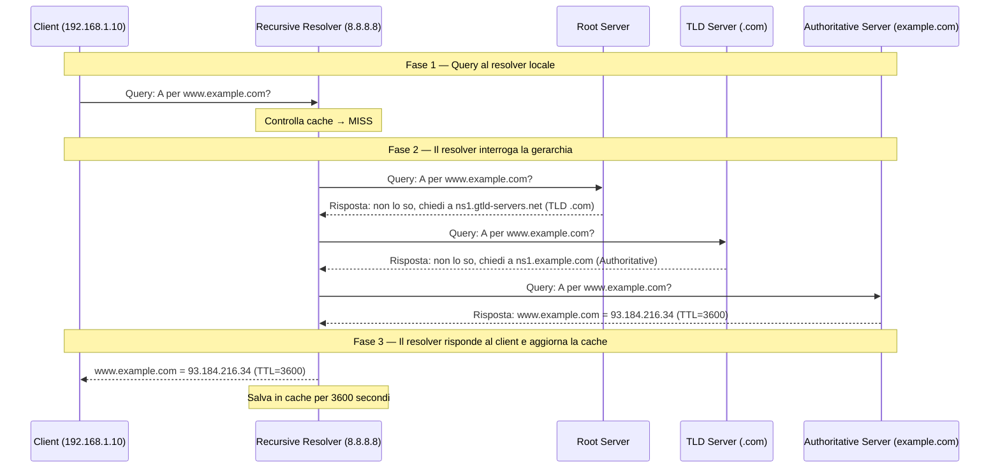

# DNS — Domain Name System

## Panoramica

Il DNS (Domain Name System) è il sistema distribuito che traduce i nomi di dominio leggibili dall'uomo (come `www.example.com`) in indirizzi IP usabili dai computer (come `93.184.216.34`). È stato progettato da Paul Mockapetris nel 1983 (RFC 882/883, poi standardizzato in RFC 1034/1035) come sostituzione scalabile del file `HOSTS.TXT` distribuito manualmente. Il DNS è un'infrastruttura critica: senza di esso, ogni applicazione che usa nomi di dominio — cioè praticamente tutto — smette di funzionare. In ambito DevOps, il DNS è fondamentale non solo per la connettività esterna, ma anche all'interno dei cluster Kubernetes (CoreDNS), per il service discovery, per la gestione di certificati TLS e per le strategie di deployment (DNS-based blue/green, canary).

### Gerarchia DNS

Il DNS è organizzato in una gerarchia globale a tre livelli:

```
.                          (root zone — gestita da IANA/ICANN, 13 cluster di root server)
├── .com                   (TLD — Top Level Domain, gestito da Verisign)
│   ├── example.com        (zona autoritativa — gestita dal proprietario del dominio)
│   │   ├── www.example.com
│   │   └── mail.example.com
│   └── google.com
├── .org
├── .io
└── .it                    (ccTLD — gestito da Registro.it in Italia)
```

## Concetti Chiave

### Recursive Resolver vs Authoritative Name Server

| Tipo | Ruolo | Chi lo gestisce | Esempi |
|---|---|---|---|
| **Recursive Resolver** | Riceve la query dal client, interroga la gerarchia DNS per suo conto, restituisce la risposta finale. Implementa caching. | ISP (Internet Service Provider), Google (8.8.8.8), Cloudflare (1.1.1.1), aziende | 8.8.8.8, 1.1.1.1, 9.9.9.9 |
| **Root Name Server** | Conosce la posizione degli authoritative server per ogni TLD | IANA/ICANN (13 cluster globali, centinaia di istanze anycast — tecnica che assegna lo stesso IP a più server distribuiti geograficamente, instradando verso il più vicino) | a.root-servers.net … m.root-servers.net |
| **TLD Name Server** | Conosce la posizione degli authoritative server per ogni dominio nel TLD | Registry (Verisign per .com, ecc.) | a.gtld-servers.net |
| **Authoritative Name Server** | Detiene la zona ufficiale per il dominio; risponde con la risposta definitiva | Proprietario del dominio, DNS provider | ns1.cloudflare.com, Route53 |

### TTL (Time To Live)

Il TTL di un record DNS indica per quanti secondi il record può essere conservato nella cache. Valori tipici:

| TTL | Valore | Uso Tipico |
|---|---|---|
| 60s | Molto basso | Pre-migrazione; massima flessibilità ma alto carico sui resolver |
| 300s | Basso | Servizi che cambiano frequentemente |
| 3600s | Medio | Default comune per record dinamici |
| 86400s | Alto (1 giorno) | Record stabili (MX, NS) |
| 172800s | Molto alto (2 giorni) | NS dei TLD |

### Zone File

Una zone file è il file di configurazione che contiene tutti i record DNS di un dominio. Il record SOA (Start of Authority) è il primo record e definisce i parametri della zona.

```
$ORIGIN example.com.
$TTL 3600

; SOA Record
@  IN SOA  ns1.example.com. admin.example.com. (
           2024020101  ; Serial (YYYYMMDDNN)
           3600        ; Refresh
           900         ; Retry
           604800      ; Expire
           300 )       ; Negative TTL

; NS Records
@  IN NS   ns1.example.com.
@  IN NS   ns2.example.com.

; A Records
@          IN A      93.184.216.34
www        IN A      93.184.216.34
ns1        IN A      198.51.100.1
ns2        IN A      198.51.100.2

; AAAA Record
@          IN AAAA   2606:2800:220:1:248:1893:25c8:1946

; MX Records
@          IN MX 10  mail1.example.com.
@          IN MX 20  mail2.example.com.

; CNAME
blog       IN CNAME  www.example.com.

; TXT
@          IN TXT    "v=spf1 include:_spf.google.com ~all"
```

## Come Funziona

### Risoluzione DNS Completa (Iterativa)



### Risoluzione Ricorsiva vs Iterativa

- **Ricorsiva**: il client delega tutto al resolver. Il resolver interroga la gerarchia per conto del client e restituisce la risposta finale. Il client fa solo una query.
- **Iterativa**: il client interroga direttamente la gerarchia, ricevendo ad ogni step un riferimento al server successivo. Usato internamente dai resolver.

## Tipi di Record DNS

| Tipo | Descrizione | Esempio |
|---|---|---|
| **A** | Mappa un hostname a un indirizzo IPv4 | `www.example.com. 3600 IN A 93.184.216.34` |
| **AAAA** | Mappa un hostname a un indirizzo IPv6 | `www.example.com. 3600 IN AAAA 2606:2800:220:1::` |
| **CNAME** | Alias — punta a un altro hostname (non a un IP). Non usabile per la root del dominio (@). | `blog.example.com. IN CNAME www.example.com.` |
| **MX** | Mail Exchange — server SMTP per il dominio. Ha una priorità (numero più basso = preferito) | `example.com. IN MX 10 mail.example.com.` |
| **TXT** | Testo arbitrario. Usato per SPF (Sender Policy Framework — autorizza i server email), DKIM (DomainKeys Identified Mail — firma crittografica delle email), DMARC (Domain-based Message Authentication — policy di autenticazione email), e verifica proprietà dominio | `example.com. IN TXT "v=spf1 include:_spf.google.com ~all"` |
| **SRV** | Localizzazione di servizi generici. Formato: `_service._proto.name TTL IN SRV priority weight port target` | `_https._tcp.example.com. IN SRV 10 5 443 www.example.com.` |
| **PTR** | Reverse DNS — mappa un IP a un hostname. Usato in `in-addr.arpa` | `34.216.184.93.in-addr.arpa. IN PTR www.example.com.` |
| **NS** | Name Server — i server autoritativi per il dominio | `example.com. IN NS ns1.example.com.` |
| **SOA** | Start of Authority — parametri della zona (serial, refresh, retry, expire, negative TTL) | *(vedi zone file sopra)* |
| **CAA** | Certification Authority Authorization — quale CA può emettere certificati per il dominio | `example.com. IN CAA 0 issue "letsencrypt.org"` |

!!! note "CNAME vs A Record"
    Un CNAME non può coesistere con altri record dello stesso nome (eccezione: CNAME Flattening/ALIAS record implementato da alcuni provider DNS come Cloudflare). Non usare mai CNAME per il root del dominio (`@` / `example.com`) perché romperebbe i record NS e SOA.

## DNS in Kubernetes

In Kubernetes, il DNS interno è gestito da **CoreDNS** (sostituisce kube-dns dalla versione 1.13).

### FQDN dei Servizi Kubernetes

```
<service-name>.<namespace>.svc.<cluster-domain>

# Esempi (cluster-domain default: cluster.local)
my-service.default.svc.cluster.local       # Servizio nel namespace default
postgres.database.svc.cluster.local        # Servizio nel namespace database
```

All'interno dello stesso namespace si può usare solo il nome del servizio:

```bash
# Da un pod nel namespace "default"
curl http://my-service              # Funziona (stesso namespace)
curl http://my-service.default      # Funziona
curl http://my-service.default.svc.cluster.local  # FQDN completo

# Da un pod in un namespace diverso
curl http://my-service              # Non funziona (namespace sbagliato)
curl http://my-service.default      # Funziona
```

### Configurazione DNS dei Pod

```yaml
# Personalizzare DNS per un pod specifico
apiVersion: v1
kind: Pod
spec:
  dnsPolicy: ClusterFirst  # Default — usa CoreDNS, poi upstream
  # Opzioni: ClusterFirst | ClusterFirstWithHostNet | Default | None
  dnsConfig:
    nameservers:
      - 8.8.8.8
    searches:
      - my-namespace.svc.cluster.local
      - svc.cluster.local
    options:
      - name: ndots
        value: "2"  # Numero di dots prima di considerare il nome assoluto
```

### ConfigMap CoreDNS

```yaml
apiVersion: v1
kind: ConfigMap
metadata:
  name: coredns
  namespace: kube-system
data:
  Corefile: |
    .:53 {
        errors
        health {
           lameduck 5s
        }
        ready
        kubernetes cluster.local in-addr.arpa ip6.arpa {
           pods insecure
           fallthrough in-addr.arpa ip6.arpa
           ttl 30
        }
        prometheus :9153
        forward . /etc/resolv.conf {
           max_concurrent 1000
        }
        cache 30
        loop
        reload
        loadbalance
    }
```

## Sicurezza

### DNSSEC

DNSSEC (DNS Security Extensions, RFC 4033-4035) aggiunge firme crittografiche ai record DNS per proteggere dall'avvelenamento della cache (DNS cache poisoning). Il resolver verifica la firma prima di accettare la risposta.

```
Chain of Trust: Root Zone → TLD → Authoritative Server
Ogni livello firma i record del livello inferiore con chiavi crittografiche.
```

!!! warning "Limitazione DNSSEC"
    DNSSEC protegge l'integrità dei record DNS ma NON cifra il traffico DNS. Le query DNS rimangono visibili in chiaro sulla rete. Per la privacy, usare DoH o DoT.

### DNS over HTTPS (DoH) e DNS over TLS (DoT)

| Protocollo | Porta | Cifratura | Pro | Contro |
|---|---|---|---|---|
| **DNS tradizionale** | 53 UDP/TCP | Nessuna | Veloce, universale | Query visibili, intercettabili |
| **DoT** (RFC 7858) | 853 TCP | TLS | Cifratura, firewall riconoscibile | Porta dedicata facile da bloccare |
| **DoH** (RFC 8484) | 443 TCP | TLS via HTTPS | Cifratura, difficile da bloccare | Mescola con traffico web, più latenza |

### DNS Cache Poisoning

Un attaccante che riesce a iniettare record DNS falsi nella cache di un resolver può dirottare il traffico verso server malevoli. Mitigazioni:

- DNSSEC (verifica crittografica)
- Query ID randomization (ora standard in tutti i resolver moderni)
- Port randomization per le query upstream
- DNS Response Rate Limiting (RRL) sui server autoritativi

## Configurazione & Pratica

### Comandi `dig` Essenziali

```bash
# Query A record (IPv4)
dig www.example.com A

# Query AAAA record (IPv6)
dig www.example.com AAAA

# Query MX record (mail server)
dig example.com MX

# Query TXT record (SPF, DKIM, etc.)
dig example.com TXT

# Reverse DNS lookup (PTR)
dig -x 93.184.216.34

# Tracciare la risoluzione completa (dal root)
dig +trace www.example.com

# Output breve (solo la risposta)
dig +short www.example.com

# Specificare un resolver alternativo
dig @8.8.8.8 www.example.com
dig @1.1.1.1 www.example.com

# Verificare il TTL rimanente in cache
dig +ttlunits www.example.com

# Query DNSSEC
dig +dnssec www.cloudflare.com

# Verificare tutti i record di una zona (se il server lo permette — AXFR: zone transfer, trasferimento completo della zona DNS)
dig @ns1.example.com example.com AXFR
```

### Comandi `nslookup`

```bash
# Query semplice
nslookup www.example.com

# Query con resolver specifico
nslookup www.example.com 8.8.8.8

# Modalità interattiva
nslookup
> set type=MX
> example.com
> set type=NS
> example.com
> exit
```

### Verifica TTL e Propagazione

```bash
# Verificare il TTL attuale di un record (per pianificare la migrazione)
dig +noall +answer www.example.com
# Risposta: www.example.com. 2847 IN A 93.184.216.34
#           il numero (2847) è il TTL rimanente in secondi

# Verificare la propagazione su multiple locazioni (usa DNS checker online)
# Oppure con dig verso resolver diversi
for ns in 8.8.8.8 1.1.1.1 9.9.9.9 208.67.222.222; do
    echo -n "Resolver $ns: "
    dig @$ns +short www.example.com A
done
```

## Best Practices

- **Abbassa il TTL prima di una migrazione**: almeno 24-48 ore prima di cambiare un record A, abbassa il TTL a 60-300s. Dopo la migrazione, puoi rialzarlo. Se non lo fai, alcuni client potrebbero usare il vecchio IP per ore o giorni.
- **Usa TTL alti per record stabili**: record MX, NS e altri record che cambiano raramente dovrebbero avere TTL di 86400s (1 giorno) o più. Riduce il carico sui resolver.
- **Split-horizon DNS**: usa server DNS diversi per la rete interna e per internet. La rete interna risolve `app.example.com` all'IP privato; internet lo risolve all'IP pubblico. Implementato con view in BIND9 o con Route53 Private Hosted Zones.
- **Monitora la scadenza dei record**: includi i record DNS nel monitoring (specialmente se usi DNSSEC, che richiede rotazione delle chiavi).
- **Non usare CNAME per il root del dominio (@)**: molti provider DNS offrono un record ALIAS o CNAME Flattening per aggirare questa limitazione.
- **Documenta la zona**: mantieni la zone file versionata in Git. Le modifiche DNS non tracciate sono una fonte frequente di incidenti.

## Troubleshooting

### DNS Non Risolve

```bash
# Step 1: Verificare la configurazione del resolver locale
cat /etc/resolv.conf
# Se vuoto o sbagliato → problema di configurazione di rete locale

# Step 2: Test con resolver pubblico
dig @8.8.8.8 www.example.com A
# Se funziona con 8.8.8.8 ma non con il resolver locale → problema nel resolver locale

# Step 3: Tracciare la risoluzione completa
dig +trace www.example.com
# Mostra ogni step della risoluzione; il fallimento indica quale server è problematico

# Step 4: Verificare connettività al resolver DNS
nc -zv 8.8.8.8 53
# Se TCP 53 è bloccato, il firewall impedisce le query DNS

# Step 5: Test con UDP (DNS usa UDP/53 di default)
dig @8.8.8.8 www.example.com +notcp
```

### Record Errato (Propagazione in Corso)

```bash
# Verificare quale valore è in cache nel resolver
dig www.example.com +noall +answer
# Il TTL restituito mostra quanto tempo rimane nella cache

# Forzare una nuova risoluzione bypassando la cache locale
# (Non funziona con cache del resolver remoto, solo cache locale)
systemd-resolve --flush-caches  # systemd-resolved
sudo killall -HUP dnsmasq       # dnsmasq

# Verificare il valore direttamente sull'authoritative server
dig @ns1.example.com www.example.com +noall +answer
```

### DNS in Kubernetes Non Funziona

```bash
# Verificare che CoreDNS sia in running
kubectl get pods -n kube-system -l k8s-app=kube-dns

# Test di risoluzione da un pod
kubectl run -it --rm debug --image=busybox --restart=Never -- nslookup kubernetes.default

# Verificare la configurazione CoreDNS
kubectl get configmap coredns -n kube-system -o yaml

# Controllare i log di CoreDNS
kubectl logs -n kube-system -l k8s-app=kube-dns --tail=100

# Test di risoluzione DNS da dentro un pod applicativo
kubectl exec -it <pod-name> -- nslookup my-service.my-namespace.svc.cluster.local
kubectl exec -it <pod-name> -- cat /etc/resolv.conf
```

## Riferimenti

- [RFC 1034 — Domain Names: Concepts and Facilities](https://www.rfc-editor.org/rfc/rfc1034)
- [RFC 1035 — Domain Names: Implementation and Specification](https://www.rfc-editor.org/rfc/rfc1035)
- [RFC 4033/4034/4035 — DNSSEC](https://www.rfc-editor.org/rfc/rfc4033)
- [RFC 8484 — DNS Queries over HTTPS (DoH)](https://www.rfc-editor.org/rfc/rfc8484)
- [CoreDNS — Documentazione Ufficiale](https://coredns.io/manual/toc/)
- [DNS in Kubernetes — Documentazione Kubernetes](https://kubernetes.io/docs/concepts/services-networking/dns-pod-service/)
- [Cloudflare Learning: What is DNS?](https://www.cloudflare.com/learning/dns/what-is-dns/)
