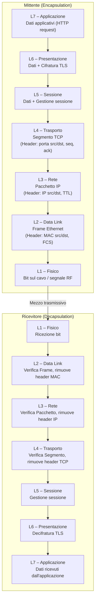

# Modello OSI

## Panoramica

Il modello OSI (Open Systems Interconnection) è uno standard ISO (ISO/IEC 7498-1) che descrive come i sistemi di comunicazione devono essere strutturati in sette livelli gerarchici e indipendenti. È stato creato negli anni '80 per risolvere il problema dell'interoperabilità tra sistemi di vendor diversi, fornendo un linguaggio comune per descrivere e progettare protocolli di rete. Nella pratica quotidiana, il modello OSI non è implementato direttamente (il TCP/IP lo ha sostituito) ma rimane lo strumento di riferimento indispensabile per il troubleshooting: permette di isolare rapidamente a quale livello si trova un problema di rete. Quando qualcosa non funziona, si usa OSI per rispondere alla domanda "il problema è fisico, di routing, di trasporto o applicativo?".

## Concetti Chiave

### I Sette Livelli OSI

| Layer | Nome | Funzione Principale | Protocolli / Standard |
|---|---|---|---|
| **7** | **Applicazione** | Interfaccia tra applicazione e rete; fornisce servizi di rete all'utente finale | HTTP, HTTPS, FTP, SMTP, DNS, SSH, SNMP, LDAP |
| **6** | **Presentazione** | Traduzione dei dati, serializzazione, cifratura/decifratura, compressione | TLS/SSL, JPEG, MPEG, ASCII, UTF-8, ASN.1, XDR |
| **5** | **Sessione** | Instaurazione, gestione e terminazione delle sessioni di comunicazione | NetBIOS, RPC, PPTP, SIP (parziale), NFS |
| **4** | **Trasporto** | Trasferimento affidabile (o no) dei dati end-to-end; controllo del flusso e degli errori | TCP, UDP, SCTP, QUIC |
| **3** | **Rete** | Instradamento dei pacchetti tra reti diverse; indirizzamento logico | IP (IPv4/IPv6), ICMP, OSPF, BGP, ARP |
| **2** | **Collegamento dati** | Trasferimento affidabile dei frame tra due nodi adiacenti; indirizzamento fisico (MAC) | Ethernet, Wi-Fi (802.11), PPP, VLAN (802.1Q), STP |
| **1** | **Fisico** | Trasmissione dei bit grezzi sul mezzo fisico; definisce tensioni, frequenze, connettori | Ethernet (cablaggio), Fiber, DSL, USB, Bluetooth (PHY) |

### PDU per Livello

Ogni livello incapsula i dati in una struttura chiamata PDU (Protocol Data Unit):

| Layer | PDU Name |
|---|---|
| 7 – Applicazione | Data |
| 6 – Presentazione | Data |
| 5 – Sessione | Data |
| 4 – Trasporto | Segmento (TCP) / Datagramma (UDP) |
| 3 – Rete | Pacchetto |
| 2 – Collegamento Dati | Frame |
| 1 – Fisico | Bit |

## Come Funziona

### Incapsulazione e Decapsulazione

Quando un'applicazione invia dati, questi vengono "avvolti" in header successivi mentre scendono dallo stack. Il ricevitore li "svolge" risalendo lo stack.



### Regola dei Layer Adiacenti

Ogni livello comunica solo con i livelli adiacenti: riceve servizi dal livello inferiore e li offre al livello superiore. Il livello N vede solo il suo header; tutto ciò che viene dal livello N+1 è "payload" opaco.

## Confronto con TCP/IP

| Livelli OSI | Livelli TCP/IP |
|---|---|
| 7 – Applicazione | Applicazione |
| 6 – Presentazione | Applicazione |
| 5 – Sessione | Applicazione |
| 4 – Trasporto | Trasporto |
| 3 – Rete | Internet |
| 2 – Collegamento Dati | Accesso alla Rete (Link) |
| 1 – Fisico | Accesso alla Rete (Link) |

Il modello TCP/IP collassa i layer 5, 6, 7 di OSI in un unico layer "Applicazione" e i layer 1 e 2 in un unico layer "Link". TCP/IP è il modello implementato nella realtà; OSI è il modello di riferimento per il ragionamento e il troubleshooting.

## Uso nel Troubleshooting

Il metodo OSI per il troubleshooting segue un approccio sistematico: si parte dal basso (Layer 1) e si sale, o si parte dall'alto e si scende, fino a isolare il livello problematico.

### Approccio Bottom-Up (il più comune)

```
L1 → Il cavo è connesso? Il LED di link è acceso?
L2 → ARP funziona? Il MAC è raggiungibile? VLAN corretta?
L3 → ping funziona? La route esiste? IP corretto?
L4 → La porta TCP/UDP è aperta? Il firewall blocca?
L7 → Il servizio risponde? Autenticazione? Certificato valido?
```

### Esempi Pratici

| Sintomo | Layer Sospettato | Diagnosi |
|---|---|---|
| Nessuna connettività, LED spento | L1 – Fisico | Cavo, porta switch, NIC |
| `ping` fallisce verso il gateway, ma L1 ok | L2 – Data Link | ARP non risolve, VLAN sbagliata |
| `ping` verso gateway ok, ma non verso internet | L3 – Rete | Route mancante, NAT (Network Address Translation) non configurato |
| `ping` funziona, ma TCP non si connette | L4 – Trasporto | Firewall blocca la porta, servizio non in ascolto |
| Connessione TCP ok, ma risposta HTTP 401 | L7 – Applicazione | Errore di autenticazione |
| Connessione TLS fallisce | L6 – Presentazione | Certificato scaduto, cipher incompatibile |

!!! tip "Suggerimento"
    Quando un collega descrive un problema di rete, chiediti sempre: "A quale layer si trova il problema?". Questo orienta immediatamente gli strumenti di diagnosi da usare (`ping` per L3, `telnet`/`nc` per L4, `curl` per L7).

!!! warning "Attenzione"
    Nei moderni stack TLS, la cifratura avviene nel Layer 6 (Presentazione) del modello OSI, ma nel Layer 4 (Trasporto) del TCP/IP. Questa asimmetria causa spesso confusione. Ricorda che OSI è un modello astratto.

## Best Practices

- **Usa OSI come lingua comune**: quando parli con altri ingegneri o apri un ticket, specifica il layer ("problema a L3", "il firewall blocca a L4") per eliminare ambiguità.
- **Troubleshoot sistematicamente**: non saltare livelli. Un problema a L7 può essere causato da qualcosa a L3 (routing asimmetrico che spezza il three-way handshake TCP).
- **Conosci i tuoi strumenti per layer**:
  - L1: `ethtool`, `ip link`, LED fisici
  - L2: `arp`, `bridge fdb`, Wireshark (frame Ethernet)
  - L3: `ping`, `ip route`, `traceroute`
  - L4: `ss`, `netstat`, `nc`, `telnet`
  - L7: `curl`, `dig`, `openssl s_client`

## Troubleshooting

### Scenario 1 — Nessuna connettività di rete (sospetto L1/L2)

**Sintomo:** Il host non comunica con nessun altro nodo, nemmeno il gateway. Il LED della NIC è spento o lampeggia in modo anomalo.

**Causa:** Problema fisico (cavo scollegato, porta switch guasta, NIC difettosa) o L2 (VLAN errata, STP in blocking, indirizzo MAC non appreso).

**Soluzione:** Verificare L1 prima di tutto, poi salire a L2.

```bash
# L1 — verifica stato interfaccia e link
ip link show eth0
ethtool eth0 | grep "Link detected"

# L2 — verifica ARP e tabella MAC
ip neigh show
arp -n
# Su switch: verificare VLAN membership e STP state
bridge link show
```

---

### Scenario 2 — `ping` fallisce verso host remoto ma gateway è raggiungibile (sospetto L3)

**Sintomo:** `ping 192.168.1.1` (gateway) risponde, ma `ping 8.8.8.8` o un host su un'altra subnet non risponde.

**Causa:** Route mancante o errata, default gateway non configurato, NAT assente su border router, policy di firewall a L3 che droppano i pacchetti ICMP.

**Soluzione:** Ispezionare la routing table e tracciare il percorso.

```bash
# Verificare routing table
ip route show
ip route get 8.8.8.8        # quale route viene usata per questa dest?

# Tracciare il percorso hop-by-hop
traceroute 8.8.8.8
traceroute -n 8.8.8.8       # senza risoluzione DNS (più veloce)

# Controllare se ICMP è filtrato ma il routing funziona
# (usa TCP invece di ICMP)
traceroute -T -p 80 8.8.8.8
```

---

### Scenario 3 — `ping` funziona ma la connessione TCP non si stabilisce (sospetto L4)

**Sintomo:** `ping <host>` risponde correttamente (L3 ok), ma `curl`, `telnet`, o la propria applicazione non riesce a connettersi alla porta target. Il three-way handshake TCP non completa.

**Causa:** Firewall (iptables, security group, ACL) che blocca la porta specifica; servizio non in ascolto sulla porta attesa; conntrack table piena; porta in TIME_WAIT che impedisce il riutilizzo.

**Soluzione:** Verificare che il servizio sia in ascolto e che non ci siano regole di firewall bloccanti.

```bash
# Verificare se la porta è aperta sul host remoto
nc -zv <host> <porta>
telnet <host> <porta>

# Sul host target: verificare che il servizio ascolti
ss -tlnp | grep <porta>
netstat -tlnp | grep <porta>

# Controllare regole iptables (su Linux)
iptables -L -n -v | grep <porta>

# Verificare conntrack (se disponibile)
conntrack -L | wc -l        # numero connessioni tracciate
cat /proc/sys/net/netfilter/nf_conntrack_max
```

---

### Scenario 4 — Handshake TLS fallisce o certificato non valido (sospetto L6)

**Sintomo:** La connessione TCP si stabilisce (L4 ok), ma il client riceve un errore TLS: `SSL_ERROR_RX_RECORD_TOO_LONG`, `certificate verify failed`, `handshake failure`, o il browser mostra "Connessione non privata".

**Causa:** Certificato scaduto, CN/SAN non corrispondente all'hostname, CA radice non fidata nel client, cipher suite incompatibile tra client e server, ALPN mismatch.

**Soluzione:** Esaminare il certificato e la negoziazione TLS con `openssl`.

```bash
# Visualizzare il certificato presentato dal server
openssl s_client -connect <host>:443 -servername <host> 2>/dev/null | \
  openssl x509 -noout -dates -subject -issuer

# Verificare la catena di certificati completa
openssl s_client -connect <host>:443 -showcerts

# Testare cipher suite supportate
nmap --script ssl-enum-ciphers -p 443 <host>

# Debug completo della negoziazione TLS
openssl s_client -connect <host>:443 -tls1_2 -debug 2>&1 | head -50
curl -v --tlsv1.2 https://<host>/
```

## Riferimenti

- [ISO/IEC 7498-1 — OSI Basic Reference Model](https://www.iso.org/standard/20269.html)
- [RFC 1122 — Requirements for Internet Hosts](https://www.rfc-editor.org/rfc/rfc1122)
- Andrew S. Tanenbaum, David J. Wetherall — *Computer Networks*, 5th Edition
- [OSI Model — Cloudflare Learning](https://www.cloudflare.com/learning/ddos/glossary/open-systems-interconnection-model-osi/)
