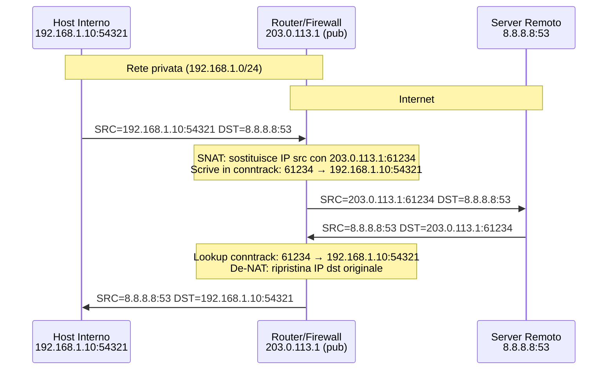
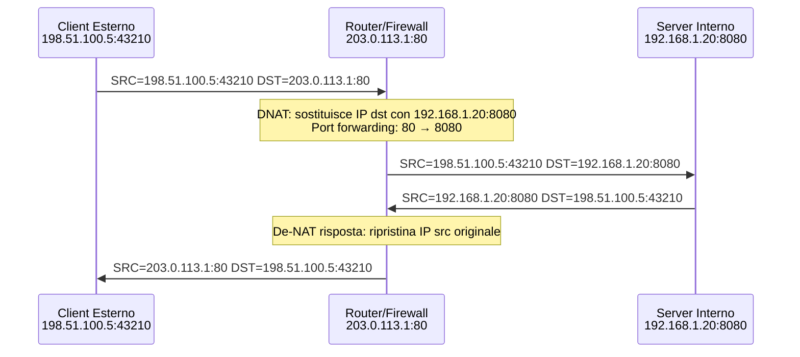

# NAT — Network Address Translation

## Panoramica

NAT (Network Address Translation) è la tecnica che permette di modificare gli indirizzi IP (e opzionalmente le porte) nei pacchetti mentre transitano attraverso un router o un firewall. Nato come soluzione all'esaurimento degli indirizzi IPv4 (RFC 1631, 1994), NAT è oggi onnipresente: ogni router casalingo, ogni cloud provider, ogni cluster Kubernetes lo usa in forme diverse. L'idea fondamentale è che un singolo indirizzo IP pubblico può rappresentare centinaia o migliaia di host con indirizzi IP privati (RFC 1918), traducendo dinamicamente gli indirizzi nel passaggio tra rete privata e pubblica. In ambito DevOps è impossibile diagnosticare problemi di connettività, configurare regole firewall o comprendere il networking Kubernetes senza capire come funziona NAT.

NAT **non** è una tecnologia di sicurezza — è una tecnologia di traduzione degli indirizzi. La sicurezza eventuale è un effetto collaterale (gli host interni non sono raggiungibili dall'esterno per default), non l'obiettivo primario. Non si deve mai affidarsi al NAT come unico meccanismo di sicurezza.

## Concetti Chiave

### Tipi di NAT

| Tipo | Alias | Cosa viene modificato | Direzione tipica | Caso d'uso |
|---|---|---|---|---|
| **SNAT** (Source NAT) | IP Masquerade, Overload NAT, PAT | IP sorgente (+ porta sorgente) | Uscita: LAN → Internet | Host privati che accedono a Internet |
| **DNAT** (Destination NAT) | Port Forwarding, Port Mapping | IP destinazione (+ porta destinazione) | Ingresso: Internet → LAN | Esporre un server interno su Internet |
| **Static NAT** | One-to-one NAT | IP sorgente (fisso) | Bidirezionale | Traduzione fissa 1:1 tra IP pubblico e privato |
| **Dynamic NAT** | NAT Pool | IP sorgente (da pool) | Uscita | Pool di IP pubblici condivisi (raro oggi) |
| **Full Cone NAT** | — | IP sorgente | Uscita | Tutti i pacchetti esterni verso IP:porta tradotta arrivano all'host |
| **Hairpin NAT** | NAT Loopback, NAT Reflection | Sorgente e destinazione | Interna | Client sulla LAN accede al server LAN tramite IP pubblico |

### PAT — Port Address Translation

PAT (o NAPT, o "NAT Overload") è la forma più comune di NAT: consente a N host privati di condividere **un singolo IP pubblico** usando le porte come discriminante. Il router mantiene una **tabella di conntrack (connection tracking)** che mappa ogni connessione uscente:

```
Connessione originale:    192.168.1.10:54321 → 8.8.8.8:53
Dopo SNAT/PAT:             203.0.113.1:61234  → 8.8.8.8:53

Risposta del server:       8.8.8.8:53         → 203.0.113.1:61234
Dopo de-NAT:               8.8.8.8:53         → 192.168.1.10:54321
```

La tabella conntrack associa `(proto, ip_pub:porta_pub, ip_dst:porta_dst)` all'host interno originale. Questa traduzione è **stateful**: solo la risposta a una connessione uscente viene accettata in ingresso.

### Connection Tracking

Il connection tracking (conntrack) è il meccanismo kernel che rende possibile il NAT stateful. Ogni connessione attiva viene registrata con i suoi 5-tuple:

- `protocollo` (TCP/UDP/ICMP)
- `IP sorgente originale` + `porta sorgente originale`
- `IP destinazione` + `porta destinazione`

Stati conntrack rilevanti:

| Stato | Significato |
|---|---|
| `NEW` | Primo pacchetto di una nuova connessione |
| `ESTABLISHED` | Connessione in corso (risposta ricevuta) |
| `RELATED` | Connessione correlata (es. FTP data channel) |
| `INVALID` | Pacchetto non associabile a nessuna connessione nota |

### Indirizzi Privati e RFC 1918

NAT esiste perché gli indirizzi privati non sono routable su internet pubblico. I range riservati:

| Range | CIDR | Host disponibili | Uso tipico |
|---|---|---|---|
| `10.0.0.0` – `10.255.255.255` | `/8` | ~16 milioni | Grandi reti aziendali, cloud VPC |
| `172.16.0.0` – `172.31.255.255` | `/12` | ~1 milione | Reti medie, Docker default bridge |
| `192.168.0.0` – `192.168.255.255` | `/16` | ~65.000 | LAN domestiche, reti piccole |

!!! warning "Doppio NAT"
    Se una rete usa indirizzi privati che si sovrappongono con la rete remota (es. entrambi usano `192.168.1.0/24`), le connessioni VPN o site-to-site falliscono silenziosamente. Pianificare spazi di indirizzamento non sovrapposti è fondamentale prima di estendere la rete.

## Architettura / Come Funziona

### SNAT — Flusso Completo



### DNAT — Port Forwarding



### NAT in Kubernetes

In Kubernetes, NAT è ovunque:

- **kube-proxy (iptables mode)**: usa DNAT per redirigere il traffico verso un Service IP (ClusterIP) ai Pod effettivi. Ogni `ClusterIP:porta` viene tradotta in `PodIP:porta` tramite regole iptables DNAT nella chain `KUBE-SERVICES`.
- **NodePort**: DNAT da `NodeIP:NodePort` al Pod. SNAT opzionale per garantire che la risposta torni attraverso lo stesso nodo.
- **LoadBalancer**: DNAT dall'IP esterno del load balancer al ClusterIP, poi al Pod.
- **CNI Plugin (Masquerade)**: il traffico uscente dai Pod verso Internet è soggetto a SNAT/masquerade (IP sorgente del Pod → IP del nodo).

## Configurazione & Pratica

### iptables — SNAT e Masquerade (Linux)

```bash
# ===== SNAT con IP pubblico fisso =====
# Tutto il traffico dalla rete 192.168.1.0/24 verso internet
# esce con IP sorgente 203.0.113.1
iptables -t nat -A POSTROUTING \
  -s 192.168.1.0/24 \
  -o eth0 \
  -j SNAT --to-source 203.0.113.1

# ===== MASQUERADE (IP pubblico dinamico — DHCP) =====
# Come SNAT ma prende l'IP automaticamente dall'interfaccia
# Usato tipicamente quando l'IP pubblico cambia (PPPoE, DHCP)
iptables -t nat -A POSTROUTING \
  -s 192.168.1.0/24 \
  -o eth0 \
  -j MASQUERADE

# ===== Abilitare il forwarding IP (obbligatorio per NAT) =====
echo 1 > /proc/sys/net/ipv4/ip_forward
# Persistente (sysctl.conf):
echo "net.ipv4.ip_forward = 1" >> /etc/sysctl.conf
sysctl -p
```

### iptables — DNAT (Port Forwarding)

```bash
# ===== Port Forwarding: porta 80 pubblica → server interno 192.168.1.20:8080 =====
iptables -t nat -A PREROUTING \
  -i eth0 \
  -p tcp --dport 80 \
  -j DNAT --to-destination 192.168.1.20:8080

# Consenti il traffico forwardato verso il server interno
iptables -A FORWARD \
  -p tcp -d 192.168.1.20 --dport 8080 \
  -m state --state NEW,ESTABLISHED,RELATED \
  -j ACCEPT

# ===== Port Forwarding multiplo (porta 443) =====
iptables -t nat -A PREROUTING \
  -i eth0 -p tcp --dport 443 \
  -j DNAT --to-destination 192.168.1.20:8443

# ===== Visualizzare le regole NAT correnti =====
iptables -t nat -L -n -v --line-numbers

# ===== Hairpin NAT (accesso da LAN tramite IP pubblico) =====
# Senza questa regola, gli host interni non raggiungono 203.0.113.1:80
iptables -t nat -A POSTROUTING \
  -s 192.168.1.0/24 \
  -d 192.168.1.20 \
  -p tcp --dport 8080 \
  -j MASQUERADE
```

### nftables — SNAT e DNAT (alternativa moderna a iptables)

```bash
# ===== Configurazione nftables equivalente a iptables NAT =====
nft add table ip nat
nft add chain ip nat POSTROUTING '{ type nat hook postrouting priority 100; policy accept; }'
nft add chain ip nat PREROUTING  '{ type nat hook prerouting priority -100; policy accept; }'

# MASQUERADE (SNAT dinamico)
nft add rule ip nat POSTROUTING \
  oifname "eth0" \
  ip saddr 192.168.1.0/24 \
  masquerade

# DNAT — port forwarding porta 80 → 192.168.1.20:8080
nft add rule ip nat PREROUTING \
  iifname "eth0" \
  tcp dport 80 \
  dnat to 192.168.1.20:8080

# Visualizzare le regole
nft list table ip nat
```

### Ispezionare conntrack

```bash
# Visualizzare la tabella conntrack corrente
conntrack -L

# Filtrare per protocollo e stato
conntrack -L -p tcp --state ESTABLISHED

# Output esempio:
# tcp 6 431999 ESTABLISHED src=192.168.1.10 dst=8.8.8.8 sport=54321 dport=53
#   src=8.8.8.8 dst=203.0.113.1 sport=53 dport=61234 [ASSURED] mark=0 use=1
# La seconda riga mostra la traduzione inversa (come la risposta viene ri-mappata)

# Contare le connessioni attive
conntrack -L | wc -l

# Eliminare una entry specifica (utile per risolvere connessioni bloccate)
conntrack -D -p tcp --orig-src 192.168.1.10 --orig-dst 8.8.8.8 --orig-port-dst 53

# Monitorare eventi in tempo reale
conntrack -E

# Visualizzare statistiche conntrack
conntrack -S
```

### NAT su Cloud (AWS)

```bash
# AWS: Creare un NAT Gateway tramite CLI
# Il NAT Gateway fornisce SNAT per subnet private verso internet

# 1. Creare un Elastic IP
aws ec2 allocate-address --domain vpc

# 2. Creare il NAT Gateway nella subnet pubblica
aws ec2 create-nat-gateway \
  --subnet-id subnet-0abc123 \
  --allocation-id eipalloc-0abc123

# 3. Aggiungere la route nella route table della subnet privata
aws ec2 create-route \
  --route-table-id rtb-0abc123 \
  --destination-cidr-block 0.0.0.0/0 \
  --nat-gateway-id nat-0abc123

# NAT Instance (alternativa economica, deprecata ma ancora usata):
# Richiede di disabilitare il source/destination check sull'istanza EC2
aws ec2 modify-instance-attribute \
  --instance-id i-0abc123 \
  --no-source-dest-check
```

## Best Practices

!!! tip "Masquerade vs SNAT"
    Usa `MASQUERADE` quando l'IP pubblico è dinamico (DHCP, PPPoE) — si adatta automaticamente. Usa `SNAT --to-source` quando l'IP è fisso: è leggermente più performante perché non richiede di leggere l'IP dell'interfaccia a ogni pacchetto.

!!! tip "Pianifica gli spazi di indirizzamento prima del deploy"
    Scegli range RFC 1918 diversi per ogni ambiente (prod, staging, dev) e per ogni sede remota. La sovrapposizione degli indirizzi è il problema più comune nei setup VPN multi-sito e in Kubernetes multi-cluster. Un errore tipico: usare `192.168.1.0/24` sia in ufficio che nel cloud VPC.

- **Conntrack table size**: in sistemi ad alto traffico, la tabella conntrack può esaurirsi (`nf_conntrack: table full, dropping packet`). Aumenta il limite con `sysctl net.netfilter.nf_conntrack_max=524288` e monitora con `conntrack -S`.
- **NAT e VPN**: il traffico IPsec tradizionale non attraversa NAT perché i protocolli AH/ESP non hanno porte. Usa sempre **NAT-T** (NAT Traversal, UDP 4500) per VPN IPsec attraverso NAT.
- **Porte ephemeral**: il range di porte usato per PAT è di default 32768–60999 su Linux. Per SNAT con molte connessioni concorrenti, configura un pool di IP pubblici oppure espandi il range con `net.ipv4.ip_local_port_range`.
- **Simmetria del routing**: con SNAT/DNAT, il pacchetto di ritorno deve passare attraverso lo stesso firewall che ha fatto la traduzione originale. Architetture asimmetriche (active-active senza sincronizzazione conntrack) causano connessioni interrotte.
- **Non esporre servizi con DNAT senza firewall**: il port forwarding da solo non è sicuro. Aggiungi sempre regole `FORWARD` che limitino le sorgenti autorizzate.

## Troubleshooting

### Nessuna Connettività da Host con IP Privato

**Sintomo**: l'host interno non raggiunge internet, il ping verso `8.8.8.8` fallisce.

```bash
# 1. Verificare che ip_forward sia abilitato sul router/firewall
cat /proc/sys/net/ipv4/ip_forward
# Deve essere 1. Se 0: echo 1 > /proc/sys/net/ipv4/ip_forward

# 2. Verificare che la regola MASQUERADE/SNAT esista
iptables -t nat -L POSTROUTING -n -v
# Deve esserci una regola con target MASQUERADE o SNAT

# 3. Verificare che la route di default sul client punti al router corretto
ip route show default
# Esempio: default via 192.168.1.1 dev eth0

# 4. Catturare il traffico sull'interfaccia pubblica del router
tcpdump -i eth0 -n 'icmp'
# Se i pacchetti arrivano con IP privato src, la SNAT non sta funzionando
# Se i pacchetti arrivano con IP pubblico src, il problema è oltre il router
```

### Port Forwarding Non Funziona (DNAT)

**Sintomo**: il servizio è raggiungibile dall'interno ma non dall'esterno tramite IP pubblico.

```bash
# 1. Verificare che la regola DNAT esista in PREROUTING
iptables -t nat -L PREROUTING -n -v --line-numbers
# Deve esserci: DNAT tcp -- * eth0 0.0.0.0/0 0.0.0.0/0 tcp dpt:80 to:192.168.1.20:8080

# 2. Verificare che il FORWARD sia permesso verso il server interno
iptables -L FORWARD -n -v
# Deve esserci una regola ACCEPT per il traffico verso 192.168.1.20:8080

# 3. Testare da un host esterno con telnet/nc
nc -zv 203.0.113.1 80
# Se "Connection refused": la DNAT funziona ma il server non accetta

# 4. Verificare che il server interno stia ascoltando sulla porta giusta
ss -tlnp | grep 8080
# Se non appare: il servizio non è in ascolto

# 5. Verificare che il default gateway del server interno punti al router NAT
# (altrimenti le risposte vengono mandate da un'altra parte)
ip route show default  # Sul server interno — deve puntare al router
```

### Conntrack Table Full

**Sintomo**: `dmesg | grep conntrack` mostra `nf_conntrack: table full, dropping packet`. Nuove connessioni falliscono.

```bash
# Verificare il limite corrente e il numero di entry
sysctl net.netfilter.nf_conntrack_max
cat /proc/sys/net/netfilter/nf_conntrack_count

# Aumentare il limite (temporaneo)
sysctl -w net.netfilter.nf_conntrack_max=524288

# Persistente
echo "net.netfilter.nf_conntrack_max = 524288" >> /etc/sysctl.conf
echo "net.netfilter.nf_conntrack_hashsize = 131072" >> /etc/sysctl.conf
sysctl -p

# Ridurre i timeout per connessioni in stato TIME_WAIT
sysctl -w net.netfilter.nf_conntrack_tcp_timeout_time_wait=30
sysctl -w net.netfilter.nf_conntrack_tcp_timeout_established=3600

# Visualizzare distribuzione per stato
conntrack -L | awk '{print $4}' | sort | uniq -c | sort -rn
```

### VPN IPsec Non Funziona Attraverso NAT

**Sintomo**: la VPN IPsec fallisce con errore `NO_PROPOSAL_CHOSEN` oppure i pacchetti non arrivano al peer.

```bash
# IPsec IKE usa UDP 500 (phase 1) e UDP 4500 con NAT-T (phase 2)
# Verificare che le porte siano aperte sul firewall

# Abilitare NAT-T nel config StrongSwan
# /etc/ipsec.conf
# conn myvpn
#   ...
#   forceencaps=yes    # Forza NAT-T anche se non rilevato
#   nat_traversal=yes

# Verificare che il firewall permetta UDP 4500 (NAT-T)
iptables -L INPUT -n -v | grep 4500
# Se non c'è: aggiungere
iptables -A INPUT -p udp --dport 4500 -j ACCEPT
iptables -A INPUT -p udp --dport 500  -j ACCEPT

# Catturare il traffico IKE
tcpdump -i eth0 -n 'udp port 500 or udp port 4500'
```

### Hairpin NAT / NAT Loopback Non Funziona

**Sintomo**: dall'interno della LAN, accedere al server tramite IP pubblico fallisce (timeout), ma funziona dall'esterno.

```bash
# Verificare se c'è una regola di hairpin NAT
iptables -t nat -L POSTROUTING -n -v | grep MASQUERADE

# Se non c'è, aggiungere:
iptables -t nat -A POSTROUTING \
  -s 192.168.1.0/24 \
  -d 192.168.1.20 \
  -p tcp --dport 8080 \
  -j MASQUERADE

# Alternativa: configurare un DNS split-horizon che risolva il dominio
# con l'IP privato per i client interni (soluzione più elegante)
```

## Relazioni

NAT si integra con molti altri argomenti della KB:

??? info "Indirizzi IP e Subnetting — Prerequisito"
    NAT dipende dai range RFC 1918. La comprensione di CIDR e subnet mask è necessaria per configurare correttamente le regole NAT che selezionano le sorgenti (`-s 192.168.1.0/24`).

    **Approfondimento completo →** [Indirizzi IP e Subnetting](indirizzi-ip-subnetting.md)

??? info "VPN IPsec — NAT Traversal"
    IPsec non attraversa NAT nativamente. Il protocollo AH non è compatibile con NAT; ESP può funzionare solo con NAT-T (UDP encapsulation). La configurazione VPN deve tenere conto del NAT tra i peer.

    **Approfondimento completo →** [VPN e IPsec](../sicurezza/vpn-ipsec.md)

??? info "Firewall e WAF — FORWARD chain"
    Le regole iptables di NAT e le regole di FORWARD lavorano insieme. Il NAT traduce gli indirizzi; la chain FORWARD decide se il pacchetto tradotto viene accettato o droppato.

    **Approfondimento completo →** [Firewall e WAF](../sicurezza/firewall-waf.md)

??? info "CNI Kubernetes — NAT dei Pod"
    Il traffico uscente dai Pod Kubernetes è soggetto a SNAT/masquerade (IP Pod → IP nodo). kube-proxy usa DNAT per implementare i Service. La comprensione di NAT è fondamentale per il debug del networking Kubernetes.

    **Approfondimento completo →** [CNI e Networking Kubernetes](../kubernetes/cni.md)

## Riferimenti

- [RFC 3022 — Traditional IP Network Address Translator (NAT)](https://www.rfc-editor.org/rfc/rfc3022)
- [RFC 1631 — The IP Network Address Translator (NAT)](https://www.rfc-editor.org/rfc/rfc1631) — RFC originale del 1994
- [RFC 1918 — Address Allocation for Private Internets](https://www.rfc-editor.org/rfc/rfc1918)
- [Netfilter/iptables — NAT HOWTO](https://www.netfilter.org/documentation/HOWTO/NAT-HOWTO.html)
- [nftables — Address families and NAT](https://wiki.nftables.org/wiki-nftables/index.php/Performing_Network_Address_Translation_(NAT))
- [AWS NAT Gateway documentation](https://docs.aws.amazon.com/vpc/latest/userguide/vpc-nat-gateway.html)
- [Conntrack — Connection tracking in netfilter](https://www.netfilter.org/documentation/HOWTO/netfilter-hacking-HOWTO-3.html)
