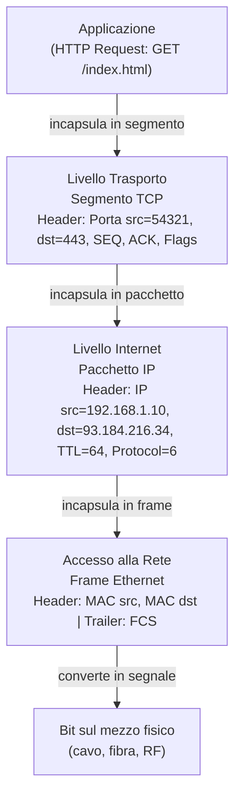
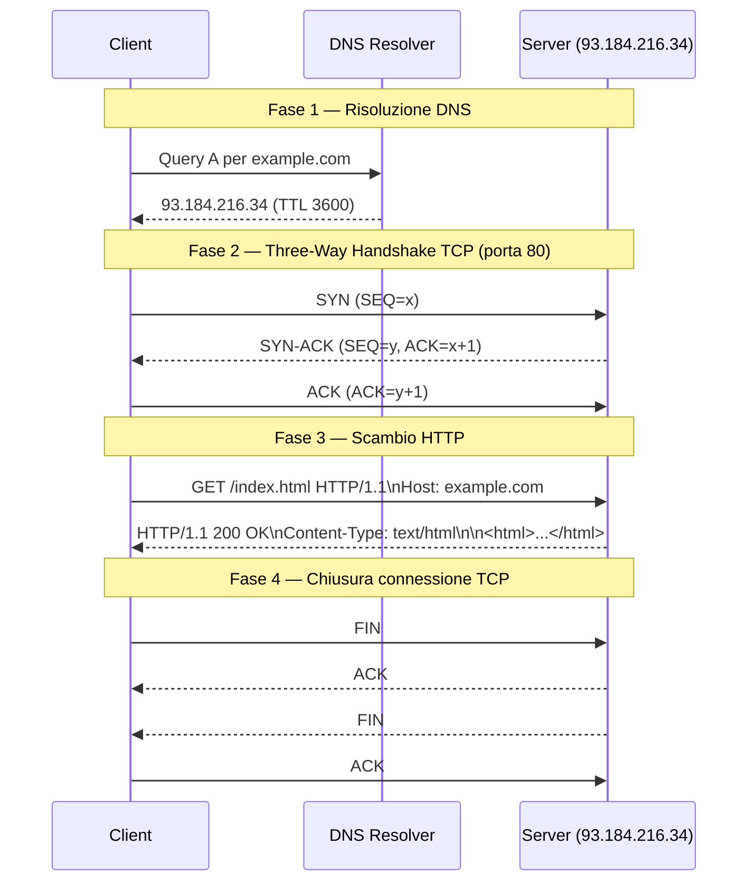

# Stack TCP/IP

## Panoramica

Lo stack TCP/IP (Internet Protocol Suite) è la suite di protocolli su cui è costruita l'intera internet e la stragrande maggioranza delle reti moderne. Nato negli anni '70 all'interno del progetto ARPANET della DARPA (Defense Advanced Research Projects Agency), è stato formalizzato nell'RFC 1122 (1989) e ha sostituito nella pratica il modello OSI come implementazione di riferimento. A differenza di OSI — un modello teorico a 7 livelli — TCP/IP è un modello pratico a 4 livelli nato dall'esperienza reale: prima sono stati scritti i protocolli, poi il modello che li descriveva. Oggi è impossibile lavorare in DevOps senza comprendere come IP, TCP, UDP e i protocolli applicativi interagiscono tra loro.

## Concetti Chiave

### I Quattro Livelli TCP/IP

| Livello | Nome | Funzione | Protocolli Principali |
|---|---|---|---|
| **4** | **Applicazione** | Fornisce servizi di rete alle applicazioni; gestisce encoding, sessioni, business logic | HTTP/S, DNS, SSH, SMTP, FTP, DHCP, SNMP, LDAP |
| **3** | **Trasporto** | Comunicazione end-to-end tra processi; affidabilità (TCP) o velocità (UDP) | TCP, UDP, SCTP, QUIC |
| **2** | **Internet** | Instradamento dei pacchetti tra reti; indirizzamento logico globale | IP (IPv4/IPv6), ICMP, IGMP, ARP, OSPF, BGP |
| **1** | **Accesso alla Rete (Link)** | Trasmissione fisica dei dati sul segmento di rete locale | Ethernet, Wi-Fi (802.11), PPP, ATM |

### TCP vs UDP

| Caratteristica | TCP | UDP |
|---|---|---|
| **Connessione** | Connection-oriented (three-way handshake) | Connectionless |
| **Affidabilità** | Garantita (ACK, retransmit, reorder) | Non garantita (best-effort) |
| **Ordine** | Garantito (numeri di sequenza) | Non garantito |
| **Controllo flusso** | Sì — sliding window: il mittente può inviare più segmenti senza attendere un ACK per ciascuno, finché non supera la dimensione della finestra | No |
| **Overhead** | Alto (header 20 byte minimo) | Basso (header 8 byte fisso) |
| **Latenza** | Maggiore | Minore |
| **Uso tipico** | HTTP, SSH, database, file transfer | DNS, streaming, VoIP, gaming, DHCP |

### Il Three-Way Handshake TCP

L'instaurazione di una connessione TCP richiede 3 scambi:

1. **SYN**: il client invia un segmento con flag SYN e numero di sequenza iniziale (ISN) casuale
2. **SYN-ACK**: il server risponde con SYN+ACK, confermando l'ISN del client e inviando il proprio
3. **ACK**: il client conferma l'ISN del server

La chiusura richiede un four-way handshake (FIN, ACK, FIN, ACK) per chiudere entrambe le direzioni indipendentemente (half-close).

## Come Funziona

### Incapsulazione dei Dati



### Flusso Completo: Richiesta HTTP verso un Server Remoto



### Header IP (IPv4)

I campi chiave dell'header IPv4 (20 byte minimo):

| Campo | Dimensione | Descrizione |
|---|---|---|
| Version | 4 bit | 4 per IPv4 |
| IHL | 4 bit | Internet Header Length (in parole da 32 bit) |
| DSCP (Differentiated Services Code Point)/ECN | 8 bit | Quality of Service, Explicit Congestion Notification |
| Total Length | 16 bit | Lunghezza totale del pacchetto (header + dati), max 65535 byte |
| TTL | 8 bit | Time To Live; decrementato di 1 a ogni hop; a 0 il pacchetto viene scartato (ICMP Time Exceeded) |
| Protocol | 8 bit | Protocollo del layer superiore: 6=TCP, 17=UDP, 1=ICMP |
| Checksum | 16 bit | Integrità dell'header |
| Source IP | 32 bit | Indirizzo IP sorgente |
| Destination IP | 32 bit | Indirizzo IP destinazione |

## Configurazione & Pratica

### Comandi Essenziali su Linux

```bash
# Visualizzare interfacce di rete e indirizzi IP
ip addr show
ip addr show eth0

# Visualizzare la tabella di routing
ip route show
ip route get 8.8.8.8  # Quale route usa il sistema per raggiungere 8.8.8.8?

# Testare connettività L3 (ICMP)
ping -c 4 8.8.8.8
ping -c 4 -s 1472 8.8.8.8  # Test con pacchetti grandi (MTU discovery — MTU = Maximum Transmission Unit, dimensione massima del pacchetto trasmissibile sul mezzo)

# Tracciare il percorso dei pacchetti (TTL incrementale)
traceroute 8.8.8.8
traceroute -T -p 443 8.8.8.8  # Usa TCP SYN invece di UDP (supera alcuni firewall)

# Visualizzare connessioni TCP/UDP attive
ss -tuln               # Porte in ascolto
ss -tup                # Connessioni attive con PID
ss -s                  # Sommario statistiche

# Catturare traffico di rete con tcpdump
tcpdump -i eth0                          # Tutto il traffico su eth0
tcpdump -i eth0 host 8.8.8.8            # Solo traffico verso/da 8.8.8.8
tcpdump -i eth0 port 443                 # Solo traffico HTTPS
tcpdump -i eth0 -n -w capture.pcap      # Salva su file (apri con Wireshark)
tcpdump -i eth0 'tcp[tcpflags] & tcp-syn != 0'  # Solo SYN (nuove connessioni)

# Testare connettività TCP a una porta specifica
nc -zv 8.8.8.8 443     # Connessione TCP a Google DNS su porta 443
nc -zv -u 8.8.8.8 53   # Connessione UDP a Google DNS su porta 53

# ARP — mappatura IP → MAC
arp -n                  # Tabella ARP corrente
ip neigh show           # Equivalente moderno
```

### Analisi con tcpdump — Three-Way Handshake

```bash
# Cattura un handshake TCP verso example.com:80
tcpdump -i eth0 'host example.com and port 80' -n

# Output tipico:
# 12:34:56.789 IP 192.168.1.10.54321 > 93.184.216.34.80: Flags [S],  seq 1234567890
# 12:34:56.850 IP 93.184.216.34.80 > 192.168.1.10.54321: Flags [S.], seq 987654321, ack 1234567891
# 12:34:56.850 IP 192.168.1.10.54321 > 93.184.216.34.80: Flags [.],  ack 987654322
# S = SYN, . = ACK, S. = SYN-ACK, F = FIN, P = PUSH (dati)
```

## Best Practices

- **Comprendi i numeri di porta**: porte < 1024 sono privilegiate (richiedono root). Le porte 1024-49151 sono registrate (IANA — Internet Assigned Numbers Authority, l'ente che gestisce l'assegnazione globale di indirizzi IP, numeri AS e numeri di porta). Le porte 49152-65535 sono ephemeral (usate dai client per le connessioni uscenti).
- **Monitora lo stato TCP**: `ss -s` mostra il conteggio delle connessioni per stato (ESTABLISHED, TIME_WAIT, CLOSE_WAIT). **TIME_WAIT** è lo stato post-chiusura in cui il sistema attende che eventuali pacchetti in ritardo vengano ricevuti (dura 2×MSL, tipicamente 60s). **CLOSE_WAIT** indica che il lato remoto ha chiuso ma la connessione locale non è ancora stata chiusa dall'applicazione. Un accumulo anomalo di entrambi indica problemi nell'applicazione.
- **Attenzione al TTL**: il TTL IP serve anche per diagnosticare. Un TTL di 64 suggerisce Linux, 128 Windows, 255 dispositivi di rete. Il numero di hop si calcola come `TTL_iniziale - TTL_ricevuto`.
- **MTU e frammentazione**: la MTU (Maximum Transmission Unit — dimensione massima del frame trasmissibile sul mezzo) standard Ethernet è 1500 byte. VPN e tunneling riducono l'MTU effettiva. Usa `ping -M do -s 1472` per verificare la MTU path (1472 + 28 header IP/ICMP = 1500).

## Troubleshooting

### Nessuna Connettività

```bash
# Step 1: L'interfaccia è up?
ip link show eth0
# Se DOWN: ip link set eth0 up

# Step 2: Ho un IP?
ip addr show eth0
# Se no: controllare DHCP (journalctl -u NetworkManager)

# Step 3: Raggiungo il gateway?
ip route show default
ping -c 3 <gateway_ip>
# Se no: problema L2 (VLAN, ARP) o L1 (cavo)

# Step 4: Raggiungo internet?
ping -c 3 8.8.8.8
# Se no: problema di routing o NAT

# Step 5: DNS funziona?
dig +short google.com @8.8.8.8
# Se no: problema DNS (vedi articolo DNS)
```

### Connessione Lenta

```bash
# Misurare RTT verso il server
ping -c 20 <server_ip> | tail -1

# Identificare il collo di bottiglia con traceroute
traceroute -n <server_ip>

# Verificare retransmission TCP (indica perdita di pacchetti)
ss -ti | grep retrans

# Controllare errori sull'interfaccia
ip -s link show eth0
# RX errors, TX errors, drops indicano problemi fisici o di buffer
```

### TIME_WAIT Accumulation

```bash
# Contare connessioni in TIME_WAIT
ss -tan | grep TIME-WAIT | wc -l

# Se eccessivo (> 10k), abilitare TCP reuse
sysctl net.ipv4.tcp_tw_reuse=1
# Oppure ridurre fin_timeout
sysctl net.ipv4.tcp_fin_timeout=15
```

## Riferimenti

- [RFC 791 — Internet Protocol (IPv4)](https://www.rfc-editor.org/rfc/rfc791)
- [RFC 793 — Transmission Control Protocol](https://www.rfc-editor.org/rfc/rfc793)
- [RFC 768 — User Datagram Protocol](https://www.rfc-editor.org/rfc/rfc768)
- [RFC 1122 — Requirements for Internet Hosts](https://www.rfc-editor.org/rfc/rfc1122)
- [TCP/IP Guide — Charles M. Kozierok](http://www.tcpipguide.com/)
- [Beej's Guide to Network Programming](https://beej.us/guide/bgnet/)
