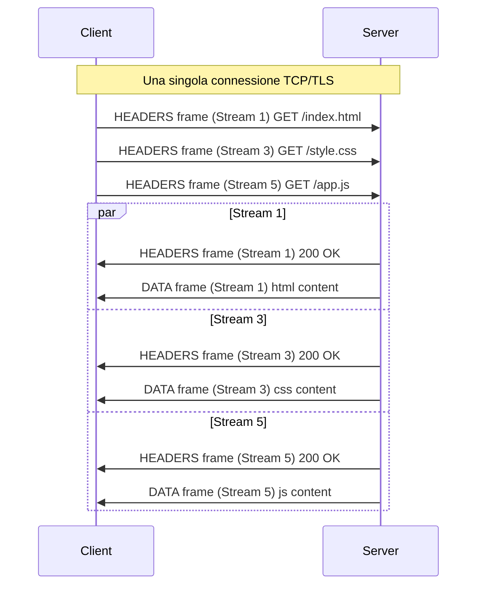

# HTTP/2 e HTTP/3

## Panoramica

HTTP è il protocollo applicativo alla base del Web. La versione 1.1 (1997) ha servito bene per decenni, ma le sue limitazioni strutturali diventano sempre più evidenti con le applicazioni web moderne.

**HTTP/1.1** soffre di:
- **Head-of-Line (HOL) Blocking**: una singola richiesta lenta blocca tutte le richieste successive sulla stessa connessione
- **Multiple connessioni TCP**: i browser aprono 6–8 connessioni parallele per aggirare l'HOL blocking, ma questo spreca risorse e aumenta la latenza (ogni connessione richiede un handshake)
- **Header verbosi e non compressi**: ogni richiesta ripete gli stessi header (User-Agent, Cookie, Accept) in chiaro
- **Nessun server push**: il server non può inviare risorse proattivamente

**HTTP/2** (2015, RFC 7540) risolve questi problemi rimanendo su TCP, introducendo un layer di framing binario sopra TLS.

**HTTP/3** (2022, RFC 9114) va oltre: abbandona TCP e costruisce HTTP sopra QUIC (UDP-based), eliminando il HOL blocking anche a livello di trasporto.

---

## Concetti Chiave

### HTTP/2: Binary Framing Layer

HTTP/1.1 è un protocollo testuale: ogni richiesta/risposta è una serie di linee di testo. HTTP/2 introduce un layer di framing binario: ogni messaggio HTTP è suddiviso in **frame** binari tipizzati.

Tipi di frame principali:

| Frame Type | Descrizione |
|-----------|-------------|
| `HEADERS` | Header HTTP compressi con HPACK |
| `DATA` | Corpo della richiesta/risposta |
| `SETTINGS` | Negoziazione parametri della connessione |
| `WINDOW_UPDATE` | Aggiornamento flow control |
| `PING` | Heartbeat e misurazione RTT (Round-Trip Time) |
| `RST_STREAM` | Cancellazione di uno stream |
| `GOAWAY` | Chiusura ordinata della connessione |
| `PUSH_PROMISE` | Annuncio server push |

### HTTP/2: Stream e Connessione

- Una **connessione HTTP/2** è una singola connessione TCP+TLS
- Sopra di essa vivono molti **stream** simultanei e indipendenti
- Ogni stream è identificato da un ID intero (dispari per client, pari per server push)
- I frame di stream diversi possono essere intercalati (multiplexing)

### HTTP/2: HPACK Header Compression

HPACK comprime gli header HTTP usando:
1. **Static Table**: 61 header comuni predefiniti (`:method: GET`, `content-type: text/html`, etc.)
2. **Dynamic Table**: header incontrati nella sessione corrente, indicizzati per riferimento futuro
3. **Huffman Encoding**: compressione dei valori stringa

In pratica, una richiesta HTTP/2 dopo le prime trasmette gli header differenti in pochi byte invece di centinaia di byte.

### HTTP/3 e QUIC

HTTP/3 mappa direttamente su QUIC invece che su TCP:
- Ogni stream HTTP/3 corrisponde a uno stream QUIC indipendente
- La perdita di un pacchetto blocca solo lo stream interessato, non tutti gli altri
- Il TLS 1.3 è integrato nel handshake QUIC (non separato)
- La connessione sopravvive ai cambi di IP (connection migration)

---

## Come Funziona

### HTTP/2: Multiplexing degli Stream



Con HTTP/1.1, le 3 richieste avrebbero richiesto 3 connessioni TCP separate (o sarebbero andate in coda su 1 connessione). Con HTTP/2, viaggiano in parallelo sulla stessa connessione.

### HTTP/2: HOL Blocking Residuo

!!! warning "HOL Blocking TCP in HTTP/2"
    HTTP/2 elimina il HOL blocking a livello HTTP (un request lento non blocca gli altri stream). Tuttavia, tutti gli stream condividono la stessa connessione TCP. Se un pacchetto TCP si perde, TCP blocca la consegna di **tutti** i frame successivi finché il pacchetto perso non è ritrasmesso — indipendentemente a quale stream appartengano.

    Su reti con alta perdita di pacchetti, HTTP/2 può essere **peggiore** di HTTP/1.1 con multiple connessioni. HTTP/3/QUIC risolve questo.

### HTTP/2: Server Push (Deprecato in pratica)

Il server push permetteva al server di inviare risorse proattivamente (es. CSS e JS insieme all'HTML, senza che il client le richiedesse). In pratica si è rivelato difficile da ottimizzare (rischio di inviare risorse già in cache) ed è stato deprecato in Chrome nel 2022. Preferire preload links (`<link rel="preload">`).

### HTTP/2: Stream Prioritization

HTTP/2 supportava una gerarchia di priorità degli stream (albero di dipendenze). In pratica raramente implementata correttamente dai server. HTTP/3 utilizza invece **QPACK prioritization** più semplice.

---

## Confronto Performance

| Caratteristica | HTTP/1.1 | HTTP/2 | HTTP/3 |
|---------------|----------|--------|--------|
| Trasporto | TCP | TCP | QUIC (UDP) |
| Connessioni per origin | 6–8 | 1 | 1 |
| Multiplexing | No (pipelining opzionale) | Sì (stream su 1 conn.) | Sì (stream QUIC) |
| HOL Blocking applicativo | Sì | No | No |
| HOL Blocking trasporto | N/A | Sì (TCP) | No (QUIC streams) |
| Header compression | No | HPACK | QPACK |
| TLS | Opzionale | Richiesto in pratica | Integrato (TLS 1.3) |
| Handshake latency | 2 RTT (TCP) + 1-2 RTT (TLS) | 2 RTT (TCP) + 1-2 RTT (TLS) | 1 RTT (0-RTT possibile) |
| Server Push | No | Sì (deprecato) | No (rimosso) |
| Connection Migration | No | No | Sì |
| Supporto browser | Universale | >97% | >95% |

---

## Configurazione Nginx

### HTTP/2

```nginx
# nginx.conf — Abilitare HTTP/2
server {
    listen 443 ssl;
    http2 on;                          # Nginx >= 1.25.1 (direttiva separata)
    # listen 443 ssl http2;            # Nginx < 1.25.1 (sintassi vecchia)

    server_name example.com;

    ssl_certificate     /etc/ssl/certs/example.com.crt;
    ssl_certificate_key /etc/ssl/private/example.com.key;
    ssl_protocols       TLSv1.2 TLSv1.3;
    ssl_ciphers         HIGH:!aNULL:!MD5;

    # Ottimizzazioni HTTP/2
    http2_max_concurrent_streams 128;   # Stream paralleli per connessione
    keepalive_timeout 65;               # Mantenere connessioni aperte

    location / {
        proxy_pass http://backend;
        proxy_set_header X-Forwarded-Proto $scheme;
    }
}
```

### HTTP/3 con QUIC

```nginx
# nginx.conf — Abilitare HTTP/3 (Nginx >= 1.25.0)
server {
    # HTTP/2 su TCP (fallback)
    listen 443 ssl;
    http2 on;

    # HTTP/3 su QUIC/UDP
    listen 443 quic reuseport;

    server_name example.com;

    ssl_certificate     /etc/ssl/certs/example.com.crt;
    ssl_certificate_key /etc/ssl/private/example.com.key;
    ssl_protocols       TLSv1.3;        # QUIC richiede TLS 1.3

    # Annunciare supporto HTTP/3 tramite header Alt-Svc
    add_header Alt-Svc 'h3=":443"; ma=86400';

    location / {
        proxy_pass http://backend;
    }
}
```

!!! note "Alt-Svc Header"
    L'header `Alt-Svc` annuncia al browser che il server supporta HTTP/3 su porta 443 UDP. Al prossimo accesso, il browser tenterà HTTP/3. La prima visita avviene sempre su HTTP/2 (TCP).

### Verificare il protocollo in uso

```bash
# Verificare se il server risponde con HTTP/2
curl -v --http2 https://example.com 2>&1 | grep "< HTTP"

# Verificare HTTP/3 (richiede curl >= 7.88 con QUIC support)
curl -v --http3 https://example.com 2>&1 | grep "< HTTP"

# Verificare con openssl
openssl s_client -connect example.com:443 -alpn h2

# nghttp2 — client HTTP/2 dedicato
nghttp -v https://example.com

# Verificare header Alt-Svc (annuncio HTTP/3)
curl -sI https://example.com | grep -i alt-svc
```

---

## Browser Support e Migrazione

### Stato del supporto (2026)

- **HTTP/2**: supportato da tutti i browser moderni (Chrome, Firefox, Safari, Edge) — > 97% degli utenti
- **HTTP/3**: supportato da Chrome 87+, Firefox 88+, Safari 14+ — > 95% degli utenti

### Strategia di migrazione

1. **Da HTTP/1.1 a HTTP/2**: quasi zero-risk
   - Abilitare TLS se non già presente (HTTP/2 richiede TLS nei browser)
   - Aggiungere `http2 on` in Nginx o equivalente in Apache/Caddy
   - Rimuovere ottimizzazioni HTTP/1.1 che diventano controproducenti: domain sharding, sprite sheets CSS, resource bundling eccessivo (con HTTP/2 i file piccoli separati vanno bene)

2. **Da HTTP/2 a HTTP/3**: deployment graduale
   - Iniziare con `Alt-Svc` header (il browser tenta HTTP/3 alla seconda visita)
   - Verificare che firewall e CDN non blocchino UDP 443
   - Mantenere HTTP/2 come fallback (lo standard prevede questa degradazione)

!!! tip "CDN e HTTP/3"
    Cloudflare, AWS CloudFront, Fastly supportano HTTP/3. Se si usa una CDN, abilitare HTTP/3 è spesso solo un toggle nella dashboard — la complessità è gestita dal provider.

---

## Best Practices

!!! tip "HTTP/2: non bundlare tutto in un unico file"
    Con HTTP/1.1, minimizzare il numero di richieste era critico. Con HTTP/2, le richieste multiple su una connessione hanno overhead minimo. Suddividere bundle grandi permette caching granulare: se cambia solo `app.js`, il browser non deve re-scaricare `vendor.js`.

!!! tip "HTTP/2: aumentare i concurrent streams se necessario"
    Il default di 100 stream concorrenti è sufficiente per la maggior parte dei casi. Applicazioni con molte richieste parallele (dashboard con dozzine di widget) possono beneficiare di valori più alti (128–256).

!!! warning "HTTP/3: verificare la compatibilità dei middlebox"
    Alcuni firewall aziendali bloccano UDP sulla porta 443. HTTP/3 fallisce silenziosamente e torna a HTTP/2. Monitorare i rate di upgrade per rilevare ambienti problematici.

!!! tip "Priorità degli header con Early Hints (103)"
    HTTP 103 Early Hints permette al server di inviare header `Link: rel=preload` prima che la risposta principale sia pronta. Funziona con HTTP/2 e HTTP/3 e può migliorare significativamente il LCP (Largest Contentful Paint).

---

## Troubleshooting

### curl: verificare il protocollo negoziato

```bash
# HTTP/2 - mostra il protocollo nel verbose output
curl -sv --http2 https://example.com 2>&1 | grep -E "(< HTTP|ALPN|protocol)"

# Output atteso per HTTP/2:
# * ALPN: server accepted h2
# < HTTP/2 200

# Se vedi HTTP/1.1 con --http2: il server non supporta HTTP/2 o TLS non è configurato
```

### Browser DevTools: identificare il protocollo

In Chrome DevTools → Network tab → colonna "Protocol":
- `h2` = HTTP/2
- `h3` o `h3-29` = HTTP/3
- `http/1.1` = HTTP/1.1

Per aggiungere la colonna Protocol: tasto destro sulle intestazioni delle colonne → "Protocol".

### Server non risponde su HTTP/3

```bash
# Verificare che il server ascolti su UDP 443
ss -ulnp | grep :443

# Verificare Alt-Svc header
curl -sI https://example.com | grep -i "alt-svc"

# Test diretto HTTP/3 con quiche-client o similar tool
# (curl deve essere compilato con HTTP/3 support: curl --version | grep HTTP3)
curl --version | grep "HTTP3"
```

---

## Relazioni

??? info "QUIC — Approfondimento"
    HTTP/3 è costruito interamente su QUIC. Comprendere QUIC è fondamentale per capire il funzionamento profondo di HTTP/3, inclusi handshake 1-RTT/0-RTT, connection migration e stream independence.

    **Approfondimento completo →** [QUIC](quic.md)

??? info "TCP e UDP — Approfondimento"
    HTTP/2 usa TCP come trasporto (con le relative limitazioni di HOL blocking). HTTP/3 usa UDP tramite QUIC.

    **Approfondimento completo →** [TCP e UDP](tcp-udp.md)

??? info "Nginx e HAProxy — Approfondimento"
    Configurazione dettagliata di HTTP/2 e HTTP/3 su Nginx e HAProxy.

    **Approfondimento completo →** [Nginx e HAProxy](../load-balancing/layer4-vs-layer7.md)

---

## Riferimenti

- [RFC 7540 — HTTP/2](https://www.rfc-editor.org/rfc/rfc7540)
- [RFC 9114 — HTTP/3](https://www.rfc-editor.org/rfc/rfc9114)
- [RFC 7541 — HPACK: Header Compression for HTTP/2](https://www.rfc-editor.org/rfc/rfc7541)
- [http2.github.io — Risorse ufficiali HTTP/2](https://http2.github.io/)
- [HTTP/3 Explained — Daniel Stenberg (autore di curl)](https://http3-explained.haxx.se/)
- [Web Almanac — HTTP Chapter](https://almanac.httparchive.org/en/2023/http)
- [Nginx HTTP/2 Module Docs](https://nginx.org/en/docs/http/ngx_http_v2_module.html)
- [Nginx HTTP/3 Module Docs](https://nginx.org/en/docs/http/ngx_http_v3_module.html)
