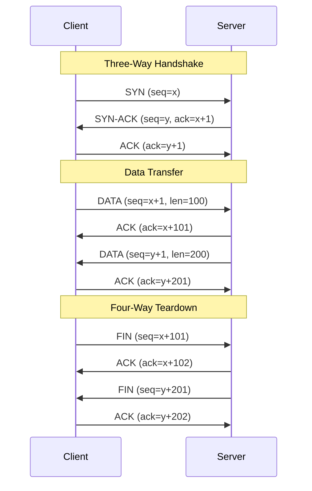

# TCP e UDP

## Panoramica

TCP (Transmission Control Protocol) e UDP (User Datagram Protocol) sono i due principali protocolli del livello di trasporto (Layer 4 del modello OSI). Operano sopra IP e forniscono la comunicazione end-to-end tra applicazioni.

**TCP** è connection-oriented: prima di trasmettere dati stabilisce una connessione, garantisce la consegna ordinata e senza perdite, e gestisce il controllo del flusso e della congestione. Il prezzo è una latenza maggiore e overhead più elevato.

**UDP** è connectionless: invia datagrammi senza stabilire connessione, senza garantire la consegna, l'ordine o l'assenza di duplicati. Il vantaggio è la latenza minima e l'overhead ridottissimo.

La scelta tra TCP e UDP non è una questione di quale sia "migliore": dipende interamente dal tipo di applicazione. Un trasferimento file richiede affidabilità (TCP); uno stream video in tempo reale preferisce la velocità e tollera qualche frame perso (UDP).

---

## Concetti Chiave

### TCP: Struttura del Segmento

Un segmento TCP contiene:

- **Source/Destination Port** (16 bit ciascuno): identificano l'applicazione mittente e destinataria
- **Sequence Number** (32 bit): posizione del primo byte di dati nel flusso
- **Acknowledgment Number** (32 bit): prossimo byte atteso dal ricevitore
- **Flags**: `SYN` (sincronizzazione), `ACK` (conferma), `FIN` (fine connessione), `RST` (reset), `PSH` (push), `URG` (urgente)
- **Window Size**: dimensione della receive window (flow control)
- **Checksum**: verifica dell'integrità

### TCP: Flag Principali

| Flag | Scopo |
|------|-------|
| `SYN` | Avvio connessione, sincronizzazione dei sequence number |
| `ACK` | Conferma ricezione di dati/controllo |
| `FIN` | Chiusura ordinata di una direzione della connessione |
| `RST` | Chiusura immediata (errore, connessione non valida) |
| `PSH` | Richiede al ricevitore di consegnare i dati all'applicazione subito |

### UDP: Struttura del Datagramma

Un datagramma UDP è estremamente semplice:

- **Source Port** (16 bit)
- **Destination Port** (16 bit)
- **Length** (16 bit): lunghezza totale header + dati
- **Checksum** (16 bit): opzionale in IPv4, obbligatorio in IPv6
- **Data**: payload applicativo

L'header UDP è di soli 8 byte, contro i 20+ byte dell'header TCP.

### Porte e Socket

Una connessione TCP è univocamente identificata da una quadrupla: `(IP_src, Port_src, IP_dst, Port_dst)`. Le porte sono divise in:

- **Well-known ports** (0–1023): HTTP (80), HTTPS (443), SSH (22), DNS (53)
- **Registered ports** (1024–49151): applicazioni specifiche registrate con IANA
- **Ephemeral ports** (49152–65535): porte temporanee assegnate ai client

---

## Come Funziona

### TCP: Three-Way Handshake, Trasferimento e Four-Way Teardown



**Handshake dettagliato:**

1. **SYN**: il client sceglie un Initial Sequence Number (ISN) casuale `x` e invia un segmento SYN
2. **SYN-ACK**: il server sceglie il proprio ISN `y`, conferma con ACK=x+1, e invia il proprio SYN
3. **ACK**: il client conferma con ACK=y+1. La connessione è ora ESTABLISHED in entrambe le direzioni

**Four-Way Teardown (chiusura ordinata):**

La chiusura è asincrona perché TCP è full-duplex. Ogni lato chiude la propria direzione indipendentemente:

1. Client invia FIN → chiude la direzione client→server
2. Server risponde ACK
3. Server invia FIN quando ha finito di trasmettere → chiude la direzione server→client
4. Client risponde ACK e entra in **TIME_WAIT**

### TCP State Machine

```
CLOSED
  │  [passive open: listen()]
  ▼
LISTEN ──────── [active open: connect()]
  │                    │
  │ [rcv SYN]          │ [snd SYN]
  ▼                    ▼
SYN_RCVD         SYN_SENT
  │ [snd SYN-ACK]      │ [rcv SYN-ACK, snd ACK]
  │ [rcv ACK]          │
  └─────────►ESTABLISHED◄──────────┘
                  │
         [snd FIN / rcv FIN]
          /              \
    FIN_WAIT_1        CLOSE_WAIT
         │                │ [snd FIN]
    [rcv FIN-ACK]         ▼
    FIN_WAIT_2       LAST_ACK
         │                │ [rcv ACK]
    [rcv FIN, snd ACK]    ▼
         ▼             CLOSED
    TIME_WAIT
         │ [2*MSL timeout]
         ▼
      CLOSED
```

**Stati critici:**

- **TIME_WAIT**: dopo aver inviato l'ACK finale, il client attende `2 × MSL` (Maximum Segment Lifetime, tipicamente 60s) per garantire che l'ACK sia arrivato e che vecchi pacchetti duplicati siano scomparsi dalla rete. Alta concentrazione di socket in TIME_WAIT è normale su server molto trafficati.
- **CLOSE_WAIT**: il lato che ha ricevuto il FIN ma non ha ancora chiuso la propria direzione. Un numero elevato indica un bug applicativo (l'applicazione non chiude i socket).
- **SYN_SENT / SYN_RCVD**: stati transitori durante l'handshake.

### TCP: Flow Control (Receive Window)

Il ricevitore annuncia quanta buffer space ha disponibile tramite il campo **Window Size** nell'header. Il mittente non può inviare più dati di quanti indicati dalla window.

- **Window Scaling** (RFC 7323): estende il campo window a 30 bit via opzione TCP per supportare finestre fino a 1 GB (necessario su reti ad alta velocità e alto RTT)
- Se la window scende a 0, il mittente si ferma e invia **Window Probes** periodici per rilevare quando la window si riapre

### TCP: Congestion Control

TCP implementa 4 algoritmi per evitare di sovraccaricare la rete:

1. **Slow Start**: alla partenza, `cwnd` (congestion window) parte da 1 MSS e raddoppia ogni RTT fino a `ssthresh`
2. **Congestion Avoidance**: superata `ssthresh`, `cwnd` cresce di 1 MSS per RTT (crescita lineare)
3. **Fast Retransmit**: alla ricezione di 3 ACK duplicati, il mittente ritrasmette il segmento perso senza attendere il timeout
4. **Fast Recovery**: dopo fast retransmit, `ssthresh = cwnd/2` e si riparte dalla congestion avoidance (non da slow start)

!!! note "TCP BBR"
    Google ha sviluppato **BBR** (Bottleneck Bandwidth and RTT), un algoritmo di congestion control moderno che misura direttamente la bandwidth disponibile invece di dedurla dalle perdite. Significativamente più efficiente di CUBIC su reti con alto RTT o perdite non da congestione (es. reti wireless).

### Nagle's Algorithm

L'algoritmo di Nagle riduce il numero di piccoli segmenti TCP aggregando i dati in attesa di un ACK. Utile per applicazioni interattive a bassa bandwidth, ma aggiunge latenza. Si disabilita con `TCP_NODELAY` (es. per database client, gaming, SSH).

---

## TCP vs UDP: Confronto

| Caratteristica | TCP | UDP |
|---------------|-----|-----|
| Connessione | Connection-oriented (3-way handshake) | Connectionless |
| Affidabilità | Garantita (ACK, ritrasmissione) | Non garantita |
| Ordinamento | Garantito | Non garantito |
| Deduplicazione | Sì | No |
| Velocità | Più lento (overhead di controllo) | Più veloce |
| Header size | 20–60 byte | 8 byte |
| Flow control | Sì (receive window) | No |
| Congestion control | Sì (slow start, CUBIC, BBR) | No |
| Broadcast/Multicast | No | Sì |
| Frammentazione | Gestita da TCP stesso | Delegata a IP |
| Use cases | HTTP, SSH, FTP, database, email | DNS, DHCP, VoIP, gaming, streaming |

---

## Casi d'Uso

### Quando usare TCP

- **HTTP/HTTPS**: richiede consegna ordinata e affidabile
- **SSH**: sessioni interattive, ogni byte deve arrivare
- **Database** (PostgreSQL, MySQL, Redis): query e risposte devono essere complete e corrette
- **Trasferimento file** (FTP, SFTP, rsync): integrità dei dati critica
- **Email** (SMTP, IMAP): non si può perdere un'email

### Quando usare UDP

- **DNS**: query/risposta brevi, la latenza è cruciale; se il pacchetto si perde si riprova
- **DHCP**: discovery broadcast sulla rete locale
- **VoIP** (SIP/RTP): preferibile perdere qualche frame audio che avere jitter elevato
- **Gaming online**: la latenza conta più dell'affidabilità; uno stato di gioco perso viene sostituto dal successivo
- **Streaming video live**: latenza > affidabilità
- **QUIC**: UDP come trasporto, ma con affidabilità implementata a livello applicativo
- **Multicast/Broadcast**: distribuzione efficiente a gruppi

---

## Configurazione & Pratica

### Ispezione connessioni attive

```bash
# Mostra tutti i socket TCP e UDP in ascolto
ss -tuln

# Mostra connessioni TCP con stato e processo
ss -tnp

# Contare socket per stato (utile per diagnostica)
ss -tan | awk 'NR>1 {print $1}' | sort | uniq -c | sort -rn

# Equivalente con netstat (deprecato ma ancora diffuso)
netstat -an | grep ESTABLISHED | wc -l
netstat -an | grep TIME_WAIT | wc -l

# Catturare traffico TCP su porta 443 (richiede root)
tcpdump -i eth0 -nn 'tcp port 443' -w /tmp/capture.pcap

# Catturare solo handshake TCP (SYN packets)
tcpdump -i eth0 -nn 'tcp[tcpflags] & (tcp-syn) != 0 and tcp[tcpflags] & (tcp-ack) == 0'

# Analizzare una cattura con Wireshark (da CLI)
tshark -r /tmp/capture.pcap -T fields -e tcp.stream -e tcp.flags.syn -e tcp.flags.ack
```

### Tuning TCP via sysctl (Linux)

```bash
# Visualizzare tutti i parametri TCP correnti
sysctl -a | grep net.ipv4.tcp

# Ridurre il tempo di keepalive (default: 7200s = 2 ore)
# Utile per liberare connessioni zombie più velocemente
sysctl -w net.ipv4.tcp_keepalive_time=600
sysctl -w net.ipv4.tcp_keepalive_intvl=60
sysctl -w net.ipv4.tcp_keepalive_probes=5

# Aumentare la backlog queue per server ad alto traffico
sysctl -w net.core.somaxconn=65535
sysctl -w net.ipv4.tcp_max_syn_backlog=65535

# Mitigare TIME_WAIT su server con molte connessioni short-lived
# Permette riuso rapido dei socket in TIME_WAIT (sicuro con timestamp TCP)
sysctl -w net.ipv4.tcp_tw_reuse=1

# Abilitare TCP Fast Open (riduce latenza eliminando RTT per connessioni ripetute)
sysctl -w net.ipv4.tcp_fastopen=3

# Buffer socket (aumentare per reti ad alta velocità/alto RTT)
sysctl -w net.core.rmem_max=134217728
sysctl -w net.core.wmem_max=134217728
sysctl -w net.ipv4.tcp_rmem="4096 87380 134217728"
sysctl -w net.ipv4.tcp_wmem="4096 65536 134217728"
```

```ini
# /etc/sysctl.d/99-tcp-tuning.conf (persistente)
net.ipv4.tcp_keepalive_time = 600
net.ipv4.tcp_keepalive_intvl = 60
net.ipv4.tcp_keepalive_probes = 5
net.core.somaxconn = 65535
net.ipv4.tcp_max_syn_backlog = 65535
net.ipv4.tcp_tw_reuse = 1
net.ipv4.tcp_fastopen = 3
net.core.rmem_max = 134217728
net.core.wmem_max = 134217728
```

### Abilitare TCP_NODELAY (disabilitare Nagle's Algorithm)

```python
# Python: disabilitare Nagle per connessioni latency-sensitive
import socket
sock = socket.socket(socket.AF_INET, socket.SOCK_STREAM)
sock.setsockopt(socket.IPPROTO_TCP, socket.TCP_NODELAY, 1)
```

```go
// Go: TCP_NODELAY è abilitato di default nel net package
conn, err := net.Dial("tcp", "host:port")
if tcpConn, ok := conn.(*net.TCPConn); ok {
    tcpConn.SetNoDelay(true)
}
```

---

## Best Practices

### TCP Tuning per Server ad Alto Traffico

!!! tip "Dimensionamento della listen backlog"
    Il parametro `net.core.somaxconn` limita la coda di connessioni in attesa di `accept()`. Su server web ad alto traffico, aumentarlo a 65535 ed impostare lo stesso valore nel listener dell'applicazione (es. `listen(fd, 65535)`).

!!! tip "TIME_WAIT: non è un problema, è una funzionalità"
    Migliaia di socket in TIME_WAIT su un server HTTP è normale e atteso. Indicano che il server sta attivamente chiudendo connessioni. Usare `tcp_tw_reuse=1` (non `tcp_tw_recycle`, deprecato e pericoloso con NAT) se l'accumulo causa esaurimento delle porte.

!!! warning "tcp_tw_recycle è pericoloso"
    `net.ipv4.tcp_tw_recycle` è stato rimosso dal kernel Linux 4.12 perché causava drop silenzioso di connessioni legittime da client dietro NAT. Non usarlo mai.

### Keepalive: quando e come

TCP keepalive permette di rilevare connessioni interrotte (es. crash del peer, link down) senza traffico applicativo. Configurare keepalive a livello applicativo (es. `SO_KEEPALIVE`) è preferibile al tuning di sistema perché consente valori diversi per diverse applicazioni.

---

## Troubleshooting

### Molti socket in TIME_WAIT

**Sintomo:** `ss -tan | grep TIME_WAIT | wc -l` restituisce valori elevati (decine di migliaia).

**Causa:** normale su server HTTP/HTTPS che chiudono le connessioni dopo ogni risposta (HTTP/1.0) o che usano connection: close.

**Soluzione:**
1. Abilitare HTTP keep-alive nell'applicazione/proxy per riusare le connessioni
2. Impostare `net.ipv4.tcp_tw_reuse=1`
3. Se il server apre connessioni verso un backend (es. reverse proxy → app), considerare un connection pool

### Connection Refused vs Connection Timeout

| Comportamento | Causa | Diagnosi |
|--------------|-------|----------|
| `Connection refused` (RST immediato) | Nessun processo in ascolto sulla porta, o firewall con REJECT | Il segmento arriva a destinazione ma viene rifiutato |
| `Connection timed out` | Firewall DROP (pacchetti scartati silenziosamente), host irraggiungibile, routing errato | Il segmento non arriva mai a destinazione |

```bash
# Distinguere refused da timeout
telnet <host> <port>        # refused: messaggio immediato; timeout: attesa lunga
nc -zv <host> <port>        # verbose connection test
traceroute <host>           # identifica dove i pacchetti si perdono
```

### SYN Flood Detection

Un SYN flood riempie la coda SYN_RCVD del server con connessioni half-open.

```bash
# Contare socket in SYN_RECV
ss -tan state syn-recv | wc -l

# Abilitare SYN cookies come mitigazione
sysctl -w net.ipv4.tcp_syncookies=1
```

!!! warning "SYN Flood"
    Se si osserva un numero anomalo di SYN_RECV (centinaia/migliaia), è probabile un attacco DDoS. Attivare SYN cookies e considerare soluzioni a livello di rete (rate limiting, anycast).

### CLOSE_WAIT Accumulati

**Sintomo:** `ss -tan | grep CLOSE_WAIT` mostra molti socket.

**Causa:** l'applicazione ha ricevuto un FIN dal peer ma non ha chiamato `close()` sul socket.

**Soluzione:** bug nel codice applicativo. Verificare che i socket vengano chiusi correttamente anche in caso di errore (finally block, defer, RAII pattern).

---

## Relazioni

??? info "HTTP/2 e HTTP/3 — Approfondimento"
    HTTP/2 costruisce un livello di multiplexing sopra TCP. HTTP/3 abbandona TCP in favore di QUIC (UDP-based) per eliminare il head-of-line blocking a livello di trasporto.

    **Approfondimento completo →** [HTTP/2 e HTTP/3](http2-http3.md)

??? info "QUIC — Approfondimento"
    QUIC implementa affidabilità e controllo della congestione sopra UDP, combinando i vantaggi di TCP (affidabilità) con quelli di UDP (bassa latenza, no HOL blocking per stream indipendenti).

    **Approfondimento completo →** [QUIC](quic.md)

??? info "Load Balancing Layer 4 — Approfondimento"
    Il load balancing L4 opera a livello TCP/UDP, distribuendo le connessioni senza ispezionare il payload. La comprensione degli stati TCP è fondamentale per capire il comportamento del bilanciatore.

    **Approfondimento completo →** [Layer 4 vs Layer 7](../load-balancing/layer4-layer7.md)

---

## Riferimenti

- [RFC 793 — Transmission Control Protocol](https://www.rfc-editor.org/rfc/rfc793)
- [RFC 768 — User Datagram Protocol](https://www.rfc-editor.org/rfc/rfc768)
- [RFC 7323 — TCP Extensions for High Performance](https://www.rfc-editor.org/rfc/rfc7323)
- [RFC 6298 — Computing TCP's Retransmission Timer](https://www.rfc-editor.org/rfc/rfc6298)
- [TCP Congestion Control — RFC 5681](https://www.rfc-editor.org/rfc/rfc5681)
- [Beej's Guide to Network Programming](https://beej.us/guide/bgnet/)
- [Linux TCP Tuning Guide — Red Hat](https://access.redhat.com/documentation/en-us/red_hat_enterprise_linux/8/html/managing_networking_infrastructure_services/index)
