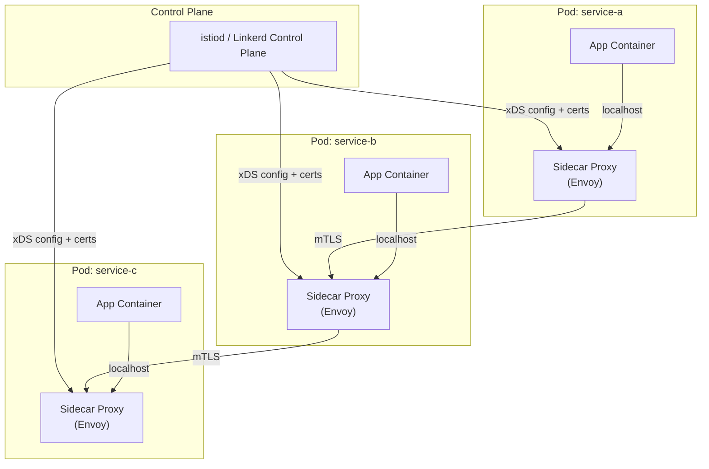

# Service Mesh — Concetti Base

## Panoramica

In un'architettura a microservizi, ogni servizio deve gestire retry, timeout, circuit breaking, mTLS e distributed tracing. Implementare queste logiche in ogni singolo servizio — potenzialmente scritto in linguaggi diversi — e' costoso, error-prone e difficile da manutenere uniformemente.

Un **service mesh** risolve questo problema spostando tutta la logica di comunicazione fuori dall'applicazione, in un proxy dedicato (il **sidecar**) affiancato a ogni istanza di servizio. Il sidecar intercetta tutto il traffico in ingresso e uscita, applicando le politiche configurate centralmente. Il codice applicativo parla con `localhost` come se non ci fosse nulla in mezzo; il service mesh fa il resto in modo trasparente.

## Concetti Chiave

!!! note "Data Plane"
    L'insieme di tutti i **sidecar proxy** in esecuzione affiancati ai servizi. Intercettano e gestiscono ogni singolo pacchetto di traffico. Implementano: routing, load balancing, health checking, mTLS, retry, timeout, circuit breaking, metrics collection, distributed tracing. Il proxy piu' utilizzato e' **Envoy**.

!!! note "Control Plane"
    Il cervello del service mesh. Configura dinamicamente il data plane tramite API (tipicamente xDS). Gestisce: distribuzione dei certificati mTLS, policy di routing, service discovery, configurazione dei proxy. Non tocca il traffico applicativo — lavora solo su configurazione e certificati. Esempi: **istiod** (Istio), **destination** (Linkerd).

!!! note "East-West Traffic"
    Il traffico **service-to-service** all'interno del cluster (orizzontale). E' il dominio primario del service mesh. Esempio: `payment-service` chiama `inventory-service`.

!!! note "North-South Traffic"
    Il traffico **client esterno verso i servizi** (verticale, in ingresso al cluster). E' il dominio dell'API Gateway e dell'Ingress Controller. Il service mesh puo' gestirlo tramite un ingress gateway dedicato (es. Istio Ingress Gateway), ma non e' il suo punto di forza.

### Feature principali di un Service Mesh

| Feature | Descrizione |
|---------|-------------|
| **mTLS automatico** | Ogni comunicazione service-to-service e' cifrata e autenticata bidirezionalmente, senza modificare il codice |
| **Traffic management** | Routing avanzato, canary deployment, A/B testing, traffic mirroring |
| **Retry e timeout** | Politiche configurabili globalmente o per route |
| **Circuit breaking** | Isolamento automatico di servizi degradati |
| **Fault injection** | Iniezione di delay o errori per chaos testing |
| **Observability** | Distributed tracing, golden metrics (latency, errors, saturation) automatici |
| **Service discovery** | Risoluzione dei servizi tramite il control plane |
| **Authorization policy** | Regole allow/deny per ogni coppia sorgente-destinazione |

## Architettura / Come Funziona

### Vista generale



### Sidecar Injection

Il sidecar proxy viene iniettato automaticamente nei Pod tramite un **Mutating Admission Webhook**. Quando un Pod viene creato in un namespace con la label `istio-injection: enabled` (o equivalente), il control plane intercetta la richiesta all'API Server e modifica la specifica del Pod per aggiungere il container sidecar e un init container.

```yaml
# Abilitare sidecar injection su un namespace
kubectl label namespace production istio-injection=enabled

# Oppure su singolo Pod/Deployment con annotation
metadata:
  annotations:
    sidecar.istio.io/inject: "true"
```

### Intercettazione del traffico

L'init container configura regole **iptables** che reindirizzano tutto il traffico in ingresso (porta 15006) e in uscita (porta 15001) attraverso il proxy Envoy. L'applicazione non sa nulla di questo: continua a fare richieste a `http://service-b:8080` come se parlasse direttamente al servizio.

### Rotazione certificati mTLS

Il control plane agisce da **Certificate Authority (CA)**. Ad ogni sidecar viene emesso un certificato SVID (SPIFFE Verifiable Identity Document) con identita' basata sul service account Kubernetes. I certificati vengono ruotati automaticamente (tipicamente ogni 24h) senza downtime.

## Service Mesh vs API Gateway

| Dimensione | Service Mesh | API Gateway |
|------------|-------------|-------------|
| **Traffico** | East-West (service-to-service) | North-South (client-to-service) |
| **Posizione** | Dentro il cluster, su ogni Pod | Edge del cluster / perimetro |
| **Awareness** | L4/L7, conosce l'identita' dei workload | L7, conosce l'identita' del chiamante esterno |
| **mTLS** | Automatico tra tutti i servizi interni | SSL/TLS terminazione verso il client esterno |
| **Auth** | SPIFFE/SVID, Kubernetes RBAC | API key, JWT, OAuth2, OIDC |
| **Rate limiting** | Per-service, configurabile via policy | Per-consumer/IP/API key |
| **Esempi** | Istio, Linkerd, Consul Connect | Kong, AWS API Gateway, Azure APIM |
| **Complementari?** | Si — lavorano su livelli diversi | Si — lavorano su livelli diversi |

!!! tip "Suggerimento"
    API Gateway e Service Mesh non si escludono: il pattern piu' comune in produzione li usa entrambi. L'API Gateway gestisce l'ingresso dal mondo esterno (auth, rate limiting per consumer), il service mesh gestisce la comunicazione interna (mTLS, retry, observability).

## Service Mesh vs Librerie (Hystrix / Resilience4j)

| Dimensione | Service Mesh | Librerie in-process |
|------------|-------------|---------------------|
| **Linguaggio** | Language-agnostic | Specifica per linguaggio/runtime |
| **Modifica al codice** | Zero | Richiede integrazione nel codice |
| **Consistenza** | Uniforme su tutti i servizi | Dipende da come ogni team integra la lib |
| **Overhead** | Latenza aggiuntiva (~1ms per hop) | Nessun hop di rete aggiuntivo |
| **Observability** | Automatica e uniforme | Richiede instrumentazione manuale |
| **Maturita'** | Relativamente recente (2017+) | Piu' maturo per certi pattern |
| **Migrazione legacy** | Puo' gestire servizi esistenti senza modifiche | Richiede refactoring |

## Quando NON usare un Service Mesh

!!! warning "Attenzione"
    Un service mesh aggiunge complessita' operativa significativa. Non e' sempre la scelta giusta.

- **Pochi servizi (< 5-10)**: Il costo operativo supera i benefici. Usare librerie o gestione manuale.
- **Monolite o monolite modulare**: Il service mesh e' pensato per microservizi distribuiti.
- **Latency-sensitive al microsecondo**: Il sidecar aggiunge ~0.5-2ms per hop. In casi estremi, conta.
- **Team piccolo senza expertise**: Istio in particolare ha una curva di apprendimento ripida. Linkerd e' piu' accessibile.
- **Infrastruttura non Kubernetes**: I service mesh moderni sono fortemente accoppiati a Kubernetes. Su VM pure richiede configurazione manuale complessa.

## Best Practices

!!! tip "Adozione graduale"
    Iniziare in modalita' PERMISSIVE (mTLS opzionale), instrumentare tutti i servizi, validare le metriche di observability, poi passare a STRICT progressivamente per namespace.

!!! tip "Observability prima"
    Il primo valore di un service mesh e' la visibilita'. Configurare Kiali/Grafana/Jaeger prima di attivare policy di sicurezza. Capire il traffico reale prima di gestirlo.

!!! tip "mTLS STRICT in produzione"
    In produzione, impostare sempre mTLS STRICT. La modalita' PERMISSIVE (che accetta anche traffico plain) non deve essere usata a regime — e' solo una fase di transizione.

```yaml
# Istio: abilitare mTLS STRICT per namespace
apiVersion: security.istio.io/v1beta1
kind: PeerAuthentication
metadata:
  name: default
  namespace: production
spec:
  mtls:
    mode: STRICT
```

## Troubleshooting

### Sidecar non iniettato

```bash
# Verificare che il namespace abbia la label corretta
kubectl get namespace production --show-labels

# Verificare che il webhook sia attivo
kubectl get mutatingwebhookconfiguration

# Forzare il rollout per re-iniettare il sidecar
kubectl rollout restart deployment/my-app -n production
```

### Connection refused tra servizi

```bash
# Istio: verificare lo stato dei proxy
istioctl proxy-status

# Verificare la policy mTLS
istioctl x describe service my-service.production

# Controllare i log del sidecar (non dell'applicazione)
kubectl logs <pod-name> -c istio-proxy -n production
```

### Latenza inaspettata

```bash
# Verificare le metriche di latenza del sidecar
kubectl exec <pod-name> -c istio-proxy -- curl -s localhost:15000/stats | grep "downstream_rq_time"
```

## Relazioni

??? info "Istio — Approfondimento"
    Istio e' il service mesh piu' diffuso in ecosistema Kubernetes. Usa Envoy come sidecar e istiod come control plane. Offre un set completo di CRD per traffic management e sicurezza.

    **Approfondimento completo →** [Istio](istio.md)

??? info "Envoy Proxy — Approfondimento"
    Envoy e' il sidecar proxy alla base di Istio e di molti altri service mesh. Comprenderlo permette di fare troubleshooting avanzato e configurazione personalizzata.

    **Approfondimento completo →** [Envoy Proxy](envoy.md)

??? info "Linkerd — Approfondimento"
    Linkerd e' l'alternativa lightweight a Istio. Proxy scritto in Rust, zero config per mTLS, ideale per team che vogliono i benefici del service mesh con minore complessita' operativa.

    **Approfondimento completo →** [Linkerd](linkerd.md)

??? info "API Gateway Pattern — Approfondimento"
    Per capire come service mesh e API gateway si complementano nella gestione del traffico north-south e east-west.

    **Approfondimento completo →** [Pattern API Gateway](../api-gateway/pattern.md)

## Riferimenti

- [What is a Service Mesh? — CNCF](https://www.cncf.io/blog/2017/04/26/service-mesh-critical-component-cloud-native-stack/)
- [Service Mesh Landscape — CNCF](https://landscape.cncf.io/card-mode?category=service-mesh)
- [Pattern: Service Mesh — microservices.io](https://microservices.io/patterns/deployment/service-mesh.html)
- [Istio Concepts](https://istio.io/latest/docs/concepts/)
- [Linkerd Architecture](https://linkerd.io/2.14/reference/architecture/)
