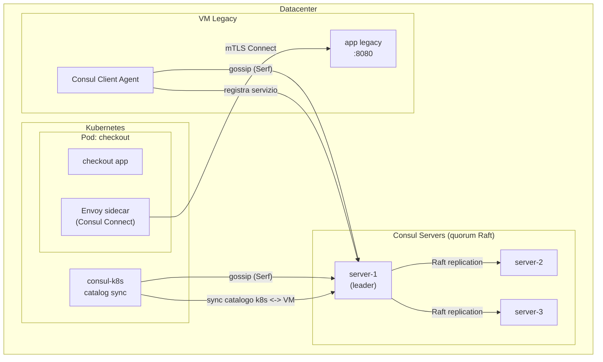

# Consul

## Panoramica

**Consul** (HashiCorp) è una piattaforma che unisce tre funzioni storicamente separate: **service discovery**, **service mesh** (Consul Connect) e **KV store** distribuito per configurazione. A differenza di Istio o Linkerd, che sono nativi Kubernetes, Consul nasce **agnostico rispetto alla piattaforma**: lo stesso catalogo di servizi può includere VM, container Docker standalone, Nomad job e pod Kubernetes.

Questo lo rende la scelta tipica per infrastrutture **ibride** o in migrazione verso Kubernetes, dove serve un unico piano di service discovery e mTLS che copra sia i workload legacy su VM sia i nuovi carichi containerizzati, senza dover mantenere VPN o peering di rete dedicati tra i due mondi.

**Quando NON usarlo:** se l'infrastruttura è già 100% Kubernetes e non ci sono VM da integrare, un service mesh nativo k8s (Istio, Linkerd) riduce l'overhead operativo — Consul richiede di gestire un cluster server separato con il proprio quorum Raft, indipendente dal control plane di Kubernetes.

## Concetti Chiave

!!! note "Consul non è solo un service mesh"
    Consul Connect (mTLS + sidecar proxy) è **una delle funzionalità**, non l'intero prodotto. Si può usare Consul solo come service discovery/KV store senza mai abilitare Connect.

### Agent model: client e server

Ogni nodo del cluster Consul esegue un **agente**, in due modalità:

- **Server**: mantiene lo stato del cluster tramite **Raft consensus** (algoritmo che elegge un leader e replica il log solo con maggioranza dei nodi, il *quorum*), replica il catalogo servizi, risponde alle query DNS/HTTP. Tipicamente 3 o 5 server per datacenter (quorum dispari).
- **Client**: gira su ogni nodo applicativo (VM o come DaemonSet in k8s), inoltra le richieste ai server e esegue gli health check locali.

### Gossip protocol (Serf)

I nodi si scoprono e si tengono sincronizzati tramite **Serf**, un protocollo gossip epidemico basato su SWIM (Scalable Weakly-consistent Infection-style Membership: ogni nodo sonda periodicamente peer casuali, così il costo per nodo resta costante al crescere del cluster). Serve per: cluster membership, failure detection e propagazione di eventi, senza dipendere da un single point of failure per il discovery iniziale.

### Catalogo servizi e DNS

Consul espone i servizi registrati via interfaccia DNS (`<service>.service.consul`) e HTTP API. Qualsiasi client — script bash, applicazione legacy, container — può risolvere un servizio senza SDK dedicato.

## Architettura / Come Funziona



### Consul on Kubernetes

Il deployment su Kubernetes avviene tramite **Helm chart ufficiale** (`consul-k8s`), che installa:

- Consul server (StatefulSet) — o punta a server esterni già esistenti
- Consul client (DaemonSet) su ogni nodo
- **Connect Inject** webhook — inietta automaticamente il sidecar Envoy nei pod annotati
- **Catalog Sync** — sincronizza bidirezionalmente i servizi tra il catalogo Consul (VM, Nomad) e i Service Kubernetes

### mTLS: Connect CA

Consul Connect fornisce mTLS automatico tra i servizi tramite una **Certificate Authority** interna:

- **Built-in CA**: Consul stesso genera e ruota i certificati (default, zero configurazione)
- **Vault come backend CA**: per ambienti enterprise, Consul può delegare l'emissione dei certificati a [Vault](../../security/secret-management/vault.md), centralizzando la gestione dei segreti e sfruttando l'infrastruttura PKI già esistente
- I certificati usano identità **SPIFFE**-compatibili, coerenti con quanto descritto in [mTLS e SPIFFE](../../security/autenticazione/mtls-spiffe.md)

### Intentions — autorizzazione L4/L7

Le **intentions** sono le regole allow/deny che definiscono quali servizi possono comunicare tra loro, equivalenti concettualmente alle `AuthorizationPolicy` di Istio ma più semplici (modello a coppie source→destination).

## Configurazione & Pratica

### Installazione su Kubernetes (Helm)

```bash
# Aggiungere repo Helm HashiCorp
helm repo add hashicorp https://helm.releases.hashicorp.com
helm repo update

# values.yaml minimo per abilitare server + connect + sync
cat <<EOF > consul-values.yaml
global:
  name: consul
  datacenter: dc1
server:
  replicas: 3
connectInject:
  enabled: true
syncCatalog:
  enabled: true
  toConsul: true    # k8s -> Consul
  toK8S: true       # Consul -> k8s (espone servizi VM come Service k8s)
EOF

# Installare il chart
helm install consul hashicorp/consul --create-namespace -n consul -f consul-values.yaml

# Verificare i pod
kubectl get pods -n consul
```

### Registrare un servizio VM legacy

```json
// /etc/consul.d/legacy-app.json sull'agent client della VM
{
  "service": {
    "name": "legacy-billing",
    "port": 8080,
    "tags": ["legacy", "vm"],
    "check": {
      "http": "http://localhost:8080/health",
      "interval": "10s",
      "timeout": "2s"
    }
  }
}
```

```bash
# Ricaricare la configurazione dell'agent client
consul reload

# Verificare che il servizio sia registrato e sano
consul catalog services
consul health check legacy-billing
```

### Sidecar injection su Kubernetes (annotation)

```yaml
apiVersion: apps/v1
kind: Deployment
metadata:
  name: checkout
spec:
  template:
    metadata:
      annotations:
        "consul.hashicorp.com/connect-inject": "true"
        # Espone il servizio anche al catalogo sync verso le VM
        "consul.hashicorp.com/service-tags": "checkout,k8s"
    spec:
      containers:
        - name: checkout
          image: myregistry/checkout:1.4.0
          ports:
            - containerPort: 8080
```

### Consumare il servizio VM da un pod Kubernetes (senza VPN)

```yaml
# Nel pod k8s, il proxy Connect risolve legacy-billing tramite upstream
apiVersion: apps/v1
kind: Deployment
metadata:
  name: checkout
spec:
  template:
    metadata:
      annotations:
        "consul.hashicorp.com/connect-inject": "true"
        # Upstream: espone legacy-billing (registrato dalla VM) su localhost:9191
        "consul.hashicorp.com/connect-service-upstreams": "legacy-billing:9191"
    spec:
      containers:
        - name: checkout
          image: myregistry/checkout:1.4.0
          env:
            - name: BILLING_SERVICE_URL
              value: "http://localhost:9191"   # Envoy instrada via mTLS alla VM
```

### Intentions — autorizzare la comunicazione

```bash
# Permettere a checkout di chiamare legacy-billing
consul intention create checkout legacy-billing

# Deny-all di default a livello globale (best practice: negare, poi aprire)
consul intention create -deny "*" "*"

# Verificare le intentions attive
consul intention check checkout legacy-billing
```

```hcl
# Alternativa dichiarativa via CRD su Kubernetes
apiVersion: consul.hashicorp.com/v1alpha1
kind: ServiceIntentions
metadata:
  name: legacy-billing
spec:
  destination:
    name: legacy-billing
  sources:
    - name: checkout
      action: allow
    - name: "*"
      action: deny
```

### KV store per configurazione

```bash
# Scrivere una chiave di configurazione
consul kv put config/checkout/max_retries 3

# Leggere una chiave
consul kv get config/checkout/max_retries

# Watch su una chiave (utile per reload dinamico dell'app)
consul watch -type=key -key=config/checkout/max_retries my-reload-script.sh
```

## Best Practices

!!! tip "Deny-all di default sulle intentions"
    Come per Istio/AuthorizationPolicy, impostare `consul intention create -deny "*" "*"` a livello globale e aprire esplicitamente solo le comunicazioni necessarie. Riduce drasticamente il blast radius in caso di compromissione di un servizio.

!!! tip "Vault come Connect CA in produzione"
    Il built-in CA di Consul va bene per iniziare, ma in ambienti enterprise con requisiti di audit centralizzato conviene delegare l'emissione certificati a [Vault](../../security/secret-management/vault.md): unico punto di rotazione, revoca e logging per tutta la PKI aziendale.

!!! warning "Overhead operativo del cluster separato"
    A differenza di Istio (che riusa il control plane Kubernetes), Consul richiede di mantenere un cluster server dedicato con il proprio quorum Raft e gossip pool. In ambienti puramente Kubernetes questo è complessità aggiuntiva non giustificata se non serve l'integrazione VM/ibrida.

- **ACL (Access Control List) abilitate in produzione**: senza ACL chiunque può scrivere nel catalogo o nel KV store. Abilitare `acl.enabled = true` con default policy `deny`.
- **Mesh Gateway per multi-datacenter**: per comunicazione cross-datacenter senza esporre ogni singolo servizio, usare i Mesh Gateway invece di aprire rotte dirette.
- **Terminating Gateway per servizi esterni non mesh-aware**: registrare database o API esterne dietro un Terminating Gateway per portarle sotto mTLS Connect senza modificarle.

## Troubleshooting

### Scenario 1 — Servizio non risolve via DNS

**Sintomo**: `NXDOMAIN` su `<service>.service.consul`.

**Causa**: agent locale non nel cluster, oppure il resolver di sistema non inoltra il dominio `.consul` alla porta DNS di Consul (8600, non la 53 standard).

**Soluzione**: verificare membership, interrogare direttamente Consul per isolare il problema, poi configurare il forwarding (`dnsmasq`/`systemd-resolved`).

```bash
consul members
dig @127.0.0.1 -p 8600 legacy-billing.service.consul
# systemd-resolved: inoltra solo il dominio .consul
# /etc/systemd/resolved.conf.d/consul.conf -> [Resolve] DNS=127.0.0.1:8600  Domains=~consul
```

### Scenario 2 — Sidecar Envoy non iniettato

**Sintomo**: il pod parte con un solo container, nessun `consul-connect-envoy-sidecar`.

**Causa**: webhook `connect-inject` (mutating admission webhook che modifica il pod alla creazione) disabilitato, annotation mancante, o pod creato prima dell'abilitazione.

**Soluzione**: verificare i values Helm e l'annotation, poi ricreare il pod (l'injection avviene solo alla creazione).

```bash
helm get values consul -n consul | grep -A2 connectInject
kubectl get deploy checkout -o jsonpath='{.spec.template.metadata.annotations}'
kubectl rollout restart deploy/checkout
```

### Scenario 3 — Comunicazione bloccata tra servizi mTLS

**Sintomo**: connessioni rifiutate/reset tra due servizi Connect, nonostante entrambi siano sani.

**Causa**: intention di deny (esplicita o default-deny globale) senza una regola allow per la coppia source→destination.

**Soluzione**: controllare l'esito dell'intention e creare l'allow esplicita.

```bash
consul intention check checkout legacy-billing
consul intention create -allow checkout legacy-billing
```

### Scenario 4 — Cluster server senza leader

**Sintomo**: errori `No cluster leader`, scritture e registrazioni falliscono.

**Causa**: quorum Raft perso (la maggioranza dei server `N/2+1` non è raggiungibile) per partizione di rete o server down; un numero pari di server non aumenta la tolleranza ai guasti.

**Soluzione**: ripristinare i server mancanti; usare 3 o 5 server; ispezionare i peer e i log.

```bash
consul operator raft list-peers
journalctl -u consul -f                  # VM (systemd)
kubectl logs -n consul consul-server-0   # Kubernetes
```

### Scenario 5 — Catalog sync non propaga i servizi VM verso k8s

**Sintomo**: servizi registrati dalla VM assenti come Service Kubernetes.

**Causa**: `syncCatalog.toK8S` disabilitato oppure filtri di sync (tag, namespace) non corrispondenti.

**Soluzione**: controllare i values Helm e i log del pod di sync.

```bash
helm get values consul -n consul | grep -A4 syncCatalog
kubectl logs -n consul deploy/consul-sync-catalog
kubectl exec -n default <pod> -c consul-connect-envoy-sidecar -- \
  wget -qO- http://localhost:19000/config_dump   # config Envoy effettiva
```

## Relazioni

??? info "Service Mesh — Concetti Base"
    Per il confronto generale sidecar pattern, data plane/control plane e quando serve davvero un service mesh.

    **Approfondimento completo →** [Concetti Base](concetti-base.md)

??? info "Istio — alternativa Kubernetes-native"
    Istio copre solo Kubernetes ma con traffic management più ricco (canary, fault injection via CRD). Consul vince quando serve integrare VM e infrastrutture ibride nello stesso mesh.

    **Approfondimento completo →** [Istio](istio.md)

??? info "Vault — Connect CA backend"
    Consul può delegare a Vault l'emissione dei certificati mTLS per centralizzare PKI e audit.

    **Approfondimento completo →** [Vault](../../security/secret-management/vault.md)

??? info "mTLS e SPIFFE"
    Le identità dei certificati Connect sono SPIFFE-compatibili, stesso modello descritto per Istio/Envoy.

    **Approfondimento completo →** [mTLS e SPIFFE](../../security/autenticazione/mtls-spiffe.md)

## Riferimenti

- [Consul Documentation](https://developer.hashicorp.com/consul/docs)
- [Consul Connect (Service Mesh)](https://developer.hashicorp.com/consul/docs/connect)
- [Consul on Kubernetes](https://developer.hashicorp.com/consul/docs/k8s)
- [Consul Intentions](https://developer.hashicorp.com/consul/docs/connect/intentions)
- [Consul Architecture](https://developer.hashicorp.com/consul/docs/architecture)
