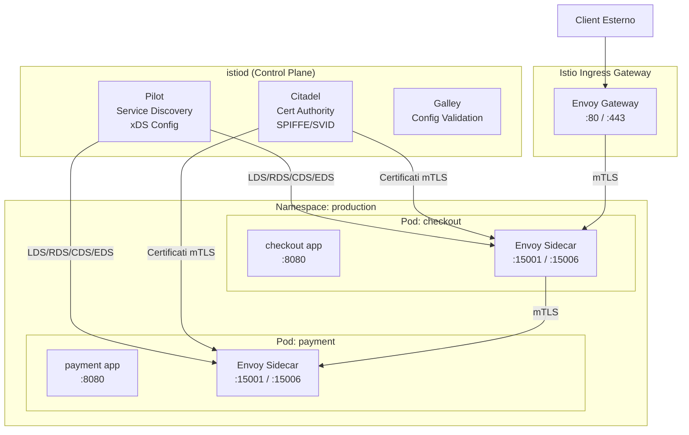

# Istio

## Panoramica

**Istio** e' il service mesh open source piu' adottato nell'ecosistema Kubernetes. Nato da una collaborazione tra Google, IBM e Lyft nel 2017, offre un set completo di funzionalita' per il traffico service-to-service: sicurezza (mTLS automatico, authorization policy), traffic management (canary, circuit breaking, fault injection), e observability (metriche, tracing, service graph).

Istio usa **Envoy** come data plane (sidecar proxy) e **istiod** come control plane unificato. Tutta la configurazione avviene tramite Kubernetes Custom Resource Definitions (CRD), che permettono di dichiarare le politiche in file YAML versionati in Git.

**Capacita' principali:**
- mTLS automatico tra tutti i servizi con rotazione certificati
- Routing avanzato: canary, A/B testing, traffic mirroring, fault injection
- Circuit breaking e retry configurabili per route
- Authorization policy fine-grained (source namespace, principal, JWT claims)
- Integrazione nativa con Prometheus, Kiali, Jaeger, Zipkin, Grafana

## Architettura



### Componenti di istiod

| Componente | Ruolo (in istiod unificato) |
|------------|----------------------------|
| **Pilot** | Service discovery, distribuzione configurazione xDS agli Envoy |
| **Citadel** | Certificate Authority SPIFFE/SVID, emissione e rotazione certificati mTLS |
| **Galley** | Validazione e normalizzazione della configurazione |

!!! note "Nota storica"
    Prima di Istio 1.5 (2020), Pilot, Citadel e Galley erano processi separati. Da 1.5 sono stati unificati in un unico processo `istiod` per semplicita' operativa.

## CRD Principali

### VirtualService

Definisce le **regole di routing** per il traffico verso un servizio. Permette routing basato su header, peso percentuale, fault injection, retry e timeout.

```yaml
apiVersion: networking.istio.io/v1alpha3
kind: VirtualService
metadata:
  name: checkout-vs
  namespace: production
spec:
  hosts:
    - checkout
  http:
    # Canary: 10% al v2, 90% al v1
    - match:
        - headers:
            x-canary:
              exact: "true"
      route:
        - destination:
            host: checkout
            subset: v2
    - route:
        - destination:
            host: checkout
            subset: v1
          weight: 90
        - destination:
            host: checkout
            subset: v2
          weight: 10
      # Retry policy
      retries:
        attempts: 3
        perTryTimeout: 5s
        retryOn: gateway-error,connect-failure,retriable-4xx
      # Timeout globale
      timeout: 30s
```

### DestinationRule

Definisce le **politiche applicate al traffico verso un host** dopo il routing: load balancing, circuit breaker, mTLS mode, subset (versioni).

```yaml
apiVersion: networking.istio.io/v1alpha3
kind: DestinationRule
metadata:
  name: checkout-dr
  namespace: production
spec:
  host: checkout
  trafficPolicy:
    loadBalancer:
      simple: LEAST_CONN
    connectionPool:
      tcp:
        maxConnections: 100
      http:
        http1MaxPendingRequests: 50
        http2MaxRequests: 1000
    # Circuit breaker: outlier detection
    outlierDetection:
      consecutiveGatewayErrors: 5
      interval: 30s
      baseEjectionTime: 30s
      maxEjectionPercent: 50
    # mTLS mode per questo host
    tls:
      mode: ISTIO_MUTUAL
  subsets:
    - name: v1
      labels:
        version: v1
    - name: v2
      labels:
        version: v2
      trafficPolicy:
        loadBalancer:
          simple: ROUND_ROBIN
```

### Gateway

Configura il **load balancer all'edge del mesh** per gestire traffico in ingresso/uscita. Abbinato a un VirtualService per il routing interno.

```yaml
apiVersion: networking.istio.io/v1alpha3
kind: Gateway
metadata:
  name: main-gateway
  namespace: production
spec:
  selector:
    istio: ingressgateway
  servers:
    - port:
        number: 443
        name: https
        protocol: HTTPS
      tls:
        mode: SIMPLE
        credentialName: tls-secret   # kubernetes.io/tls secret
      hosts:
        - "api.example.com"
    - port:
        number: 80
        name: http
        protocol: HTTP
      hosts:
        - "api.example.com"
      tls:
        httpsRedirect: true
---
# VirtualService per collegare Gateway al servizio interno
apiVersion: networking.istio.io/v1alpha3
kind: VirtualService
metadata:
  name: api-external-vs
  namespace: production
spec:
  hosts:
    - "api.example.com"
  gateways:
    - main-gateway
  http:
    - route:
        - destination:
            host: api-service
            port:
              number: 8080
```

### ServiceEntry

Registra **servizi esterni al mesh** (database SaaS, API terze parti) rendendoli visibili e gestibili come fossero servizi interni.

```yaml
apiVersion: networking.istio.io/v1alpha3
kind: ServiceEntry
metadata:
  name: external-payments-api
spec:
  hosts:
    - api.payments-provider.com
  ports:
    - number: 443
      name: https
      protocol: HTTPS
  resolution: DNS
  location: MESH_EXTERNAL
```

### PeerAuthentication

Definisce la **politica mTLS** per il traffico in ingresso ai workload nel namespace.

```yaml
# Abilitare mTLS STRICT per tutto il namespace production
apiVersion: security.istio.io/v1beta1
kind: PeerAuthentication
metadata:
  name: default
  namespace: production
spec:
  mtls:
    mode: STRICT
---
# Eccezione per un deployment specifico (es. health check da un sistema legacy)
apiVersion: security.istio.io/v1beta1
kind: PeerAuthentication
metadata:
  name: legacy-allow
  namespace: production
spec:
  selector:
    matchLabels:
      app: legacy-service
  mtls:
    mode: PERMISSIVE
```

### AuthorizationPolicy

Definisce le **regole allow/deny** per il traffico: quale sorgente puo' raggiungere quale destinazione, su quale metodo/path.

```yaml
# Permettere solo al checkout di chiamare il payment service
apiVersion: security.istio.io/v1beta1
kind: AuthorizationPolicy
metadata:
  name: payment-authz
  namespace: production
spec:
  selector:
    matchLabels:
      app: payment-service
  action: ALLOW
  rules:
    - from:
        - source:
            principals:
              - "cluster.local/ns/production/sa/checkout-service-account"
      to:
        - operation:
            methods: ["POST"]
            paths: ["/api/v1/charge", "/api/v1/refund"]
---
# Deny-all di default (best practice: iniziare negando tutto, poi aprire)
apiVersion: security.istio.io/v1beta1
kind: AuthorizationPolicy
metadata:
  name: deny-all
  namespace: production
spec:
  {}
```

## Traffic Management — Esempi Avanzati

### Canary Deployment (10%/90%)

```yaml
# DestinationRule: definire i subset v1 e v2
apiVersion: networking.istio.io/v1alpha3
kind: DestinationRule
metadata:
  name: api-service-dr
spec:
  host: api-service
  subsets:
    - name: v1
      labels:
        version: "1.0"
    - name: v2
      labels:
        version: "2.0"
---
# VirtualService: 10% al v2, 90% al v1
apiVersion: networking.istio.io/v1alpha3
kind: VirtualService
metadata:
  name: api-service-vs
spec:
  hosts:
    - api-service
  http:
    - route:
        - destination:
            host: api-service
            subset: v1
          weight: 90
        - destination:
            host: api-service
            subset: v2
          weight: 10
```

### Fault Injection per Chaos Testing

```yaml
apiVersion: networking.istio.io/v1alpha3
kind: VirtualService
metadata:
  name: payment-fault-test
spec:
  hosts:
    - payment-service
  http:
    - fault:
        # Iniettare 500ms di delay sul 10% delle richieste
        delay:
          percentage:
            value: 10.0
          fixedDelay: 500ms
        # Restituire HTTP 503 sul 5% delle richieste
        abort:
          percentage:
            value: 5.0
          httpStatus: 503
      route:
        - destination:
            host: payment-service
```

### Circuit Breaker (via DestinationRule)

```yaml
apiVersion: networking.istio.io/v1alpha3
kind: DestinationRule
metadata:
  name: inventory-circuit-breaker
spec:
  host: inventory-service
  trafficPolicy:
    connectionPool:
      tcp:
        maxConnections: 50
      http:
        http1MaxPendingRequests: 20
        http2MaxRequests: 200
        maxRetries: 3
    outlierDetection:
      # Ejection dopo 5 errori consecutivi in 10s
      consecutiveGatewayErrors: 5
      interval: 10s
      # Tenere fuori dal pool per 30s
      baseEjectionTime: 30s
      # Max 100% degli host ejectabili
      maxEjectionPercent: 100
      # Considerare anche HTTP 5xx
      splitExternalLocalOriginErrors: true
```

### Retry Policy

```yaml
apiVersion: networking.istio.io/v1alpha3
kind: VirtualService
metadata:
  name: catalog-vs
spec:
  hosts:
    - catalog-service
  http:
    - route:
        - destination:
            host: catalog-service
      retries:
        attempts: 3
        perTryTimeout: 2s
        retryOn: "gateway-error,connect-failure,reset,retriable-4xx"
      timeout: 10s
```

## Observability

### Kiali — Service Graph

Kiali fornisce una visualizzazione grafica del service mesh: traffico tra servizi in real-time, errori, latenza, configurazione mTLS. Si installa come addon Istio.

```bash
# Installare gli addon ufficiali (Kiali, Prometheus, Grafana, Jaeger)
kubectl apply -f https://raw.githubusercontent.com/istio/istio/release-1.20/samples/addons/kiali.yaml
kubectl apply -f https://raw.githubusercontent.com/istio/istio/release-1.20/samples/addons/prometheus.yaml
kubectl apply -f https://raw.githubusercontent.com/istio/istio/release-1.20/samples/addons/grafana.yaml
kubectl apply -f https://raw.githubusercontent.com/istio/istio/release-1.20/samples/addons/jaeger.yaml

# Aprire dashboard Kiali
istioctl dashboard kiali
```

### Prometheus + Grafana

Istio espone automaticamente metriche Prometheus dai sidecar Envoy:

| Metrica | Descrizione |
|---------|-------------|
| `istio_requests_total` | Contatore richieste per source, destination, response code |
| `istio_request_duration_milliseconds` | Latenza per percentile (p50, p95, p99) |
| `istio_tcp_sent_bytes_total` | Traffico TCP |
| `pilot_xds_pushes` | Push di configurazione da istiod |

### Distributed Tracing (Jaeger/Zipkin)

Istio propaga automaticamente gli header di tracing (B3, W3C TraceContext). L'applicazione deve solo **propagare** gli header ricevuti nelle richieste in uscita — non deve generare span.

```python
# Esempio Python: propagare header di tracing
TRACE_HEADERS = [
    'x-request-id', 'x-b3-traceid', 'x-b3-spanid',
    'x-b3-parentspanid', 'x-b3-sampled', 'x-b3-flags',
    'x-ot-span-context', 'traceparent', 'tracestate'
]

def forward_trace_headers(incoming_request, outgoing_request):
    for header in TRACE_HEADERS:
        if header in incoming_request.headers:
            outgoing_request.headers[header] = incoming_request.headers[header]
```

## Installazione

```bash
# 1. Scaricare istioctl
curl -L https://istio.io/downloadIstio | sh -
export PATH=$PWD/istio-1.20.0/bin:$PATH

# 2. Verificare prerequisiti del cluster
istioctl x precheck

# 3. Installare Istio con profilo default
istioctl install --set profile=default -y

# 4. Verificare installazione
istioctl verify-install

# 5. Abilitare sidecar injection sul namespace target
kubectl label namespace production istio-injection=enabled

# 6. Rollout dei deployment esistenti per iniettare il sidecar
kubectl rollout restart deployment -n production
```

### Profili disponibili

| Profilo | Uso | Componenti |
|---------|-----|------------|
| `minimal` | Sviluppo, risorse limitate | Solo istiod |
| `default` | Produzione standard | istiod + ingress gateway |
| `demo` | Demo, test, tutorial | Tutti i componenti + addons |
| `ambient` | Nuova modalita' senza sidecar (alpha/beta) | istiod + ztunnel + waypoint proxy |

## Best Practices

!!! tip "Label namespace per auto-injection"
    Applicare `istio-injection=enabled` solo ai namespace che effettivamente necessitano del service mesh. Non iniettare il sidecar nei namespace di sistema (`kube-system`, `istio-system`).

!!! tip "mTLS STRICT in produzione"
    Usare PERMISSIVE solo durante la fase di migrazione. In produzione impostare STRICT a livello mesh o namespace con PeerAuthentication.

!!! tip "Resource limits per il sidecar"
    Il sidecar Envoy consuma risorse. Impostare sempre request/limit per evitare starvation:

```yaml
# Impostare resource limits per tutti i sidecar di un namespace
apiVersion: v1
kind: ConfigMap
metadata:
  name: istio-sidecar-injector
  namespace: istio-system
data:
  config: |
    defaultTemplates: [sidecar]
    policy: enabled
    alwaysInjectSelector: []
    neverInjectSelector: []
    injectedAnnotations: {}
    template: |
      spec:
        containers:
        - name: istio-proxy
          resources:
            requests:
              cpu: 10m
              memory: 40Mi
            limits:
              cpu: 200m
              memory: 256Mi
```

!!! tip "GitOps con Istio CRDs"
    Versionare tutti i VirtualService, DestinationRule, PeerAuthentication e AuthorizationPolicy in Git. Usare Argo CD o Flux per applicazione automatica. Il declarative model di Istio si presta perfettamente al GitOps.

## Troubleshooting

### Comandi diagnostici principali

```bash
# Analisi automatica della configurazione (trova problemi comuni)
istioctl analyze -n production

# Stato dei proxy (sincronizzati con istiod?)
istioctl proxy-status

# Configurazione dettagliata di un proxy specifico
istioctl proxy-config all <pod-name>.<namespace>

# Listeners configurati su un pod
istioctl proxy-config listener <pod-name>.<namespace>

# Routes configurate
istioctl proxy-config route <pod-name>.<namespace>

# Clusters configurati (upstream services)
istioctl proxy-config cluster <pod-name>.<namespace>

# Endpoints (IP dei Pod upstream)
istioctl proxy-config endpoint <pod-name>.<namespace>

# Certificati mTLS
istioctl proxy-config secret <pod-name>.<namespace>

# Descrivere un servizio (policy mTLS, routing rules)
istioctl x describe service my-service.production
```

### Problemi comuni

| Problema | Causa probabile | Soluzione |
|----------|----------------|-----------|
| 503 tra servizi | mTLS mode mismatch (STRICT su un lato, no sidecar sull'altro) | Verificare PeerAuthentication e sidecar injection |
| 404 via Ingress Gateway | VirtualService non collegato al Gateway o host errato | `istioctl analyze`, verificare `gateways` nel VS |
| Sidecar non iniettato | Namespace senza label o webhook disabilitato | `kubectl label namespace ns istio-injection=enabled` |
| Certificati scaduti | istiod down durante rotazione | Riavviare istiod, verificare logs |
| Alta latenza | Envoy overhead, configurazione errata | Verificare timeout, retry loop, circuit breaker |

```bash
# Log del sidecar per debug
kubectl logs <pod-name> -c istio-proxy -n production --tail=100

# Aumentare il log level di un proxy specifico (temporaneo)
istioctl proxy-config log <pod-name>.<namespace> --level debug

# Ripristinare il log level
istioctl proxy-config log <pod-name>.<namespace> --level warning
```

## Relazioni

??? info "Envoy Proxy — Approfondimento"
    Il sidecar che Istio inietta in ogni Pod e' Envoy. Capire l'architettura xDS di Envoy permette un troubleshooting avanzato con `proxy-config` e `config_dump`.

    **Approfondimento completo →** [Envoy Proxy](envoy.md)

??? info "Service Mesh — Concetti Base"
    Per il confronto Service Mesh vs API Gateway, il pattern sidecar, e i casi d'uso generici.

    **Approfondimento completo →** [Concetti Base](concetti-base.md)

## Riferimenti

- [Istio Documentation](https://istio.io/latest/docs/)
- [Istio CRD Reference](https://istio.io/latest/docs/reference/config/networking/)
- [Istio Security](https://istio.io/latest/docs/concepts/security/)
- [Istio Observability](https://istio.io/latest/docs/concepts/observability/)
- [Istio Best Practices](https://istio.io/latest/docs/ops/best-practices/)
- [istioctl Reference](https://istio.io/latest/docs/reference/commands/istioctl/)
