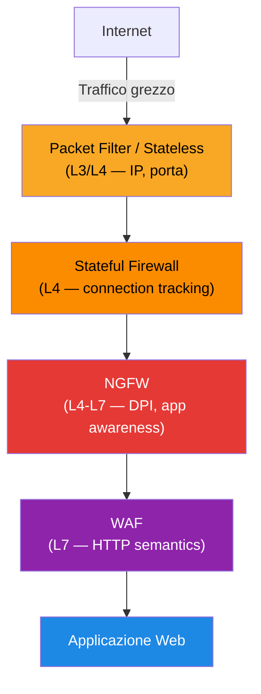
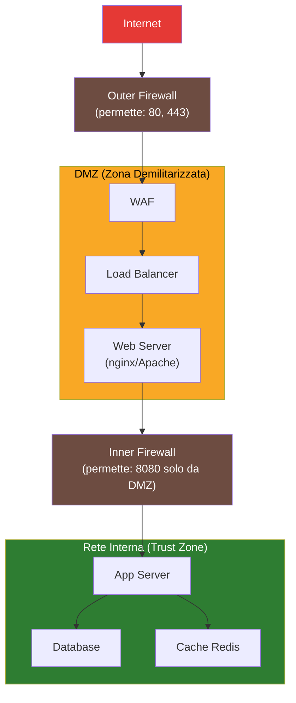

# Firewall e WAF

## Panoramica

Un firewall è un sistema di controllo del traffico di rete che applica politiche di accesso tra zone di rete con livelli di fiducia diversi. La sua funzione fondamentale è decidere quali pacchetti possono transitare in base a regole configurate dall'amministratore. I firewall operano a differenti livelli del modello OSI: dai semplici filtri di pacchetti al livello 3/4, fino alle soluzioni Layer 7 che analizzano il contenuto applicativo.

Il **Web Application Firewall (WAF)** è una specializzazione che opera esclusivamente al Layer 7 su protocolli HTTP/HTTPS, comprende la semantica delle applicazioni web e protegge da classi di vulnerabilità specifiche come SQL injection, XSS e CSRF, descritte nelle OWASP Top 10.

In un'architettura moderna a difesa in profondità, firewall e WAF sono componenti complementari che coprono livelli diversi della catena di protezione.

## Prerequisiti

Questo argomento presuppone familiarità con:
- [Modello OSI](../fondamentali/modello-osi.md) — il firewall opera a L3/L4, il WAF a L7: sapere cos'è ogni layer è fondamentale
- [TCP/IP](../fondamentali/tcpip.md) — three-way handshake, stati TCP (per capire stateful vs stateless inspection)
- [HTTP/HTTPS](../fondamentali/http-https.md) — il WAF analizza traffico HTTP/HTTPS, comprende header, body, metodi

Senza questi concetti, alcune sezioni potrebbero risultare difficili da contestualizzare.

## Tipi di Firewall

### Packet Filter (Stateless)

Opera al Layer 3 e 4. Ogni pacchetto viene valutato in modo indipendente rispetto alle regole configurate basandosi su:

- IP sorgente e destinazione
- Porta sorgente e destinazione
- Protocollo (TCP, UDP, ICMP)
- Interfaccia di rete

**Limitazione critica**: non mantiene stato delle connessioni. Per permettere il traffico di ritorno di una connessione TCP iniziata dall'interno, è necessario aprire esplicitamente le porte effimere (1024-65535) in ingresso, il che riduce significativamente la sicurezza.

### Stateful (Connection Tracking)

Mantiene una tabella dello stato delle connessioni attive. Per una connessione TCP, traccia lo stato del three-way handshake (SYN, SYN-ACK, ACK, ESTABLISHED, FIN, etc.). Questo permette di autorizzare automaticamente il traffico di ritorno per connessioni stabilite dall'interno, senza aprire porte arbitrarie.

**Vantaggio operativo**: una singola regola "ESTABLISHED,RELATED ACCEPT" copre il traffico di ritorno per tutte le connessioni autorizzate.

### NGFW — Next-Generation Firewall

Aggiunge al firewall stateful:

- **Deep Packet Inspection (DPI)**: analisi del payload oltre gli header
- **Application Awareness**: identifica le applicazioni indipendentemente dalla porta (es. riconosce BitTorrent anche su porta 80)
- **IPS/IDS integrato**: rilevamento e prevenzione intrusioni
- **SSL/TLS Inspection**: decrittografia e re-cifratura del traffico HTTPS per analisi
- **User Identity Awareness**: integrazione con directory (LDAP/AD) per politiche per utente
- **Threat Intelligence**: feed di IoC (Indicators of Compromise) aggiornati

Prodotti: Palo Alto Networks, Fortinet FortiGate, Check Point, Cisco Firepower, pfSense/OPNsense.

### WAF — Web Application Firewall

Opera esclusivamente su HTTP/HTTPS. A differenza dei firewall di rete, comprende la struttura delle richieste web:

- URI, query string, headers HTTP
- Body della richiesta (POST data, JSON, XML)
- Cookie e session token
- Response body (in modalità bidirezionale)

Può operare in tre modalità:
- **Detection/Monitor**: logga le violazioni senza bloccare
- **Prevention/Block**: blocca le richieste che violano le regole
- **Learning/Training**: modalità adattiva per ridurre falsi positivi



## iptables e nftables

### iptables: Struttura

iptables organizza le regole in **tabelle** e **chain**:

| Tabella | Scopo | Chain disponibili |
|---------|-------|-------------------|
| `filter` | Filtraggio pacchetti (default) | INPUT, OUTPUT, FORWARD |
| `nat` | Network Address Translation | PREROUTING, POSTROUTING, OUTPUT |
| `mangle` | Modifica header pacchetti | PREROUTING, POSTROUTING, INPUT, OUTPUT, FORWARD |
| `raw` | Esenzione dal connection tracking | PREROUTING, OUTPUT |

**Chain di default:**

- `INPUT`: pacchetti destinati al sistema locale
- `OUTPUT`: pacchetti originati dal sistema locale
- `FORWARD`: pacchetti in transito (routing)
- `PREROUTING`: prima del routing (nat DNAT)
- `POSTROUTING`: dopo il routing (nat SNAT/MASQUERADE)

### Regole iptables Comuni

```bash
# --- Visualizzazione ---
iptables -nvL                     # Lista regole con contatori
iptables -nvL --line-numbers      # Con numeri di riga
iptables -t nat -nvL              # Tabella NAT

# --- Policy di default ---
iptables -P INPUT DROP            # Drop di default in INPUT
iptables -P FORWARD DROP          # Drop di default in FORWARD
iptables -P OUTPUT ACCEPT         # Accept di default in OUTPUT

# --- Regole base ---
# Permettere traffico loopback
iptables -A INPUT -i lo -j ACCEPT

# Permettere traffico established/related (connessioni già aperte)
iptables -A INPUT -m conntrack --ctstate ESTABLISHED,RELATED -j ACCEPT

# Permettere SSH (porta 22) da subnet specifica
iptables -A INPUT -p tcp --dport 22 -s 10.0.0.0/8 -m conntrack --ctstate NEW -j ACCEPT

# Permettere HTTP e HTTPS da tutti
iptables -A INPUT -p tcp -m multiport --dports 80,443 -m conntrack --ctstate NEW -j ACCEPT

# Bloccare porta specifica
iptables -A INPUT -p tcp --dport 3306 -j DROP

# Rate limiting: limitare nuove connessioni SSH a 5/minuto per IP
iptables -A INPUT -p tcp --dport 22 -m conntrack --ctstate NEW \
  -m hashlimit --hashlimit-name ssh --hashlimit-upto 5/minute \
  --hashlimit-burst 3 --hashlimit-mode srcip -j ACCEPT
iptables -A INPUT -p tcp --dport 22 -j DROP

# MASQUERADE per NAT (es. gateway per rete interna)
iptables -t nat -A POSTROUTING -o eth0 -j MASQUERADE

# --- Persistenza ---
iptables-save > /etc/iptables/rules.v4
iptables-restore < /etc/iptables/rules.v4
```

### ip6tables per IPv6

Le stesse regole si applicano a IPv6 con il comando `ip6tables`. Errore comune: configurare solo iptables dimenticando che IPv6 usa regole separate.

```bash
ip6tables -P INPUT DROP
ip6tables -A INPUT -i lo -j ACCEPT
ip6tables -A INPUT -m conntrack --ctstate ESTABLISHED,RELATED -j ACCEPT
# Permettere ICMPv6 (necessario per Neighbor Discovery)
ip6tables -A INPUT -p ipv6-icmp -j ACCEPT
ip6tables -A INPUT -p tcp --dport 22 -j ACCEPT
```

### nftables: Il Successore

nftables sostituisce iptables/ip6tables/ebtables con un'unica interfaccia unificata. Disponibile su kernel 3.13+, è il default su Debian 10+, RHEL 8+.

```bash
# Visualizzazione
nft list ruleset

# Creare una tabella e chain equivalente a iptables
nft add table inet filter
nft add chain inet filter input { type filter hook input priority 0 \; policy drop \; }
nft add chain inet filter forward { type filter hook forward priority 0 \; policy drop \; }
nft add chain inet filter output { type filter hook output priority 0 \; policy accept \; }

# Regole equivalenti a iptables
nft add rule inet filter input iif lo accept
nft add rule inet filter input ct state established,related accept
nft add rule inet filter input tcp dport 22 ct state new accept
nft add rule inet filter input tcp dport { 80, 443 } ct state new accept

# Rate limiting con nftables
nft add rule inet filter input tcp dport 22 ct state new \
  limit rate 5/minute burst 3 packets accept

# File di configurazione /etc/nftables.conf
```

**Vantaggi nftables su iptables:**
- Sintassi più coerente e leggibile
- Set e map nativi (più efficienti per liste di IP/porte)
- Valutazione atomica degli aggiornamenti (no race condition)
- Supporto nativo IPv4, IPv6, ARP, bridge in un'unica interfaccia

## Cloud Security Groups

### AWS Security Groups

I Security Groups AWS sono firewall stateful a livello di istanza (ENI). Caratteristiche principali:

- **Stateful**: il traffico di ritorno è automaticamente permesso
- **Solo regole allow**: non è possibile creare regole deny esplicite
- **Associati alle ENI**: possono essere applicati a istanze EC2, RDS, Lambda (VPC), etc.
- **Modifiche applicate immediatamente**: senza necessità di riavvio
- **Reference tra SG**: un SG può referenziare un altro come sorgente (es. "permetti traffico dal SG del load balancer")

```json
// Esempio: Security Group per web server
{
  "GroupName": "web-server-sg",
  "Description": "Web server security group",
  "Inbound": [
    {
      "Type": "HTTPS",
      "Protocol": "TCP",
      "Port": 443,
      "Source": "0.0.0.0/0",
      "Description": "HTTPS from internet"
    },
    {
      "Type": "Custom TCP",
      "Protocol": "TCP",
      "Port": 8080,
      "Source": "alb-sg-id",
      "Description": "HTTP from ALB only (SG reference)"
    },
    {
      "Type": "SSH",
      "Protocol": "TCP",
      "Port": 22,
      "Source": "bastion-sg-id",
      "Description": "SSH from bastion host only"
    }
  ],
  "Outbound": [
    {
      "Type": "All traffic",
      "Protocol": "-1",
      "Port": "All",
      "Destination": "0.0.0.0/0"
    }
  ]
}
```

### AWS Network ACL (NACL)

Le NACL operano a livello di subnet, a differenza dei SG che operano a livello di istanza.

| Caratteristica | Security Group | Network ACL |
|----------------|----------------|-------------|
| Livello | Istanza (ENI) | Subnet |
| Stato | Stateful | Stateless |
| Regole Allow | Si | Si |
| Regole Deny | No | Si |
| Ordine regole | Tutte valutate | Primo match (numerato) |
| Default | Deny all (SG senza regole) | Allow all |
| Use case | Protezione istanze | Blocco subnet-level (es. ban IP) |

!!! warning "NACL Stateless"
    Le NACL sono stateless. Per permettere il traffico TCP di ritorno verso client ephemeral ports (1024-65535), è necessario aggiungere esplicitamente una regola outbound per quell'intervallo di porte. Questo è un errore comune nella configurazione.

### Azure Network Security Group (NSG)

Gli NSG Azure hanno una struttura simile ai SG AWS ma con alcune differenze:

- Possono essere applicati a subnet OPPURE a singole NIC (o entrambi)
- Supportano sia regole allow che deny
- Hanno priorità numeriche (100-4096): regola con numero più basso ha priorità maggiore
- Includono regole di default pre-configurate (es. DenyAllInBound con priorità 65500)

```yaml
# Esempio NSG Rule in Azure (ARM template)
securityRules:
  - name: allow-https
    properties:
      priority: 100
      protocol: Tcp
      access: Allow
      direction: Inbound
      sourceAddressPrefix: "*"
      sourcePortRange: "*"
      destinationAddressPrefix: "*"
      destinationPortRange: "443"
  - name: deny-all-inbound
    properties:
      priority: 4096
      protocol: "*"
      access: Deny
      direction: Inbound
      sourceAddressPrefix: "*"
      sourcePortRange: "*"
      destinationAddressPrefix: "*"
      destinationPortRange: "*"
```

## WAF — Web Application Firewall

### OWASP ModSecurity Core Rule Set (CRS)

Il ModSecurity CRS è il set di regole open source più diffuso per WAF. Protegge dalle OWASP Top 10:

- **A01 — Broken Access Control**: rilevamento di path traversal (../), directory listing
- **A02 — Cryptographic Failures**: rilevamento di trasmissione dati sensibili
- **A03 — Injection**: SQL injection, command injection, LDAP injection
- **A05 — Security Misconfiguration**: rilevamento di header di sicurezza mancanti
- **A06 — Vulnerable Components**: rilevamento di exploit noti
- **A07 — Auth Failures**: brute force, credential stuffing
- **A08 — Software Integrity**: deserializzazione insicura
- **A10 — SSRF**: Server-Side Request Forgery

```apache
# Configurazione ModSecurity base (Apache/nginx)
SecRuleEngine On
SecAuditLog /var/log/modsec_audit.log
SecAuditLogParts ABIJDEFHZ

# Paranoia Level (1=minimo falsi positivi, 4=massima sicurezza)
SecAction "id:900000,phase:1,nolog,pass,t:none,setvar:tx.paranoia_level=2"

# Abilita CRS
Include /etc/modsecurity/crs/crs-setup.conf
Include /etc/modsecurity/crs/rules/*.conf
```

### AWS WAF

AWS WAF è un servizio gestito integrato con CloudFront, ALB, API Gateway e AppSync.

```hcl
# Terraform: AWS WAF WebACL con regole managed
resource "aws_wafv2_web_acl" "main" {
  name  = "production-waf"
  scope = "REGIONAL"  # o "CLOUDFRONT" per CloudFront

  default_action {
    allow {}
  }

  # AWS Managed Rules: Core Rule Set
  rule {
    name     = "AWSManagedRulesCommonRuleSet"
    priority = 10

    override_action { none {} }

    statement {
      managed_rule_group_statement {
        name        = "AWSManagedRulesCommonRuleSet"
        vendor_name = "AWS"
      }
    }

    visibility_config {
      cloudwatch_metrics_enabled = true
      metric_name                = "CommonRuleSetMetric"
      sampled_requests_enabled   = true
    }
  }

  # Rate limiting: max 2000 req/5min per IP
  rule {
    name     = "RateLimitRule"
    priority = 1

    action { block {} }

    statement {
      rate_based_statement {
        limit              = 2000
        aggregate_key_type = "IP"
      }
    }

    visibility_config {
      cloudwatch_metrics_enabled = true
      metric_name                = "RateLimitMetric"
      sampled_requests_enabled   = true
    }
  }
}
```

### Gestione Falsi Positivi

I falsi positivi sono il problema principale dei WAF in produzione. Approccio consigliato:

1. **Fase iniziale**: Deploy in modalità Detection/Count (non blocca)
2. **Analisi log**: identificare pattern di falsi positivi per almeno 2 settimane
3. **Tuning**: creare regole di esclusione per le richieste legittime identificate
4. **Gradual enforcement**: abilitare Prevention/Block regola per regola
5. **Monitoring continuo**: alert su spike di blocked requests

```python
# Esempio di esclusione in AWS WAF per falso positivo
# Esclude la regola SQLi per la path /api/v1/query che usa SQL-like syntax legittimamente
{
  "ExcludedRules": [
    {
      "Name": "SQLi_QUERYARGUMENTS"
    }
  ],
  "ScopeDownStatement": {
    "ByteMatchStatement": {
      "SearchString": "/api/v1/query",
      "FieldToMatch": {"UriPath": {}},
      "TextTransformations": [{"Priority": 0, "Type": "NONE"}],
      "PositionalConstraint": "STARTS_WITH"
    }
  }
}
```

## Architettura DMZ

La DMZ (Demilitarized Zone) è una subnet parzialmente fidata che ospita servizi pubblicamente accessibili, separando Internet dalla rete interna.



**Regole dei firewall nella DMZ:**

- Outer firewall: permette solo 80 e 443 da Internet verso DMZ
- DMZ → Inner: solo le porte applicative necessarie (es. 8080 per app server)
- Inner firewall: nessun accesso diretto da Internet alle risorse interne
- Database: mai esposto in DMZ, solo accessibile dall'App Server nella rete interna

## Best Practices

!!! tip "Default Deny"
    La policy di base deve essere `DROP ALL`. Aprire esplicitamente solo il traffico necessario documentando il motivo di ogni regola.

!!! tip "Minimal Exposure"
    Non esporre mai servizi su `0.0.0.0/0` se non strettamente necessario. SSH, RDP, database management ports non devono mai essere accessibili da Internet.

**Regole generali:**

1. **Documentare ogni regola**: ogni regola firewall deve avere un commento/description con il motivo e il ticket di riferimento
2. **Separation of duties per ambiente**: SG/NSG separati per dev, staging, prod
3. **Revoca accessi temporanei**: le regole temporanee (es. accesso debug) devono avere una data di scadenza e un processo di revisione
4. **Audit regolare**: rivedere trimestralmente le regole per rimuovere quelle obsolete
5. **Principle of least privilege per SG**: usare SG reference invece di CIDR quando possibile (es. ALB-SG → EC2-SG)
6. **Log tutto**: abilitare VPC Flow Logs (AWS) o NSG Flow Logs (Azure) per visibilità completa
7. **WAF in tutte le applicazioni pubbliche**: non solo i servizi "critici"

## Troubleshooting

### iptables Debug

```bash
# Visualizza regole con contatori di pacchetti e bytes
iptables -nvL --line-numbers

# Conta i pacchetti che matchano ogni regola
watch -n1 iptables -nvL

# Log dei pacchetti droppati (aggiungere regola di log prima del DROP)
iptables -A INPUT -j LOG --log-prefix "IPTABLES-DROP: " --log-level 4
iptables -A INPUT -j DROP

# Svuota contatori
iptables -Z

# Tracciare connessione specifica con conntrack
conntrack -L | grep "192.168.1.10"
conntrack -L --proto tcp --dport 443

# Verificare stato connection tracking
cat /proc/net/nf_conntrack | grep "192.168.1.10"
```

### AWS Security Groups Debug

```bash
# Visualizza regole di un SG
aws ec2 describe-security-groups --group-ids sg-xxxxxxxx

# VPC Flow Logs: abilitare per debug traffico
aws ec2 create-flow-logs \
  --resource-type VPC \
  --resource-ids vpc-xxxxxxxx \
  --traffic-type ALL \
  --log-destination-type cloud-watch-logs \
  --log-group-name /vpc/flowlogs

# Query CloudWatch Insights per traffico rifiutato
# filter action="REJECT" | stats count() by srcAddr, dstPort | sort count desc
```

### WAF Debug

```bash
# AWS WAF: contare (non bloccare) per analisi
# Cambiare action da "block" a "count" temporaneamente

# Verificare quale regola ha bloccato la richiesta
aws wafv2 get-sampled-requests \
  --web-acl-arn arn:aws:wafv2:... \
  --rule-metric-name CommonRuleSetMetric \
  --scope REGIONAL \
  --time-window StartTime=...,EndTime=... \
  --max-items 100
```

## Riferimenti

- [netfilter/iptables documentation](https://netfilter.org/documentation/)
- [nftables wiki](https://wiki.nftables.org/)
- [AWS Security Groups documentation](https://docs.aws.amazon.com/vpc/latest/userguide/VPC_SecurityGroups.html)
- [AWS Network ACLs](https://docs.aws.amazon.com/vpc/latest/userguide/vpc-network-acls.html)
- [Azure NSG documentation](https://docs.microsoft.com/azure/virtual-network/network-security-groups-overview)
- [OWASP ModSecurity Core Rule Set](https://coreruleset.org/)
- [AWS WAF documentation](https://docs.aws.amazon.com/waf/)
- [OWASP Top 10](https://owasp.org/www-project-top-ten/)
